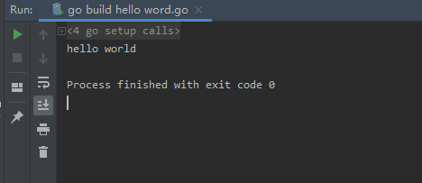

# Go语言简介

Go语言（或 Golang）起源于 2007 年，并在 2009 年正式对外发布。Go 是非常年轻的一门语言，它的主要目标是“兼具 Python 等动态语言的开发速度和 C/C++ 等编译型语言的性能与安全性”。

Go语言是编程语言设计的又一次尝试，是对类C语言的重大改进，它不但能让你访问底层操作系统，还提供了强大的网络编程和并发编程支持。Go语言的用途众多，可以进行网络编程、系统编程、并发编程、分布式编程。

Go语言的推出，旨在不损失应用程序性能的情况下降低代码的复杂性，具有“部署简单、并发性好、语言设计良好、执行性能好”等优势，目前国内诸多 IT 公司均已采用Go语言开发项目。

Go语言有时候被描述为“C 类似语言”，或者是“21 世纪的C语言”。Go 从C语言继承了相似的表达式语法、控制流结构、基础数据类型、调用参数传值、指针等很多思想，还有C语言一直所看中的编译后机器码的运行效率以及和现有操作系统的无缝适配。

因为Go语言没有类和继承的概念，所以它和 Java 或 C++ 看起来并不相同。但是它通过接口（interface）的概念来实现多态性。Go语言有一个清晰易懂的轻量级类型系统，在类型之间也没有层级之说。因此可以说Go语言是一门混合型的语言。

此外，很多重要的开源项目都是使用Go语言开发的，其中包括 Docker、Go-Ethereum、Thrraform 和 Kubernetes。

## go 语言特点

1. 静态类型,编译型的开源语言

2. 脚本化的语言,支持多种编程范式(函数式编程和面向对象编程)

3. 原生,给力的并发编程支持
原生支持把一些代码片段并发的提交给CPU执行,和函数库支持是有区别的

## go 语言的优势

1. 脚本化的语法
可以使我们非常容易的编写 go 语言程序,容易上手,程序的开发效率

2. 静态型+编译型
保障了程序的运行速度

3. 原生,给力的并发编程支持
使得 go 语言在服务端软件开发方面有更强的优势,优势体现在降低了开发成本以及维护成本和程序能更好的执行

## go 语言的劣势

1. 语法糖没有python或者ruby那么多
语法糖越多,会使我们在开发的时候会很舒服,但是后期维护的成本会增加

2. 目前go语言的运行速度不如C语言

3. 第三方函数库暂时不像绝对主流的编程语言那样多

#  windows 下的 go 语言环境安装

官网地址:https://golang.google.cn/

1. go的编程环境的安装

Go语言官网(需要翻墙)：https://golang.org/
go中文社区：https://studygolang.com
go中文在线文档：https://studygolang.com/pkgdoc

通过上述网站下载go编程环境的安装包,例如:go1.13.5.windows-amd64.msi安装包

2. go 语言集成化开发环境的安装(IDE) Golang

Goland官网:https://www.jetbrains.com/go/


# linux下Go语言环境的部署

1. 下载go语言开发程序包
```bash
wget https://dl.google.com/go/go1.13.5.linux-amd64.tar.gz
```

2. 解压程序包
```bash
tar -xvf go1.13.5.linux-amd64.tar.gz -C /usr/local/src/
```

3. 准备环境变量
```bash
vim /etc/profile
# 添加环境变量
# 设置go语言的安装目录
export GOROOT=/usr/local/src/go
# 设置go语言的工作区的集合
export GOPATH=~/golib:~/goproject
# 存放go程序可执行文件的目录
export GOBIN=~/gobin
export PATH=$PATH:$GOROOT/bin:$GOBIN

# 重新加载环境变量
source /etc/profile
```

4. 验证
```bash
root@ldapdomain:~# go version
go version go1.13.5 linux/amd64
root@ldapdomain:~# go env
GO111MODULE=""
GOARCH="amd64"
GOBIN=""
GOCACHE="/root/.cache/go-build"
GOENV="/root/.config/go/env"
GOEXE=""
GOFLAGS=""
GOHOSTARCH="amd64"
GOHOSTOS="linux"
GONOPROXY=""
GONOSUMDB=""
GOOS="linux"
GOPATH="/root/go"
GOPRIVATE=""
GOPROXY="https://proxy.golang.org,direct"
GOROOT="/usr/local/src/go"
GOSUMDB="sum.golang.org"
GOTMPDIR=""
GOTOOLDIR="/usr/local/src/go/pkg/tool/linux_amd64"
GCCGO="gccgo"
AR="ar"
CC="gcc"
CXX="g++"
CGO_ENABLED="1"
GOMOD=""
CGO_CFLAGS="-g -O2"
CGO_CPPFLAGS=""
CGO_CXXFLAGS="-g -O2"
CGO_FFLAGS="-g -O2"
CGO_LDFLAGS="-g -O2"
PKG_CONFIG="pkg-config"
GOGCCFLAGS="-fPIC -m64 -pthread -fno-caret-diagnostics -Qunused-arguments -fmessage-length=0 -fdebug-prefix-map=/tmp/go-build294728818=/tmp/go-build -gno-record-gcc-switches"
```

## go 语言的工作区
工作区是放置 go 源码文件的目录

一般情况下,go 的源码文件都需要存放在工作区中,但是对于命令源码文件来说,这不是必须的

### 工作区的目录结构
每一个工作区都应该有以下文件结构
```bash
[ root@ldapdomain ~]# tree golib/
golib/
├── bin # 用户存放当前工作区中Go程序的可执行文件,当设置了GOBIN环境变量后,该目录会失效
├── pkg # 用于存放归档文件(名称以.a为后缀文件),所有的归档文件都会被存放到该目录下的平台相关的目录中,同一样以代码包为组织单位,平台相关目录以$GOOS_$GOARCH(linux_amd64)命名
└── src # 用于存放源码文件,以代码包为主旨形式

```

## go 语言源码文件的分类和含义

1. 源码文件
名称以.go为后缀,内容以go语言代码组织的文件
多个 go 源码文件需要用代码包组织起来

2. 源码文件的分类

命令源码文件: go语言程序
> 声明自己属于main代码包,包含无参数声明和结果声明的main函数
> 被安装之后,相应的可执行文件会被保存到GOBIN指向的目录或当前工作区的bin目录下
> 命令源码文件是go程序的入口,但是不建议把所有的程序都写在一个文件中,但是同一个代码包中不建议直接包含多个命令源码文件

库源码文件: go语言程序
> 不具备命令源码文件特征的源码文件
> 被安装后相应的归档文件会被保存到当前工作区目录的pkg目录的平台相关目录下

测试源码文件: 辅助源码文件
> 名称以 _test.go 为后缀
> 其中至少有一个函数的名称以test或者benchmark为前缀,并且该函数接手一个类型为 *testing.T或者*testing.B的参数


# 用 Go 语言编写第一个程序 Hello World

1. 新建项目


2. 在项目中新建Go文件


3. 编写hello world
```go
package main
//定义了包名,必须在源文件中非注释的第一行指明这个文件属于哪个包,package main表示一个可独立执行的程序,每个go程序都包含一个名为main的包

import "fmt"
//导入标准输入输出的包,告诉go编译器这个程序需要使用fmt这个包

// 第一个程序hello world (这部分是注释内容)
func main()  {
	// 主函数的名称一定是main,主函数是程序的主入口,程序有且只有一个主函数
	//一般来说在启动后悔首先执行main函数
	// 在屏幕输出 hello world,使用fmt.Println函数,会自动导入"fmt"包,println打印后会自动换行
	//使用 fmt.Print("hello, world\n")可以得到同样的结果
	fmt.Println("hello world,这是第一个go 语言程序")
}
```

4. 运行


## linux 下编写第一个程序

1. 创建程序文件
```bash
root@ldapdomain:~# vim hello.go

package main
//定义了包名,必须在源文件中非注释的第一行指明这个文件属于哪个包,package main表示一个可独立执行的程序,每个go程序都包含一个名为main的包

import "fmt"
//导入标准输入输出的包,告诉go编译器这个程序需要使用fmt这个包

// 第一个程序hello world (这部分是注释内容)
func main()  {
        // 主函数的名称一定是main,主函数是程序的主入口,程序有且只有一个主函数
        //一般来说在启动后悔首先执行main函数
        // 在屏幕输出 hello world,使用fmt.Println函数,会自动导入"fmt"包,println打印后会自动换行
        //使用 fmt.Print("hello, world\n")可以得到同样的结果
        fmt.Println("hello world,这是第一个go 语言程序")
}
```

2. 运行
```bash
root@ldapdomain:~# go run hello.go 
hello world,这是第一个go 语言程序
```