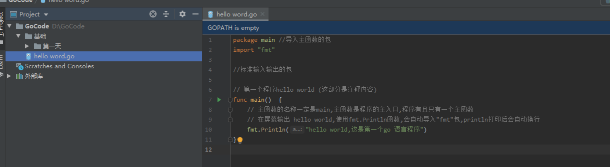
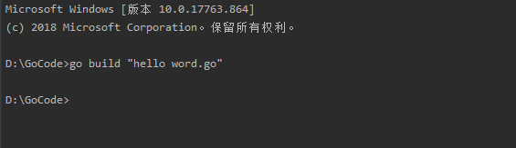
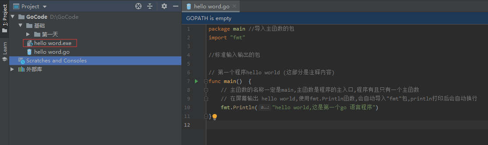

# go run 命令
用于编译并运行命令源码文件

只能接受一个命令源码问你安以及若干个库源码文件作为文件参数

## go run 命令的内部操作步骤

1. 先编译源码文件,把编译结果放到临时的目录中

2. 然后运行编译结果(编译结果包括命令源码文件被编译后生成的可执行文件以及相关库源码文件编译后生成的归档文件)

## go run 命令的用法

1. 运行源码文件
```bash
[ root@ldapdomain ds]# go run showds.go 
/root/goc2p/src/helper/ds:
  showds.go
```
> 后面可以加要使用的参数

## go run 命令的常用标记

1. -a标记
强制编译相关的代码,不论它们的编译结果是否是最新的
> 如果我们有了源码文件导入了代码包A,并且编译过,下次编译的时候,如果代码包A没有发生过变化,那么编译的时候不会再去编译代码包A的,当使用了-a参数的时候,回去强制重新编译,不论代码包A是否发生过变化

2. -n标记
打印编译过程中所运行的命令,但不真正的去执行他们
> 这样就可以使我们在不产生任何后果的情况下,真正的查看源码的文件的执行步骤

3. -p标记
-p N:并行编译,其中N为并行的数量,使编译过程运行在CPU的多个核心上

4. -v标记
列出被编译的代码包的名称(-a 和 -v 标记连用,可以列出所有被编译的代码包的名称)

5. -work 标记
显示编译时创建的临时工作目录的路径,并且不删除他它

6. -x 标记
打印编译过程中所需要运行的额外命令


# go build
用于编译源码文件,代码包和依赖包
> 编译非命令源码文件不会产生任何结果文件
> 编译命令源码文件会在该命令的执行目录中生成一个可执行文件
> 不加任何参数时,会把当前目录作为代码包并编译

现在有一个go语言的源码文件


执行go build查看并结果

使用 go build 后会在源码文件的同级目录下生成编译后的可执行文件


# go install
用于编译并安装代码包或者源码文件
> 安装代码包会在当前工作区的pkg/<平台相关目录>下生成归档文件
> 安装命令源码文件会在当前工作区的bin目录或者$GOBIN目录下生成可执行文件

1. 执行该命令的时候,如果不追加任何参数,它会将单签目录作为代码包进行编译并安装

2. 当以代码包的导入路径作为参数的时候,该代码包及其依赖会被安装

3. 当以命令源码文件及其相关的库文件作为参数的时候,只有这些文件会被编译并安装


# go get
用于从远程代码仓库上下载并安装代码包
> 支持的代码版本控制系统哟:Git,Mercurial(hg),SVN,Bazaar
> 指定的代码包会儿比下载到$GOPATH中包含的第一个工作区的src目录中

1. -d 标记
只执行下载动作,而不执行安装动作

2. -fix 标记
在下载代码包后先执行修正动作,而后在进行编译和安装

3. -u标记
利用网络来更新已有的代码包及其依赖包