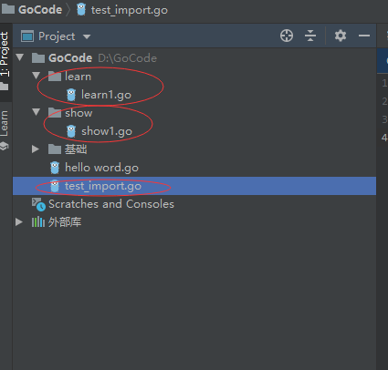

# go 语言的基础语法

## 程序实体
任何 go 语言源码文件都是由若干个程序实体组成的,在 go 语言中,变量.常量.函数.结构体和接口都被统称为程序实体,而他们的名字被统称为标识符

> 在 go 语言中,我们对程序实体的访问权限控制只能通过它们的名字来实现,首字母为大写的程序实体可以被任何代码包中的代码访问到,但是首字母小写的程序实体只能被同一个代码包中的代码所访问


## go 语言的关键字
go 语言保留的关键字只有25个

[table id=13 /]

## go 语言的标识符
标识符可以是任何的 Unicode 编码可以表示的数字.字母以及下划线,但是首字母不能是数字和下划线

go 语言有36个预定义的标识符,其中包括基础数据类型和系统内嵌函数

[table id=14 /]

## go 语言的注释

```go
1. // : 表示单行注释

2. /* ....
	...*/  : 表示多行注释
```

## go 语言的基础结构

```go
package main  // 代码包声明语句。

// 代码包导入语句。
import (
    "fmt"  // 导入代码包fmt。
)

// main函数。
func main() {

	// 打印函数调用语句。用于打印输出信息。
	fmt.Println("Go语言编程实战")
}
```

### package 的用法

package是最基本的分发单位和工程管理中依赖关系的体现
> 当我们写的函数或者类要被别人使用的时候,就将函数或者类打成包,供其他人调用,为了方便使用

- 每个 Go 语言源代码文件开头都需拥有一个 package 声明,表示源码文件所属的代码包
> 建议package引入包的名称要与目录的名称一致

- 要生成 Go 语言的可执行文件,必须要有 main 的 package 包,且必须在该包下有 main 函数

- 同一个路径下面只能存在一个package,一个package可以拆成多个源文件组成
> 一个目录就是一个包，该目录下的所有文件必须属于同一个包

### import 的用法
import 语句用来导入源码文件所依赖的 package 包

- import 不得导入源码文件中没有用到的包,否则 go 编译器会报编译错误

- import 的语法格式主要有以下两种
```go
// 第一种
import "package1"
import "package2"
import "package3"

// 第二种,这种形式是常用的
import (
	"package1"
	"package2"
	"package3"
)
```

- 如果一个 main 导入其他包,包将被顺序导入

- 如果导入的包中依赖其他的包(包B),会首先导入包B,然后初始化包B中的常量和变量.最后如果包B中有init,会自动执行init函数

- 所有包导入完成后才会对main中常量和变量进行初始化,然后执行main中的init函数(如果存在),最后之执行main函数

- 如果一个包被导入多次,则该包只会被导入一次

#### import 用法实验
1. 新建learn和show两个目录


2. 创建show1.go文件
```go
package show

import "fmt"

func init()  {
	fmt.Println("hello show1")
}

func Show1()  {

}
```

3. 创建learn1.go文件
```go
package learn

import (
	"fmt"
	"show"
)

func init() {
	show.Show1()
	fmt.Println("hello learn1")
}

func Learn1() {

}
```

4. 在test_import.go中引入learn包
```go
package main

import (
	"fmt"
	"learn"
	"show"
)

func init()  {
	// init函数会比main函数先执行
	fmt.Println("init")
}

func main() {
	learn.Learn1()
	fmt.Println("hello main")
	show.Show1()  //这里将不会被执行,因为在learn1函数中已经被导入了,不会再导入第二次
}
```

4. 查看运行结果


5. 由上可知,程序的执行顺序为


#### 代码包其它相关的知识

1. 代码包的作用
编译和归档go程序的基本单位:把多个go程序文件放到一个代码包下,然后会代码包进行编译和归档

代码划分,集结和依赖的有效组织形式,也是权限控制的辅助手段

2. 代码包的规则
一个代码包实际上就是一个由导入路径代表的目录
> 导入路径即<工作区目录>/src或者<工作区目录>/pkg/<平台相关目录>之下的某段子路径

```bash
例如: 代码包test.cn可以对应于/root/golib/src/test.cn

其中/root/golib是工作区目录
```

3. 代码包的声明
每个源文件必须声明其所属的代码包
同一个代码包中的所有源文件声明的代码包应该都是相同的

4. 代码包声明与代码包导入路径的区别

代码包声明语句中的包名称应该是该代码包导入路径的最右子路径
```bash
例如:
	源码文件属于 test.cn/pkgtool 代码包下,那么源码文件中代码包声明语句可以写成 package pkgtool
```

代码包导入语句中使用的包名应该与其导入的路径一致
```bash
例如:
	现在由三个代码包 flag fmt 和string
	导入到源码文件中的写法
	import(
	"flag"
	"fmt"
	"string"
	)
```

5. 代码包的导入方法

带别名的代码包
```go
import str "string" // 调用代码包string的时候就可以使用str代替 string.HasPrefix() <====> str.HasPrefix()
```

本地化导入
```go
import . "string" // 调用代码包中的函数时可以省略前缀包名,例如调用 string 的时候就可以写成 .HasPrefix()
```

仅仅初始化
```go
import _ "string" // 在后续的代码中不调用代码包中的实体,仅执行代码包中的初始化函数,因此无法通过包名来调用包中的其它函数
```

6. 代码包初始化
由代码包初始化函数提供:无参数声明和结果声明的init函数
init函数可以被声明在任何文件中,且可以有多个
> init函数会被先执行,之后才是main函数

7. init函数的执行时机
在单一代码包内,当导入某一个代码包时,首先代码包中的全局变量会进行求值,在求值后代码包中的所有init函数会被执行,同一个代码包中多个init函数的执行顺序是不一定的

在不通的代码包中,被导入的代码包中的init函数会被先执行,然后导入它的那个代码包的init函数才会被执行

> 当代码包的导入为 a导入了b,b又导入了c,那么init的执行顺序为c.b.a

### 内部包

在进程代码重构的时候,我们会将一些内部的模块陆续的分离出来,以独立的形式维护,此时,基于首字母大小写的访问控制权限就显得比较粗狂了,我们希望这些包导出的成员仅仅在特定的范围内访问,而不是像所有的用户公开

内部包机制相当于增加了新的访问控制权限

- 所有保存在inernal 目录下的包(包括自身)仅能被其所属的父目录下的包(包含所有层次的子目录)访问

