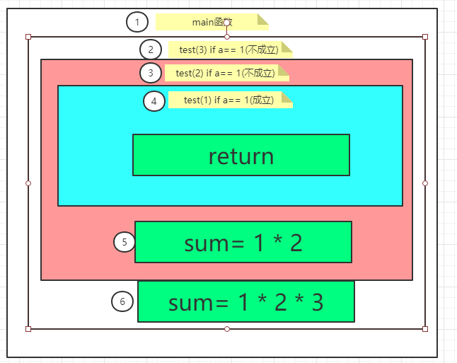

# 匿名函数
通过之前的学习发现,在一个函数的内部是不能在定义一个函数的,但是使用匿名函数就可以实现这个功能
```go
func main() {
	num := 9
	f := func() { // 匿名函数,没有函数名
		//num :=0
		num ++
		fmt.Printf("匿名函数:%d \n",num)
	}

	f()
	fmt.Printf("main函数:%d\n",num)
}
```

- 匿名函数的定义时,是没有函数名的,将匿名函数赋值给了变量 f ,那么 f 就是函数类型,通过 f() 调用

- 匿名函数时可以直接使用所在的函数定义的变量的,当匿名函数没有定义局部变量的时候,会使用所在函数的变量,如果有局部变量,那么局部变量优先

- 匿名函数中调用主函数的值,产生的结果是会影响主函数的

## 直接调用匿名函数
```go
func main() {
	num := 9
	func() {
		//num :=0
		num ++
		fmt.Printf("匿名函数:%d \n",num)
	}()
	fmt.Printf("main函数:%d\n",num)
}
```
> 在匿名函数的结尾加上小括号,表示直接调用,也不需要再赋值给某个变量

## 匿名函数传递参数

在定义匿名函数的时候,指定形参,并在结尾调用的小括号中指定实参即可

1. 方法一
```go
func main() {
	num := 9
	func(a,b int) {
		//num :=0
		fmt.Printf("匿名函数:%d \n",a+b)
	}(4,6)
	fmt.Printf("main函数:%d\n",num)
}
```

2. 方法二
```go
func main() {
	num := 9
	f := func(a,b int) {
		//num :=0
		fmt.Printf("匿名函数:%d \n",a+b)
	}
	f(4,6)
	fmt.Printf("main函数:%d\n",num)
}
```

## 匿名函数的返回值

```go
func main() {
	x , y:= func(a , b int) (max , min int){
		if a>b {
			max = a
			min = b
		}else if a == b {
			max ,min = a ,b
		}else {
			max = b
			min = a
		}
		return 
	}(4,6)

	fmt.Printf("最大值为:%d\n最小值为:%d\n",x,y)
}
```

## 闭包

所谓的闭包就是指有权限访问另一个函数作用域中的变量的函数,就是在一个函数内部创建另一个函数

在Go语言里，所有的匿名函数(Go语言规范中称之为函数字面量)都是闭包

通过以下例子来查看闭包的作用
```go
func test() int {
	var x int
	x++
	return x
}

func main() {
	fmt.Println(test())  // 输出结果为1
	fmt.Println(test())  // 输出结果为1
	fmt.Println(test())  // 输出结果为1
}
```
> 我们在主函数中调用了三次 test(),但是打印的结果都是一样的,但是要是实现每调用一次就加1,的结果,就需要用到闭包

```go
func test() func() int {
	var x int
	return func() int{// 返回匿名函数类型
		x++
		return x
	}
}

func main() {
	f := test()  // 函数调用,将test()的返回值赋值给f
	// 函数会保存在变量f中,执行完毕不会销毁,能实现x变量值的累加
	// f := test // 将 test函数类型赋值给
	fmt.Println(f())
	fmt.Println(f())
	fmt.Println(f())
}
```
其实上面的代码的作用等同于在main函数中使用匿名函数
```go
func main() {
	var x int
	f := func() int{
		x++
		return x
	}
	fmt.Println(f())
	fmt.Println(f())
	fmt.Println(f())
}
```

# 函数递归
函数递归就是在函数的内部,调用函数自己本身
```go
func test(a int) {
	if a == 0{ // 判断条件,符合一定的条件后退出
		fmt.Println("a=",a)
		return
	}
	test(a - 1)  // 调用test()本身
	fmt.Println("abc=",a)
}

func main() {
	test(3)
}
```

> 在使用递归的过程中,一定要设置退出条件,否则会导致无限递归循环(死递归)

> 递归非常占用内存,谨慎使用

## 函数递归的典型应用

1. 递归问题
```go
var sum int = 1

func test(a int) {
	if a == 1{
		return
	}
	test(a - 1)
	sum = sum * a
}

func main() {
	test(3)
	println(sum)
}
```
递归函数的执行过程


2. 台阶问题

有50级台阶,只能一次走一步或者一次都两步,有多少种走法

```go
package main

import "fmt"

func taijie(n uint64) uint64 {
	if n <= 2 {
		return n
	}else {
		return taijie(n-1) + taijie(n -2)
	}
}

func main() {
	fmt.Println(taijie(40))
}
```

通过分析得知,无论是多少节台阶,那么走到最后只有两个走法,要不就是只剩一个台阶,或者是只剩下两个台阶,那么n个台阶的走法就是n-1台阶的走法加上n-2个台阶的走法