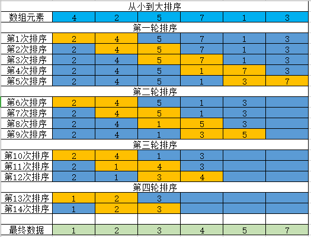

# 复合类型
前面学习的简单的基本类型(int,float,string,bool和函数类型),Go 语言同样也有复合类型(数组,指针,切片,map和结构体等)

# 数组的定义和使用
数组指的就是同一类型的数据的集合

## 数组的定义
```go
var arg [10] int
```
> 数组的定义也是通过 var 关键词 ,后面跟数组名称(arg),中括号中表示数组的长度,最后数数组的类型,上述的定义表示,定义一个叫 arg 的数组,能存储10个整型数字

> 数组名本身是一个常量,代表整个数组,也可以表示数组首个元素的地址

> 注意:数组的长度只能是个常量,而不能使用变量来定义数组的长度

打印数组的长度
```go
func main() {
	var arg [10] int
	fmt.Println(len(arg))
}
```

> 当定义了数组之后,就会在数组中开辟一段连续的内存空间,每个数据都存储在对应的内存空间中,数组中包含的每个数据,称为数组的元素,数组中的元素个数,称为数组的长度

## 数组赋值
数组定义之后,可以对数组进行赋值操作

数组的赋值通过下标来进行操作,下标从0开始,到数组长度-1结束

赋值方法一:使用下标逐个赋值
```go
func main() {
	var arg [3] int
	fmt.Println("数组的长度是:",len(arg))
	arg[0] = 1
	arg[1] = 2
	arg[2] = 3

	fmt.Println("第一个元素是:",arg[0])
	fmt.Println("第二个元素是:",arg[1])
	fmt.Println("第三个元素是:",arg[2])
}
```

赋值方法二:通过循环赋值
```go
func main() {
	var arg [3] int
	fmt.Println("数组的长度是:",len(arg))
	for i :=0 ; i<len(arg) ; i++ {
		arg[i] = i+1
		fmt.Printf("第%d个元素是:%d\n",i,arg[i])
	}
}
// 变量 i 存储的是数组的下标, arg[i] 存储的是数组下标对应的值
```

### 通过循环来遍历数组中的元素

```go
func main() {
	var arg [3] int
	fmt.Println("数组的长度是:",len(arg))
	for i :=0 ; i<len(arg) ; i++ {
		arg[i] = i+1
	}

	for _, date := range arg {
		fmt.Println("数组中的元素为:",date)
	}
}
```

> range 有两个返回值,第一个是数组的下标,第二个是数组下标对应的元素

> 数组中的元素如果没有赋值,那么打印的时候,全部为对应数组类型的默认值(int类型和float类型的数组为0,string类型的数组为空字符,bool类型的数组为false)

## 数组的初始化
数组的赋值既可以在定义之后完成,也可以在定义的时候完成

全部元素初始化,会将指定的元素从下标为0开始逐个给数组赋值
```go
func main() {
	var arg [3] int = [3] int {1,2,3}
	for _, date := range arg {
		fmt.Println("数组中的元素为:",date)
	}
}
```

部分元素初始化,会将指定的元素从下标为0开始逐个给数组赋值,直至元素结束,没有赋值的元素为默认值
```go
func main() {
	var arg [3] int = [3] int {1,2}
	for _, date := range arg {
		fmt.Println("数组中的元素为:",date)
	}
}
```

指定元素初始化,会将指定的元素赋值给数组,没有指定的为默认值
```go
func main() {
	var arg [3] int = [3] int {1:1,2:2}
	for _, date := range arg {
		fmt.Println("数组中的元素为:",date)
	}
}
```

## 定义数组的另一种方式
在定义数组长度的情况下,数组的长度会根据数组中的元素个数变化的
```go
func main() {
	arg  := [] int {1,2,3,4,5}
	// 或者 arg  := [...] int {1,2,3,4,5}
	// 或者 var arg [] int = [] int {1,2,3,4,5}
	fmt.Println(len(arg))
	for _, date := range arg {
		fmt.Println("数组中的元素为:",date)
	}
}
```
不定长的数组在赋值的时候,如果给指定的元素赋值,那么没有赋值的元素为默认值
```go
func main() {
	var arg [...] int = [...] int {1,2:2,3}
	fmt.Println(len(arg))
	for _, date := range arg {
		fmt.Println("数组中的元素为:",date)
	}
}
// arg[0]=1,arg[1]=0,arg[2]=2,arg[3]=3
```
> 即使使用不定长度的数组,但是只要是数组的定义完成后,那么数组的长度也是不可变的,所以说无论使用哪种方式去定义数组,都不能在定义完成后改变数组的长度,调用超过数组元素个数的情况,我们称为数组下标越界

## 数组使用示例

取出5个数中的最大值和最小值,并计算平局数和总和
```go
package main

import (
	"fmt"
)

var max , min , sum  int

func test() {
	arr := [5] int {}
	for i:=0 ; i<5 ; i++ {
		var a int
		fmt.Printf("请输入第%d个数字数字:",i+1)
		fmt.Scan(&a)
		arr[i] = a
		if i==0 {
			max = arr[0]
			min = arr[0]
		}
		if arr[i] >= max {
			max = arr[i]
		}else if arr[i] <= min{
			min = arr[i]
		}

		sum = sum + arr[i]
	}
	fmt.Println("最大值为:",max)
	fmt.Println("最小值为:",min)
	fmt.Println("平均值:",float64(sum)/5)
	fmt.Println("总和为:",sum)

}

func main()  {
	test()
}
```

## 数组中的元素逆置
将数组中的元素顺序反转
```go
func main() {
	arr := [6]string{"a","b","c","d","e","f"}

	for i :=0 ; i< len(arr)/2 ; i++{
		arr[i] , arr[len(arr)-1-i] = arr[len(arr)-1-i] , arr[i]
	}

	for i :=0 ; i < len(arr) ; i++{
		fmt.Println(arr[i])
	}
}
```

## 冒泡排序
重复地走访过要排序的元素列，依次比较两个相邻的元素，如果顺序（如从大到小、首字母从从Z到A）错误就把他们交换过来。走访元素的工作是重复地进行直到没有相邻元素需要交换，也就是说该元素列已经排序完成


例如: 对数组 arr[2,4,5,1,7,3] 进行排序


使用代码来实现
```go
func main() {
	arr := [6]int{4,2,5,1,7,3}

	for i :=0 ; i< len(arr)-1 ; i++{  // 每执行一次外层循环,能找到一个最大值
		// 外层循环执行的次数为元素个数
		for j :=0 ; j<len(arr)-1-i;j++{ // 每执行一次内层循环,能找到相邻的最大值
			// 每执行一次外层循环,内存循环就少执行一次
			if arr[j] > arr[j+1] {
				arr[j] , arr[j+1] = arr[j+1], arr[j]
			}
		}
	}
		fmt.Println(arr)
}
```

> 因为每次执行外层循环,都会能选出一个最大数,那么外层循环的执行次数为元素个数减1,执行内存循环的时候,因为执行的外层循环已经将最大数滞后,那么就不需要再去比较最大数,每执行一次外层循环,内层循环都会少执行一次


## 数组作为函数的参数
数组也可以像变量一样,作为参数传递给函数

```go
func test(a [5]int)  {
	a[0] = 666
	fmt.Println(a)  // 输出 [666 2 3 4 5]
}

func main() {
	b := [5]int{1,2,3,4,5}
	test(b)

	fmt.Println(b)   // 输出 [1 2 3 4 5]
}
```

> 形参和实参的数组元素数必须相同
> go 语言中数组作为函数的参数是值传递的,形参不会影响实参的值

### go 函数数组示例

```go
// 用方法来实现：有一个字符串数组： { "马龙", "迈克尔乔丹", "雷吉米勒", "蒂姆邓肯", "科比布莱恩特" },请输出最长的字符串

func test(a [5]string) string {
	var max string
	for i :=0 ; i < len(a) ; i++ {
		if len(a[i]) > len(max) {
			max = a[i]
		}
	}
	return max
}

func main() {
	var mix string
	a :=[5]string { "马龙", "迈克尔乔丹", "雷吉米勒", "蒂姆邓肯", "科比布莱恩特"}

	mix = test(a)
	fmt.Println(mix)
}
```

### 随机数
要产生随机数,需要导入“math/rand”包
```go
import (
	"fmt"
	"math/rand"
)

func main() {
	fmt.Println(rand.Intn(123))
}
```
> rand.Int() 每次产生的随机数的范围都非常大,所以可以使用rand函数中的Intn方法来限制随机数的范围 rand.Intn(123) 表示生成 0-122 范围内的随机数

> 但是这样打印出来的是伪随机数,是以1970-01-01 00:00:00 的时间来生成的随机数,是不会变化的,要想产生变化的随机数需要使用随机数种子

所谓的随机数种子就是根据一定的计算方法计算出来的数值,所以,只要计算方法一定,随机种子一定,那么产生的随机数就不会变,为了解决这个问题,可以让随机种子随时间发生变化,所以可以利用时间来作为随机种子,那么久需要导入 time 包

```go
import (
	"fmt"
	"math/rand"
	"time"
)

func main() {
	// 设置随机数种子
	rand.Seed(time.Now().UnixNano()) // 以当前的系统时间作为随机数种子
	fmt.Println(rand.Intn(123))
}
```

### 练习1: 随机生成10个数的数组,并进行从大到小的排序
```go
import (
	"fmt"
	"math/rand"
	"time"
)

// 生成 10 个随机数的数组的函数
func grand() (arr [10]int){
	// 设置随机数种子
	rand.Seed(time.Now().UnixNano())
	for i :=0 ; i< 10 ; i++ {
		arr[i] = rand.Intn(1000)
	}

	return
}

// 对生成的数组进行排序的函数
func paixu() (arr [10]int) {
	arr = grand()

	for i :=0 ; i < len(arr)-1 ; i++{
		for j :=0 ; j< len(arr)-1-i ; j++{
			if arr[j] > arr[j+1]{
				arr[j] , arr[j+1] = arr[j+1] , arr[j]
			}
		}
	}
	return
}

func main()  {
	arr :=paixu()
	fmt.Println(arr)
}
```

### 练习2: 打印双色球,红球6个范围1-33 ,不能出现重复, 蓝球1个范围1-16 
```go
package main

import (
	"fmt"
	"math/rand"
	"time"
)

func RedBall()  (rb [6]int){
	var temp int
	rand.Seed(time.Now().UnixNano())
	for i := 0 ; i<6 ; i++ {   // 外层循环控制生成6个随机数
		temp = rand.Intn(32) + 1 // 将随机数保存在临时变量中
		for j :=0 ; j < i ; j++{ // 内层循环控制,将临时变量逐个与数组中的元素比较
			if temp == rb[j] {// 如果出现相等,也就是重复
				temp = rand.Intn(32) + 1 // 重新生成随机数
				j = -1  // 并将 j 的值重新赋值为 0 ,重新开始新的循环,执行i++后i=0,重新循环x
				continue
			}
		}
		rb[i] = temp  // 如果没有重复的值, 将temp保存的值赋值给对应的数组元素
	}
	return
}

func BlueBall()  [1]int{
	var bb[1]int
	rand.Seed(time.Now().UnixNano())
	for i :=0 ; i< len(bb) ; i++{
		bb[i] = rand.Intn(16)+1
	}
	return bb
}

func main()  {
	rb := RedBall()
	fmt.Println("红球",rb)
	bb := BlueBall()
	fmt.Println("蓝球",bb)
}
```

### 练习3: 输入20个字符,统计每个字符出现的次数
```go
func test()  {
	var str [20]byte
	var arr [26]int
	for i :=0 ; i<len(str) ; i++{
		fmt.Scanf("%c",&str[i])  // 输入20个字符,并将每个字符赋值为数组的元素
	}
	// 数组 arr[26] int : 使用 0-25 保存数组中的26个小写字母
	for j :=0 ; j <len(str) ; j++ {
		// str[j] 表示对应下标的数组的元素的值,用这个值对应的ascii的值减去a对应的ascii的值,得到数组的下标
		// 对应的数组下标的元素加1,表示有一个这个字母
		// 例如 str[10]='z',那么就会将z出现的次数保存在 arr[25]
		arr[str[j]-'a']++
	}

	for k :=0 ;k<len(arr) ; k++ {
		if arr[k] >0 {
			// 打印的时候,将对应的数组下标加上a对应的ascii加上对应的数组下标得到的ascii码再转化为字符,就能得到对应的字母
			fmt.Printf("字母:%c,出现:%d次\n",'a'+k,arr[k])
		}
	}

}

func main()  {
	test()
}
```