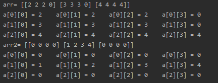
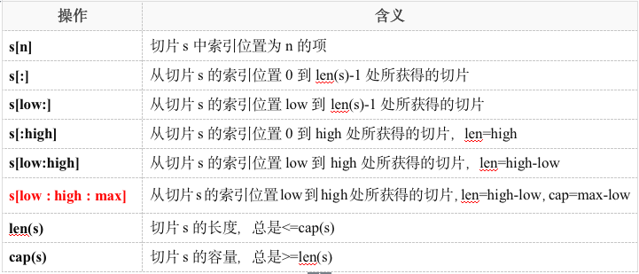

# 二维数组

普通的数组,只有一个下标,只能是用来保存一组连续空间的数据,二维数组有两个下标,可以用来存储由行和列构成的数据,二维数组的元素个数为行数乘以列数

## 二维数组的定义,初始化与遍历
```go
func main()  {
	arr :=[3][4]int{{2,2,2},{3,3,3},{4,4,4,4}}
	fmt.Println("arr=",arr)
	// 可以理解为定义了一个有三行四列的数组
	// 部分初始化,没有初始化的值为0
	// 遍历的时候,是二维数组就要使用两次for循环
	for i:=0 ; i<3 ; i++  {  // 外层循环控制行
		for j :=0 ; j<4 ; j++{ // 内层循环控制列
			fmt.Printf("a[%d][%d] = %d    ",i,j,arr[i][j])
		}
		fmt.Printf("\n")
	}

	fmt.Println(len(arr)) // len(二维数组) : 得到的是二维数组的行数
	fmt.Println(len(arr[0])) // 二维数组[0] : 表示的是二维数组的第一行的值
							 //len(二维数组[0]):表示二维数组的列数

	// 只对第二列进行初始化
	arr2 :=[3][4]int{1:{1,2,3,4}}
	fmt.Println("arr2=",arr2)
	for i:=0 ; i<len(arr2) ; i++  {
		for j :=0 ; j<len(arr2[0]) ; j++{
			fmt.Printf("a[%d][%d] = %d    ",i,j,arr2[i][j])
		}
		fmt.Printf("\n")
	}
}
```
上面代码的输出



# 切片
了解了数组之后,我们想一下数组的缺点:

1. 数组是固定长度的,数组定义完成后,只能是修改数组中元素的值,但是要是想添加元素是不可能的

2. 当数组作为函数的参数进行传递的时候,如果形参是5个元素的数组,那么实参必须也是5个元素的数组,而且数组作为函数参数传递的时候,会将整个数组拷贝一份,会造成内存的大量占用

切片相比于数组的长度是不固定的,可以追加元素,在追加元素的时候能使切片的容量扩大,所以可以将切片理解为动态数组,但是切片并不是数组

## 切片与数组的区别

1. 从定义上看
数组的定义
```go
a := [5]int{1,2,3,4}
```

切片的定义(一):不带长度的切片
```go
func main() {
	arr :=[]int{} // 定义的切片是不带长度的切片,或者说是长度为0的切片
	// arr[0] = 1 这种写法是错误的,因为切片的长度为0
	fmt.Println(arr)
}
```

> 从定义上看,切片的定义与数组的定义非常相似,但是切片的定义时[]是空的,切片的长度和容量是可以不固定的

> ⚠️本质:切片并不是数组或数组指针，它通过内部指针和相关属性引⽤数组⽚段，以实现变⻓⽅案。

切片的定义(二):带长度的切片,通过make函数来实现
```go
func main() {
	arr :=make([]int,5)
	// make([]类型,长度)
	arr[0] = 1
	// arr[5] = 1 这种方式是错误的
	fmt.Println(arr)
}
```

> 定义了默认长度为5的切片,但是长度也是能扩展的,即使能扩展的,也不能通过使用超出切片元素个数的下标来给切片赋值,要是append函数来网切片中追加元素

### 切片的追加
```go
func main()  {
	arr :=make([]int,3)
	// 向数组arr中追加元素,追加完成之后再赋值给数组arr
	arr = append(arr,123) // append(要追加元素的切片,要追加的元素...)
	// 如果没有初始化,那么元素的值为切片类型的默认值
	fmt.Println(arr) // 输出 [0 0 0 123]
}
```

> 使用append追加元素的时候,切片的地址有可能会发生变化,因为如果扩充的数据导致源分配的内存不足,那么切片会自动找寻新的地址存储,同时也会将之前占用的内存空间释放

### 切片的拷贝
基本语法: copy(目标切片,源切片[起始下标:结束下标])

> 拷贝的时候,如果不对源切片指定位置,那么默认拷贝全部元素,当指定了下标之后表示从起始下标开始,到结束下标为止,但是不包括结束下标的元素

```go
func main() {
	s :=[]int{1,2}
	a :=[]int{11,22,33,44,55}
	copy(s,a)
	fmt.Println("切片s为:",s)
	fmt.Println("切片a为:",a)
}
//输出为
切片s为: [11 22]
切片a为: [11 22 33 44 55]
```
> 通过上面的代码我们能知道,当将a拷贝给s的时候,拷贝的长度为两个切片的最小值,而且会将源切片中的元素拷贝到目标切片的相同位置,并覆盖之前的内容

```go
func main() {
	a :=[]int{11,22,33,44,55}
	s1 :=make([]int,2)
	s2 :=make([]int,6)
	copy(s1,a[1:4])
	copy(s2,a[1:4])
	fmt.Println("切片s1为:",s1)
	fmt.Println("切片s2为:",s2)
	fmt.Println("切片a为:",a)
}
//输出为
切片s1为: [22 33]
切片s2为: [22 33 44 0 0 0]
切片a为: [11 22 33 44 55]
```
> 当目标切片的长度大于截取的源切片的长度时,那么会将制定区域的源切片拷贝至目标切片,不足的位置为0,如果目标切片的长度小于截取的源切片的长度时,只能拷贝目标切片长度的元素

### 切片的容量
切片的长度是已经初始化为空间,容量是切片在定义时开辟的空间,容量会随着切片的长度增长,容量永远大于等于长度

```go
	arr :=make([]int,3)
	fmt.Println(len(arr)) // 使用len函数来统计切片的长度
	fmt.Println(cap(arr)) // 使用cap函数类统计切片的容量
```

### 容量的增长规则
```go
func main()  {
	arr :=make([]int,3)

	fmt.Println(len(arr))  // 输出3
	fmt.Println(cap(arr))  // 输出3
	arr = append(arr,1,2,3)
	fmt.Println(len(arr))  // 输出6
	fmt.Println(cap(arr))  // 输出6
	arr = append(arr,1,2,3)
	fmt.Println(len(arr))  // 输出9
	fmt.Println(cap(arr))  // 输出12
}
```

> 如果切片整体数据没有超过 1024 个字节, 每次扩展为上一次的倍数, 超过 1024 个字节,每次扩展为上一次的1/4

### 使用make函数定义切片的时候指定容量
```go
func main()  {
	arr :=make([]int,3,10)
	// make([]类型,长度,容量)

	fmt.Println(len(arr))  //输出3
	fmt.Println(cap(arr))  //输出10
}
```

## 切片截取
```go
func main() {
	s :=[]int{1,2,3,4,5}

	slice :=s[0:3:5]
	// 第一个数表示截取开始的下标,省略默认从下标为0开始
	// 第二个数表示截取结束的下标,但是不包括结束下标,省略表示截取到最后一个元素(包含最后一个元素)
	// 第三个值表示用来计算容量,(切片的容量-第一个值)<=第三个值>=切片的容量,不写默认为(切片的容量-第一个值)
	// 生成的新的切片的容量为(第三个值-第一个值)得到的结果

	fmt.Println(slice)
	// 输出 [1 2 3]
}
```



> 切片截取后所得到的新的切片也属于原来切片的一部分,修改新的切片的值,也会影响源切片的值

```go
func main() {
	s :=[]int{1,2,3,4,5}

	a :=s[0:3]
	fmt.Println(a)  // 输出[1 2 3]
	a[1] = 123
	fmt.Println(a)  // 输出[1 123 3]
	fmt.Println(s)  // 输出[1 123 3 4 5]
}
```

> 将源切片进行截取后,获得的新的切片其实是指向了源切片中的一部分区域,而并不是新建了一个切片,所以修改其中的值会影响源切片

通过内存地址来验证上述
```go
package main

import "fmt"

func main() {
	s :=[]int{0,1,2,3,4}
	a :=s[2:5]
	fmt.Println("切片a为:",a)
	fmt.Println("切片s为:",s)
	fmt.Println("------------------------------------------")
	fmt.Printf("切片s的第一个元素的内存地址为:%p\n",s)
	fmt.Printf("切片s的第二个元素的内存地址为:%p\n",&s[1])
	fmt.Printf("切片s的第三个元素的内存地址为:%p\n",&s[2])
	fmt.Printf("切片s的第四个元素的内存地址为:%p\n",&s[3])
	fmt.Printf("切片s的第五个元素的内存地址为:%p\n",&s[4])
	fmt.Println("------------------------------------------")
	fmt.Printf("切片a的第一个元素的内存地址为:%p\n",a)
	fmt.Printf("切片a的第二个元素的内存地址为:%p\n",&a[1])
	fmt.Printf("切片a的第三个元素的内存地址为:%p\n",&a[2])
}

// 输出为
切片a为: [2 3 4]
切片s为: [0 1 2 3 4]
------------------------------------------
切片s的第一个元素的内存地址为:0xc00000c270
切片s的第二个元素的内存地址为:0xc00000c278
切片s的第三个元素的内存地址为:0xc00000c280
切片s的第四个元素的内存地址为:0xc00000c288
切片s的第五个元素的内存地址为:0xc00000c290
------------------------------------------
切片a的第一个元素的内存地址为:0xc00000c280
切片a的第二个元素的内存地址为:0xc00000c288
切片a的第三个元素的内存地址为:0xc00000c290

```

> 因为我的电脑是64位的,那么一个 int 类型占 8 个字节,内存地址为十六进制,那么从切片s的地址我们可以看出,每个元素相差8个字节,而切片a的元素的地址与s[2:5]的地址相同,说明经过切片s截取后的切片a只是指向了切片s的一个区域,而不是新建了一个切片

思考下面代码的输出
```go
func main() {
	s :=[]int{0,1,2,3,4,5,6,7,8,9}
	a :=s[2:5] // a[2,3,4]

	fmt.Println(cap(a)) //a切片在截取的时候,没有写容量,那么容量为(10-2)=8
	b := a[2:7]  // b[4,5,6,7,8]
	fmt.Println(cap(b)) // //a切片在截取的时候,没有写容量,那么容量为(8-2)=6
	b[2] = 222
	fmt.Println(s)// [0 1 2 3 4 5 222 7 8 9]
	fmt.Println(a)// [2 3 4]
	fmt.Println(b)// [4 5 222 7 8]
}
```