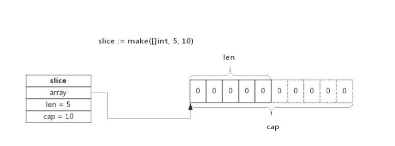
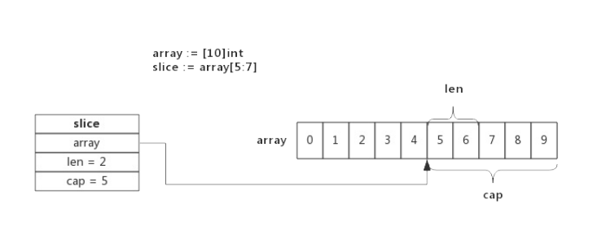
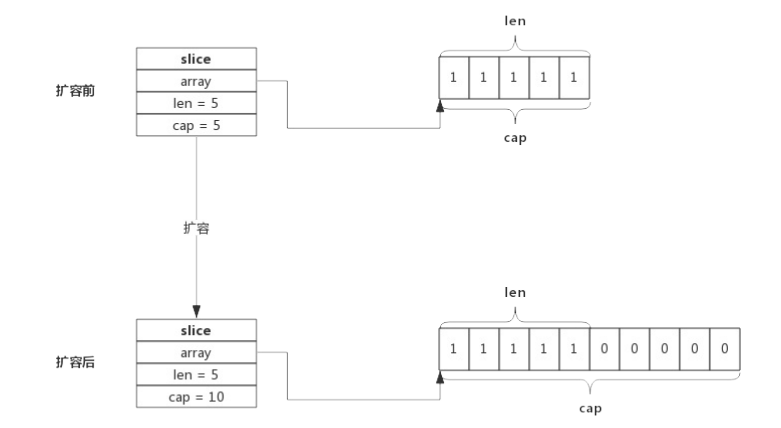

## Slice 实现原理

slice依托数组实现,底层数组对用户屏蔽,在底层数组容量不足的时候,可以通过自动重新分配并生成新的slice


### slice的数据结构

在源码包`go/src/runtime/slice.go`中定义了slice的数据结构

```go
type slice struct {
	array unsafe.Pointer
	len   int
	cap   int
}
```

从数据结构上看,slice的结构很清晰,array 指针指向底层的数组,len表示切片的长度,cap表示底层数组的容量

### 使用make创建slice

使用make来创建slice的时候,可以同时指定长度和容量,创建时底层分配一个数组,数组的长度就是容量

例如: 语句`slice := make([]int,5,10)`所创建的slice,结构如下图所示



该slice的长度为5,容量为10,表示后续向slice中添加新的元素的时候可以不用重新分配内存,直接使用预留的内存

### 使用数组创建slice

使用数组来创建slice的时候,slice将于原数组公用一部分内存

例如L语句`slice := array[5:7]`所创建的slice结构体如下:



切片从数组的array[5]开始,到数组的array[7]结束(不包含下标7的元素),即切片的长度为2,数组后面的内容都将作为切片的预留空间,即容量为5


数组和切片操作可能使用同一块内存,这也是使用的过程中需要注意的一点


### slice 扩容

使用append向切片追加元素的时候,如果切片的空间不足,将会触发切片扩容,扩容实际上就是重新分配一块更大的内存,将源切片的数据拷贝至新的切片总,然后返回新的切片,扩容后再将数据追加到新的切片中

例如: 向一个容量为5长度也为5的切片中再追加一个元素的时候,就会发生扩容



扩容操作值关心容量,会把原来的切片拷贝至新的切片中,追加数据由append在扩容结束后,上图可见,扩容后新的切片长度仍然为5,但是容量提升到了10,原来切片中的数据也都全部拷贝到了新的切片指向的数组中


扩容的时候,遵守以下规则:

1. 如果原来的切片容量够用,则将新的元素追加进去,slice.len++,返回原切片
2. 原切片的容量不够,则先将切片扩容,返回扩容后的新的切片
3. 将元素追加到新的切片中,slice.len++,返回新的切片

### 切片的拷贝

使用copy()内置函数拷贝两个切片的时候,会将源切片的数据逐个拷贝到目的切片指向的数组中,拷贝数量取两个切片长度的最小值

> 也就是说,切片在拷贝的时候,是不会发生扩容的

### 特殊的切片

根据数组或者切片生成的新的切片,一般使用`slice := array[start:end]`的方式,这种新生成的切片并没有指定切片的容量,实际上新的切片的容量是从start开始直至array结束的.

比如下面两个切片,长度和容量都是一直的,使用共同的内存地址

```go
sliceA := make([]int,5,10)
sliceB := sliceA[0:5]
```

根据数组或切片生成切片还有另一种写法,就是在生成新的切片的同时也指定容量,即`slice[start:end;cap]`其中cap为新的切片的容量,但是新的切片的容量不能超过原切片的实际容量

### 编程Tips

- 创建切片的时候,根据实际需要分配容量,尽量避免追加过程而导致的扩容,有利于提升性能
- 切片拷贝的时候要判断实际的元素个数
- 谨慎使用多个切片操作同一个数组,以防止读写冲突

## 总结

1. 每一个切片都指向一个底层数组
2. 每一个切片都保存了当前切片的长度,底层数组可用容量
3. 使用len()计算切片的长度时间复杂度为o(1),不需要变量切片
4. 使用cap()计算切片容量时间复杂度o(1),不需要变量切片
5. 通过函数传递切片的时候,不会拷贝整个切片,因为切片本身就是结构体而已
6. 使用append()向切片总追加元素时可能会触发扩容,扩容后将会生成新的切片