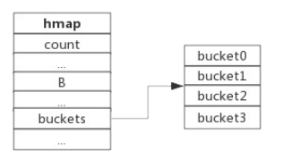
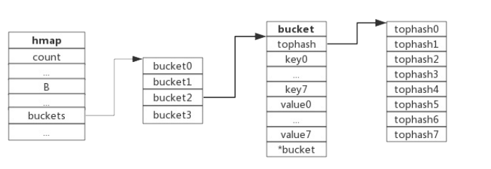
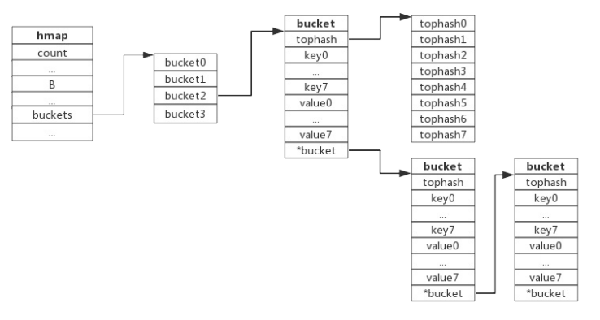
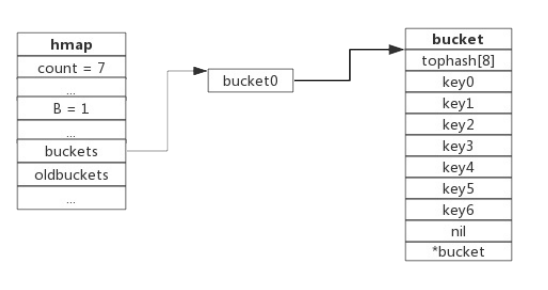
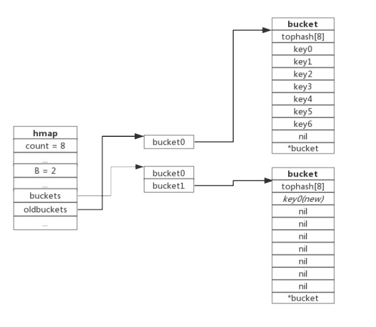
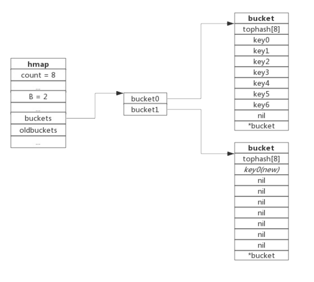

## map的数据结构

golang 的map使用哈希表作为底层实现,一个哈希表里面可以有多个哈希表节点,也就是bucket,而每个bucket就保存了map中的一个或者一组键值对

map 数据结构由`go/src/runtime/map.go`定义

```go
type hmap struct {
	count     int
	flags     uint8
	B         uint8 
	... 
	buckets    unsafe.Pointer 
    ...
}
```

- count: 表示当前保存的元素的个数
- B: 指示bucket数组的大小
- buckets: bucket数组指针,数组的大小俄日2^B

下面展示了一个拥有4个bucket的map



本例中,`hmap.B=2`而`hmap.buckets`的长度就是2^b=4,元素经过hash运算后将会落到某个bucket中进行存储,查找过程类似

### bucket的数据结构

```go
type bmap struct {
	tophash [bucketCnt]uint8
    // bucketCnt = 1 << bucketCntBits 
    // bucketCntBits = 3
    data byte[1]
    overflow *bmap
}
```

- tophash : 是一个长度为8的数组,hash值相同的键(准确的说是hash值低位相同的键)存入当前bucket时会将hash值高位村粗在该数组中,以方便后续的匹配
- data存放的是key-value数据,存放顺序是key/key/key..../value/value/value,如此存放的是为了节省字节对齐带来的空间浪费
- overflow: 指针指向的是下一个bucket据此将所有冲突的键连接起来

> 注意: 上述的data和overflow字段并不是定义在结构体字段中的,而是直接通过指针缘散进行访问的



### hash 冲突

当有两个或者以上数量的键被hash到了同一个bucket中的时候,我们称这些键发生了冲突,go使用链地址方法来解决键值冲突,由于每个bucket可以存放8个键值对,所以同一个bucket存放超过8个键值对就会创建一个新的键值对,用类似链表的方式将bucket连接起来

下图展示产生冲突后的map



bucket数据结构知识下一个bucket的指针称为overflow bucket,意味着当前bucket盛不下而溢出的部分,实际上hash冲突并不是好事情,它降低了存取效率,好的hash算法既可以保证hash值的随机性,又可以保证hash值的随机性,但是冲突多过也是要控制的


### 负载因子

负载因子用于衡量一个hash冲突的情况,公式为

```go
负载因子 = 键数量/bucket数量
```

例如,对于一个bucket数量为4,包含4个键值的hash表来说,这个hash的负载因子为1

hash表需要将负载因子控制在合适的大小,超过阀值需要进行rehash,也就是对键值进行重新组织

- hash因子过小,说明空间使用率低
- hash因子过大,说明冲突严重,存取效率较低

每个hash表的实现对负载因子的容忍程度不同,比如redis实现中负载因子大于1时就会触发rehash,而go则在负载因子达到6.5的时候才会触发,因为redis的每个bucket只能存储一个键值对,但是go的bucket可以存储8个键值对,所以go可以容忍更高的负载因子

### 渐进式扩容

渐进式扩容的前提

为了保证访问效率,当新元素将要添加进map 的时候,都会检查是否需要扩容,扩容实际上就是以空间换时间的手段,触发扩容的条件有两个

1. 负载因子 > 6.5 的时候,也就是平均每个bucket中出的键值对达到6.5个
2. overflow数量 > 2^15时,也就是overflow的数量超过32768的时候

### 增量扩容

当负载因子过大的时候,就新建一个bucket,新的bucket长度是原来的两倍,然后旧的bucket数据迁移到新的bucket中

考虑到如果map存储了数以亿计的key-value,一次性迁移将会造成比较大的延迟,go采用的是逐步迁移的策略,即每次访问map的时候都会触发一次搬迁,每次搬迁2个键值对

下图展示了包含一个bucket满载的map(为了描述方便，图中bucket省略了value区域): 



当前map存储了7个键值对,只有1个bucket,此时的负载因子为7,再次插入数据时候,将会触发扩容机制,扩容之后将键值插入到新的bucket中

当第8个键值对插入的时候,将会触发扩容



hmap数据结构中额oldbuckets成员指向原bucket,而buckets指向新申请的bucket,新的键值对被插入到新的bucket中,后续对map访问操作会触发迁移,将oldbuckets中的键值对逐步搬迁过来,当oldbuckets中的键值对全部迁移完成之后,删除oldbuckets



数据迁移过程中原bucket中的键值对将存在于新的bucket的前面,新插入的键值对将存在于新的bucket的后面