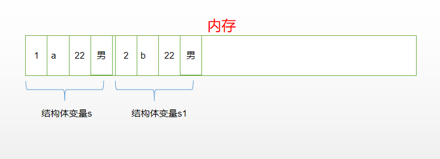
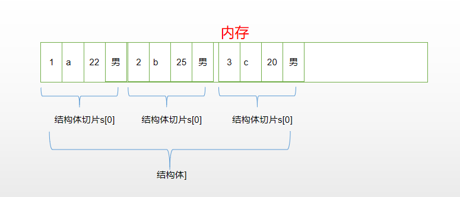

# 结构体
无论是之前学习的数组和切片,甚至是map都不能保存不同的数据类型,Go 语言中可以使用结构体来保存复杂的数据

## 结构体的定义
type 结构体名称 struct{
	成员 成员的类型
	...
}
```go
type students struct {
	id   int
	name string
	age  int
	sex  string
}
```
> 结构体要定义在函数外面,结构式是全局的,可以被项目中的所有文件调用

##  结构体的初始化

1. 定义的时候完成初始化
```go
type students struct {
	id   int
	name string
	age  int
	sex  string
}

func main() {
	// 顺序初始化,所有的成员必须按照定义时的顺序赋值
	var s students = students{1,"aaa",20,"男"}

	fmt.Println(s)
}
```

2. 定义完成之后完成初始化
```go
type students struct {
	id   int
	name string
	age  int
	sex  string
}

func main() {
	var s students
	// 使用变量给结构体的成员按个赋值
	s.id = 1
	s.name = "aaa"
	s.age = 20
	s.sex = "男"

	fmt.Println(s)
}
```

3. 不按照成员顺序的初始化
```go
type students struct {
	id   int
	name string
	age  int
	sex  string
}

func main() {
	// 初始化时指定成员进行初始化
	s := students{name:"aaa",id:1,sex:"男",age:20}
	fmt.Println(s)
}
```

## 结构体的赋值与比较

1. 结构体的赋值
```go
type students struct {
	id   int
	name string
	age  int
	sex  string
}

func main() {
	s := students{name:"aaa",id:1,sex:"男",age:20}
	s1 := s // 将 s 赋值给 s1, s1 会在内存中开辟新的空间,两个结构体变量数据不会相互影响
	fmt.Println("s:",s)
	fmt.Println("s1:",s1)
}
```

2. 结构体的比较
```go
type students struct {
	id   int
	name string
	age  int
	sex  string
}

func main() {
	s := students{name:"aaa",id:1,sex:"男",age:20}
	var s1 students
	// 相同类型的结构体之间可以相互赋值
	s1 = s
	if s1 == s {
		fmt.Println("相同")
	}else {
		fmt.Println("不同")
	}
}
```
> 结构体只能支持等值比较(==或者!=),但是结构体内的成员可以支持其它的比较(>,<,>=,<=等)

## 结构体数组与结构体切片
结构体在内存中存储的方式:

> 结构体占用空间的大小等于所有成员大小的总和

结构体数组或者结构体切片的存储方式


1. 结构体切片的定义与初始化
结构体数组的使用方式与结构体切片类似
```go
type students struct {
	id   int
	name string
	age  int
	sex  string
}

func main() {
	s :=[]students{{1,"a",22,"男"},
		{2,"b",30,"女"}}
	fmt.Println(s)

}
```

2. 循环结构体数组赋值
```go
type students struct {
	id   int
	name string
	age  int
}

func main() {
	var s [5]students
	for i :=0 ; i <len(s) ; i++ {
		fmt.Scan(&s[i].id,&s[i].name,&s[i].age)
	}
	for j :=0 ; j<len(s) ; j++ {
		fmt.Println(s[j])
	}

}
```

### 练习1: 输入5名学生的id,姓名和成绩,并求出成绩的最高分,最低分和平均分

```go
package main

import (
	"fmt"
)

type Students struct {
	id    int
	name  string
	score int
}

func main() {
	s := [5]Students{}
	sum ,max , min := 0 , 0 ,0

	for i := 0; i < len(s); i++ {
		//fmt.Printf("请输入第%d名学生的成绩:(学号 姓名 成绩 用空格分隔)\n",i+1)
		fmt.Scan(&s[i].id, &s[i].name, &s[i].score)
	}
	for j := 0; j < len(s) ; j++ {
		sum += s[j].score
		if j == 0{
			max = s[j].score
			min = s[j].score
		}
		if max <= s[j].score {
			max = s[j].score
		}else if min >= s[j].score {
			min = s[j].score
		}
	}

	fmt.Printf("平均分为:%f,最高分为:%d,最低分为:%d\n",float64(sum)/float64(len(s)),max , min)

}
// 输入
101 赵云 99
102 关羽 98
103 张飞 97
104 马超 95
105 黄忠 90
// 输出
平均分为:95.800000,最高分为:99,最低分为:90
```
### 练习2: 在上面的基础上按照成绩排序
```go
package main

import (
	"fmt"
)

type Students struct {
	id    int
	name  string
	score int
}

func main() {
	s := [5]Students{}
	sum := 0

	for i := 0; i < len(s); i++ {
		//fmt.Printf("请输入第%d名学生的成绩:(学号 姓名 成绩 用空格分隔)\n",i+1)
		fmt.Scan(&s[i].id, &s[i].name, &s[i].score)
	}
	for j := 0; j < len(s) ; j++ {
		sum += s[j].score
	}

	fmt.Printf("平均分为:%f\n",float64(sum)/float64(len(s)))
	for i := 0 ; i<len(s)-1 ; i++{
		for j :=0 ; j <len(s)-1-i ; j++ {
			if s[j].score < s[j+1].score {
				s[j] , s[j+1] = s[j+1] , s[j]
			}
		}
	}
	fmt.Println("排序后的结果为:")
	for _,value := range s{
		fmt.Println(value)
	}
}
// 输入
101 赵云 99
102 关羽 98
103 张飞 97
104 马超 95
105 黄忠 90
// 输出
平均分为:95.800000,最高分为:99,最低分为:90
排序后的结果为:
{101 赵云 99}
{102 关羽 98}
{103 张飞 97}
{104 马超 95}
{105 黄忠 90}
```

## 向结构体切片中追加数据
```go
package main

import "fmt"

type Students struct {
	id    int
	name  string
	score int
}

func main() {
	s := []Students{{101, "赵云", 99},
		{102, "关羽", 98},
		{103, "张飞", 97}}

	s = append(s, Students{104, "马超", 95},
		Students{105, "黄忠", 90})

	for _,value := range s {
		fmt.Println(value)
	}
}
```