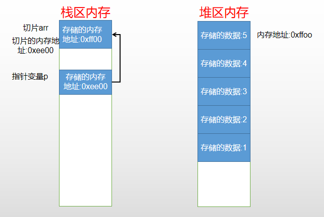

# 指针变量
前面我们学习了多种变量类型,无论是使用简单类型的变量存储数据,还是使用复合类型的变量存储数据,无外乎都有两层含义:

- 变量在内存中的存储地址

- 对应内存地址中的数据

```go
func main() {
	var i int = 9999

	fmt.Printf("变量i的内存地址为:%v\n" ,&i)  //变量i的内存地址为:0xc000064090
	fmt.Printf("变量i存储的值为:%d\n",i)
}
```
> &为取地址运算符,可以通过&符号,取到指定变量在内存中的地址,定义一个变量就是在内存中开辟一个内存地址,当将变量i赋值为9999时,就是将9999存储到对应的内存空间中

所谓的指针变量,就是用来存储一个值的内存地址,指针变量的定义如下:
```go
func main() {
	var i int = 9999

	fmt.Printf("变量i的内存地址为:%v\n" ,&i)
	fmt.Printf("变量i存储的值为:%d\n",i)

	var p  *int // 表示存储一个整形变量的地址
	p = &i		// 表示将变量 i 的内存地址取出来,赋值给指针变量 p
	// p :=&i  // 自动类型推导
	fmt.Printf("变量p的内存地址为:%v\n" ,&p)
	fmt.Printf("变量p存储的值为:%v\n",p)
	fmt.Printf("指针变量p保存的地址中对应的数据为:%d\n",*p)
}
// 输出
变量i的内存地址为:0xc00000a0b8
变量i存储的值为:9999
变量p的内存地址为:0xc000006030
变量p存储的值为:0xc00000a0b8
```

> 指针变量 p 存储的是变量 i 的内存地址,也就是指针变量 p 指向了变量 i 的存储单元,通过使用 *p ,可以调用指针变量中存储的地址对应的数据, &符号为取地址运算符, * 表示取值运算符

```go
func main() {
	var i int = 9999

	fmt.Printf("变量i的内存地址为:%v\n" ,&i)
	fmt.Printf("变量i存储的值为:%d\n",i)

	var p  *int
	p = &i
	*p = 10
	fmt.Printf("变量i的内存地址为:%v\n" ,&i)
	fmt.Printf("变量i存储的值为:%d\n",i)
}
//输出
变量i的内存地址为:0xc00000a0b8
变量i存储的值为:9999
变量i的内存地址为:0xc00000a0b8
变量i存储的值为:10
```
> 通过指针变量修改数据的时候,我们可以看到,源内存地址是不变的,但是内存地址中对应的数据是可以修改的

使用指针变量要主要以下两点


1. 默认值为 nil
```go
func main() {
	var i int = 9999

	fmt.Printf("变量i的内存地址为:%v\n" ,&i)
	fmt.Printf("变量i存储的值为:%d\n",i)

	var p  *int
	fmt.Printf("指针变量p存储的地址为:%v\n",p)
}
//输出
变量i的内存地址为:0xc000060090
变量i存储的值为:9999
指针变量p存储的地址为:<nil>
```
> nil 为(0),空指针,表示保存内存地址编号为0的空间,0-255 的地址空间为系统占用,不允许用户访问

2. 不能操作没有合法指向的内存
```go
var p  *int
	*p = 56  // 这种是错误的,访问了内存地址为0的空间,56是为定义的内存空间,这种方式称为野指针
	fmt.Printf("指针变量p存储的地址为:%v\n",p)
```

## new()函数
上面实验中,我们得出了指针变量不能使用未定义内存地址,也是就出现野指针的情况,但是我们可以通过new函数来申请创建内存地址

```go
package main

import "fmt"

func main() {
	var p *int

	p = new(int)
	*p = 57
	fmt.Println(*p)
	fmt.Println(p)
}
```
> new(int)的作用就是创建一个整形大小的空间,然后让指针变量 p 指向该空间,在通过指针变量 p 访问空间进行赋值,go 语言中使用new()函数申请的内存,不需要手动的去释放,创建空间的默认值为对应类型的默认值

也可以使用自动推导类型创建
```go
package main

import "fmt"

func main() {
	p :=new(int)
	*p = 57
	fmt.Println(*p)
	fmt.Println(p)
}
```

## 指针作为函数的参数使用
指针变量因为存储的是变量的内存地址,那么即使在函数中调用,也是直接使用对应内存地址空间中的值,那么指针作为函数的参数时为引用调用

```go
func test(num1,num2 *int)  {
	*num1 , *num2 = *num2 , *num1
}

func main() {
	a , b := 1 , 2
	test(&a,&b)
	fmt.Println(a,b)
}
```
> 输出结果为 2,1 , 那么证实指针作为函数参数的时候为引用调用s 


## 数组指针
前面学习数组的时候,说明了数组作为函数参数是值传递,如果想实现引用传递,可以使用数组指针

所谓的数组指针,就是将指针变量指向数组的地址
```go
package main

import "fmt"

func test(arr *[5]int)  {
	for i:= 0 ; i<len(*arr)-1 ; i++ {
		for j :=0 ; j<len(*arr)-1-i ; j++ {
			if (*arr)[j] > (*arr)[j+1] {
				(*arr)[j] , (*arr)[j+1] = (*arr)[j+1] , (*arr)[j]
			}
		}
	}
}

func main()  {
	num := [5]int{5,4,3,2,1}

	test(&num)

	fmt.Println(num)
}
// 上面代码中的 *arr 表示的就是num,但是要调用数组中的元素的话需要(*arr)[j] ,需要加上括号 *arr[j]这种方式是错误的
```
> 上面的代码中 要使用数组的元素需要 (*arr)[j] , 但是在 Go 语言中可以直接使用指针变量加数组下标来操作数组元素

```go
package main

import "fmt"

func test(arr *[5]int)  {
	for i:= 0 ; i<len(arr)-1 ; i++ {
		for j :=0 ; j<len(arr)-1-i ; j++ {
			if arr[j] > arr[j+1] {
				arr[j] , arr[j+1] = arr[j+1] , arr[j]
			}
		}
	}
}

func main()  {
	num := [5]int{5,4,3,2,1}

	test(&num)

	fmt.Println(num)
}
```

## 切片指针
所谓的数组指针,就是将指针变量指向切片的地址,切片本身在调用的时候,使用的就是引用调用
```go
package main

import "fmt"

func test(arr *[]int)  {
	for i:= 0 ; i<len(*arr)-1 ; i++ {
		for j :=0 ; j<len(*arr)-1-i ; j++ {
			if (*arr)[j] > (*arr)[j+1] {
				(*arr)[j] , (*arr)[j+1] = (*arr)[j+1] , (*arr)[j]
			}
		}
	}
	fmt.Println(&arr)
}

func main()  {
	num := []int{5,4,3,2,1}

	test(&num)

	fmt.Println(num)
}
```
> 通过上面的代码,我们可以看出,切片指针在调用切片元素的时候,必须要是用 (*指针变量)[数组下标] 来调用,通过下面的图片我们能知道原因



> 因为指针p中存储的是切片arr的内存地址,而切片arr中存储的是切片第一个元素的内存地址,因此必须使用 *p 才能使用切片中的元素

使用new函数创建切片指针
```go
func main()  {
	p := new([]int)

	*p = append(*p,55,66,77)

	fmt.Println(*p)
}
```

## 指针切片指针数组
切片指针或数组指针是指:使用指针变量指向切片或者数组的地址
指针切片和指针数组指的是:使用切片或者数组中的元素存储的都是指针(也就是地址)

1. 指针切片
```go
func main()  {
	p := new([]*int)
	a := 10
	b := 20

	p = append(p,&a,&b)
	for _,v :=range p {
		fmt.Println(*v)
	}

}
```
> 从上面的代码我们可以看出,指针切片的定义为 p := new([]*int) , 而切片指针的定义为 p := new([]int), 表示切片存储的是 *int(指针类型)的变量

调用指针切片中的元素
```go
func main()  {
	p := new([]*int)
	a := 10
	b := 20

	*p = append(*p,&a,&b)
	for _,v :=range *p {
		fmt.Println(*v)
	}

}
```
> 变量v中存储的是指针切片中的元素的地址,通过 *v 访问对应地址中元素的值

2. 指针数组
```go
func main()  {
	p := new([2]*int)
	a := 10
	b := 20

	p[0] = &a
	p[1] = &b
	for _,v :=range p {
		fmt.Println(*v)
	}

}
```
> 因为数组和切片存储方式的不同,不需要使用 "星号" 来调用

## 结构体指针变量

1. 结构体指针的定义
```go
package main

import "fmt"

type student struct {
	id   int
	name string
	age  int
}

func main() {

	var p1 *student = &student{1,"aaa",22}
	fmt.Println(p1)
}

```

也可以使用自动推导类型来定义
```go
package main

import "fmt"

type student struct {
	id   int
	name string
	age  int
}

func main() {

	p1 := &student{1,"aaa",22}
	fmt.Println(p1)
}
```

2. 结构体指针的成员的使用
```go
package main

import "fmt"

type student struct {
	id   int
	name string
	age  int
}

func main() {

	p1 := &student{1,"aaa",22}
	p1.name = "bbb"
	fmt.Println(p1)
}
```

3. 结构体指针的参数传递

```go
package main

import "fmt"

type student struct {
	id   int
	name string
	age  int
}

func test(stu *student)  {
	stu.id = 101
}

func main() {

	p1 := &student{1,"aaa",22}
	test(p1)
	fmt.Println(p1)
}
```

> 结构体指针默认是值传递,但是能通过使用结构体指针变量,在函数调用的时候,使用引用传递

## 多级指针
```go
func main() {
	a :=10
	p :=&a
	pp :=&p  // 二级指针
	fmt.Println(a)
	fmt.Println(*p)
	fmt.Println(**pp)
}
```
> 二级指针保存的是一级指针的地址


# 内存的模型

内存开始 0-255 为系统占用,不允许程序进行读写操作,最高地址段用来存放注册表信息,对于程序来说,内存可以分为4个区域


1. 代码区
存放计算机执行信息,是只读的,比如函数没有执行的情况下,会存放在代码区,需要使用的时候,会加载到栈区

2. 数据区

常量区:存放常量,常量区的数据不能显示地址
初始化数据区:存放已经初始化过的数据
未初始化数据区:存放未初始化过的数据

3. 堆区
用来存储切片数据、string或者new函数申请的空间等,堆区的空间最大, go 语言在使用堆区的空间的时候,不需要对其进行管理

4. 栈区
经常用来存放局部变量、函数信息