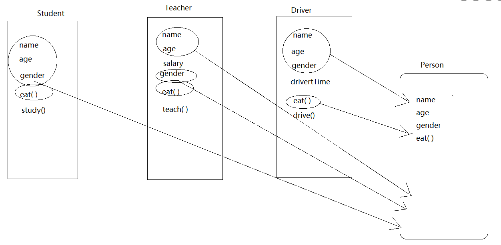

# 什么是面向对象

面向过程编程:所谓的面向过程编程就是强调过程(步骤),每一个过程都需要自己去实现

面向对象编程:就是强调的是对象,不需要去关系实现的过程,关注的是去实现的对象

## 对象和类
在面向对象中,有两个比较重要的概念就是对象和类

1. 对象
万物皆对象,在生活中我们来描述对象的时候,可以通过对象的特征(身高,体重,年龄等)和行为(爱好等)进行描述
在程序中,通过属性和方法(函数)来描述对象,属性就是特征,方法(函数)就是行为,所以说对象必须具有属性和方法

2. 类
类就是个模板,确定了对象应该具有的属性和方法,例如"人"类具有(年龄,身高和姓名等属性),"张三"这个对象就是根据"人"这个类创建出来的,也就是说先有类才有的对象


# go 语言中的面向对象
严格意义上来说, Go 语言中没有类的概念,但是我们可以将结构体看作是类,应为结构体中可以添加属性(成员)和方法(函数)

面向对象编程的好处:

1. 继承
继承是指,我们可能会在一些类(结构体)中,重复的写一些成员,那么我们就可以将这些重复的成员单独的封装到一个类(结构体)中,作为这些类的父类



通过上的图,我们可以看出,学生类和教师类中有共同的成员(属性和方法),这样就存在重复,所以我们就把这些重复的成员封装到一盒父类中,然后在学生类和教师类中继承父类

> 其实,go语言中是没有继承的,但是我们可以通过"匿名组合"来实现继承的效果

## 匿名字段的创建和初始化
可以通过匿名字段(也叫匿名组合)来实现

1. 匿名字段的定义
```go
type person struct {
	id   int
	name string
	age  int
}

type student struct {
	person // 匿名字段
	score int
}
type teacher struct {
	person  / 匿名字段
	subjects string
}
```
> 创建学生类和教师类的时候,可以通过匿名字段来继承person类中的成员,那么student类和teacher类中就有了person类中的成员,注意匿名字段只有类型,没有名称

2. 匿名字段的初始化
```go
package main

import "fmt"

type person struct {
	id   int
	name string
	age  int
}

type student struct {
	person
	score int
}

type teacher struct {
	person
	subjects string
}

func main() {
	// 按照顺序初始化
	stu1 :=student{person{101,"张三",22},100}
	// 指定成员初始化
	stu2 :=student{score:99}
	// 对匿名字段指定成员初始化
	stu3 :=student{person{name:"李四"},96}
	th1 :=teacher{person{101,"treacher.Li",35},"语文"}
	fmt.Println("student1:",stu1)
	fmt.Println("student2:",stu2)
	fmt.Println("student3:",stu3)
	fmt.Println("th1:",th1)
}
```

3. 成员的操作
```go
package main

import "fmt"

type person struct {
	id   int
	name string
	age  int
}

type student struct {
	person
	score int
}

type teacher struct {
	person
	subjects string
}

func main() {
	stu1 :=student{person{101,"张三",22},100}
	th1 :=teacher{person{101,"treacher.Li",35},"语文"}
	stu1.score = 99
	th1.person.age = 45 // th1.age = 45
	fmt.Println("student1:",stu1)
	fmt.Println("th1:",th1)
}
```
// 在为匿名字段的成员赋值的时候,子类中没有相同的字段,可以不同添加匿名字段的值
## 同名字段
同名字段,指的就是子类中有和父类中相同的成员
```go
type person struct {
	id   int
	name string
	age  int
}

type teacher struct {
	person
	name string // 同名字段
	subjects string
}

func main() {
	th1 :=teacher{person{101,"teacher.Li",35},"lisi","语文"}
	th1.name = "李四"
	//th1.person.name = "teacher.李"
	fmt.Println("th1:",th1)
}

// 输出
th1: {{101 treacher.Li 35} 李四 语文}
```
> 从输出中我们可以看出,如果有同名字段,那么操作的成员的时候,没有指定父类的话,会优先使用子类成员,子类中没有才会去父类中找对应的成员,如果指定了父类的话,会使用父类中的成员

## 指针类型匿名字段
结构体(类)中使用的匿名字段,也可以是指针类型的
```go
package main

import "fmt"

type person struct {
	id   int
	name string
	age  int
}

type student struct {
	*person // 指针类型的匿名字段
	score int
}

func main() {
	stu :=student{&person{101,"student.sun",22},100}

	fmt.Println(stu) //输出{0xc000054440 100}
}
```

使用指针类型的匿名字段的取值
```go
package main

import "fmt"

type person struct {
	id   int
	name string
	age  int
}

type student struct {
	*person
	score int
}

func main() {
	stu :=student{&person{101,"student.sun",22},100}

	fmt.Println(stu.id)
}
```

在对象定义后,逐个元素初始化
```go
package main

import "fmt"

type person struct {
	id   int
	name string
	age  int
}

type student struct {
	*person
	score int
}

func main() {
	var stu student
	stu.person = new(person) // 必须使用new函数现将 *person 指向person内存空间
	// 如果这里不使用new函数创建空间的话,那么使用的时候,因为 *person 是指针类型,但是并没有指向任何地址,就是不可使用的
	stu.id = 101
	stu.name = "student.Li"
	stu.age = 22
	stu.score = 99
	fmt.Println(stu.id,stu.name,stu.age,stu.score)
}
```

> new函数的作用是分配内存空间,new函数的参数是一个类型,这里person是结构体类型,所以赋值给 *person ,这样 *person 就指向了结构体person的内存空间

## 同名字段
在上面的案例中,student 类(结构体)继承了 person 类(结构体),那么 person 类能不能继承别的类呢

多重继承是指在一个类中可以继承另一个类,而另外一个类又可以继承别的类,比如A类继承B类,而B类又可以继承C类,这就是多重继承

```go
package main

import "fmt"

type person struct {
	id   int
	name string
	age  int
}

type man struct {
	person
	sex string
}

type students struct {
	man
	sorce int
}

func main() {
	stu1 :=students{man{person{1,"张三",22},"man"},99}
	fmt.Println(stu1)
}
```
> 上面的程序中,man 类继承了person 类,而student 类又继承了man 类,操作的方式和之前的类似,但是在开发的过程中要尽量减少使用多重继承,使用多重继承会增加程序的复杂度