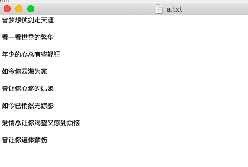
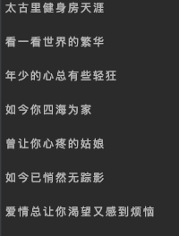

# 文本文件的处理
之前的学习中,我们总是将数据存储在内存总,但是存储在内存中的数据是不持久的,也就是如果系统断电了,就会导致存储在内存中的数据丢失,所以,为了能够持久的存储数据,那么我们需要把数据存储到硬盘上

# 创建文件
创建文件需要使用到 Create()函数,该函数在创建文件时,首先会判断文件是否存在,如果不存在则创建,如果存在,会将文件中已有的数据清空,当文件创建成功后,该文件会默认打开,所以不用执行打开操作,可以直接向文件中写入数据

创建文件的步骤:

- 导入对应的 “os”包,创建文件和读写文件的方法都在该包中

- 指定创建的文件已经存放路径

- 执行Create()函数,进行文件创建

- 关闭文件

```go
package main

import (
	"fmt"
	"os"
)

func CreateFile(path string)  {
	// 创建文件，返回两个值，一个是创建文件，另一个是错误信息
	f,err := os.Create(path) //指定创建文件的路径,路径可以是绝对路径或者是相对路径
	if err != nil {
		fmt.Println(err)
		return
	}
	defer f.Close() // 在函数退出的时候关闭文件
}

func main()  {
	var filepath  = "/Users/weiying/a.txt"
	CreateFile(filepath)
}
```
- 执行上面代码后,可以在指定的的目录下创建一个指定文件名的文件,如果没有指定文件路径,会在当前程序所在的目录下创建指定的文件

> ⚠️注意:在创建文件的时候,需要判断是否出现异常,同时注意使用defer关闭文件,如果不关闭文件会占用内存和缓冲区,也会导致打开的最大文件数达到上限

## 打开文件
打开文件和创建文件使用的都是 “os”包中的方法,创建文件使用的是Create()方法,打开文件是Open和OpenFile方法

> 这里有一点要注意的是,打开文件就是单单的打开文件,并不读取文件中的内容,如果要读取文件,需要打开文件并使用对应读取文件的方法去操作,只要是对文件进行读写,第一步都应该是打开文件(创建文件默认就打开了文件)

1. Open()方法的使用
Open() 方法只有一个参数,就是指定文件的存放路径和名称,然后以“只读”的方式打开

返回值有两个,分别是文件指针和错误信息
```go
func main()  {
	// 以只读的方式打开文件
	filename , err := os.Open("/Users/weiying/Desktop/b.txt")

	defer filename.Close() // 延迟调用，结束的时候一定要关闭文件

	if err != nil {
		fmt.Println("打开文件失败",err)
		return
	}

}
```

2. OpenFile()方法的使用
OpenFile()方法有三个参数,分别代表:

- 第一个参数:指定要打开的文件的路径

- 第二个参数:指定打开文件的模式,常见的模式有
	- os.O_RDONLY : 只读模式
	- os.O_WRONLY : 只写模式
	- os.O_RDWR : 读写模式
	- os.APPEND : 追加模式
	- os.O_CREAT : 创建文件
	- os.O_TRUNC :清空

- 第三个参数:指定打开文件的权限
	- 0 : 表示没有任何权限
	- 1 : 执行权限(如果是可执行文件,程序是可以运行的)
	- 2 : 写权限
	- 3 : 写权限与执行权限
	- 4 : 读权限
	- 5 : 读权限与执行权限
	- 6 : 读、写权限
	- 7 : 读、写、执行权限

```go
func main()  {
	// 以读写的权限打开指定的文件
	filename , err := os.OpenFile("/Users/weiying/Desktop/b.txt",os.O_RDWR,0644)

	defer filename.Close() // 延迟调用，结束的时候一定要关闭文件

	if err != nil {
		fmt.Println("打开文件失败",err)
		return
	}

}
```

当打开文件的时候,想要指定多个模式的时候,需要使用`|`位运算,来指定多个
```go
filename, err := os.OpenFile("/Users/weiying/Desktop/b.txt", os.O_RDWR|os.O_CREATE|os.O_APPEND, 0644)

//以读写的模式打开,如果没有文件就创建,并采用追加的模式
// 能这样写的原因是,底层的实现都是十六进制的数字
O_RDONLY                          = 0x0       0000 0000 0000 0000
O_WRONLY                          = 0x1       0000 0000 0000 0001
O_RDWR                            = 0x2       0000 0000 0000 0010
O_APPEND                          = 0x8       0000 0000 0000 1000
O_CREAT                           = 0x200     0000 0010 0000 0000
O_TRUNC                           = 0x400     0000 0100 0000 0000
...

从上面的二进制中可以看出,每一位二进制数字都是一个标志位,每个标志位表示一个功能,比如 O_RDONLY 和 O_WRONLY 使用的标志位都是 第一位,那么说明 当这两个模不能同时使用,当使用了 "|"连接多个模式以后,那么会根据二进制进行逻辑或运算,得到的标志位为 1 的表示使用在这个标志位上的模式生效
```

# 向文件中写入数据

1. 向文件中写数据的方法为 WriteString()
```go
package main

import (
	"fmt"
	"os"
)

func CreateFile(path string)  {
	// 创建文件，返回两个值，一个是创建文件，另一个是错误信息
	f,err := os.Create(path)
	if err != nil {
		fmt.Println(err)
		return
	}
	// 新创建的文件默认为打开的，可以向文件中写入数据
	for i := 0 ; i<10 ; i++{
		// WriteString()函数有两个返回值,第一个是写入数据的长度,第二个是返回的错误信息
		n,err2 := f.WriteString("Hello world") // 向指定的文件中写入指定的信息
		fmt.Println(n)
		if err2 != nil {
			fmt.Println(err)
			return
		}
	}
	defer f.Close() // 在函数退出的时候关闭文件
}


func main()  {
	var filepath  = "/Users/weiying/Desktop/a.txt"
	CreateFile(filepath)
}
```
>  WriteString() 方法默认写到文件中的数据是不换行的,如果想换行,可以采用下面的方式

```go
// 插入换行符
f.WriteString("Hello world\n")
// 注意,这种方式会有问题,因为Linux或者unix的换行符为“\n”,但是windows的换行符为“\r\n”
```

2. 使用Write()方法,以切片的方式写入单个字符
同样有两个返回值,返回字符个数和返回的写入结果
```go
package main

import (
	"fmt"
	"os"
)

func CreateFile(path string)  {
	// 创建文件，返回两个值，一个是创建文件，另一个是错误信息
	f,err := os.Create(path)
	if err != nil {
		fmt.Println("error",err)
		return
	}
	// 新创建的文件默认为打开的，可以向文件中写入数据
	s := []byte{'a','b','c','d'} // 字符切片
	for i := 0 ; i<10 ; i++{
		n,err2 := f.Write(s) //写入
		fmt.Println(n)
		if err2 != nil {
			fmt.Println("error",err)
			return
		}
	}
	defer f.Close() // 在函数退出的时候关闭文件
}


func main()  {
	var filepath  = "/Users/weiying/Desktop/a.txt"
	CreateFile(filepath)
}
```
> 上面的的书写方式就是特别的麻烦,但是实际上可以将字符串类型装换成字节切片

```go
func CreateFile(path string)  {
	// 创建文件，返回两个值，一个是创建文件，另一个是错误信息
	f,err := os.Create(path)
	if err != nil {
		fmt.Println("error",err)
		return
	}
	// 新创建的文件默认为打开的，可以向文件中写入数据
	str := "hello world\n" //字符串类型
	b :=[]byte(str) // 字符串类型转换为字节切片
	for i := 0 ; i<10 ; i++{
		n,err2 := f.Write(b)
		fmt.Println(n)
		if err2 != nil {
			fmt.Println("error",err)
			return
		}
	}
	defer f.Close() // 在函数退出的时候关闭文件
}
```

3. 使用 WriteAt() 方法,在指定的位置插入数据
WriteAt() 方法也有两个返回值,第一个是插入数据的长度,第二个是返回插入的是否成功的结果

WriteAt() 方法有两个参数:第一个参数是要插入的字符切片,第二个参数是指定插入字符的位置(偏移量),位置指定的是光标的位置,从指定的光标的位置开始插入

现在有文件的内容为:


```go
package main

import (
	"fmt"
	"os"
)

func main()  {
	filename , err := os.OpenFile("/Users/weiying/Desktop/a.txt",os.O_RDWR,6)

	defer filename.Close() // 延迟调用，结束的时候一定要关闭文件

	if err != nil{
		fmt.Println("文件创建失败",err)
		return //此处的 return 必须添加，因为如果文件读取失败肯定不能执行下面的操作
	}
	str := "太古里健身房"

	b := []byte(str)
	a , err2 := filename.WriteAt(b,0) //将光标定位到文件起始位置,将指定的字符切片替换当前的内容
	if err2 != nil{
		fmt.Println("写入数据失败",err2)
	}
	fmt.Println(a)
}
```
执行后的结果为:


> 当使用 WriteAt() 方法的时候,会依次覆盖原有的内容

##  Seek()设置光标的位置
文件打开后,默认光标的位置为文件开始,我们可以使用seek方法来指定光标到具体的位置,从指定的位置开始操作文件


Seek() 方法有两个参数:

- 第一个 : 偏移量
	正数表示向文件尾部偏移,负数表示向文件头部偏移

- 第二个 : 偏移的开始位置 (文件打开,默认的光标位置为文件开头)
	- os.SEEK_SET(io.SeekStart) : 表示从起始位置开始,也可以用“0”表示
	- os.SEEK_CUR(io.SeekCurrent) : 表示从光标的当前位置开始,也可以用“1”表示
	- os.SEEK_END(io.SeekEnd) : 表示从结束位置开始,也可以用“2”表示

Seek() 方法有两个返回值

- 第一个 : 获取设置光标位置的偏移量
	表示从文件起始位置,到当前文件读写指针位置的偏移量

- 第二个 : 返回是否成功,如果请求的位置是有效的会返回这个位置的信息到第一个参数,第二个值为空,如果请求的位置是无效的,那么会返回错误信息给第二个值

例如:在文件的末尾插入指定的信息
```go
package main

import (
	"fmt"
	"os"
)

func main()  {
	filename , err := os.OpenFile("/Users/weiying/Desktop/a.txt",os.O_RDWR,0644)

	defer filename.Close() // 延迟调用，结束的时候一定要关闭文件

	if err != nil{
		fmt.Println("文件创建失败",err)
		return //此处的 return 必须添加，因为如果文件读取失败肯定不能执行下面的操作
	}
	str := "太古里健身房"

	b := []byte(str)
	// 获取偏移量,设置光标的位置为文件结束的位置
	n,_ := filename.Seek(0,2)

	a , err2 := filename.WriteAt(b,n)
	if err2 != nil{
		fmt.Println("写入数据失败",err2)
	}
	fmt.Println(a)
}
```

上面的方法中,执行在文件的指定位置插入的话,如果在指定的位置是有数据的,那么默认会覆盖原有的内容,如果不想覆盖的话,需要先将文件的内容临时存储到别的地方,然后在源文件中插入指定位置之前的数据和指定的数据以及后面的数据,指定位置的内容在临时文件中获取,完毕删除临时文件


# 文件读取
如果文件已经存在了,就可以进行数据的读取了,读取数据的基本流程就是,首先打开文件,然后读取,最后关闭文件

1. read() 方法的使用
read()方法有两个返回值

	- 返回值1 :  读取数据的长度

	- 返回值2 : 读取数据是否成功

```go
package main

import (
	"fmt"
	"io"
	"os"
)

func main() {
	filename := "/Users/weiying/Desktop/a.txt"

	f,err1 := os.Open(filename)
	if err1 != nil{
		fmt.Println("打开文件错误",err1)
		return
	}
	defer f.Close()
	// 创建字符切片用来存储读取出来的数据 2048哥字节（2KB ）
	b := make([]byte,1024*2)
	// 读取指定的文件内容，将读取到的数据保存在 b 中
	n,err2 := f.Read(b)
	if err2 != nil || err2 != io.EOF { // 判断文件读取失败或者文件没有读取到结尾
		fmt.Println("读取文件出错",err2)
		return
	}
	fmt.Println(string(b[0:n]))
}
```

> 使用 read() 方法读取文件的时候,需要一个切片类型,而且定义切片的时候需要的类型数字符切片,将读取到的内容保存在切片中,如果文件的长度超过切片定义的长度,那么只会以切片的长度为准

2. ReadBytes( ) 按行读取数据
使用 ReadBytes( ) 方法读取数据时,需要用到缓冲区,所谓的缓冲区就是存储数据的区域,也就是先将从文件中读取到的数据存储在该区域中,然后将该区域中的数据读取出来

```go
package main

import (
	"bufio"
	"fmt"
	"io"
	"os"
)

func main() {
	filename := "/Users/weiying/Desktop/a.txt"

	f,err1 := os.Open(filename)
	if err1 != nil{
		fmt.Println("打开文件错误",err1)
		return
	}
	defer f.Close()
	// 创建缓冲区
	r := bufio.NewReader(f)

	//读取缓冲区中的内容
	for {
		// 遇到指定的分隔符停止，这里指定的是'\n'，将读取到的数据保存在buff中
		buff , err2 := r.ReadBytes('\n')
		if err2 != nil {
			if err2 == io.EOF { // 如果读取失败并且已经到了最后一行，那么退出读取的循环
				// io.EOF 表示文件的结尾,值为-1,结束标记是要单独读取一次才能读到的x
				break
			}
			fmt.Println(err2)
		}
		// 每次读取一行并打印
		fmt.Println(string(buff))
	}
}
```

> 使用 ReadBytes() 方法的时候,传递的参数就是指定的分隔符,遇到指定的参数的时候,就会进行分割,然后继续读取,直到读取文件结束才退出循环,ReadBytes() 方法返回的是字节切片

## 文件操作实例

1. 让用户输入存在的源文件的名称,在用户指定的位置为其复制一份
```go
package main

import (
	"fmt"
	"io"
	"os"
)

// 定义接口，接口提供读取文件的方法和写入文件的方法
type Read_Writeer interface {
	read_file() string
	wirte_file()
}

// 定义类，filename1 为要读取的文件，filename2 为要写入的文件
type filenames struct {
	filename1 string
	filename2 string
}

// 实现读取文件的方法 , 返回值用来传递从文件中读取出来的数据
func (f *filenames) read_file() string{
	r , o_err := os.Open(f.filename1)
	defer r.Close()
	if o_err != nil{
		fmt.Println("打开文件错误",o_err)
		return "error"
	}else {
		fmt.Println("打开文件成功")
	}

	b :=make([]byte,1024) // 创建1024字节大小的缓冲区
	n , r_err := r.Read(b)
	if r_err != nil{
		if r_err != io.EOF{
			fmt.Println("文件没有读取完整")
		}
		fmt.Println("读取文件错误",r_err)
		return "error"
	}else {
		fmt.Println("读取文件成功")
	}

	s := string(b[0:n])
	return s
}

// 将数据写入到文件中的方法
func (f *filenames) wirte_file() {
	// 首先创建文件
	w , c_err := os.Create(f.filename2)
	defer w.Close()
	if c_err != nil {
		fmt.Println("创建文件错误",c_err)
		return
	}else {
		fmt.Println("创建文件成功")
	}
	s :=f.read_file() // 写入的数据为读取出来的
	_,w_err := w.WriteString(s)
	if w_err != nil {
		fmt.Println("写入文件错误",w_err)
		return
	}else {
		fmt.Println("写入文件成功")
	}

}

// 实现接口的多态
func Who_read_writer(i Read_Writeer)  {
	i.wirte_file()
}

// 获取用户输入路径的方法
// y_filename 表示源文件 ， m_filename 表示目标文件
func print_file() (y_filename , m_filename string) {
	fmt.Printf("请输入源文件：")
	fmt.Scanf("%s",&y_filename)
	fmt.Printf("请输入目标文件：")
	fmt.Scanf("%s",&m_filename)
	return
}

func main()  {
	y_filename , m_filename := print_file()
	f := &filenames{y_filename,m_filename}
	Who_read_writer(f)
}
```

2. 大文件拷贝
```go
package main

import (
	"fmt"
	"io"
	"os"
)

func main()  {
	// 打开文件
	f_r , err := os.Open("/Users/weiying/Desktop/createyum.sh")

	if err != nil {
		fmt.Println(err)
		return
	}
	// 关闭文件
	defer f_r.Close()

	// 创建目标文件
	f_w , err := os.Create("/Users/weiying/Desktop/createyum2.sh")
	if err != nil {
		fmt.Println(err)
		return
	}
	defer f_w.Close()
	// 创建1024字节大小的缓冲区
	b :=make([]byte,1024)
	// 每次读取1024字节大小的数据写入，循环直到文件结尾
	for {
		n , err := f_r.Read(b)
		if err != nil && err == io.EOF {
			fmt.Println(err)
			return
		}
		// 写入文件
		f_w.Write(b[:n])
		// 这里不能写入整个b字节切片，因为文件的最后一次读取,可能小于1024
		// 那么如果写入整个字节切片的话，写出的文件会比源文件大
		// 那么写入的应该是字节切片的开始到读取字节数为结尾
	}
}
```