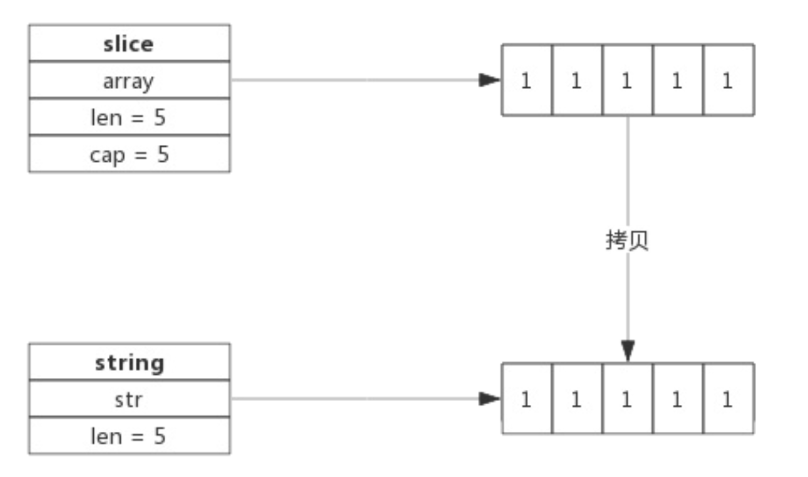
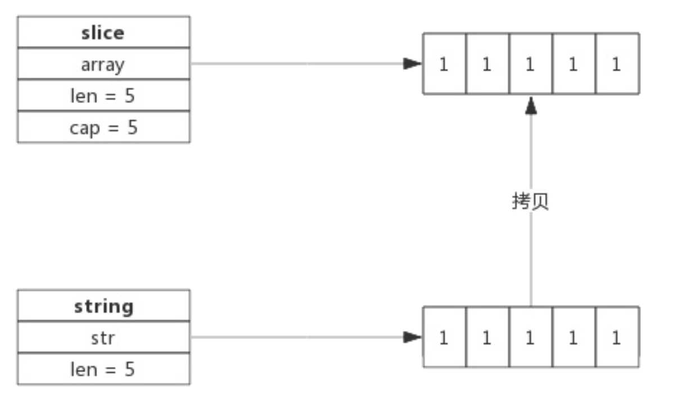

## 字符串的标准概念

Go 标准库`src/builtin/builtin.go`,其中关于 string 的描述如下

```go
// string is the set of all strings of 8-bit bytes, conventionally but not
// necessarily representing UTF-8-encoded text. A string may be empty, but
// not nil. Values of string type are immutable.
type string string
```

所以字符串是 8 比特字节的集合,通常但不一定是 UTF-8编码的文本

另外,还提到了两点,非常重要

- string 可以为空(长度为 0),但是不会是 nil
- string 对象不可以修改

### string 数据结构

源码包`src/runtime/srting.go` 中定义了 string 的数据结构

```go
type stringStruct struct {
	str unsafe.Pointer
	len int
}
```

其实字符串的数据结构很简单

- stringStruct.str : 字符串的首地址
- stringStruct.len : 字符串的长度

string 数据结构与切片类似,只不过是切片还有一个表示容量的成员,事实上 string 和 slice,准确的来说是 buye 切片经常发生转换


### 字符串的声明

```go
var str string
str = ""hello world
```

上面的代码中,声明了一个字符串,并且赋值,字符串的构建过程是先构建 stringStruct,再转换成 string,转换的源码如下:

```go
func gostringnocopy(str *byte) string {// 根据字符串地址构建 string
  ss := stringStruct{str: unsafe.Pinter(str),len:findnull(str)} // 先构建 stringStrcut
  s := *(*string)(unsafe.Pointer(&ss)) // 再将 stringStruct 转换成 string
  return s
}
```

string 在 runtime 包中就是 stringStruce,对外呈现叫做 string

### 将[]byte 转换成string

byte 切片可以很方便的转换成 string

```go
func GetStringBySlice(s []byte) string {
  return string(s)
}
```

需要注意的是: 这种转换需要一次内存拷贝

转换的过程如下:

- 根据切片的长度申请内存空间,假设内存地址为 P,切片的长度为 len(b)
- 构建 string(string.str = p;string.len=len)
- 拷贝数据(切片中的数据拷贝到新申请的内存空间)



### string 转[]byte

```go
func GetSliceByString(str string) []byte { 2. return 		[]byte(str)
}
```

string 转换成字节切片,也需要一次内存拷贝,其过程如下

- 申请切片内存空间
- 将 string 拷贝到切片 



### 字符串拼接

即便有很多的字符串需要拼接,性能上也有很好的保证,因为新字符串的内存空间是一次分配完成的,所以性能的消耗主要是在数据拷贝上

一个拼接语句的字符串编译的时候,会被存放到一个切片中,拼接过程需要遍历两次切片,第一次遍历获取总的字符串长度,第二次遍历会把字符串逐个拷贝进去

字符串的拼接代码如下

```go
func concatstrings(a []string) string { // 字符串拼接
  length := 0	// 拼接后的字符串的长度
  for _,str := rangs a {
    length +=length(str)
  }
  
  s, b := rawstring(length) // 生成指定大小的字符串,返回一个 string 和切片,二者共享内存空间
  for _,str := range a {
    copy(b,str)	// string 无法修改,只能通过切片修改 
    b = b[len(str):]
  }
  return s
}
```

  因为 string 是无法直接修改的,所以这里使用 rawstring() 方法初始化一个指定大小的 string,同时返回一个切片,二者共享一块内存空间,后面向切片中拷贝数据,也就间接的修改的 string

```go
func rawstring(size int) (s string, b []byte) { // 生成一个新的string，返回的string和切片共享相同的空间
  p := mallocgc(uintptr(size), nil, false)
  stringStructOf(&s).str = p
  stringStructOf(&s).len = size

  *(*slice)(unsafe.Pointer(&b)) = slice{p, size, size} 8.
  return
}
```

#### 为什么字符串不允许修改

向 C++中的 strings,其本身拥有内存空间,修改 string 是支持的,但是在 go 语言汇总,string 不包含内存空间,只有一个内存指针,这样做的好处就是 string 变得很轻量级,可以很方便的进行传递而不用担心内存拷贝

因为 string 通常是指向字符串字面量,而字符串字面量存储位置是只读段,而不是堆或者栈上,所以才有了 string 不可修改的约定 

