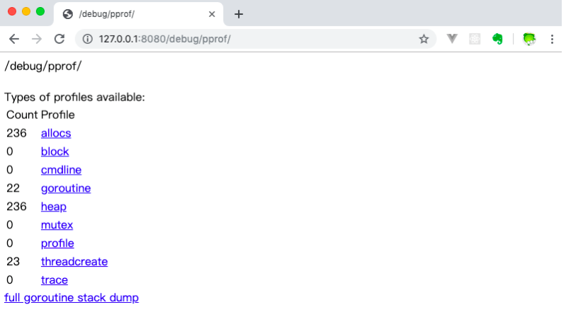
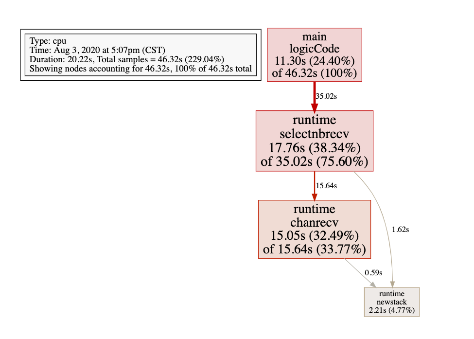

## 基准测试
基准测试就是在一定的工作负载的情况下,检测程序性能的方法,基准测试的基本格式如下

```go
func BenchmarkName(b *testing.B) {
  // ....
}
```

基准测试以`Benchmark`为前缀,需要一个以`*testing.B` 类型的参数 b ,基准测试需要执行 b.N 次,这样的测试才有对照性,`b.N`的值是根据系统实际情况去调整的,从而保证测试的稳定性,`Testing.B`拥有的方法如下;
```go
func (c *B) Error(args ...interface{})
func (c *B) Errorf(format string, args ...interface{})
func (c *B) Fail()
func (c *B) FailNow()
func (c *B) Failed() bool
func (c *B) Fatal(args ...interface{})
func (c *B) Fatalf(format string, args ...interface{})
func (c *B) Log(args ...interface{})
func (c *B) Logf(format string, args ...interface{})
func (c *B) Name() string
func (b *B) ReportAllocs()
func (b *B) ResetTimer()
func (b *B) Run(name string, f func(b *B)) bool
func (b *B) RunParallel(body func(*PB))
func (b *B) SetBytes(n int64)
func (b *B) SetParallelism(p int)
func (c *B) Skip(args ...interface{})
func (c *B) SkipNow()
func (c *B) Skipf(format string, args ...interface{})
func (c *B) Skipped() bool
func (b *B) StartTimer()
func (b *B) StopTimer()
```

#### 基准测试示例
```go
func BenchmarkSplit(b *testing.B) {
	for i:=0;i<b.N;i++ {
		Split("我的你的他", "的")
	}
}
```

执行基准测试
```bash
$ go test -bench=Split
goos: darwin
goarch: amd64
pkg: split_str
BenchmarkSplit-4         4450274               302 ns/op
PASS
ok      split_str       1.637s
```

基准测试不会默认执行,需要使用`-bench=函数名`的方式执行基准测试,在得到的结果中`BenchmarkSplit-4 `表示对哪个函数执行基准测试,`4`代表`GOMAXPROCS`的值,这个对于并发的基准测试很重要,`4450274`测试执行的次数,`302 ns/op`指的是每次执行的时间,这个是多次执行测试以后的平均值

> 由于基准测试的最小执行时间是 1 秒钟,也就是说,N 次执行测试的时间必须达到 1 秒钟才能执行完毕

我们还可以为基准测试添加`-benchmem`参数，来获得内存分配的统计数据。
```go
$ go test -bench=Split -benchmem
goos: darwin
goarch: amd64
pkg: split_str
BenchmarkSplit-4         4535692               271 ns/op             112 B/op              3 allocs/op
PASS
ok      split_str       1.508s
```

`3 allocs/op` 表示每次执行需要申请三次内存,那么我们来查看那一下 Split 函数的代码,看看是不是可以优化一下
```go
// 优化之前的代码
// Split 函数用于分割字符串,str 为原始字符串,seq 为分隔符
func Split(str string, seq string) (result []string) {
	// 首先确定指定的分隔符在字符串中的位置
	index := strings.Index(str, seq)
	for index >= 0 {
		// 将分隔符之前的数据添加到切片中
        // 在向切片中追加数据的时候需要申请内存,如果容量不够的时候,每次追加都需要申请内存
      // 那么我们可以在声明变量的时候,根据要切割的字符串的长度来申请容量
		result = append(result, str[:index])
		// 将分隔符之后的数据重新赋值给str
		str = str[index+len(seq):]
		// 重新确定index的位置
		index = strings.Index(str, seq)
	}
	result = append(result, str)
	return
}

// 优化之后的代码
// Split 函数用于分割字符串,str 为原始字符串,seq 为分隔符
func Split(str string, seq string) []string {
	// 首先确定指定的分隔符在字符串中的位置
	result := make([]string, 0, strings.Count(str, seq)+1)
	index := strings.Index(str, seq)
	for index >= 0 {
		// 将分隔符之前的数据添加到切片中
		result = append(result, str[:index])
		// 将分隔符之后的数据重新赋值给str
		str = str[index+len(seq):]
		// 重新确定index的位置
		index = strings.Index(str, seq)
	}
	result = append(result, str)
	return result
}
```

优化之后的内存使用情况
```go
$ go test -bench=Split -benchmem
goos: darwin
goarch: amd64
pkg: split_str
BenchmarkSplit-4         7365704               158 ns/op              48 B/op              1 allocs/op
PASS
ok      split_str       1.337s
```


> 其他的测试请查看博客:[https://www.liwenzhou.com/posts/Go/16\_test/](https://www.liwenzhou.com/posts/Go/16_test/)


## 性能调优

Go 语言的性能优化主要在一下几个方面

- CPU profile:报告程序的 CPU 使用情况,按照一定频率去采集应用程序在 CPU 和寄存器上面的数据
- Memory Porfile(Heap Profile):报告程序的的内存使用情况
- Block Profile:报告 Goroutine 不再运行状态的情况,可以用来分析和查找死锁性能瓶颈
- Goroutine profiling:报告 goroutine 的使用情况,有哪些 goroutine,它们的调用关系是怎样的

## 采集性能数据
Go 语言内置了虎丘程序运行数据的工具,包括以下两个标准库

- runtime/pprof:采集工具型应用,运行数据进行分析
- net/http/pporf:采集服务型应用,运行时数据进行分析

pprof 开启后,每个一段时间(10ms)就会收集当前的堆栈信息,获取各个函数占用的 CPU 以及内存资源,最后通过对这些采集的数据进行分析,形成一个性能分析报告

> 注意,一般只有在性能测试的时候,才会使用 pprof,其他的时间,应该是关闭的,因为 pprof 也是要消耗系统资源的


### 工具型应用
如果你的应用程序是运行一段时间就结束退出类型。那么最好的办法是在应用退出的时候把 profiling 的报告保存到文件中，进行分析。对于这种情况，可以使用`runtime/pprof`库。 首先在代码中导入`runtime/pprof`工具：

```go
import "runtime/pprof"
```

### CPU 性能分析
开启 cpu 性能分析
```go
pprof.StartCPUProfile(w io.Writer)
```

停止CPU性能分析：

```go
pprof.StopCPUProfile()
```

应用执行结束后，就会生成一个文件，保存了我们的 CPU profiling 数据。得到采样数据之后，使用`go tool pprof`工具进行CPU性能分析。

### 内存性能优化
记录程序的堆栈信息
```go
pprof.WriteHeapProfile(w io.Writer)
```

得到采样数据之后，使用`go tool pprof`工具进行内存性能分析。

`go tool pprof`默认是使用`-inuse_space`进行统计，还可以使用`-inuse-objects`查看分配对象的数量。

## 服务型应用
如果你的应用程序是一直运行的，比如 web 应用，那么可以使用`net/http/pprof`库，它能够在提供 HTTP 服务进行分析。

如果使用了默认的`http.DefaultServeMux`（通常是代码直接使用 http.ListenAndServe(“0.0.0.0:8000”, nil)），只需要在你的web server端代码中按如下方式导入`net/http/pprof`
```go
import _ "net/http/pprof"
```

如果你使用自定义的 Mux，则需要手动注册一些路由规则：
```go
r.HandleFunc("/debug/pprof/", pprof.Index)
r.HandleFunc("/debug/pprof/cmdline", pprof.Cmdline)
r.HandleFunc("/debug/pprof/profile", pprof.Profile)
r.HandleFunc("/debug/pprof/symbol", pprof.Symbol)
r.HandleFunc("/debug/pprof/trace", pprof.Trace)
```

如果你使用的是gin框架，那么推荐使用`"github.com/DeanThompson/ginpprof"`。

不管哪种方式，你的 HTTP 服务都会多出`/debug/pprof` endpoint，访问它会得到类似下面的内容：
 

这个路径下还有几个子页面：

- /debug/pprof/profile：访问这个链接会自动进行 CPU profiling，持续 30s，并生成一个文件供下载
- /debug/pprof/heap： Memory Profiling 的路径，访问这个链接会得到一个内存 Profiling 结果的文件
- /debug/pprof/block：block Profiling 的路径
- /debug/pprof/goroutines：运行的 goroutines 列表，以及调用关系

## go tool pprof命令

不管是工具型应用还是服务型应用，我们使用相应的pprof库获取数据之后，下一步的都要对这些数据进行分析，我们可以使用`go tool pprof`命令行工具。

`go tool pprof`最简单的使用方式为:
```go
go tool pprof \[binary\] \[source\]
```
其中：

*   binary 是应用的二进制文件，用来解析各种符号；
    
*   source 表示 profile 数据的来源，可以是本地的文件，也可以是 http 地址。
    

**注意事项：** 获取的 Profiling 数据是动态的，要想获得有效的数据，请保证应用处于较大的负载（比如正在生成中运行的服务，或者通过其他工具模拟访问压力）。否则如果应用处于空闲状态，得到的结果可能没有任何意义。

## 具体示例
首先有一段有问题的代码
```go
// runtime_pprof/main.go
package main

import (
	"flag"
	"fmt"
	"os"
	"runtime/pprof"
	"time"
)

// 一段有问题的代码
func logicCode() {
	var c chan int
	for {
		select {
		case v := <-c:
			fmt.Printf("recv from chan, value:%v\n", v)
		default:

		}
	}
}

func main() {
	var isCPUPprof bool
	var isMemPprof bool

	flag.BoolVar(&isCPUPprof, "cpu", false, "turn cpu pprof on")
	flag.BoolVar(&isMemPprof, "mem", false, "turn mem pprof on")
	flag.Parse()

	if isCPUPprof {
		file, err := os.Create("./cpu.pprof")
		if err != nil {
			fmt.Printf("create cpu pprof failed, err:%v\n", err)
			return
		}
		pprof.StartCPUProfile(file)
		defer pprof.StopCPUProfile()
	}
	for i := 0; i < 8; i++ {
		go logicCode()
	}
	time.Sleep(20 * time.Second)
	if isMemPprof {
		file, err := os.Create("./mem.pprof")
		if err != nil {
			fmt.Printf("create mem pprof failed, err:%v\n", err)
			return
		}
		pprof.WriteHeapProfile(file)
		file.Close()
	}
}
```

> 上面的代码因为没有初始化 chan,也就是 chan 没有内存地址,那么向管道读取数据的时候,会一直处于阻塞的状态

通过flag我们可以在命令行控制是否开启CPU和Mem的性能分析。 将上面的代码保存并编译成`runtime_pprof`可执行文件，执行时加上`-cpu`命令行参数如下：

```bash
$ ./runtime_pprof -cpu=true
```

### 命令行交互界面
```bash
$ go tool pprof cpu.pprof 
Type: cpu
Time: Aug 3, 2020 at 5:07pm (CST)
Duration: 20.22s, Total samples = 46.32s (229.04%)
Entering interactive mode (type "help" for commands, "o" for options)
(pprof) top 3 # 查看占用 CPU 前三位的函数
Showing nodes accounting for 44.11s, 95.23% of 46.32s total
Showing top 3 nodes out of 4
      flat  flat%   sum%        cum   cum%
    17.76s 38.34% 38.34%     35.02s 75.60%  runtime.selectnbrecv
    15.05s 32.49% 70.83%     15.64s 33.77%  runtime.chanrecv
    11.30s 24.40% 95.23%     46.32s   100%  main.logicCode
(pprof) list logicCode # 查看指定的函数
Total: 46.32s
ROUTINE ======================== main.logicCode in /Users/weiying/go/src/runtime_pprof/runtime_pporf.go
    11.30s     46.32s (flat, cum)   100% of Total
         .          .     12:// 一段有问题的代码
         .          .     13:func logicCode() {
         .          .     14:   var c chan int
         .          .     15:   for {
         .          .     16:           select {
    11.30s     46.32s     17:           case v := <-c:
         .          .     18:                   fmt.Printf("recv from chan, value:%v\n", v)
         .          .     19:           default:
         .          .     20:
         .          .     21:           }
         .          .     22:   }
```

其中：

- flat：当前函数占用CPU的耗时
- flat：:当前函数占用CPU的耗时百分比
- sun%：函数占用CPU的耗时累计百分比
- cum：当前函数加上调用当前函数的函数占用CPU的总耗时
- cum%：当前函数加上调用当前函数的函数占用CPU的总耗时百分比
- 最后一列：函数名称

### 图形化
```bash
$ go tool pprof cpu.pprof 
Type: cpu
Time: Aug 3, 2020 at 5:07pm (CST)
Duration: 20.22s, Total samples = 46.32s (229.04%)
Entering interactive mode (type "help" for commands, "o" for options)
(pprof) web
```
可以直接输入web，通过svg图的方式查看程序中详细的CPU占用情况。 想要查看图形化的界面首先需要安装[graphviz](https://graphviz.gitlab.io/)图形化工具。

MAC:
```bash
brew install graphviz
```

Windows: 下载[graphviz](https://graphviz.gitlab.io/_pages/Download/Download_windows.html) 将`graphviz`安装目录下的bin文件夹添加到Path环境变量中。 在终端输入`dot -version`查看是否安装成功。

 

每个框代表一个函数，理论上框的越大表示占用的CPU资源越多。 方框之间的线条代表函数之间的调用关系。 线条上的数字表示函数调用的次数。 方框中的第一行数字表示当前函数占用CPU的百分比，第二行数字表示当前函数累计占用CPU的百分比。

## pprof与性能测试结合

`go test`命令有两个参数和 pprof 相关，它们分别指定生成的 CPU 和 Memory profiling 保存的文件：

*   \-cpuprofile：cpu profiling 数据要保存的文件地址
    
*   \-memprofile：memory profiling 数据要报文的文件地址
    

我们还可以选择将pprof与性能测试相结合，比如：

比如下面执行测试的同时，也会执行 CPU profiling，并把结果保存在 cpu.prof 文件中：
```go
go test -bench . -cpuprofile=cpu.prof
```

比如下面执行测试的同时，也会执行 Mem profiling，并把结果保存在 cpu.prof 文件中：
```go
go test -bench . -memprofile=./mem.prof
```

需要注意的是，Profiling 一般和性能测试一起使用，这个原因在前文也提到过，只有应用在负载高的情况下 Profiling 才有意义。

