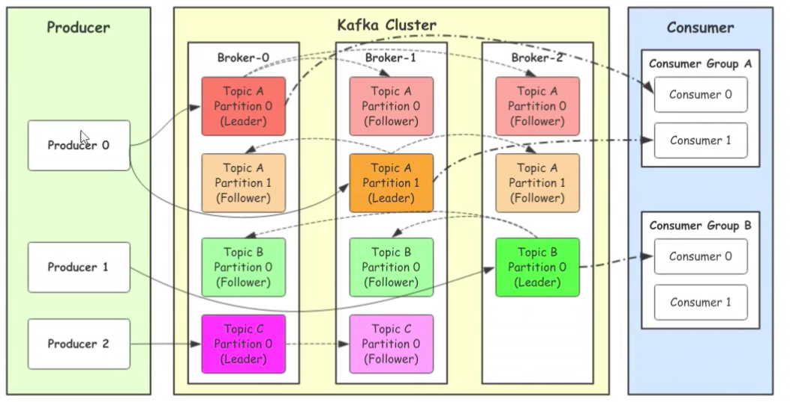
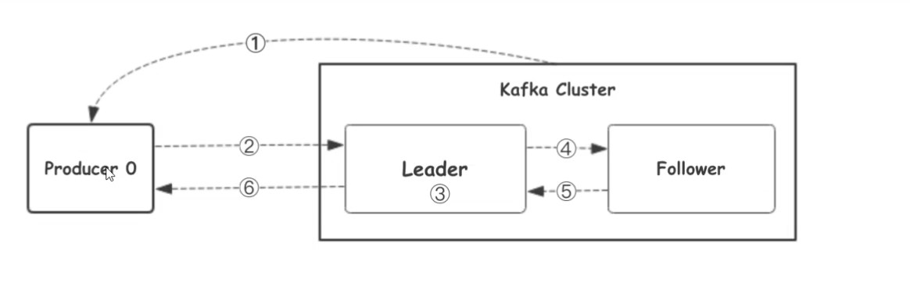
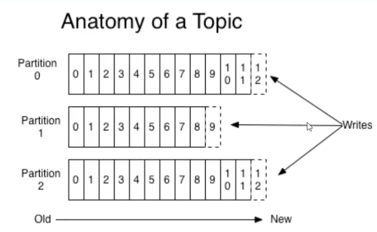
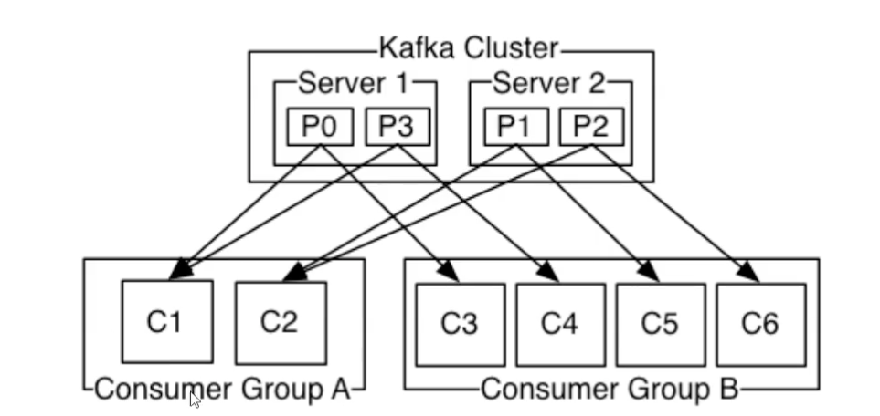

## 消息队列的通信模型

1. 点对点模式(queue)
消息生产者生产消息发送到queue 中,然后消息消费者从 queue 中读取并且消费消息,一条消息被消费以后,queue 中就没有了,不会存在重复消费

2. 发布/订阅(topic)
消息生产者(发布)将消息发布到 topic 中,同时有多个消费者订阅消费该消息,和点对点的方式不同,发布到 topic 中的消息会被所有的消费者消费

> 在发布订阅模式下,当发布者的消息量很大的时候,单一的消费者的处理能力不足,实际上是多个消息订阅者节点组成一个订阅组,负载均衡消费 topic 消息,即分组订阅,这样订阅者很容易实现线性能力的扩展


## kafka

Apache Kafka 有著名的公司 Linkedln 开发,最初的目的就是为了完成海量日志的传输等问题,kafka 使用 Scala 语言编写,现在为 Apache 的顶级项目

Kafka 是一个分布式数据流凭条,可以运行在单台服务器上,可以在多台服务器上部署成集群的模式,提供了发布和订阅的模式,使用者可以发送数据到 kafka,也可以从 kafka 中读取数据

kafka 具有高吞吐,低延迟和高容错等特点 

### kafka 的架构

 

- Producer: Porducer 就是生产者,消息的产生者,是消息的入口
- Kafka Cluster: kafka 集群,一台或者多台服务器组成
    - Broker : Broker 是指部署了 kafka 示例的服务器节点,每个服务器上有一个或者多个 kafka 的实例,每个 kafka 集群内的 Broker 都有不重复的编号
  - Topic:消息的主题,可以理解为消息的分类,kafka 的数据就保存在 topic,在每个 broker 上都可以创建多个 topic,实际业务中,通常是一个业务线创建一个 topic
  - Partition:Topic 的分区,每个 topic 可以有多个分区,分区的作用就是负载,提供 kafka 的吞吐量,在同一个 topic 的不同的分区上,消息是不重复的,partition 的表现形式就是一个个的目录
  - Replication :每一个分区都可以拥有多个副本,当主分区的 Leader 故障以后,Follower 会通过选举成为 Leader,kafka 中默认副本的最大数量是 10 个,且副本的数量不能大于 Broker 的数量,Follower 和 leader 绝对是在不同的机器上面的,同一个机器对同一个分区只能保存一个副本

- Consumer:消费者,也就是消息的出口
  - consumer Group: 我们可以将多个 consumer 组成消费者组,在 kafka 的设计中,同一个分区的数据智能版诶消费者组中的一个消费者消费,同一个消费者组的消费者可以消费同一个 topic 的不同分区的数,这也是为了提高开发科的吞吐量

### 工作流程

 

1. 生产者从 Kafka 集群获取分区 Leader 信息
2. 生产者将消息发送为 Leader
3. Leader 将消息写入本地硬盘
4. Follower 从 leader 拉取消息数据
5. Follower 将消息写入到本地磁盘后,向 leader 发送 ACK 确认
6. leader 收到 Follower 的 ACK确认后,向生产者发送 ACK 确认

### 选择 Partition 的原则
在 kafka 中,如果某个 topic 中有多个 partition,生产者又怎么知道将数据发送到哪个分区中呢?

1. 生产者在写入数据的时候,指定了分区,那么就将数据写入到指定的分区中
2. 如果没有指定分区,但是设置了 key,那么kafka 会根据 key 的值 hash 出一个分区
3. 如果没有指定分区,也没有设置 key,那么就会采用轮询的方式,写入到现有的分区中


### ACK 应答机制

生产者向 kafka 写入数据的时候,可以设置参数来确认 Kafka 是否接收到数据

- `0`:代表生产者只需要往 kafka 集群中发送数据,不确保数据是否发送成功,这种方式的效率最高,但是不确定数据的安全性
- `1`:代表生成者往集群中发送数据,只要 leader 应答可以继续发送下一条数据,只需要确保 leader 成功
- `all`: 代表生产者向集群中发送数据,需要等待 Follower 在 leader 拉取数据成功应答 Leader,然后 leader 应答生产者以后,才会继续发送数据,安全性最高,但是效率低

> 如果往不存在的 topic 中写入数据,kafka 会自动创建 topic,分区和副本默认都是 1

### topic 和数据日志
`topic`是同一类别的消息记录的集合,在 kafka 中一个祖逖通常有多个订阅者,对于每个主题,kafka 集群维护了一个分区数据日志文件结构如下:

 

每个 Partition 都是一个有序且不可变的消息记录集合,当新的输入写入的时候,就会被追加到 parition 的末尾,在每个分区中,每条消息都会被分配为一个顺序标识,这个标识被称为 offset,即偏移量

> kafka 只保证在同一个分区内部的消息是有序的,在不同的分区之间,并不能保证消息有序


kafka 可以配置一个保留期限,用来标识日志会在 kafka 及集群内保留多长时间,kafka 集群会在保留期限内保留所有被发布的消息,不管这些消息是否被消费国,比如保留期限设置为两天,那么数据被发布到 kafka 集群的两天内内,所有的这些消息都是可以被消费的,当超过两天,这些数据将会被清空,以便为后续的数据腾出空间,由于 kafka 会将数据进行持久化存储,所以报了的数据可以设置为一个比较大的值

### 分区的结构

分区在服务器上的表现形式就是一个个的目录,每一个分区的目录下面都会有多组 segment 文件,每组 segment 文件有包含了.index 文件,.log 文件和.timeindex 文递减,其中.log 文件就是实际存储 message 的地方,而.index 个.timeindex 文件为索引 we年,用于检索消息

### 消费数据

多个消费者实例可以组成一个消费者组,并用一个标签来标识这个消费者组,一个消费者组中的不用消费者实例可以运行在不同的进程,甚至不同的服务器上

如果所有的消费者实例都在同一个消费者组中,那么消息记录会被很好的均衡的发送到每个消费者实例中

如果所有的消费者实例都在不同的消费者组,那么每一条消息记录都会被广播到每一个消费者实例

 

根据上图可以看出,每一个分区中的数据,可以被多个消费者组消费,但是一个分区中的数据,只能被同一个消费者组中的一个消费者消费

## 使用场景

1. 消息队列 (MQ)
在系统架构设计中,经常会使用消息队列---MQ,MQ 是一种跨主机通年薪的机制,用于上下游非消息传递,使用 MQ 可以使用上下游解耦,消息发送上下游只需要依赖 MQ,逻辑上和物理上都不需要依赖其他的下游服务,MQ 的常见使用场景如流量削峰,数据驱动的任务依赖等

2. 追踪网站活动
kafka 最初就是用来被设计用来进行网站活动(PV,UV 等)的追踪,可以将不同的活动放入到不同的主体,供后续的实时计算,实时监控等程序使用,也可以将数据导入到数据仓库中进行后续的离线处理和生成报表等

3. Metrics
经常被用来传输监控数据,主要用来聚合分布式应用程序的统计数据麻将数据集中后进行统一的分析和展示等

4. 日志聚合

## kafka 的部署

三台服务器:172.19.36.95,172.19.36.94,172.19.36.47

配置三台机器的 hosts 文件
```bash
172.19.36.95 kafka1
172.19.36.94 kafka2
172.19.36.47 kafka3
```

### 首先安装 zookeeper

1. 配置 java 环境
```bash
# tar -xvf jdk-8u261-linux-x64.tar.gz -C /usr/local/src/
# ln -sv /usr/local/src/jdk1.8.0_261 /usr/local/src/jdk

# 设置环境变量
vim /etc/profile
export HISTTIMEFORMAT="%F %T `whoami` "
export export LANG="en_US.utf-8"
export JAVA_HOME=/usr/local/src/jdk
export CLASSPATH=.:$JAVA_HOME/jre/lib/rt.jar:$JAVA_HOME/lib/dt.jar:$JAVA_HOME/lib/tools.jar
export PATH=$PATH:$JAVA_HOME/bin
```

2. 安装 zookeeper
```bash
tar -xvf apache-zookeeper-3.6.1.tar.gz -C /usr/local/src/
ln -sv /usr/local/src/apache-zookeeper-3.6.1/ /usr/local/src/zookeeper
```

3. 配置 zookeeper
```bash
cp /usr/local/src/zookeeper/conf/zoo_sample.cfg /usr/local/src/zookeeper/conf/zoo.cfg

vim /usr/local/src/zookeeper/conf/zoo.cfg
tickTime=2000
# The number of ticks that the initial 
# synchronization phase can take
initLimit=10
# The number of ticks that can pass between 
# sending a request and getting an acknowledgement
syncLimit=5
# the directory where the snapshot is stored.
# do not use /tmp for storage, /tmp here is just 
# example sakes.
dataDir=/tmp/zookeeper
# the port at which the clients will connect
clientPort=2181

server.1=192.168.100.181:2888:3888
server.2=192.168.100.182:2888:3888
server.3=192.168.100.183:2888:3888
```

4. 配置 myid
```bash
# server1 执行
echo 1 > /tmp/zookeeper/myid
# server2 执行
echo 2 > /tmp/zookeeper/myid
# server3 执行
echo 3 > /tmp/zookeeper/myid
```

5. 启动 zookeeper
```bash
/usr/local/src/zookeeper/bin/zkServer.sh start
```

### 安装 kafka
1. 安装
```bash
# server1
tar -xf kafka_2.12-2.6.0.tgz -C /usr/local/src/
ln -sv /usr/local/src/kafka_2.12-2.6.0 /usr/local/src/kafka
'/usr/local/src/kafka' -> '/usr/local/src/kafka_2.12-2.6.0'
# 更改 kafka 的配置文件
vim /usr/local/src/kafka/config/server.properties
# 指定全局唯一的 id
broker.id=1
# 指定监听的地址
listeners=PLAINTEXT://192.168.100.181:9092
# 指定保留日志的时长(小时)
log.retention.hours=24
# 所有 zookeeper 的地址
zookeeper.connect=192.168.100.181:2181,192.168.100.182:2181,192.168.100.183:2181

# server2 和 server3 类似,id 和监听的地址不同
```

2. 分别以守护进程的方式启动 kafka
```bash
/usr/local/src/kafka/bin/kafka-server-start.sh -daemon /usr/local/src/kafka/config/server.properties
```

3. 验证 kafka
```bash
jps
1984 Kafka
2052 Jps
1435 QuorumPeerMain

```

### kafka 使用测试

1. 创建 topic
```bash
/usr/local/src/kafka/bin/kafka-topics.sh --create --zookeeper 172.19.36.240:2181,172.19.36.241:2181,172.19.36.242:2181 --partitions 3 --replication-factor 3 --topic logagent 
Created topic logagent.

-- partitions : 指定分区数量
--replication-factor : 指定副本数量
```

2. 获取 topic
```bash
/usr/local/src/kafka/bin/kafka-topics.sh --describe --zookeeper 172.19.36.240:2181,172.19.36.241:2181,172.19.36.242:2181 --topic logagent
Topic: logagent	PartitionCount: 3	ReplicationFactor: 3	Configs: 
	Topic: logagent	Partition: 0	Leader: 2	Replicas: 2,3,1	Isr: 2,3,1
	Topic: logagent	Partition: 1	Leader: 3	Replicas: 3,1,2	Isr: 3,1,2
	Topic: logagent	Partition: 2	Leader: 1	Replicas: 1,2,3	Isr: 1,2,3
    
```

> 上面的输出中可以看出,logagent 这个 topic 有三个分区为 0,1,2,0 这个分区的 leader 是 3(配置文件中的broker.id),分区 0 有三个副本,状态都是lsr（ln-sync，表示可以参加选举成为leader）。

3. 获取所有的 topic
```bash
/usr/local/src/kafka/bin/kafka-topics.sh --list --zookeeper 172.19.36.240:2181,172.19.36.241:2181,172.19.36.242:2181
__consumer_offsets
logagent
web_log
```

4. 删除 topic
```bash
/usr/local/src/kafka/bin/kafka-topics.sh --delete --zookeeper 172.19.36.240:2181,172.19.36.241:2181,172.19.36.242:2181 --topic logagent 
Topic logagent is marked for deletion.
Note: This will have no impact if delete.topic.enable is not set to true.
```

#### 测试通过 kafka 发送消息

1. 创建 topic
```bash
/usr/local/src/kafka/bin/kafka-topics.sh --create --zookeeper 172.19.36.240:2181,172.19.36.241:2181,172.19.36.242:2181 --partitions 3 --replication-factor 3 --topic logagent
```

2. 发送消息
```bash
/usr/local/src/kafka/bin/kafka-console-producer.sh --broker-list  172.19.36.240:9092,172.19.36.241:9092,172.19.36.242:9092 --topic  logagent
#数据会分散放在kafka的分区上
>hello       
>kafka 
>logstash
>ss
>oo
```

3. 其他 kafka 服务器测试获取数据
```bash
/usr/local/src/kafka/bin/kafka-console-consumer.sh --bootstrap-server  172.19.36.240:9092,172.19.36.241:9092,172.19.36.242:9092 --topic  logagent --from-beginning
```