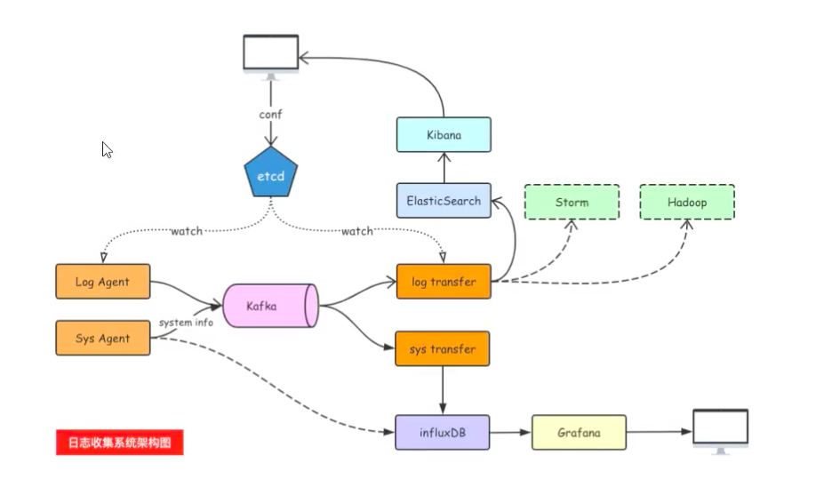

## 日志收集项目
 

1. 首先通过 log agent 收集日志
2. log agent 将收集到的日志发送到 kafka 中
3. log transfer 在 kafka 中读取数据
4. log transfer 将日志信息发送给 ElasticSearch
5. 最后通过 Kibana 展示日志信息

### log agent
log agent 的工作流程如下:

1. 使用`tailf`模块,持续的读取一个日志文件
2. 如果有新增的日志信息,那么就将其读取出来,并写入到 kafka 中

#### tailf 模块的介绍以及使用

1. 安装`tailf`第三方模块
```bash
go get github.com/hpcloud/tail
```

2. 简单的测试使用
```go
package main

import (
	"fmt"
	"time"

	"github.com/hpcloud/tail"
)

func main() {
	fileName := "./my.log" // 要读取的日志文件
	config := tail.Config{
		ReOpen:    true,                                 // 重新打开,也就是日志切换后重新打开文件
		Follow:    true,                                 // 是否跟随文件,日志切换之后,添加了时间戳等,如果没有读取完毕是否跟随
		Location:  &tail.SeekInfo{Offset: 0, Whence: 2}, // 从文件的哪个位置开始读取,下一次启动的审核从上一次读取的位置继续
		MustExist: false,                                // 如果文件不存在,不报错
		Poll:      true,
	}

	tails, err := tail.TailFile(fileName, config)

	if err != nil {
		fmt.Printf("tail file failed,err :", err)
		return
	}

	var (
		line *tail.Line // 一行
		ok   bool
	)

	for {
		// 按行读取
		line, ok = <-tails.Lines
		if !ok {
			fmt.Printf("tail file close reopen,filename :%s\n", tails.Filename)
			time.Sleep(time.Second)
			continue
		}
		fmt.Println("line:", line.Text)
	}
}
```

### go 操作kafka
#### sarama

Go语言中连接kafka使用第三方库:[github.com/Shopify/sarama](https://github.com/Shopify/sarama)。

### 下载及安装

```bash
go get github.com/Shopify/sarama
```

### 注意事项

`sarama` v1.20之后的版本加入了`zstd`压缩算法，需要用到cgo，在Windows平台编译时会提示类似如下错误：

```bash
# github.com/DataDog/zstd
exec: "gcc":executable file not found in %PATH%
```

所以在Windows平台请使用v1.19版本的sarama。

### 连接 kafka 发送消息
```go
package main

import (
	"fmt"

	"github.com/Shopify/sarama"
)

func main() {
	config := sarama.NewConfig()
	// 发送完数据需要leader和follow都确认
	config.Producer.RequiredAcks = sarama.WaitForAll
	// 新选出一个partition
	config.Producer.Partitioner = sarama.NewRandomPartitioner
	// 成功交付的消息将在success channel返回
	config.Producer.Return.Successes = true

	// 构造一个消息
	msg := &sarama.ProducerMessage{}
	msg.Topic = "web_log"
	msg.Value = sarama.StringEncoder("this is a test log")
	// 连接kafka,可以接收一个节点,也可以接收集群
	client, err := sarama.NewSyncProducer([]string{"172.19.36.240:9092","172.19.36.241:9092","172.19.36.242:9092"}, config)
	if err != nil {
		fmt.Println("producer closed, err:", err)
		return
	}
	defer client.Close()
	// 发送消息
	pid, offset, err := client.SendMessage(msg)
	if err != nil {
		fmt.Println("send msg failed, err:", err)
		return
	}
	fmt.Printf("pid:%v offset:%v\n", pid, offset)
}
```

查看 kafka 数据目录的内容
```bash
ll /tmp/kafka-logs/web_log-0/  #web_log-0 表示为 web_log这个主题的第 0 个分区
total 16
drwxr-xr-x 2 root root     4096 Aug 12 14:32 ./
drwxr-xr-x 3 root root     4096 Aug 12 14:40 ../
-rw-r--r-- 1 root root 10485760 Aug 12 14:32 00000000000000000000.index
-rw-r--r-- 1 root root       86 Aug 12 14:32 00000000000000000000.log
-rw-r--r-- 1 root root 10485756 Aug 12 14:32 00000000000000000000.timeindex
-rw-r--r-- 1 root root        8 Aug 12 14:32 leader-epoch-checkpoint
```

index 和 timeindex 为索引文件,log 为真正存储数据的文件

### 连接 kafka 消费消息
```go
package main

import (
	"fmt"
	"github.com/Shopify/sarama"
)

func main() {
	// 连接kafka
	consumer, err := sarama.NewConsumer([]string{"172.19.36.240:9092", "172.19.36.241:9092", "172.19.36.242:9092"}, nil)
	if err != nil {
		fmt.Printf("fail to start consumer, err:%v\n", err)
		return
	}
	// 根据topic取到所有的分区
	partitionList, err := consumer.Partitions("logagent1")
	if err != nil {
		fmt.Printf("fail to get list of partition:err%v\n", err)
		return
	}
	fmt.Println("分区列表",partitionList)
	for partition := range partitionList { // 遍历所有的分区
		// 针对每个分区创建一个对应的分区消费者
		pc, err := consumer.ConsumePartition("logagent1", int32(partition), sarama.OffsetNewest) // 获取最新的消息
		if err != nil {
			fmt.Printf("failed to start consumer for partition %d,err:%v\n", partition, err)
			return
		}
		defer pc.AsyncClose()
		// 异步从每个分区消费信息
		go func(sarama.PartitionConsumer) {
			for msg := range pc.Messages() {
				fmt.Printf("Partition:%d Offset:%d Key:%v Value:%v\n", msg.Partition, msg.Offset, msg.Key, string(msg.Value))
			}
		}(pc)
	}
	select {

	}
}
```

> 启动程序之后,持续的向 kafka 中写入数据,便能获取到最新的消息

## Log Agent 的实现

1. 初始化 kafka 连接以及向 kafka 中发送数据
```go
// 专门往kafka写入日志信息的模块
package kafka

import (
	"fmt"
	"github.com/Shopify/sarama"
)


// 声明一个全局的kafka的生产者
var (
	client sarama.SyncProducer
)

// 初始化上面创建的全局的生产者
func Init(address []string)(err error) {
	config := sarama.NewConfig()
	// 发送完数据需要leader和follow都确认
	config.Producer.RequiredAcks = sarama.WaitForAll
	// 新选出一个partition
	config.Producer.Partitioner = sarama.NewRandomPartitioner
	// 成功交付的消息将在success channel返回
	config.Producer.Return.Successes = true

	// 连接kafka
	client, err = sarama.NewSyncProducer(address, config)
	if err != nil {
		fmt.Println("producer closed, err:", err)
		return
	}
	return
}

// 往kafka发送数据
func SendToKafka(topic,data string){
	// 构造一个消息
	msg := &sarama.ProducerMessage{}
	msg.Topic = topic
	msg.Value = sarama.StringEncoder(data)
	// 发送消息
	pid, offset, err := client.SendMessage(msg)
	if err != nil {
		fmt.Println("send msg failed, err:", err)
		return
	}
	fmt.Printf("pid:%v offset:%v\n", pid, offset)
}

```

2. 初始化读取日志文件,以及返回读取的内容
```go
// 专门从日志文件收集日志信息的模块
package taillog

import (
	"fmt"
	"github.com/hpcloud/tail"
)

// 定义全局的tail对象

var (
	tailobj *tail.Tail
)

func Init(fileName string) (err error){
	config := tail.Config{
		ReOpen:    true,                                 // 重新打开,也就是日志切换后重新打开文件
		Follow:    true,                                 // 是否跟随文件,日志切换之后,添加了时间戳等,如果没有读取完毕是否跟随
		Location:  &tail.SeekInfo{Offset: 0, Whence: 2}, // 从文件的哪个位置开始读取,下一次启动的审核从上一次读取的位置继续
		MustExist: false,                                // 如果文件不存在,不报错
		Poll:      true,
	}

	tailobj, err = tail.TailFile(fileName, config)

	if err != nil {
		fmt.Printf("tail file failed,err :", err)
		return
	}
	return
}

// 读取日志的函数
func ReadLog()  <-chan *tail.Line {
	// 将每一行返回
	return tailobj.Lines
}
```

3. 主函数中调用
```go
package main

import (
	"fmt"
	"logAgent/kafka"
	"logAgent/taillog"
	"time"
)

func run()  {
	//1. 读取日志
	for {
		select {
		case line := <- taillog.ReadLog():
			//2. 发送数据到kafka
			kafka.SendToKafka("web_log",line.Text)
		default:
			time.Sleep(time.Second)
		}
	}

	//2. 发送数据到kafka
}

// 日志收集的入口
func main() {
	// 1. 初始化kafka连接
	address := []string{"172.19.36.240:9092","172.19.36.241:9092","172.19.36.242:9092"}
	err := kafka.Init(address)
	if err != nil {
		fmt.Printf("kafka初始化失败，err:%#v\n",err)
		return
	}
	fmt.Println("初始化kafka成功")
	// 2. 打开日志文件收集日志
	err =taillog.Init("./my.log")
	if err != nil {
		fmt.Printf("初始化打开文件读取日志，err:%#v\n",err)
		return
	}
	fmt.Println("初始化文件成功")

	run()
}
```

## log agent 通过配置文件获取配置
例如下面的配置文件
```bash
[kafka]
address=172.19.36.240:9092,172.19.36.241:9092,172.19.36.242:9092
topic=web_log

[taillog]
path=./mylog
```

1. 首先安装第三方库
```go
go get gopkg.in/ini.v1
````

2. 加载配置文件
```go
func ReloadIni(filename string) (addr []string,topic , logfile string){
	cfg , err := ini.Load(filename)
	if err != nil {
		fmt.Println("解析配置文件失败：",err)
		return
	}
	// 获取kafkaip地址
	address := cfg.Section("kafka").Key("address").String()
	// 将ip地址按照逗号分割成字符串切片
	addr = strings.Split(address,",")

	// 获取topic
	topic = cfg.Section("kafka").Key("topic").String()

	// 获取日志文件路径
	logfile = cfg.Section("taillog").Key("path").String()

	// 返回
	return
}
```

3. 主函数中调用
```go
func main() {
	// 0. 加载配置文件
	addr , topic , logfile := ReloadIni("./config.ini")

	// 1. 初始化kafka连接

	err := kafka.Init(addr)
	if err != nil {
		fmt.Printf("kafka初始化失败，err:%#v\n",err)
		return
	}
	fmt.Println("初始化kafka成功")
	// 2. 打开日志文件收集日志
	err =taillog.Init(logfile)
	if err != nil {
		fmt.Printf("初始化打开文件读取日志，err:%#v\n",err)
		return
	}
	fmt.Println("初始化文件成功")

	run(topic)
}
```