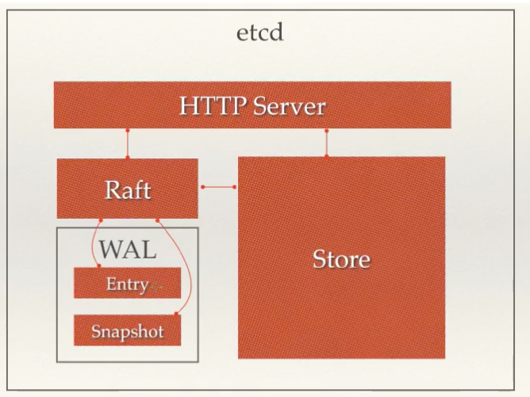

## etcd 介绍
etcd 是使用 go 语言开发的一个开元的,高可用的分布式 key-value 存储系统,可用于二胖子会共享和服务的发现与注册

类似的项目有 zookeeper 和 consul

### etcd 的特点

- 完全复制:每个集群节点都可以使用完整的存档
- 高可用性:ectd 可用于避免硬件或者网络的单点故障
- 一致性:每次读物都会返回跨多主机的最新写入
- 简单: 包括一个定义良好,面向用户的 API(gRPC)
- 安全: 实现了带有可选的客户端身份验证的自动化 TLS
- 快速: 每秒 10000 次写入的基准速度
- 可靠: 使用 Raft 算法,实现了强一致性,高可用性的服务存储目录

#### Raft
Raft 是一种共识算法,目的是替代 Paxos,Raft 提供了一种在计算系统集群中分布状态机的通用方法,确定集群中的每个节点都统一一系列相同的状态转换

Rafe 算法与其他一致性算法的独有的特点

- 强领导者(Strong leader): 和其他一致性算法相比,Rafe 使用一种更强的领导能力形式,比如,日志条目只从领导者发送给其他的服务器,这种方式简化了对复制日志的管理并且使得 rafe 算法更加易于理解
- 领导选举(Leader election): Raft 算法使用一个随机计数器来选举领导者,这种方式只是在任何一致性算法都必须实现的心跳机制上增加了一点机制,在解决冲突的时候会更加的简单快捷
- 成员关系调整(Membership changes) : raft 使用一种共同一致性的方法来处理集群成员变换的问题,在这种方法下,处于调整过程中的两种不同配置的集群中大多数机器会有重叠,这就使得集群在成员变换的时候依旧可以继续工作


Raft 集群的节点中的转态

- leader: 处理所有来自客户端的请求,封装为可重入的日志记录,并将其复制给其他的 Follower 节点.并在收到超过半数的确认后将日志提交
- follower: 是被动的.他们自己不产生请求,只处理 leaders 和 candidates 的请求并回应
- candidate: Follower 被选举为 leader 之前的状态

Raft 集群节点中存在的 RPC 调用

- RequestVote RPC: 发起于 candidate 节点,作用于其他节点,用于收集选票,只有当 candidate 当前日志的 term 和 index 都比当前节点新的时候,才会生效
- AppendEntries RPC: 发起于 leader 节点,作用于 Follower 节点,用于将 leader 的日志记录复制给follower 节点,当AppendEntries RPC 不包含日志记录的时候,则将其作为心跳告知所有 follower 节点 leader 的存活

##### 选举

当一个 follower 节点在一个选举超时时间内都没有收到心跳或者请求,则将其自身的 term 加1,并将其装换为 candidate 状态发起选举

candidate 会并行向集群汇总的其它节点发起 RequestVote RPC 请求,并持续此转态直至出现下面的三种中的一种发生:

1. 获得多数选票,从而赢得此次选举称为 leader
2. 收到相同或者更高的 term 的 leader 发来的 AppendEntries RPC
3. 在选举超时时间内,没有出现前两种情况

Raft采用随机选举超时时间来解决这个问题，即每个candidate有一个随机的超时时间（例如150-300ms），因此在绝大多数情况3中只有一个candidate会超时并发起新一轮选举，大大降低了情况3再次发生的几率。

##### 日志复制
leader 的工作就是将客户端的请求封装为日志,然后将其发送给 follower 节点,并且在收到超过半数的确认之后,将日志提交并返回给客户端结果

Rafe 中每个日志都带有一个 term 号以及一个 log index 来唯一标识,日志记录具有两个特性:

- 如果两条不同节点的某两个日志记录具有相同的 term 和 index 号,则两条记录一定是完全相同的
- 如果两条不同节点的某两个日志记录具有相同的 term 和 index 号,则两条记录之前的所有记录也一定是完全相同的

第一个特性是由于 leader 产生的日志是唯一性与顺序不变性,而第二个特性是欣慰 lead 而所发送的AppendEntries RPC 会带有前一条日志的 term 和 index,如果 follower 对比自身与其 log 的最后一条不一致,则会拒绝 leader 发来的请求


### ectd 的应用场景

1. 服务发现
服务发现要解决的也是分布式系统中最常见的问题,即在同一个跟不是集群中的进程或者服务,要如何才能找到对方并建立连接,本质上来说,服务发现就是想要了解集群中是否有进程在监听 udp 或者 tcp 端口,并且通过名字就可以直接查找和连接

2. 配置中心
将一些配置信息放到 etcd 上进行集中式管理

这类场景的使用方式通常是这样的： 应用在启动的时候，主动的从 etcd 中获取一次配置，同时在 etcd 节点上注册一个 watcher 并等待，以后每次配置有更新的时候，etcd 都会实时的通知订阅者，以此达到获取最新配置信息的目的

3. 分布式锁
因为 etcd 使用 Rafe 算法，保持了数据的强一致性，某次操作存储到集群中的值必然是全局一致性的，所以很溶蚀显示分布式锁，锁服务有两种使用方式，一是保持独占，二是控制时序

- 保持独占即所有获取锁的用户最终只有一个可以得到： etcd 为此提供了一套实现分布式锁原子操作 CAS 的 API，通过设置 PrevExist 值，可以保证在多个节点同时去创建某个目录的时候，只有一个成功，而创建成功的用户就可以认为是获得到了锁
- 控制时序： etcd 为此页提供了一套 API（自动创建有序键）,对一个目录建值时指定为 POST 动作,这样 etcd 会自动在目录下生成一个当前最大的值为键,存储着新的值(客户端编号),同时还可以使用 API 按顺序列出所有当前目录下的键值,此时这些键的值就是客户端的时序,而这些建中存储的值可以是代表客户端的编号.

### etcd 的优点

1. 简单,使用 go 语言编写,使用 http 作为接口,使用简单
2. 数据持久化,默认数据更新就会进行持久化
3. 安全,etcd 支持 SSL 客户端安全认证


### etcd 架构
 

1. http server: 用于处理用户发送的 API 请求以及其他 etcd 节点的同步与心跳信息请求
2. store: 用户处理 etcd 支持的各类功能的事务,包括数据索引,节点转态变更,监控与反馈,事件处理与执行等等,是 etcd 对用户提供的大多数的 API 功能的具体实现
3. RafrL 强一致性算法,是 etcd 的核心
4. WAL: 预写式日志,是 etcd 的数据存储方式,除了在内存中存有所有数据的状态以及节点的索引之外,etcd 就可以通过 WAL 进行数据持久化存储,WAL 中,所有的数据提交前都会事先记录日志,snapshot 是为了防止数据过多而进行的状态快照,entry 表示存储日志的具体内容

## etcd 集群部署
由于 Raft 算法在做决策的时候需要进行节点投票,所以 etcd 集群的节点个数一般为奇数个节点

etc 监听的端口:

- 默认监听 2379 端
- 2380 端口为节点间通信的端口

三个节点: 172.19.36.240,172.19.36.241,172.19.36.242


1. 下载 etcd[https://github.com/etcd-io/etcd/releases](https://github.com/etcd-io/etcd/releases)

2. 解压
```bash
tar -xf etcd-v3.4.10-linux-amd64.tar.gz -C /usr/local/src/
ln -sv /usr/local/src/etcd-v3.4.10-linux-amd64 /usr/local/src/etcd

# 拷贝可执行文件

```

3. 创建配置文件
```bash
vim /etc/etcd.conf
name: node01    # 成员间显示的可读的名称
initial-advertise-peer-urls: http://172.19.36.240:2380  # 用于集群间节点的通信
listen-peer-urls: http://172.19.36.240:2380 # 用于集群间心跳检测的地址
listen-client-urls: http://172.19.36.240:2379,http://127.0.0.1:2379 # 监听的客户端的使用地址
advertise-client-urls: http://172.19.36.240:2379 # 
initial-cluster-token: etcd-cluster-0   # 集群的 token,每个集群唯一
initial-cluster: node01=http://172.19.36.240:2380,node02=http://172.19.36.241:2380,node03=http://172.19.36.242:2380   # 集群的所有成员
initial-cluster-state: new          # 集群的状态,new 为新建的集群
data-dir: /tmp/etcd                # 集群的数据目录
```

4. 创建启动脚本
```bash
vim /lib/systemd/system/etcd.service
[Unit]
Description=Etcd Server
After=network.target
After=network-online.target
Wants=network-online.target
Documentation=https://github.com/coreos
 
[Service]
Type=notify
ExecStart=/usr/bin/etcd --config-file=/etc/etcd.conf
Restart=on-failure
RestartSec=5
LimitCORE=infinity
LimitNOFILE=655360
LimitNPROC=655350
 
[Install]
WantedBy=multi-user.target
```

5.  加载启动脚本,并启动服务
```bash
systemctl daemon-reload
systemctl start etcd
```

6. 查看状态
```bash
etcdctl member list
4632124c90e91f08, started, node01, http://172.19.36.240:2380, http://172.19.36.240:2379, false
5d48eea686d726f9, started, node03, http://172.19.36.242:2380, http://172.19.36.242:2379, false
9b69e20b8f1c36fd, started, node02, http://172.19.36.241:2380, http://172.19.36.241:2379, false
```

### etcd 的简单使用

1. put 设置一个键值对
```bash
etcdctl --endpoints=http://127.0.0.1:2379 put name "weiying"
```

2. get 获取一个值
```bash
etcdctl --endpoints=http://127.0.0.1:2379 get name
```

3. del 删除一个 key
```bash
etcdctl --endpoints=http://172.19.36.241:2379 del name
```


## 使用 go 语言操作 etcd

1. 安装依赖包
```bash
go get go.etcd.io/etcd/clientv3
```

2. 使用 go 语言操作 etcd
```go
package main

import (
	"context"
	"go.etcd.io/etcd/clientv3"
	"fmt"
	"time"
)

func main()  {
	// 连接etcd
	cli ,err := clientv3.New(clientv3.Config{
		Endpoints: []string{"172.19.36.240:2379","172.19.36.241:2379","172.19.36.242:2379"},
		DialTimeout: 5* time.Second,
	})
	if err != nil {
		fmt.Println("连接etcd 失败：",err)
		return
	}
	defer cli.Close()
	// put
	ctx , cancel := context.WithTimeout(context.Background(),time.Second)
	_,err = cli.Put(ctx,"id","100")
	cancel()
	if err != nil {
		fmt.Println("put to etcd failed,err :",err)
		return
	}
	// get
	ctx , cancel = context.WithTimeout(context.Background(),time.Second)
	resp ,err := cli.Get(ctx,"id")
	cancel()
	if err != nil {
		fmt.Println("get from etcd failed,err :",err)
		return
	}
	for _,ev := range resp.Kvs {
		fmt.Printf("获取到的 值为:%s-%s\n",ev.Key,ev.Value)
	}

}
```

## watch 机制
在使用 watch 机制的时候,我们制定一个 key,这要这个可以发生变化,程序就能察觉到

```go
package main

import (
	"context"
	"fmt"
	"go.etcd.io/etcd/clientv3"
	"time"
)

func main()  {
	// 连接etcd
	cli ,err := clientv3.New(clientv3.Config{
		Endpoints: []string{"172.19.36.240:2379","172.19.36.241:2379","172.19.36.242:2379"},
		DialTimeout: 5* time.Second,
	})
	if err != nil {
		fmt.Println("连接etcd 失败：",err)
		return
	}
	defer cli.Close()
	// watch
	// 返回一个channel,如果指定的id发生变化，会通过这个channel通知
	ch := cli.Watch(context.Background(),"id")
	// 从channel取值
	for wresp := range ch {
		for _,event := range wresp.Events {
			fmt.Printf("type:%v key:%v value:%v\n",event.Type,string(event.Kv.Key),string(event.Kv.Value))
		}
	}

}
```

使用 etcdctl 更新 id 的值查看变化
```bash
root@master1:~# etcdctl --endpoints=http://127.0.0.1:2379 put id 600
OK
root@master1:~# etcdctl --endpoints=http://127.0.0.1:2379 put id 700
OK
root@master1:~# etcdctl --endpoints=http://127.0.0.1:2379 del id 
```

程序输出
```bash
type:PUT key:id value:600
type:PUT key:id value:700
type:DELETE key:id value:
```