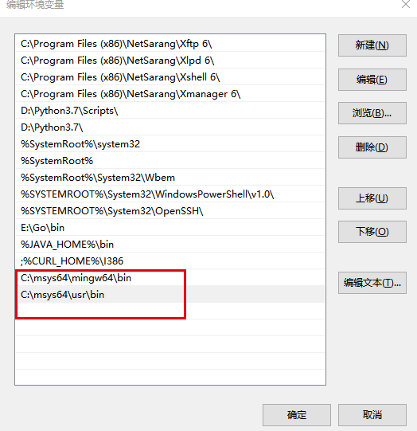
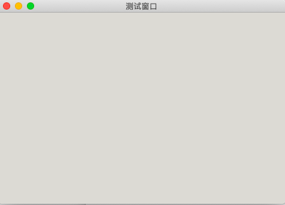
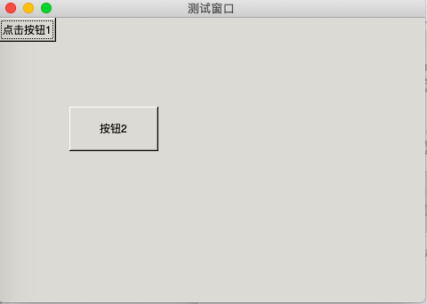

# GTK 简介

GTK 是一种函数库是用来帮助制作图形交互界面的,同时,它遵循 LGPL 许可证,所以用户可以用它来开发开源软件、自由软件或者是商用软件,是一种面向对象的 API

GTK 提供一整套完备的图形构建,适用于大大小小各种软件工程项目,不论是小到只需要一个窗口,还是复杂到如桌面环境

GTK 是最手欢迎的 图形交互界面(GUI)设置的工具包之一,如开源的桌面软件,大多数是基于 GTK 开发的,一些商用软件 chromium 和 Linux版本的 firefox 均为 GTK 画龙点睛

## Go 版 GTK 环境的搭建(以MAC为例)

1. 安装command line工具, 如果安装了Xcode, 就直接跳过该步骤
```bash
# 直接命令行输入
xcode-select --install
```
2. 安装Homebrew
```bash
ruby -e "$(curl -fsSL https://raw.githubusercontent.com/Homebrew/install/master/install)

# 如果上面的代码执行后不能安装,请根据下面的操作执行

1. 下载下面的脚本到系统的任意位置
http://upload.aishad.top/brew_install.rb

2. 执行这个脚本
ruby Desktop/brew_install.rb (执行的过程中根据提示操作
```

3. 使用 brew 工具安装 GTK 环境
```bash
#在终端输入
brew install pkg-config 

#在终端输入
brew install gtk+3

# clang编译  在终端输入
clang `pkg-config --libs --cflags gtk+-3.0` main.c
```

## Go 版 GTK 环境的搭建(以windows为例)

1. 安装 msys64,并修改镜像源
```bash

msys2 64 的下载地址：
官网：http://www.msys2.org/

清华大学镜像：https://mirrors.tuna.tsinghua.edu.cn/msys2/distrib/

中国科学技术大学镜像：http://mirrors.ustc.edu.cn/msys2/distrib/

国内用清华和科大的镜像下载速度很快，官网的下载速度很慢。

修改镜像源（修改三个文件）：

（1）C:\msys32\etc\pacman.d\mirrorlist.mingw32

## 清华大学
Server = https://mirrors.tuna.tsinghua.edu.cn/msys2/mingw/i686/
## 中国科学技术大学
Server = http://mirrors.ustc.edu.cn/msys2/mingw/i686/
## Server = http://repo.msys2.org/mingw/i686/
## Server = https://sourceforge.net/projects/msys2/files/REPOS/MINGW/i686/
## Server = http://www2.futureware.at/~nickoe/msys2-mirror/mingw/i686/
## Server = https://mirror.yandex.ru/mirrors/msys2/mingw/i686/

（2）C:\msys32\etc\pacman.d\mirrorlist.mingw64

## 清华大学
Server = https://mirrors.tuna.tsinghua.edu.cn/msys2/mingw/x86_64/
## 中国科学技术大学
Server = http://mirrors.ustc.edu.cn/msys2/mingw/x86_64/
## Server = http://repo.msys2.org/mingw/x86_64/
## Server = https://sourceforge.net/projects/msys2/files/REPOS/MINGW/x86_64/
## Server = http://www2.futureware.at/~nickoe/msys2-mirror/mingw/x86_64/
## Server = https://mirror.yandex.ru/mirrors/msys2/mingw/x86_64/

（3）C:\msys32\etc\pacman.d\mirrorlist.msys

## 清华大学
Server = https://mirrors.tuna.tsinghua.edu.cn/msys2/msys/$arch/
## 中国科学技术大学
Server = http://mirrors.ustc.edu.cn/msys2/msys/$arch/
## Server = http://repo.msys2.org/msys/$arch/
## Server = https://sourceforge.net/projects/msys2/files/REPOS/MSYS2/$arch/
## Server = http://www2.futureware.at/~nickoe/msys2-mirror/msys/$arch/
## Server = https://mirror.yandex.ru/mirrors/msys2/msys/$arch/
```

2. 打开msys2 后,在命令行下安装GTK3
```bash
pacman -S mingw-w64-x86_64-gtk3

# 安装过程中需要输入y确认安装
```

3. 在命令行下安装GTK2
```bash
pacman -S mingw-w64-x86_64-gtk2
```

4. 安装 glade
```bash
pacman -S mingw-w64-x86_64-glade
```

5. 安装帮助文档
```bash
pacman -S mingw-w64-x86_64-devhelp
```

6. 安装MinGW
```bash
pacman -S mingw-w64-x86_64-toolchain base-devel
```

7. 配置环境变量，添加系统 PATH 环境变量


> 要注意连个环境变量的先后顺序

8. window 的命令行中验证
```bash
cmd 命令行中输入make -v 验证
```

# GTK 的基本使用
GTK 在使用的时候大致需要下面四部

1. 导入指定的包 “github.com/mattn/go-gtk/gtk 和os”
```bash
#在使用go的时候如果依赖导入github上的,要先将对应的包下载下来,比如上面的导入,要使用命令下载

go get github.com/mattn/go-gtk/gtk

#默认下载到GOPATH定义的目录的src下
```

2. 初始化,这里的写法是固定的
```go
gtk.Init(&os.Args)
```

3.  用户所写的代码

4. gtk.Main() 
主事件循环(程序不会结束),等待用户操作(例如移动窗口、点击鼠标等操作)

### 通过上面的介绍写一个简单的窗口程序

```go
package main

import (
	"github.com/mattn/go-gtk/gtk"
	"os"
)

func main()  {
	// 1. 初始化（固定）
	gtk.Init(&os.Args)
	// 2. 用户写的代码
	//  2.1 创建窗口,带边框的顶层窗口
	win := gtk.NewWindow(gtk.WINDOW_TOPLEVEL) // gtk.WINDOW_TOPLEVEL 为最上层主窗口
	// 2.2 设置属性 （标题）
	win.SetTitle("测试窗口")
	// 2.3 设置大小
	win.SetSizeRequest(480,320)
	// 2.4 显示窗口
	win.Show()

	// 3 主事件循环，不让窗口关闭，等待用户操作(固定)
	gtk.Main()

}
```
代码效果演示


> 上面的程序有一个问题,就是窗口不会关闭,即使是点击了关闭按钮也不行,只能是终止程序的执行才行,后面会学习到怎么关闭窗口

## GTK 窗口控件
现在我们已经创建了一个窗口程序,但是问题是,窗口上什么都没有,接下来我们需要在窗口上添加按钮等元素,我们将按钮、菜单和对话框等统称为控件

GTK的窗口控件主要分为两类:

1. 容器控件
它可以容纳别的控件,我们可以理解容器控件为盒子,容器控件又分为两类,一类是只能容纳一个控件,如窗口、按钮等,另一类是能容纳多个控件,如布局控件

2. 非容器控件
它不可以容纳别的控件,如标签、行编辑等

```go
package main

import (
	"github.com/mattn/go-gtk/gtk"
	"os"
)

func main()  {
	// 1. 初始化（固定）
	gtk.Init(&os.Args)
	// 2. 用户写的代码
	//  2.1 创建窗口,带边框的顶层窗口
	win := gtk.NewWindow(gtk.WINDOW_TOPLEVEL) // gtk.WINDOW_TOPLEVEL 为最上层主窗口
	// 2.2 设置属性 （标题）
	win.SetTitle("测试窗口")
	// 2.3 设置大小
	win.SetSizeRequest(480,320)

	// 创建容器控件（固定布局，任意布局）
	// 因为窗口控件是非容器控件,只能放一个控件,那么需要在窗口上创建一个容器控件,然后在容器控件上添加按钮
	layout := gtk.NewFixed()
	b1 := gtk.NewButton()  // 新建按钮
	b1.SetLabel("点击按钮1") // 设置按钮内容
	layout.Put(b1,0,0) // 将按钮添加带布局控件中
	// put 方法有三个参数 ， 分别是要添加的按钮，以及按钮在窗口中的横纵坐标，全部取值为0，表示按钮显示在窗口的左上角
	// 添加第二个按钮
	b2 := gtk.NewButton()
	b2.SetSizeRequest(100,50) // 设置按钮大小，也可以使用默认值
	b2.SetLabel("按钮2")
	layout.Put(b2,0,2)// 设置窗口在容器的位置
	layout.Move(b2,80,100) // 移动按钮的位置，必须先put，再用move

	win.Add(layout) // 将布局控件添加到窗口中
	// 默认情况下,布局控件 layout 会占满整个窗口，而且是透明的

	// 2.4 显示全部
	win.ShowAll() // 等价于下面的代码
	/*layout.Show()
	b1.Show()
	win.Show()*/

	// 3 主事件循环，不让窗口关闭，等待用户操作(固定)
	gtk.Main() // 后面的代码不会执行

}
```
代码的效果展示


## GTK 窗口的信号处理

前门的代码生产的窗口中,无论我们怎么点击其中的控件,都是没有反应的,那么我们需要在按下按钮后,程序作出相应的反应,这就需要使用到信号处理

GTK 采用信号与回调函数来处理窗口外部传来的事件、消息或者信号,当信号发生时,程序会自动的调用为信号链接(注册)的回调函数

学习图形界面编程,我们会经常使用到信号这个名词, GTK 中信号实际上就是一种软件中断,当用户按下按钮的时候,就产生了一个中断,相当于产生了一个信号,接着程序就会处理这个中断任务(程序中的体现为调用一个函数)

信号在 GTK 中可以认为是一种中断的标志,如按下按钮的标志为“pressed”,释放按钮的标志为“released”,这些标示就相当于 GO 语言的关键词一样,我们使用的时候,必须完全按照它的名字来书写,需要注意的是,每个控件的信号标志不一定都一样,如按钮(GtkButton)里面又“pressed”信号,但是,窗口(GtkWindow)中就没有这个信号,每个控件具体有哪些信号,需要我们去查看帮助文档

按钮的常用信号
```bash
------------------------------------------------------
	信号标识	|			触发条件				|
------------------------------------------------------
	clicked		  |		按下按钮的时候触发	  |  // 按下按钮和释放按钮都在按钮上进行,才生效
------------------------------------------------------
	pressed		 |		按下按钮的时候触发	  | // 按下按钮的时候就会触发,无论是否释放
------------------------------------------------------
	released	|		释放按钮的时候触发	  | // 在按钮按下,任意位置释放触发
------------------------------------------------------
```

### 信号的简单使用
根据前面的代码,我们先创建窗口,在创建布局控件,将按钮添加到布局控件中,并将布局控件添加到窗口
```go
func main()  {
	// 1. 初始化（固定）
	gtk.Init(&os.Args)
	// 2. 用户写的代码
	//  2.1 创建窗口,带边框的顶层窗口
	win := gtk.NewWindow(gtk.WINDOW_TOPLEVEL) // gtk.WINDOW_TOPLEVEL 为最上层主窗口
	// 2.2 设置属性 （标题）
	win.SetTitle("测试窗口")
	// 2.3 设置大小
	win.SetSizeRequest(480,320)

	// 创建容器控件（固定布局，任意布局）
	layout := gtk.NewFixed()
	b1 := gtk.NewButton()  // 新建按钮
	b1.SetLabel("点击按钮1") // 设置按钮内容
	layout.Put(b1,0,0) // 将按钮添加带布局控件中
	// put 方法有三个参数 ， 分别是要添加的按钮，以及按钮在窗口中的横纵坐标，全部取值为0，表示按钮显示在窗口的左上角

	win.Add(layout) // 将布局控件添加到窗口中
	// 默认情况下,布局控件 layout 会占满整个窗口，而且是透明的

	// 2.4 显示全部
	win.ShowAll()
	
	// 3 主事件循环，不让窗口关闭，等待用户操作(固定)
	gtk.Main() // 后面的代码不会执行

}
```
下面我们将使用 Connect() 方法为 b1 这个按钮绑定一个 clicked 信号,并且指定信号发生后,所调用的方法的具体的代码实现如下:

```go
//设置按钮点击事件
	str := "are you ok"
	b1.Connect("clicked",test,str)
	// b1.Clicked(test,str) 等价于上面的写法
```
Connect() 方法的第一个参数是,指定的信号名称,第二个参数是指定调用的方法名称,第三个参数是给方法传递的参数

> 注意:Connect() 方法只执行一次,给按钮绑定好对应的信号后,后续不需要重复的绑定信号,在这里还有一点要注意的是,当程序执行到这一行的代码的时候,并不会去调用 test函数,仅仅是将 按钮 b1 的信号 clicked 与test() 方法绑定到了一起,同时传递了参数,那么什么时候调用呢,就是当用户点击按钮的时候,才送 clicked 信号的时候,才会去调用执行 test() 方法

test() 方法的实现
```go
func test(str string)  {
	fmt.Println("I'm ok")
}
```

当我们定义好方法后,执行代码,但是点击按钮的时候会报错,原因是关于 test() 函数的参数,应该使用 gtk.CallbackContext 代替字符串类型,也就是说test的参数列表写法是固定的
```go
func test(ctx *glib.CallbackContext)  {
}
// 需要导入 github.com/mattn/go-gtk/glib 包
```
在参数 glib.CallbackContext 中,存储了传递过来的参数数据,在 CallbackContext 中,有一个 Data()方法,可以获取到传递过来的数据,该方法返回的空接口类型,尽管是空接口类型(可变参数),但是只能传递一个参数,可变参数的目的是让用户选择传递或者不传递参数
```go
func test(ctx *glib.CallbackContext)  {
	str := ctx.Data() // 获取传递的参数
	// 类型断言
	data , ok := str.(string)

	if ok {
		fmt.Printf("按钮 b1 被按下：%s\n",data)
	}
}
```
> 运行程序后,当用户点击指定的按钮后,就会调用函数,并作出相应的操作

上面的代码有一个问题,就是定义的test函数只针对于指定的按钮有效,那么我们可以使用匿名内部函数
```go
package main

import (
	"fmt"
	"github.com/mattn/go-gtk/glib"
	"github.com/mattn/go-gtk/gtk"
	"os"
)

func main()  {
	// 1. 初始化（固定）
	gtk.Init(&os.Args)
	// 2. 用户写的代码
	//  2.1 创建窗口,带边框的顶层窗口
	win := gtk.NewWindow(gtk.WINDOW_TOPLEVEL) // gtk.WINDOW_TOPLEVEL 为最上层主窗口
	// 2.2 设置属性 （标题）
	win.SetTitle("测试窗口")
	// 2.3 设置大小
	win.SetSizeRequest(480,320)

	// 创建容器控件（固定布局，任意布局）
	layout := gtk.NewFixed()
	b1 := gtk.NewButton()  // 新建按钮
	b1.SetLabel("点击按钮1") // 设置按钮内容
	//使用匿名函数设置按钮点击事件
	str := "are you ok"
	b1.Connect("clicked", func(ctx *glib.CallbackContext) {
		s := ctx.Data() // 获取传递的参数
		// 类型断言
		data , ok := s.(string)

		if ok {
			fmt.Printf("按钮 b1 被按下：%s\n",data)
		}
	},str)

	layout.Put(b1,0,0) // 将按钮添加带布局控件中
	// put 方法有三个参数 ， 分别是要添加的按钮，以及按钮在窗口中的横纵坐标，全部取值为0，表示按钮显示在窗口的左上角

	win.Add(layout) // 将布局控件添加到窗口中
	// 默认情况下,布局控件 layout 会占满整个窗口，而且是透明的

	// 2.4 显示全部
	win.ShowAll()

	// 3 主事件循环，不让窗口关闭，等待用户操作(固定)
	gtk.Main() // 后面的代码不会执行

}
```

### 关于程序退出的问题
当我们单机窗口中的关闭按钮的时候,程序并不会真正的退出,只能是把程序强行的终止,那么要退出整个程序的话,需要使用到“destroy”信号,我们可以在该信号对应的方法中使程序退出
```go
win.Connect("destroy", func(ctx *glib.CallbackContext) {
	gtk.MainQuit() // MainQuit() 方法的作用是退出整个程序
	})
```