# glade
上面的学习中,我们通过纯代码来进行 GTK 编程,大致流程如下

1. 创建主窗口,根据需要设置窗口的相应属性

2. 创建布局容器

3. 把布局容器添加到窗口中

4. 根据需要创建相应的控件

5. 把控件添加到布局容器中

6. 根据需要处理控件信号

7. 显示所有的控件

用纯代码的方式书写 GTK 程序有个不好的地方,就是布局太抽象了,无法直观的看到按钮应该如何摆放,我们只有在运行程序时才能看到效果

这时候我们很有必要学习 glade,因为 glade工具允许用户快速和高效的设计图形用户界面

glade 是 GTK 的界面辅助工具,可以勇敢拖放控件的方式快速的设计出用户界面,这样的优势就在于能在设计的同时直观的看到界面上的控件,并且可以随时调整界面上的设计,可以帮助我们快速的设计界面

### Glade的安装(以MAC为例)
```bash
brew install glade

# 启动
glade
```

#### glade的简单使用
先简单的设计一个窗口接界面
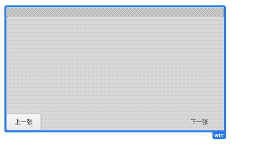

将文件保存到 Go 的代码项目中,并将文件加载到代码中,给按钮绑定信号
```go
package main

import (
	"fmt"
	"github.com/mattn/go-gtk/gtk"
	"os"
)

func main() {
	// 初始化
	gtk.Init(&os.Args)
	// 加载glade文件
	builder := gtk.NewBuilder()
	builder.AddFromFile("/Users/weiying/go/src/glade1.glade")

	// 获取glade文件上的控件

	win := gtk.WindowFromObject(builder.GetObject("win"))
	b1 := gtk.LabelFromObject(builder.GetObject("b1"))
	b2 := gtk.LabelFromObject(builder.GetObject("b2"))

	// 信号处理
	
	b1.Connect("clicked", func() {
		fmt.Println("上一页")
	})
	b2.Connect("clicked", func() {
		fmt.Println("下一页")
	})
	
	win.Connect("destroy", func() {
		gtk.MainQuit()
	})

	// 显示窗口
	// 显示控件，如果是通过glade添加的控件，show即可显示所有，如果是通过代码布局添加的控件，需要showall才能显示所有
	
	win.Show()

	gtk.Main()

}
```
上面代码的演示效果:
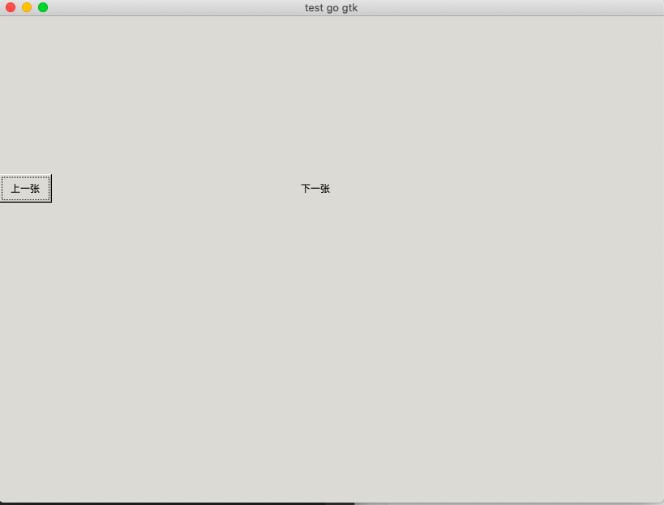

# 常用控件

1. 窗口控件
获取glade文件上的窗口

```go
	win := gtk.WindowFromObject(builder.GetObject("win"))
```

设置窗口标题的控件

```go
	win.SetTitle("test go gtk")
```

设置窗口图标

```go
	win.SetIconFromFile("favicon.ico")
```

指定窗口的大小,指的是最小窗口的大小,可以拖动边框来调整大小
```go
	win.SetSizeRequest(820,600)
```

获取窗口大小
```go
	var w , h int
	win.GetSize(&w,&h) // 传递的是指针类型的参数，会将窗口的宽和高返回给传递的变量
	fmt.Println(w,h)
```

设置窗口位置

```go
// 让窗口居中显示
	win.SetPosition(gtk.WIN_POS_CENTER)
	//gtk.WIN_POS_CENTER：表示窗口居中显示。
	//WIN_POS_MOUSE：在窗口启动之前，你的鼠标指向哪，窗口就在哪显示。例如：鼠标指向了电脑屏幕右下角，那么窗口就在右下角显示。
	//WIN_POS_CENTER_ALWAYS:表示永远居中。
```

固定窗口大小,false 表示不允许通过拖动边框来调整窗口大小

```go
	win.SetResizable(false)
```

关闭窗口控件

```go
	win.Connect("destroy", func() {
		gtk.MainQuit()
	})
```

显示窗口

```go
	// 显示控件，如果是通过glade添加的控件，show即可显示所有，如果是通过代码布局添加的控件，需要showall才能显示所有
	win.Show()
```

2. 标签控件

获取标签控件

```go
// 获取glade文件中的标签
	b1 := gtk.LabelFromObject(builder.GetObject("b1"))
	b2 := gtk.LabelFromObject(builder.GetObject("b2"))
```

设置标签内容
```go
	b1.SetText("上一页")
```

设置字体大小
```go
	b1.ModifyFontSize(40)
```

设置字体颜色
```go
	 // 需要导入包 github.com/mattn/go-gtk/gdk
	b1.ModifyFG(gtk.STATE_NORMAL,gdk.NewColor("red"))
// 两个参数,分别是字体的样式和颜色
```

3. 图片控件
```go
	// 获取glade文件中的图片控件
	image := gtk.ImageFromObject(builder.GetObject("image"))

	// 获取图片大小
	var w , h int
	image.GetSizeRequest(&w,&h)

	// 设置图片资源,需要导入包 github.com/mattn/go-gtk/gdkpixbuf
	// 这里只是将图片加载到内存中,并没有加载到 image 控件中,加载到内存中的图片称为纹理
	pixbuf , _ := gdkpixbuf.NewPixbufFromFileAtScale("/Users/weiying/go/src/cls.jpg",w-10,h-10,false)
	//gdkpixbuf.NewPixbufFromFileAtScale 方法有三个参数,第一个是图片,然后是宽和高,false表示不保存图片原来的尺寸
 // 两个返回值,分别为返回设置好的图片和是否成功的信息

	// 给 image  设置图片资源
	image.SetFromPixbuf(pixbuf)

// 图片资源使用完毕,需要释放空间(如果不释放,会占用内存)
	pixbuf.Unref()
```

4. 布局控件

- 水平布局: 就是将窗体水平划分
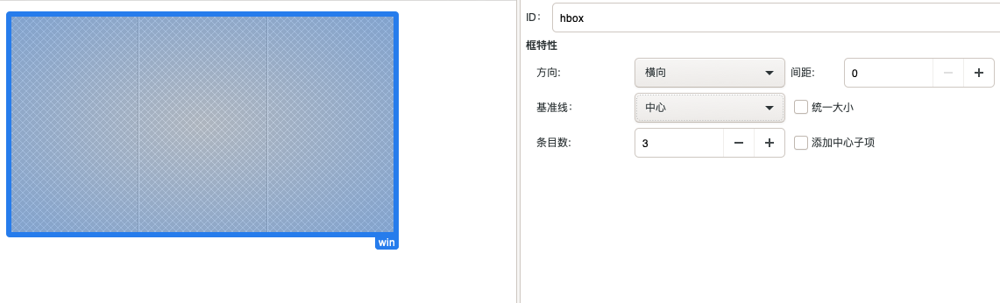

可以划分为不同的条目,可以在不同的条目中添加需要的控件,也可以自己手动的添加按钮,并添加到
```go
package main

import (
	"github.com/mattn/go-gtk/gtk"
	"os"
)

func main() {
	// 初始化
	gtk.Init(&os.Args)
	// 加载glade文件
	builder := gtk.NewBuilder()
	builder.AddFromFile("/Users/weiying/go/src/glade2.glade")

	// 获取glade文件上的窗口
	win := gtk.WindowFromObject(builder.GetObject("win"))

	// 获取水平布局
	hbox := gtk.HBoxFromObject(builder.GetObject("hbox"))
	// 新建按钮添加到布局中
	b1 :=gtk.NewButtonWithLabel("新按钮")
	b1.SetSizeRequest(20,20)
	b2 :=gtk.NewButtonWithLabel("新按钮")
	hbox.Add(b1)
	hbox.Add(b2)

	win.ShowAll()
	win.Connect("destroy", func() {
		gtk.MainQuit()
	})
	gtk.Main()
}
```
效果展示
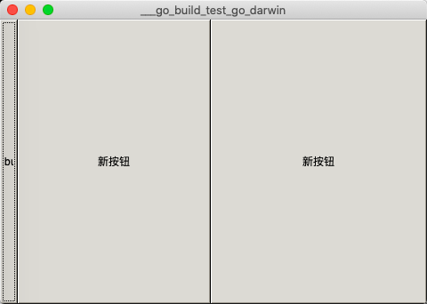

- 垂直布局
```go
package main

import (
	"github.com/mattn/go-gtk/gtk"
	"os"
)

func main() {
	// 初始化
	gtk.Init(&os.Args)
	// 加载glade文件
	builder := gtk.NewBuilder()
	builder.AddFromFile("/Users/weiying/go/src/glade3.glade")

	// 获取glade文件上的窗口
	win := gtk.WindowFromObject(builder.GetObject("win"))

	// 获取垂直布局
	hbox := gtk.VBoxFromObject(builder.GetObject("vbox"))
	// 新建按钮添加到布局中
	b1 :=gtk.NewButtonWithLabel("新按钮")
	b1.SetSizeRequest(20,20)
	b2 :=gtk.NewButtonWithLabel("新按钮")
	hbox.Add(b1)
	hbox.Add(b2)

	win.ShowAll()
	win.Connect("destroy", func() {
		gtk.MainQuit()
	})
	gtk.Main()
}
```
效果展示
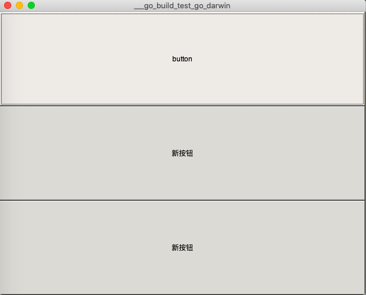

- 表格布局

表格布局添加控件的坐标位置说明
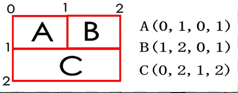

```go
package main

import (
	"github.com/mattn/go-gtk/gtk"
	"os"
)

func main() {
	// 初始化
	gtk.Init(&os.Args)
	// 加载glade文件
	builder := gtk.NewBuilder()
	builder.AddFromFile("/Users/weiying/go/src/glade3.glade")

	// 获取glade文件上的窗口
	win := gtk.WindowFromObject(builder.GetObject("win"))

	// 获取表格布局
	table := gtk.TableFromObject(builder.GetObject("table"))

	// 新建按钮添加到布局中
	b1 :=gtk.NewButtonWithLabel("新按钮")
	// 添加按钮到指定的位置
	table.AttachDefaults(b1,2,3,2,3)

	win.ShowAll()
	win.Connect("destroy", func() {
		gtk.MainQuit()
	})

	gtk.Main()
}
```

5. 进度条
glade设计如下:
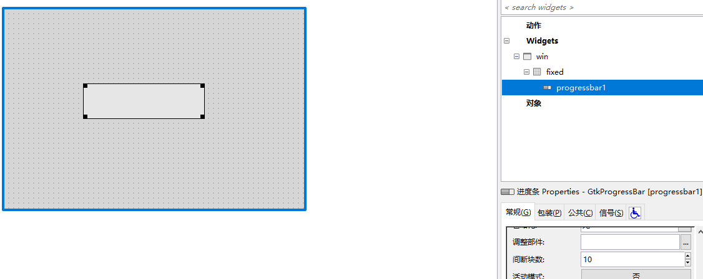

```go
package main

import (
	"fmt"
	"github.com/mattn/go-gtk/gtk"
	"os"
)

func main()  {
	// 初始化
	gtk.Init(&os.Args)
	// 加载glade文件
	builder := gtk.NewBuilder()
	builder.AddFromFile("/Users/weiying/go/src/glades/progressbar.glade")

	// 获取窗口
	win := gtk.WindowFromObject(builder.GetObject("win"))

	// 获取进度条控件
	progressbar :=gtk.ProgressBarFromObject(builder.GetObject("progressbar1"))
	// 设置进度 范围 0.0 ~ 1.0
	progressbar.SetFraction(0.5)

	// 设置进度条显示的文本
	progressbar.SetText("50%")

	// 获取进度
	value := progressbar.GetFraction()
	fmt.Println(value)

	win.Connect("destroy", func() {
		gtk.MainQuit()
	})
	win.ShowAll()

	gtk.Main()
}
```
效果展示
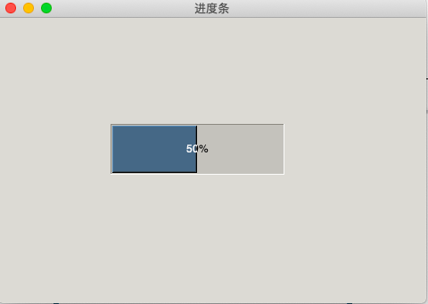

6. 行编辑:只允许输入一行数据的控件
常用的信号标识: activate 控件内部按回车的时候触发
```go
package main

import (
	"fmt"
	"github.com/mattn/go-gtk/gtk"
	"os"
)

func main()  {
	// 初始化
	gtk.Init(&os.Args)
	// 加载glade文件
	builder := gtk.NewBuilder()
	builder.AddFromFile("/Users/weiying/go/src/glades/entry.glade")

	// 获取窗口
	win := gtk.WindowFromObject(builder.GetObject("win"))

	//获取行编辑控件
	entry := gtk.EntryFromObject(builder.GetObject("entry1"))

	// 设置内容
	entry.SetText("123456")
	// 获取内容
	fmt.Println(entry.GetText())

	// 设置不可见字符，即密码模式
	//entry.SetVisibility(false)
	// 设置只读
	//entry.SetEditable(false)

	//修改字体大小
	entry.ModifyFontSize(30)

	// 信号处理，当用户在文本中中按下回车的时候引发 activate 信号
	entry.Connect("activate", func() {
		fmt.Println(entry.GetText())
	})

	win.Connect("destroy", func() {
		gtk.MainQuit()
	})
	win.ShowAll()

	gtk.Main()
}
```
 运行效果图:
 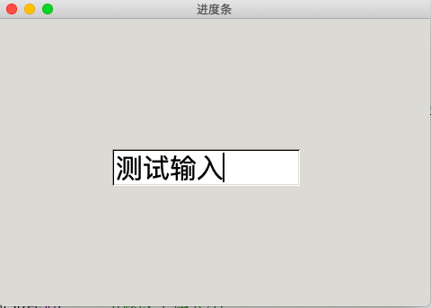

 7. 对话框
 glade中设计
 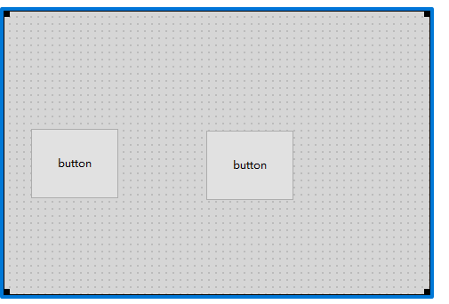

```go
package main

import (
	"fmt"
	"github.com/mattn/go-gtk/gtk"
	"os"
)

func main()  {
	// 初始化
	gtk.Init(&os.Args)
	// 加载glade文件
	builder := gtk.NewBuilder()
	builder.AddFromFile("/Users/weiying/go/src/glades/talbe.glade")

	// 获取窗口
	win := gtk.WindowFromObject(builder.GetObject("win"))

	// 获取两个按钮
	b1 := gtk.ButtonFromObject(builder.GetObject("button1"))
	b2 := gtk.ButtonFromObject(builder.GetObject("button2"))


	//信号处理
	b1.Connect("clicked", func() {
		// 新建消息对话框，选择对话框
		dialog := gtk.NewMessageDialog(
			win ,// 指定父窗口
			gtk.DIALOG_MODAL, 		// 模态对话框
			gtk.MESSAGE_QUESTION,	// 指定对话框类型
			gtk.BUTTONS_YES_NO,		// 默认按钮
			"are you ok")	// 设置内容

			dialog.SetTitle("问题对话框") // 设置对话框标题
			flag := dialog.Run() // 运行对话框，返回值为按下的按钮类型
			if flag == gtk.RESPONSE_YES {
				fmt.Println("按下的是yes")
			}else if flag == gtk.RESPONSE_NO{
				fmt.Println("按下的是no")
			}else{
				fmt.Println("按下的是关闭按钮")
			}

			dialog.Destroy() // 销毁对话框

	})

	b2.Connect("clicked", func() {
		// 新建消息对话框，选择对话框
		dialog := gtk.NewMessageDialog(
			win, // 指定父窗口
			gtk.DIALOG_MODAL,         // 模态对话框
			gtk.MESSAGE_INFO,         // 指定对话框类型,info类型
			gtk.BUTTONS_OK,           // 默认按钮
			"结束了") // 设置内容
		dialog.Run()
		dialog.Destroy()
	})


	win.Connect("destroy", func() {
		gtk.MainQuit()
	})
	win.ShowAll()

	gtk.Main()
}
```

8. 定时器
```go
package main

import (
	"github.com/mattn/go-gtk/glib"
	"github.com/mattn/go-gtk/gtk"
	"os"
	"strconv"
)

func main()  {
	// 初始化
	gtk.Init(&os.Args)
	// 加载glade文件
	builder := gtk.NewBuilder()
	builder.AddFromFile("/Users/weiying/go/src/glades/TimeOutAdd.glade")

	// 获取窗口
	win := gtk.WindowFromObject(builder.GetObject("win"))

	// 获取两个按钮
	button_start := gtk.ButtonFromObject(builder.GetObject("button_start"))
	button_start.SetLabel("开始")
	button_start.SetLabelFontSize(40)
	button_stop := gtk.ButtonFromObject(builder.GetObject("button_stop"))
	button_stop.SetLabel("停止")
	button_stop.SetLabelFontSize(40)

	// 获取标签
	label := gtk.LabelFromObject(builder.GetObject("label1"))
	// 设置初始值为0和字体大小
	label.SetText("0")
	label.ModifyFontSize(40)

	// 默认还没开始的时候，停止按钮是不能使用的
	button_stop.SetSensitive(false)

	// 设置定时器id号和累加标记
	var id int
	var num int = 1

	// 启动定时器
	button_start.Clicked(func() {
		// 启动定时器。500毫秒为时间单位间隔，回调函数为匿名函数
		id = glib.TimeoutAdd(500, func() bool {
			num++
			label.SetText(strconv.Itoa(num))
			// num 为整型，需要转换为字符串后传递给label
			return true
			// TimeoutAdd的返回值类型为bool类型，当返回false的时候，定时器执行一次后便停止，要是想定时器连续的工作，需要返回true

		})
		// 定时器启动后，启动的按钮不能使用，停止的按钮可以使用
		button_start.SetSensitive(false)
		button_stop.SetSensitive(true)
	})

	// 停止定时器
	button_stop.Clicked(func() {
		glib.TimeoutRemove(id) // 移除指定id的定时器

		button_start.SetSensitive(true) // 开始按钮可以使用
		button_stop.SetSensitive(false) // 结束按钮不能使用
	})


	win.Connect("destroy", func() {
		gtk.MainQuit()
	})
	win.ShowAll()

	gtk.Main()
}
```
效果展示如下:
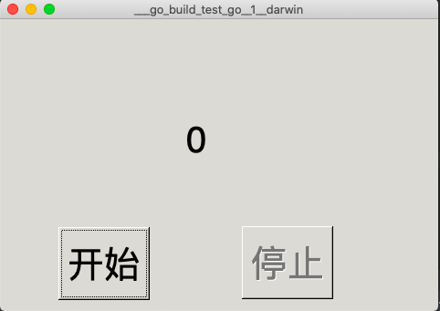

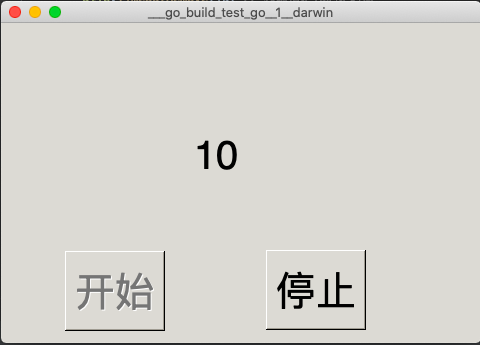