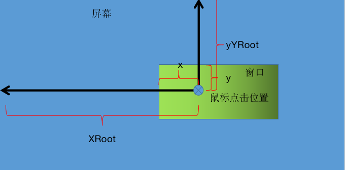

# 键盘事件
常见的键盘事件标识
```bash
|------------------------------|------------------------------|
|          事件标识             |          触发条件             |
|------------------------------|------------------------------|
|		key-press-event      |   键盘按下的时候触发    |
|------------------------------|------------------------------|
|		key-release-event   |  键盘抬起的时候触发    |
|------------------------------|------------------------------|
```
示例代码
```go
package main

import (
	"fmt"
	"github.com/mattn/go-gtk/gdk"
	"github.com/mattn/go-gtk/glib"
	"github.com/mattn/go-gtk/gtk"
	"os"
	"unsafe"
)

func main()  {
	gtk.Init(&os.Args)

	win := gtk.NewWindow(gtk.WINDOW_TOPLEVEL)
	win.SetTitle("键盘事件")
	win.SetSizeRequest(620,480)

	win.Connect("destroy", func() {
		gtk.MainQuit()
	})

	// 捕获键盘事件
	win.Connect("key-press-event", func(ctx *glib.CallbackContext) {
		// 获取键盘按下属性 结构体变量，是系统内部的变量，不是用户传递的变量
		arg := ctx.Args(0)
		// 获取键盘的事件
		event := *(**gdk.EventKey)(unsafe.Pointer(&arg))

		// envent.Keyval:获取按下（释放）键盘的键值，每个键值对应一个 ASCII 码
		key := event.Keyval
		// 上面的两行代码是固定的写法(变量可根据自己定义)

		if gdk.KEY_Up == key{
			fmt.Println("key=",event.Keyval,"上")
		}else if gdk.KEY_Down == key{
			fmt.Println("key=",event.Keyval,"下")
		}else if gdk.KEY_Left == key{
			fmt.Println("key=",event.Keyval,"左")
		}else if gdk.KEY_Right == key{
			fmt.Println("key=",event.Keyval,"右")
		}else if gdk.KEY_Escape == key{
			fmt.Println("key=",event.Keyval,"esc 退出")
			gtk.MainQuit()
		}else {
			fmt.Printf("%s\n",string(event.Keyval))
		}

	})

	win.ShowAll()
	gtk.Main()
}
```

# 绘图事件
之前我们学习过图片控件,我们可以将图片控件显示在窗口中,其实我们也可以不通过图片控件,而是将图片花在窗口上,也就是将窗口比做一个画布,在上面直接画

GTK 界面只要有图片的地方,其实底层实际上是通过绘图实现的,绘图事件也是事件的一种,GTK中绘图事件也叫曝光事件,绘图的操作需要放在时间回调函数中

如果在窗口上直接画图,那么会触发事件“expose-event”,其实,不光是我们在窗口上画图触发该事件,其实我们通过鼠标移动窗口,或者是调整窗口的最大化最小化等都会触发该事件,也就是说,只要窗口发生变化,都会触发该事件,我们可以在该事件触发后,在所调用函数中完成绘图的操作

这里需要注意的是,绘图事件信号“expose-event”默认情况下,是自动触发的,就算我们不做任何操作,“expose-event”信号也有可能自动触发,窗口状态（移动，初始化，按按钮……）改变，只用我们肉眼能看到窗口上有变化，它都会自动触发曝光事件信号"expose-event"，然后就自动会调用它所连接的回调函数，但是，它不是刷新窗口的全部区域，它是按需要局部刷新，哪儿变化了就刷新那个变化的区域。
```go
package main

import (
	"github.com/mattn/go-gtk/gdk"
	"github.com/mattn/go-gtk/gdkpixbuf"
	"github.com/mattn/go-gtk/gtk"
	"os"
)

func main()  {
	gtk.Init(&os.Args)

	win := gtk.NewWindow(gtk.WINDOW_TOPLEVEL)
	win.SetTitle("绘图事件")
	win.SetSizeRequest(620,480)

	win.Connect("destroy", func() {
		gtk.MainQuit()
	})

	//窗口默认情况下不允许绘图，需要允许窗口绘图
	win.SetAppPaintable(true)

	// 获取绘图事件
	win.Connect("expose-event", func() {
		// 加载一张纹理的信息
		//函数的参数分别为需要加载的图片、宽度、高度和是否保存图片的原尺寸
		image , _ := gdkpixbuf.NewPixbufFromFileAtScale("/Users/weiying/go/src/cls.jpg",
			80,80,false)

		//  指定窗口为绘制区域
		paint := win.GetWindow().GetDrawable()
		// 指定绘制者
		gc := gdk.NewGC(paint)

		// 绘制
		// 函数的参数:1. 绘制者 2. 要绘制的图片 
		//3. (0,0):从图片的哪个位置开始绘制(相对图片而言)  
		//4. (0,0)画图的位置,相对窗口而言 
		//5.(-1,-1):大小,-1表示加载多大的图片那么大小就是多大 
		//6. 后面三个参数固定
		paint.DrawPixbuf(gc,image,0,0,0,0,-1,-1,gdk.RGB_DITHER_NONE,0,0)

		// 将内存中的图片释放掉
		image.Unref()
	})

	win.ShowAll()
	gtk.Main()
}
```

# 鼠标事件
鼠标事件,可以理解为操作鼠标的动作,对于窗口而言,用户操作鼠标,窗口检测到鼠标的操作(产生一个信号),然后去做相应的处理(调用其规定的回调函数),即为鼠标事件
```bash
|            事件标识              |                    触发条件                  |        触发信号            |
| ------------ -------------------|---------------------------- ------------ | ------------ --------------|
| BUTTON_PRESS_MASK       |  鼠标按下                                   |  button-press-event   |
| ------------ -------------------|---------------------------- ------------ | ------------ --------------|
| BUTTON_RELEASE_MASK   | 鼠标抬起                                    | button-release-event  |
| ------------ -------------------|---------------------------- ------------ | ------------ --------------|
| BUTTON_MOTION_MASK    | 鼠标移动,按下任何键都可以移动  | motion-notify-event  |
| ------------ -------------------|---------------------------- ------------ | ------------ --------------|
|  BUTTON1_MOTION_MASK | 鼠标移动,按住左键才触发移动      |  motion-notify-event |
| ------------ -------------------|---------------------------- ------------ | ------------ --------------|
| BUTTON2_MOTION_MASK  | 鼠标移动,按住中间键才能移动      | motion-notify-event  |
| ------------ -------------------|---------------------------- ------------ | ------------ --------------| 
|  BUTTON3_MOTION_MASK |  鼠标移动,按住右键才能移动        | motion-notify-event  |
| ------------ -------------------|---------------------------- ------------ | ------------ --------------|
```

1. 代码实现鼠标点击事件
```go
package main

import (
	"fmt"
	"github.com/mattn/go-gtk/gdk"
	"github.com/mattn/go-gtk/glib"
	"github.com/mattn/go-gtk/gtk"
	"os"
	"unsafe"
)

func main()  {
	gtk.Init(&os.Args)

	win := gtk.NewWindow(gtk.WINDOW_TOPLEVEL)
	win.SetTitle("鼠标事件")
	win.SetSizeRequest(620,480)

	win.Connect("destroy", func() {
		gtk.MainQuit()
	})

	//设置鼠标按下事件
	win.SetEvents(int(gdk.BUTTON_PRESS_MASK))
	// 获取鼠标点击事件
	win.Connect("button-press-event", func(ctx *glib.CallbackContext) {
		// 获取鼠标按下属于结构体变量，是系统内部的变量，不是用户传参变量
		arg := ctx.Args(0)
		event := *(** gdk.EventButton)(unsafe.Pointer(&arg))

		// event.Type 鼠标点击类型
		if event.Type == int(gdk.BUTTON2_PRESS){ // 单机
			fmt.Printf("双机,")
		}else if event.Type == int(gdk.BUTTON_PRESS){ // 双击
			fmt.Printf("单击,")
		}

		// 获取鼠标点击的信息
		if event.Button == 1 {
			fmt.Printf("左键,")
		}else if  event.Button == 2{
			fmt.Printf("中间键,")
		}else if event.Button == 3{
			fmt.Printf("右键,")
		}

		// 打印鼠标点击的位置
		fmt.Println("坐标",int(event.X),int(event.Y))

	})

	win.ShowAll()
	gtk.Main()
}
```

2. 无边窗口的移动
创建窗口的时候,如果指定窗口类型为弹出类型,即为无边窗口类型,这时候,无法通过边框移动窗口,这时可以借助鼠标点击、移动事件来实现窗口的移动

坐标说明:

坐标x和y为鼠标点击位置在窗口中的坐标
坐标XRoot和YRoot为鼠标点击位置在窗口中的坐标

> 当我们按住鼠标移动窗口的时候,x、y的坐标是不会改变的,改变的XRoot和YRoot,因此使用XRoot减去x得,YRoot减去y,得到的坐标位置就是窗口最左上角在窗口的位置

```go
package main

import (
	"github.com/mattn/go-gtk/gdk"
	"github.com/mattn/go-gtk/glib"
	"github.com/mattn/go-gtk/gtk"
	"os"
	"unsafe"
)

func main()  {
	// 初始化
	gtk.Init(&os.Args)
	// 加载glade文件
	builder := gtk.NewBuilder()
	builder.AddFromFile("/Users/weiying/go/src/glades/win.glade")

	// 获取窗口
	win := gtk.WindowFromObject(builder.GetObject("win"))
	win.SetSizeRequest(480,320)

	var x,y int = 0, 0
	// 设置鼠标按下事件和移动事件
	win.SetEvents(int(gdk.BUTTON_PRESS_MASK | gdk.BUTTON1_MOTION_MASK))

	//鼠标按下事件处理
	win.Connect("button-press-event", func(ctx *glib.CallbackContext) {
		// 获取鼠标按下的属性
		arg :=ctx.Args(0)
		event := *(**gdk.EventButton)(unsafe.Pointer(&arg))

		if event.Button == 1 { // 左键
			x,y = int(event.X) , int(event.Y)
		}else if event.Button == 3 { // 右键
			// 右键关闭窗口
			gtk.MainQuit()
		}
	})

	// 鼠标移动事件处理
	win.Connect("motion-notify-event", func(ctx *glib.CallbackContext) {
		// 获取鼠标移动属性
		arg := ctx.Args(0)
		event := *(**gdk.EventButton)(unsafe.Pointer(&arg))
		win.Move(int(event.XRoot)-x,int(event.YRoot)-y)
	})

	win.Connect("destroy", func() {
		gtk.MainQuit()
	})
	win.ShowAll()

	gtk.Main()
}
```