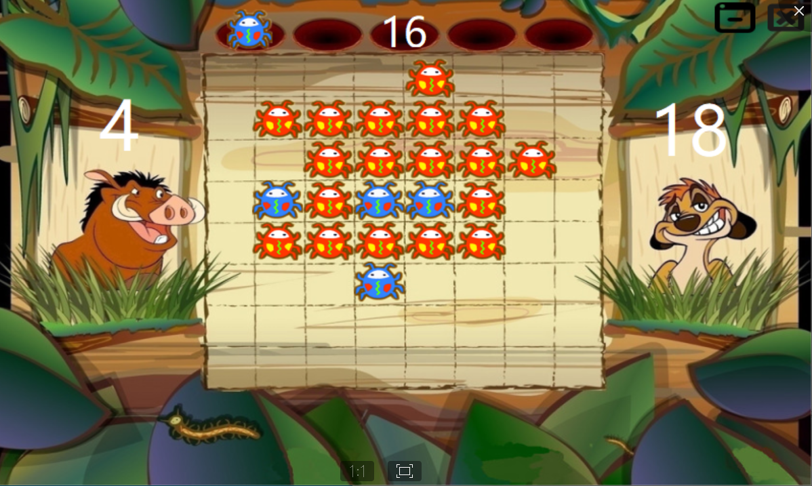
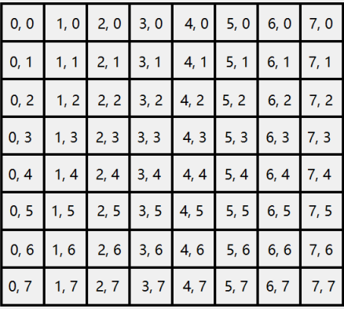
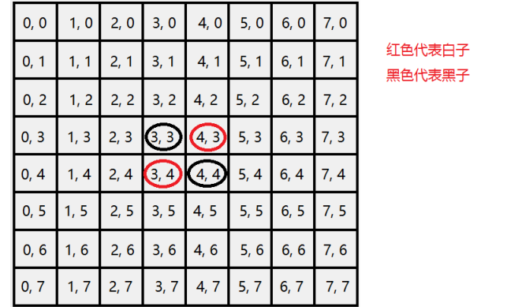
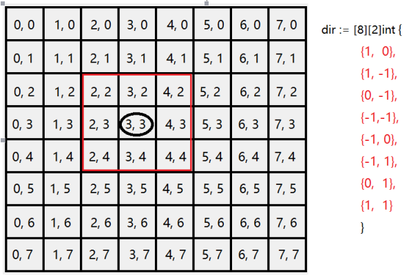
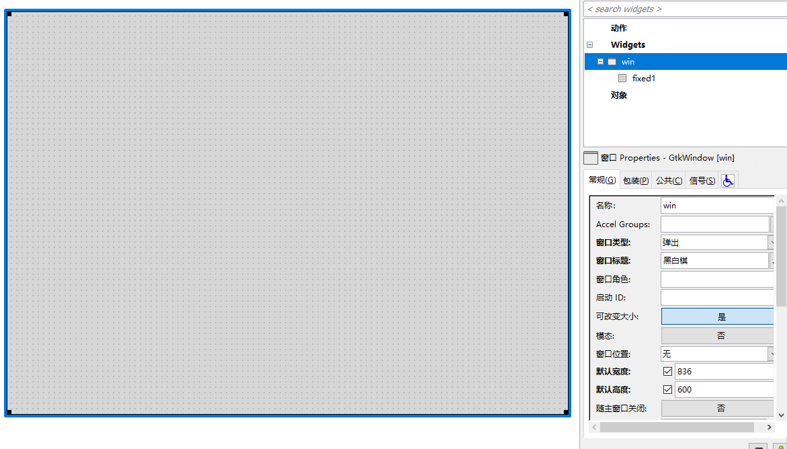
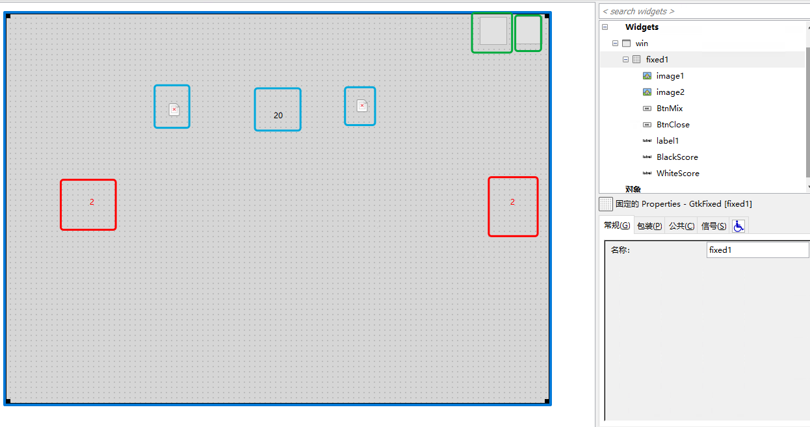
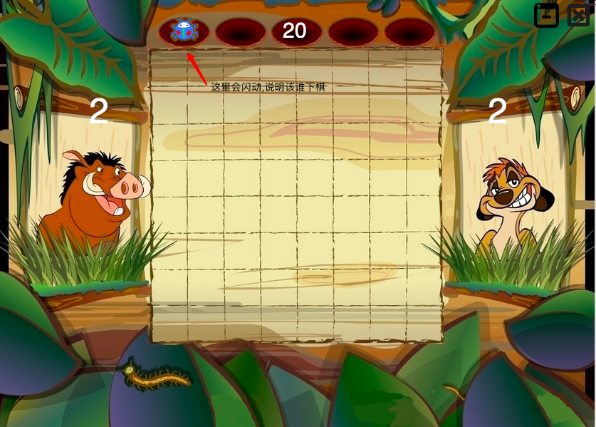
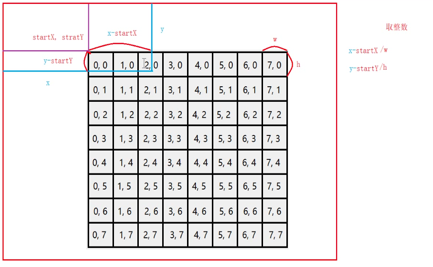
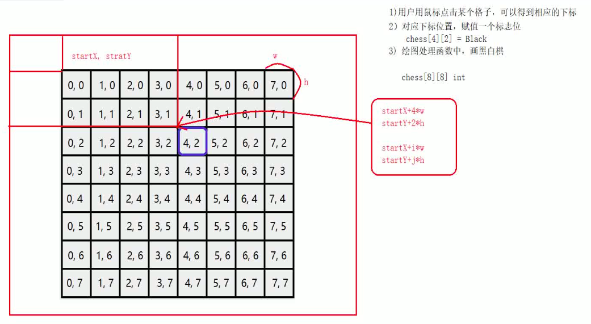

# 黑白棋项目


## 游戏说明
棋盘为8 x 8的方格布局,开局时在棋盘中间摆好4个棋子,黑白各两枚,交叉放置,双方交替下子,棋子落在方格内

合法的棋步包括:在一个空格新落下棋子,并且反转对手一个或多个棋子,落子必须要吃子

下子方式：把自己颜色的棋子放在棋盘的空格上，而当自己放下的棋子在横、竖、斜八个方向内有一个自己的棋子，则被夹在中间的对方棋子全部翻转会成为自己的棋子。夹住的位置上必须全部是对手的棋子，不能有空格。并且，只有在可以翻转棋子的地方才可以下子。一步棋可以在数个方向上翻棋，任何被夹住的棋子都必须被翻转过来，棋手无权选择不去翻某个棋子必须是刚下的子夹对方才能够翻对方的子，因翻转对方的棋子而夹住的子是不能被翻的。

若棋局中下子都不能翻转对方棋子，则自动pass轮空。若二个玩家都不能下子翻转对方棋子，游戏结束。

## 原理说明

1. 棋盘下标


2. 棋子标志


3. 方向移动


每次都要判断以落子为中心的8个位置,落子的坐标为(0,0)

## 黑白棋初始化
图片资源下载:http://upload.aishad.top/images.zip

####  先使用glade设计界面

1. glade中新建窗体,大小为 836*600,以及添加 fixed 容器


2. 添加界面上的标签、image和图片


上图中蓝色选择选中的为图片控件,用于显示当前是谁在下棋,红框的为标签控件,两个图片中间的标签为计时器,另外的两个为黑白双放当前的棋子数,绿框为最小化和关闭(位置为临时的,还会调整)

##  代码中的设计

1. 完成棋盘中的简单布局
```go
package main

import (
	"fmt"
	"github.com/mattn/go-gtk/gdk"
	"github.com/mattn/go-gtk/gdkpixbuf"
	"github.com/mattn/go-gtk/glib"
	"github.com/mattn/go-gtk/gtk"
	"os"
	"unsafe"
)

// 枚举类型，标志黑子和白字的的状态（轮到谁下棋）
const (
	Empty = iota // 代表当前棋盘格子没有子（没有落子的空格子）  0
	Black        // 当前棋盘格子为黑子   1
	White        // 当前棋盘格子为白子   2
)

// 控件结构体
type ChessWidget struct {
	window      *gtk.Window // 窗口
	min         *gtk.Button // 最小化按钮控件
	close       *gtk.Button // 关闭按钮控件
	black_start *gtk.Image  // 提示黑棋落子控件 坐标（223,10）
	white_start *gtk.Image  // 提示白棋落子控件 坐标（528,10）
	black_score *gtk.Label  // 黑棋剩余的棋子控件 坐标(70,85)
	white_score *gtk.Label  // 白棋剩余的棋子控件 坐标（630,90）
	time        *gtk.Label  // 计时器 坐标（349,2）
}

// 控件属性
type ChessInfo struct {
	w, h int //窗口的宽度和高度
	x, y int // 鼠标点击相对于窗口的坐标

}

// 黑白棋结构体
type ChessBoard struct {
	ChessWidget
	ChessInfo
	CurrenRole int // 该谁下棋
	TipTimeId int // 实现提示闪烁效果的定时器id
}

//方法1：创建控件、设置属性的方法
func (obj *ChessBoard) CreateWindow() {
	// 加载glade文件
	builder := gtk.NewBuilder()
	builder.AddFromFile("/Users/weiying/go/src/glades/UI.glade")

	// 窗口相关
	obj.window = gtk.WindowFromObject(builder.GetObject("win"))
	// 让窗口居中显示
	obj.window.SetPosition(gtk.WIN_POS_CENTER)
	// 设置窗口的宽度和高度
	obj.w, obj.h = 836, 600
	obj.window.SetSizeRequest(obj.w, obj.h)
	// 去掉窗口的边框
	obj.window.SetDecorated(false)

	// 首先允许绘图
	obj.window.SetAppPaintable(true)

	// 按钮相关
	// 获取按钮
	obj.close = gtk.ButtonFromObject(builder.GetObject("close"))
	obj.min = gtk.ButtonFromObject(builder.GetObject("min"))
	//清空按钮的显示内容
	obj.close.SetLabel("")
	obj.min.SetLabel("")

	// 给按钮设置图片
	ButtonSetImageFromFile(obj.close, "/Users/weiying/go/src/images/close.png")
	ButtonSetImageFromFile(obj.min, "/Users/weiying/go/src/images/min.png")

	// 标签相关
	obj.black_score = gtk.LabelFromObject(builder.GetObject("black_score"))
	obj.white_score = gtk.LabelFromObject(builder.GetObject("white_score"))
	obj.time = gtk.LabelFromObject(builder.GetObject("time"))

	// 设置标签字体大小
	obj.black_score.ModifyFontSize(50)
	obj.white_score.ModifyFontSize(50)
	obj.time.ModifyFontSize(30)
	// 设置标签内容
	obj.black_score.SetText("2")
	obj.white_score.SetText("2")
	obj.time.SetText("20")
	//设置字体颜色
	obj.black_score.ModifyFG(gtk.STATE_NORMAL, gdk.NewColor("white"))
	obj.white_score.ModifyFG(gtk.STATE_NORMAL, gdk.NewColor("white"))
	obj.time.ModifyFG(gtk.STATE_NORMAL, gdk.NewColor("white"))

	// image 相关
	obj.black_start = gtk.ImageFromObject(builder.GetObject("black_start"))
	obj.white_start = gtk.ImageFromObject(builder.GetObject("white_start"))

	// 添加图片
	ImageSetPicFromFile(obj.black_start,
		"/Users/weiying/go/src/images/black.png")
	ImageSetPicFromFile(obj.white_start,
		"/Users/weiying/go/src/images/white.png")
}

// 方法2 ： 事件、信号处理
func (obj *ChessBoard) HandleSignal() {
	// 设置鼠标的点击和移动事件
	obj.window.SetEvents(int(gdk.BUTTON_PRESS_MASK | gdk.BUTTON1_MOTION_MASK))
	//鼠标点击事件
	obj.window.Connect("button-press-event", MousePressEvent, obj)
	//鼠标移动事件,按住鼠标的时候触发
	obj.window.Connect("motion-notify-event", MouseMoveEvent, obj)

	// 关闭按钮事件处理
	obj.close.Connect("clicked", func() {
		//关闭定时器
		glib.TimeoutRemove(obj.TipTimeId)
		gtk.MainQuit()

	})
	// 最小化按钮处理
	obj.min.Connect("clicked", func() {
		obj.window.Iconify() // 最小化窗口
	})

	// 绘图相关
	// 大小改变事件
	obj.window.Connect("configure_event", func() {
		// 重新刷图
		obj.window.QueueDraw()
	})

	// 绘图事件
	obj.window.Connect("expose-event", PaintEvent, obj)

}

// 鼠标点击事件函数
func MousePressEvent(ctx *glib.CallbackContext) {
	// 获取用户传递的参数
	data := ctx.Data()
	// 类型判断。判断传递的参数的类型是否为 *ChessBoard 类型
	obj, ok := data.(*ChessBoard)
	if ok == false {
		fmt.Println("函数 MousePressEvent 中传递的参数类型错误")
		return
	}

	// 获取鼠标按下属于结构体变量，是系统内部的变量，不是用户传参变量
	arg := ctx.Args(0)
	event := *(** gdk.EventButton)(unsafe.Pointer(&arg))

	// 保存用户点击的x和y的坐标
	obj.x, obj.y = int(event.X), int(event.Y)
}

// 鼠标移动事件函数
func MouseMoveEvent(ctx *glib.CallbackContext) {
	// 获取用户传递的参数
	data := ctx.Data()
	// 类型判断。判断传递的参数的类型是否为 *ChessBoard 类型
	obj, ok := data.(*ChessBoard)
	if ok == false {
		fmt.Println("函数 MouseMoveEvent 中传递的参数类型错误")
		return
	}

	// 获取鼠标按下属于结构体变量，是系统内部的变量，不是用户传参变量
	arg := ctx.Args(0)
	event := *(** gdk.EventButton)(unsafe.Pointer(&arg))

	// 获取移动时候的坐标差值，具体可到博客鼠标事件中查看
	x, y := int(event.XRoot)-obj.x, int(event.YRoot)-obj.y
	obj.window.Move(x, y)

}

// 给按钮添加图片的函数
func ButtonSetImageFromFile(button *gtk.Button, file string) {
	// 获取按钮的大小
	var w, h int
	button.GetSizeRequest(&w, &h)

	// 加载指定的纹理图片
	pixbuf, _ := gdkpixbuf.NewPixbufFromFileAtScale(file, w-10, h-10, false)
	// 通过pixbuf新建image ,指定image为绘制区域
	image := gtk.NewImageFromPixbuf(pixbuf)
	// 给按钮设置图标
	button.SetImage(image)
	// 去掉按钮的焦距
	button.SetCanFocus(false)

	// 将内存中的图片释放掉
	pixbuf.Unref()
}

// 添加背景图
func PaintEvent(ctx *glib.CallbackContext) {
	// 获取用户传递的参数
	data := ctx.Data()
	// 类型判断。判断传递的参数的类型是否为 *ChessBoard 类型
	obj, ok := data.(*ChessBoard)
	if ok == false {
		fmt.Println("函数 PaintEvent 中传递的参数类型错误")
		return
	}
	// 获取画家，设置绘图区域
	paint := obj.window.GetWindow().GetDrawable()
	gc := gdk.NewGC(paint)
	// 加载一张纹理的信息

	// 加载指定的纹理图片
	pixbuf, _ := gdkpixbuf.NewPixbufFromFileAtScale("/Users/weiying/go/src/images/bg.jpg",
		obj.w, obj.h, false)
	// 绘图
	paint.DrawPixbuf(gc, pixbuf, 0, 0, 0, 0, -1, -1,
		gdk.RGB_DITHER_NONE, 0, 0)
	// 释放图片
	pixbuf.Unref()

}

// 给image设置图片
func ImageSetPicFromFile(image *gtk.Image, filename string) {
	// 获取图片大小
	var w, h int
	image.GetSizeRequest(&w, &h)

	// 这里只是将图片加载到内存中
	pixbuf, _ := gdkpixbuf.NewPixbufFromFileAtScale(filename,
		w-10, h-10, false)
	// 给 image  设置图片资源
	image.SetFromPixbuf(pixbuf)

	// 图片资源使用完毕,需要释放空间(如果不释放,会占用内存)
	pixbuf.Unref()
}

//	方法：黑白棋属性相关
func (obj *ChessBoard) InitChess()  {
	// 开始的时候，默认全部隐藏
	obj.black_start.Hide()
	obj.white_start.Hide()

	// 默认是黑子先下棋
	obj.CurrenRole = Black
	// 启动定时器
	obj.TipTimeId = glib.TimeoutAdd(500, func() bool {
		// 实现没500毫秒，调用一次函数，实现闪烁
		ShowTip(obj) // 提示谁下子的函数
		return true
	})

}

// 函数，实现闪烁功能，提示谁下子
func ShowTip(obj *ChessBoard)  {

	if obj.CurrenRole == Black { // 当前黑子下棋
		// 隐藏白棋image
		obj.white_start.Hide()
		//实现闪烁的功能
		if obj.black_start.GetVisible() == true {
			// 如果是显示的状态就隐藏
			obj.black_start.Hide()
		}else {
			// 如果是隐藏的状态就显示
			obj.black_start.Show()
		}

	}else { // 当前白子下棋
	// 隐藏黑子 image
		obj.black_start.Hide()
		//实现闪烁的功能
		if obj.white_start.GetVisible() == true {
			// 如果是显示的状态就隐藏
			obj.white_start.Hide()
		}else {
			// 如果是隐藏的状态就显示
			obj.white_start.Show()
		}
	}
}

func main() {
	// 初始化
	gtk.Init(&os.Args)

	// 创建结构体变量
	var obj ChessBoard
	// 调用创建控件、设置属性的方法
	obj.CreateWindow()

	// 调用信号处理
	obj.HandleSignal()

	// 黑白棋属性相关
	obj.InitChess()

	// 显示窗口
	obj.window.Show()

	// 主事件循环
	gtk.Main()
}

```
效果展示如下


2. 棋盘坐标说明


当我们能够获取到startX、startY的坐标后,并且我们能够知道每一小格子的宽度w和高度h,startX、startY、w和h的值可以通过鼠标事件来获取 

当用户使用鼠标点击棋盘的时候,能够获取到鼠标点击的坐标x和y,使用x-startX,y-startY得到的值就是鼠标点击在棋盘中的位置,我们用这个得到的横坐标除以宽度w,使用纵坐标除以高度h,得到的整数就是棋盘二维中的位置

落子说明:


当用户使用鼠标点击某个格子后,就可以得到对应的二维数组的下标(例如 chess[4][2]),那么我们就可以对这个位置进行标志是黑子还是白子,然后进行画图

画图的时候,我们需要得到这个格子的左上角的坐标,可以通过为(startX+i\*w,startY\*h),i和j的值为对应二维数组的下标

部分代码实现如下:
```go
// 保存用户点击的x和y的坐标
	obj.x, obj.y = int(event.X), int(event.Y)
	//fmt.Println(obj.x, obj.y)
	i := (obj.x-obj.startX)/obj.gridW
	j := (obj.y-obj.startY)/obj.gridH
	//fmt.Println(i,j)
	// 限制用户在棋盘中点击
	if i >=0 && i<=7 && j>=0 && j<=7{
		obj.chess[i][j] = White
		// 刷新绘图区域（整个窗口）
		obj.window.QueueDraw()
	}

// 绘制下棋时候的图片
	pixbuf_black, _ := gdkpixbuf.NewPixbufFromFileAtScale("/Users/weiying/go/src/images/black.png",
		obj.gridW, obj.gridH, false)
	pixbuf_white, _ := gdkpixbuf.NewPixbufFromFileAtScale("/Users/weiying/go/src/images/white.png",
		obj.gridW, obj.gridH, false)
// 画黑白棋
	// 遍历二维数组，如果格子中没有就可以下棋
	for i :=0 ; i < 8 ; i++ {
		for j := 0 ; j < 8 ; j++ {
			// 根据对应格子的下标中的标志来判断画哪种颜色的棋
			if obj.chess[i][j] == Black {

				paint.DrawPixbuf(gc, pixbuf_black, 0, 0,
					obj.startX+i*obj.gridW, obj.startY+j*obj.gridH, -1, -1,
					gdk.RGB_DITHER_NONE, 0, 0)

			}else if obj.chess[i][j] == White {
				paint.DrawPixbuf(gc, pixbuf_white, 0, 0,
					obj.startX+i*obj.gridW, obj.startY+j*obj.gridH, -1, -1,
					gdk.RGB_DITHER_NONE, 0, 0)
			}
		}
	}
```

3. 下棋的时候角色的切换
```go
// 改变落子角色
func (obj *ChessBoard) ChageRole()  {
	// 黑白子轮流下棋
	if obj.CurrenRole == Black {
		obj.CurrenRole = White
	}else {
		obj.CurrenRole = Black
	}
}
```

4. 实现计时器
规定的20s的事件内,如果没有落子,角色别为对方下棋
```go
// 在初始化的时候完成
// 倒计时定时器
	// 起始时间20s
	obj.TimeNum = 20
	obj.time.SetText(strconv.Itoa(obj.TimeNum))

	//启动
	obj.LeftTipTimeId = glib.TimeoutAdd(1000, func() bool {
		obj.TimeNum--
		obj.time.SetText(strconv.Itoa(obj.TimeNum))
		// 时间到了改变角色
		if obj.TimeNum == 0 {
			obj.ChageRole()
		}
		return true
	})
```
上面的代码中调用了改变角色的函数,但是改变角色后时间仍然为0,那需要在改变角色的函数中重新设置20s定时器
```go
// 改变落子角色
func (obj *ChessBoard) ChageRole()  {
	// 改变角色后重新设置20s的定时器
	obj.TimeNum = 20
	obj.time.SetText(strconv.Itoa(obj.TimeNum))
	// 黑白子轮流下棋
	if obj.CurrenRole == Black {
		obj.CurrenRole = White
	}else {
		obj.CurrenRole = Black
	}
}
```

5. 吃子设计
秉承落子必吃子的概念

方向移动指的就是说,当我们在一个位置下子之后,我们需要沿着这个位置向四周移动,来判断是否能够吃子

例如:所下的棋子为chess[3][3],那么就有8个方向需要判断,上、下、左、右、左上、左下、右上和右下,那么当我们有如图所示的二维数组 dir 的时候使用坐标(3,3)+(1,0)得到(4,3)就是棋子右的位置,依次类推

根据上图,假如黑子要落子在(4,2),那么需要判断一下条件:

- 要落子的位置是否为空,也就是没有子

- 沿着某个方向移动,移动一个位置就判断这个位置的标志位,一共有三种清空,一:移动一个格子如果为空,说明这个方向不能吃子,终止本方向移动.二:移动一个格子的时候,如果标志位为自己的棋子,那么这个方向也不能吃子,终止本方向移动.三:如果移动一个格子,判断标志位为对方的棋子,那么沿着这个方向继续移动,直到在这个方向遇到自己的棋子为止,如果在到达边界后仍没有自己的棋子,说明这个方向不能吃子,那么终止本方向移动,如果有自己的棋子,那么反方向回去将沿途的棋子变成自己的棋子,然后将最开始落子的位置变成自己的棋子


```go
// 吃子规则
// 吃子规则的参数，棋盘数组坐标位置（x，y），role为当前落子的角色
// eatChess为true，代表改变原来的数据，false不改变数组内容，只判断此位置能够吃多少个子
// 返回值，吃子个数
func (obj *ChessBoard) ChessRule(x int, y int, role int, eatChess bool) (eatNum int) {

	// 棋盘的八个方向
	dir := [8][2]int{{1, 0}, {1, -1}, {0, -1}, {-1, -1}, {-1, 0}, {-1, 1}, {0, 1}, {1, 1}}

	tempX, tempY := x, y // 临时保存棋盘数组坐标位置

	if obj.chess[tempX][tempY] != Empty { // 如果此方格内已有棋子，返回
		return 0
	}

	// 棋盘的8个方向
	for i := 0; i < 8; i++ {
		tempX += dir[i][0]
		tempY += dir[i][1] // 准备判断相邻棋子

		// 如果没有出界，且相邻棋子是对方棋子，才有吃子的可能．
		if (tempX < 8 && tempX >= 0 && tempY < 8 && tempY >= 0) && (obj.chess[tempX][tempY] != role) && (obj.chess[tempX][tempY] != Empty) {
			tempX += dir[i][0]
			tempY += dir[i][1] // 继续判断下一个，向前走一步
			for tempX < 8 && tempX >= 0 && tempY < 8 && tempY >= 0 {
				if obj.chess[tempX][tempY] == Empty { // 遇到空位跳出
					break
				}

				if obj.chess[tempX][tempY] == role { // 找到自己的棋子，代表可以吃子
					if eatChess == true { // 确定吃子
						obj.chess[x][y] = role // 开始点标志为自己的棋子
						tempX -= dir[i][0]
						tempY -= dir[i][1] // 后退一步
						for (tempX != x) || (tempY != y) {
							// 只要没有回到开始的位置就执行
							obj.chess[tempX][tempY] = role // 标志为自己的棋子
							tempX -= dir[i][0]
							tempY -= dir[i][1] // 继续后退一步
							eatNum++           // 累计
						}
					} else { //不吃子，只是判断这个位置能不能吃子
						tempX -= dir[i][0]
						tempY -= dir[i][1] // 后退一步
						for (tempX != x) || (tempY != y) { // 只计算可以吃子的个数
							tempX -= dir[i][0]
							tempY -= dir[i][1] // 继续后退一步
							eatNum++
						}
					}

					break // 跳出循环
				} // 没有找到自己的棋子，就向前走一步

				tempX += dir[i][0]
				tempY += dir[i][1] // 向前走一步
			}
		} // 如果这个方向不能吃子，就换一个方向
		tempX, tempY = x, y
	}

	return // 返回能吃子的个数
}
```

6. 棋子统计和胜负判断
```go
// 统计黑白子个数，同时判断胜负
func (obj *ChessBoard) JudgeResult() {
	// 判断胜负的条件就是双方都不能吃子
	blackNum, whiteNum := 0, 0
	isOver := true // 默认游戏可以结束
	for i := 0; i < 8; i++ {
		for j := 0; j < 8; j++ {
			if obj.chess[i][j] == Black {
				blackNum++
			} else if obj.chess[i][j] == White {
				whiteNum++
			}
			// 只要有任意位置能吃子，游戏就没有结束
			if obj.ChessRule(i, j, Black, false) > 0 || obj.ChessRule(i, j, White, false) > 0 {
				isOver = false
			}
		}
	}
	//界面显示个数
	obj.black_score.SetText(strconv.Itoa(blackNum))
	obj.white_score.SetText(strconv.Itoa(whiteNum))
	if isOver == false {
		return
	}
	// 到这一步说明游戏结束
	//关闭定时器
	glib.TimeoutRemove(obj.TipTimeId)
	glib.TimeoutRemove(obj.LeftTipTimeId)
	// 判断胜负
	var result string

	if blackNum > whiteNum {
		result = "蓝色方获胜\n是否继续游戏"
	} else if blackNum < whiteNum {
		result = "红色方获胜\n是否继续游戏"
	} else {
		result = "平局\n是否继续游戏"
	}
	// 问题会话框
	dialog := gtk.NewMessageDialog(
		obj.window,           // 指定父窗口
		gtk.DIALOG_MODAL,     // 模态对话框
		gtk.MESSAGE_QUESTION, // 指定对话框类型
		gtk.BUTTONS_YES_NO,   // 默认按钮
		result) //对话框内容
	ret := dialog.Run()
	if ret == gtk.RESPONSE_YES{ // 按下的是继续
		obj.InitChess() // 棋盘重新初始化
	}else {
		// 关闭窗口
		gtk.MainQuit()
	}
	dialog.Destroy()
}
```

7. 完整的代码
```go
package main

import (
	"fmt"
	"github.com/mattn/go-gtk/gdk"
	"github.com/mattn/go-gtk/gdkpixbuf"
	"github.com/mattn/go-gtk/glib"
	"github.com/mattn/go-gtk/gtk"
	"os"
	"strconv"
	"unsafe"
)

// 枚举类型，标志黑子和白字的的状态（轮到谁下棋）
const (
	Empty = iota // 代表当前棋盘格子没有子（没有落子的空格子）  0
	Black        // 当前棋盘格子为黑子   1
	White        // 当前棋盘格子为白子   2
)

// 控件结构体
type ChessWidget struct {
	window      *gtk.Window // 窗口
	min         *gtk.Button // 最小化按钮控件
	close       *gtk.Button // 关闭按钮控件
	black_start *gtk.Image  // 提示黑棋落子控件 坐标（223,10）
	white_start *gtk.Image  // 提示白棋落子控件 坐标（528,10）
	black_score *gtk.Label  // 黑棋剩余的棋子控件 坐标(70,85)
	white_score *gtk.Label  // 白棋剩余的棋子控件 坐标（630,90）
	time        *gtk.Label  // 计时器 坐标（349,2）
}

// 控件属性
type ChessInfo struct {
	w, h           int //窗口的宽度和高度
	x, y           int // 鼠标点击相对于窗口的坐标
	startX, startY int // 棋盘在图片中的起始坐标 (210,73)
	gridW, gridH   int // 棋盘中一个网格的宽度和高度 (51,50)

}

// 黑白棋结构体
type ChessBoard struct {
	ChessWidget
	ChessInfo
	CurrenRole    int        // 该谁下棋
	TipTimeId     int        // 实现提示闪烁效果的定时器id
	chess         [8][8] int //棋盘二维数组
	LeftTipTimeId int        // 实现规定的20s切换下棋角色
	TimeNum       int        // 记录剩余时间
	MachineTimeID int        // 机器落子定时器
}

//方法1：创建控件、设置属性的方法
func (obj *ChessBoard) CreateWindow() {
	// 加载glade文件
	builder := gtk.NewBuilder()
	builder.AddFromFile("/Users/weiying/go/src/glades/UI.glade")

	// 窗口相关
	obj.window = gtk.WindowFromObject(builder.GetObject("win"))
	// 让窗口居中显示
	obj.window.SetPosition(gtk.WIN_POS_CENTER)
	// 设置窗口的宽度和高度
	obj.w, obj.h = 836, 600
	obj.window.SetSizeRequest(obj.w, obj.h)
	// 去掉窗口的边框
	obj.window.SetDecorated(false)

	// 首先允许绘图
	obj.window.SetAppPaintable(true)

	// 按钮相关
	// 获取按钮
	obj.close = gtk.ButtonFromObject(builder.GetObject("close"))
	obj.min = gtk.ButtonFromObject(builder.GetObject("min"))
	//清空按钮的显示内容
	obj.close.SetLabel("")
	obj.min.SetLabel("")

	// 给按钮设置图片
	ButtonSetImageFromFile(obj.close, "/Users/weiying/go/src/images/close.png")
	ButtonSetImageFromFile(obj.min, "/Users/weiying/go/src/images/min.png")

	// 标签相关
	obj.black_score = gtk.LabelFromObject(builder.GetObject("black_score"))
	obj.white_score = gtk.LabelFromObject(builder.GetObject("white_score"))
	obj.time = gtk.LabelFromObject(builder.GetObject("time"))

	// 设置标签字体大小
	obj.black_score.ModifyFontSize(50)
	obj.white_score.ModifyFontSize(50)
	obj.time.ModifyFontSize(30)
	// 设置标签内容
	obj.black_score.SetText("2")
	obj.white_score.SetText("2")
	obj.time.SetText("20")
	//设置字体颜色
	obj.black_score.ModifyFG(gtk.STATE_NORMAL, gdk.NewColor("white"))
	obj.white_score.ModifyFG(gtk.STATE_NORMAL, gdk.NewColor("white"))
	obj.time.ModifyFG(gtk.STATE_NORMAL, gdk.NewColor("white"))

	// image 相关
	obj.black_start = gtk.ImageFromObject(builder.GetObject("black_start"))
	obj.white_start = gtk.ImageFromObject(builder.GetObject("white_start"))

	// 添加图片
	ImageSetPicFromFile(obj.black_start,
		"/Users/weiying/go/src/images/black.png")
	ImageSetPicFromFile(obj.white_start,
		"/Users/weiying/go/src/images/white.png")

	// 棋盘坐标相关
	obj.startX, obj.startY = 210, 73
	obj.gridW, obj.gridH = 51, 50
}

// 方法2 ： 事件、信号处理
func (obj *ChessBoard) HandleSignal() {
	// 设置鼠标的点击和移动事件
	obj.window.SetEvents(int(gdk.BUTTON_PRESS_MASK | gdk.BUTTON1_MOTION_MASK))
	//鼠标点击事件
	obj.window.Connect("button-press-event", MousePressEvent, obj)
	//鼠标移动事件,按住鼠标的时候触发
	obj.window.Connect("motion-notify-event", MouseMoveEvent, obj)

	// 关闭按钮事件处理
	obj.close.Connect("clicked", func() {
		//关闭定时器
		glib.TimeoutRemove(obj.TipTimeId)
		glib.TimeoutRemove(obj.LeftTipTimeId)
		gtk.MainQuit()

	})
	// 最小化按钮处理
	obj.min.Connect("clicked", func() {
		obj.window.Iconify() // 最小化窗口
	})

	// 绘图相关
	// 大小改变事件
	obj.window.Connect("configure_event", func() {
		// 重新刷图
		obj.window.QueueDraw()
	})

	// 绘图事件
	obj.window.Connect("expose-event", PaintEvent, obj)

}

// 鼠标点击事件函数
func MousePressEvent(ctx *glib.CallbackContext) {
	// 获取用户传递的参数
	data := ctx.Data()
	// 类型判断。判断传递的参数的类型是否为 *ChessBoard 类型
	obj, ok := data.(*ChessBoard)
	if ok == false {
		fmt.Println("函数 MousePressEvent 中传递的参数类型错误")
		return
	}

	// 获取鼠标按下属于结构体变量，是系统内部的变量，不是用户传参变量
	arg := ctx.Args(0)
	event := *(** gdk.EventButton)(unsafe.Pointer(&arg))

	// 保存用户点击的x和y的坐标
	obj.x, obj.y = int(event.X), int(event.Y)
	//fmt.Println(obj.x, obj.y)
	i := (obj.x - obj.startX) / obj.gridW
	j := (obj.y - obj.startY) / obj.gridH
	//fmt.Println(i,j)
	// 限制当机器下棋的时候，用户不能点击
	if obj.CurrenRole == White {
		return
	}
	// 限制用户在棋盘中点击
	if i >= 0 && i <= 7 && j >= 0 && j <= 7 {

		// 落子必须能吃子
		if obj.ChessRule(i, j, obj.CurrenRole, true) > 0 {
			// 刷新绘图区域（整个窗口）
			obj.window.QueueDraw()
			// 改变角色
			obj.ChageRole()
		}
	}
}

// 鼠标移动事件函数
func MouseMoveEvent(ctx *glib.CallbackContext) {
	// 获取用户传递的参数
	data := ctx.Data()
	// 类型判断。判断传递的参数的类型是否为 *ChessBoard 类型
	obj, ok := data.(*ChessBoard)
	if ok == false {
		fmt.Println("函数 MouseMoveEvent 中传递的参数类型错误")
		return
	}

	// 获取鼠标按下属于结构体变量，是系统内部的变量，不是用户传参变量
	arg := ctx.Args(0)
	event := *(** gdk.EventButton)(unsafe.Pointer(&arg))

	// 获取移动时候的坐标差值，具体可到博客鼠标事件中查看
	x, y := int(event.XRoot)-obj.x, int(event.YRoot)-obj.y
	obj.window.Move(x, y)

}

// 给按钮添加图片的函数
func ButtonSetImageFromFile(button *gtk.Button, file string) {
	// 获取按钮的大小
	var w, h int
	button.GetSizeRequest(&w, &h)

	// 加载指定的纹理图片
	pixbuf, _ := gdkpixbuf.NewPixbufFromFileAtScale(file, w-10, h-10, false)
	// 通过pixbuf新建image ,指定image为绘制区域
	image := gtk.NewImageFromPixbuf(pixbuf)
	// 给按钮设置图标
	button.SetImage(image)
	// 去掉按钮的焦距
	button.SetCanFocus(false)

	// 将内存中的图片释放掉
	pixbuf.Unref()
}

// 添加背景图
func PaintEvent(ctx *glib.CallbackContext) {
	// 获取用户传递的参数
	data := ctx.Data()
	// 类型判断。判断传递的参数的类型是否为 *ChessBoard 类型
	obj, ok := data.(*ChessBoard)
	if ok == false {
		fmt.Println("函数 PaintEvent 中传递的参数类型错误")
		return
	}
	// 获取画家，设置绘图区域
	paint := obj.window.GetWindow().GetDrawable()
	gc := gdk.NewGC(paint)
	// 加载一张纹理的信息

	// 加载背景图片
	pixbuf, _ := gdkpixbuf.NewPixbufFromFileAtScale("/Users/weiying/go/src/images/bg.jpg",
		obj.w, obj.h, false)
	// 加载黑白棋图片资源
	pixbuf_black, _ := gdkpixbuf.NewPixbufFromFileAtScale("/Users/weiying/go/src/images/black.png",
		obj.gridW, obj.gridH, false)
	pixbuf_white, _ := gdkpixbuf.NewPixbufFromFileAtScale("/Users/weiying/go/src/images/white.png",
		obj.gridW, obj.gridH, false)
	// 绘图
	paint.DrawPixbuf(gc, pixbuf, 0, 0, 0, 0, -1, -1,
		gdk.RGB_DITHER_NONE, 0, 0)

	// 画黑白棋
	// 遍历二维数组，如果格子中没有就可以下棋
	for i := 0; i < 8; i++ {
		for j := 0; j < 8; j++ {
			// 根据对应格子的下标中的标志来判断画哪种颜色的棋
			if obj.chess[i][j] == Black {

				paint.DrawPixbuf(gc, pixbuf_black, 0, 0,
					obj.startX+i*obj.gridW, obj.startY+j*obj.gridH, -1, -1,
					gdk.RGB_DITHER_NONE, 0, 0)

			} else if obj.chess[i][j] == White {
				paint.DrawPixbuf(gc, pixbuf_white, 0, 0,
					obj.startX+i*obj.gridW, obj.startY+j*obj.gridH, -1, -1,
					gdk.RGB_DITHER_NONE, 0, 0)
			}
		}
	}

	// 释放图片
	pixbuf.Unref()
	pixbuf_black.Unref()
	pixbuf_white.Unref()

}

// 给image设置图片
func ImageSetPicFromFile(image *gtk.Image, filename string) {
	// 获取图片大小
	var w, h int
	image.GetSizeRequest(&w, &h)

	// 这里只是将图片加载到内存中
	pixbuf, _ := gdkpixbuf.NewPixbufFromFileAtScale(filename,
		w-10, h-10, false)
	// 给 image  设置图片资源
	image.SetFromPixbuf(pixbuf)

	// 图片资源使用完毕,需要释放空间(如果不释放,会占用内存)
	pixbuf.Unref()
}

//	方法：黑白棋属性相关
func (obj *ChessBoard) InitChess() {
	// 开始的时候，默认全部隐藏
	obj.black_start.Hide()
	obj.white_start.Hide()

	// 默认是黑子先下棋
	obj.CurrenRole = Black
	// 启动定时器
	obj.TipTimeId = glib.TimeoutAdd(500, func() bool {
		// 实现没500毫秒，调用一次函数，实现闪烁
		ShowTip(obj) // 提示谁下子的函数
		return true
	})
	// 初始化起始的四个棋子
	// 遍历二维数组，在中间的四个位置安装四个棋子
	for i := 0; i < 8; i++ {
		for j := 0; j < 8; j++ {
			// 初始全部为空
			obj.chess[i][j] = Empty
		}
	}
	// 默认有两个黑子和白子
	obj.chess[3][3] = Black
	obj.chess[4][4] = Black
	obj.chess[3][4] = White
	obj.chess[4][3] = White

	// 更新棋盘
	obj.window.QueueDraw()
	// 初始分数为2
	obj.black_score.SetText("2")
	obj.white_score.SetText("2")

	// 倒计时定时器
	// 起始时间20s
	obj.TimeNum = 20
	obj.time.SetText(strconv.Itoa(obj.TimeNum))

	//启动
	obj.LeftTipTimeId = glib.TimeoutAdd(1000, func() bool {
		obj.TimeNum--
		obj.time.SetText(strconv.Itoa(obj.TimeNum))
		// 时间到了改变角色
		if obj.TimeNum == 0 {
			obj.ChageRole()
		}
		return true
	})

}

// 函数，实现闪烁功能，提示谁下子
func ShowTip(obj *ChessBoard) {

	if obj.CurrenRole == Black { // 当前黑子下棋
		// 隐藏白棋image
		obj.white_start.Hide()
		//实现闪烁的功能
		if obj.black_start.GetVisible() == true {
			// 如果是显示的状态就隐藏
			obj.black_start.Hide()
		} else {
			// 如果是隐藏的状态就显示
			obj.black_start.Show()
		}

	} else { // 当前白子下棋
		// 隐藏黑子 image
		obj.black_start.Hide()
		//实现闪烁的功能
		if obj.white_start.GetVisible() == true {
			// 如果是显示的状态就隐藏
			obj.white_start.Hide()
		} else {
			// 如果是隐藏的状态就显示
			obj.white_start.Show()
		}
	}
}

// 改变落子角色
func (obj *ChessBoard) ChageRole() {
	// 改变角色后重新设置20s的定时器
	obj.TimeNum = 20
	obj.time.SetText(strconv.Itoa(obj.TimeNum))
	// 黑白子轮流下棋
	if obj.CurrenRole == Black {
		obj.CurrenRole = White
	} else {
		obj.CurrenRole = Black
	}
	obj.JudgeResult()
	obj.window.QueueDraw()
	// 机器落子
	if obj.CurrenRole == White {
		obj.MachineTimeID = glib.TimeoutAdd(2000, func() bool {
			obj.MachinePlay() // 机器落子的方法
			return true
		})
	}
}

// 机器落子的方法
func (obj *ChessBoard) MachinePlay() {
	// 移除定时器
	glib.TimeoutRemove(obj.MachineTimeID)

	max, px, py := 0, -1, -1
	//优先落子在四个角落，如果不能在四个角落落子。落在吃子最多的位置
	for i := 0; i < 8; i++ {
		for j := 0; j < 8; j++ {
			num := obj.ChessRule(i, j, obj.CurrenRole, false)
			if num > 0 {
				if (i == 0 && j == 0) || (i == 0 && j == 7) || (i == 7 && j == 7) || (i == 7 && j == 0) {
					px, py = i, j
					goto End
				}
				if num > max {
					max, px, py = num, i, j
				}
			}
		}
	}
End:
	if px == -1 { // 说明机器不能落子
		obj.ChageRole()
		return
	}
	// 机器吃子
	obj.ChessRule(px, py, obj.CurrenRole, true)
	obj.window.QueueDraw()
	obj.ChageRole()
}

// 统计黑白子个数，同时判断胜负
func (obj *ChessBoard) JudgeResult() {
	// 判断胜负的条件就是双方都不能吃子
	blackNum, whiteNum := 0, 0
	isOver := true // 默认游戏可以结束
	for i := 0; i < 8; i++ {
		for j := 0; j < 8; j++ {
			if obj.chess[i][j] == Black {
				blackNum++
			} else if obj.chess[i][j] == White {
				whiteNum++
			}
			// 只要有任意位置能吃子，游戏就没有结束
			if obj.ChessRule(i, j, Black, false) > 0 || obj.ChessRule(i, j, White, false) > 0 {
				isOver = false
			}
		}
	}
	//界面显示个数
	obj.black_score.SetText(strconv.Itoa(blackNum))
	obj.white_score.SetText(strconv.Itoa(whiteNum))
	if isOver == false {
		return
	}
	// 到这一步说明游戏结束
	//关闭定时器
	glib.TimeoutRemove(obj.TipTimeId)
	glib.TimeoutRemove(obj.LeftTipTimeId)
	// 判断胜负
	var result string

	if blackNum > whiteNum {
		result = "蓝色方获胜\n是否继续游戏"
	} else if blackNum < whiteNum {
		result = "红色方获胜\n是否继续游戏"
	} else {
		result = "平局\n是否继续游戏"
	}
	// 问题会话框
	dialog := gtk.NewMessageDialog(
		obj.window,           // 指定父窗口
		gtk.DIALOG_MODAL,     // 模态对话框
		gtk.MESSAGE_QUESTION, // 指定对话框类型
		gtk.BUTTONS_YES_NO,   // 默认按钮
		result) //对话框内容
	ret := dialog.Run()
	if ret == gtk.RESPONSE_YES { // 按下的是继续
		obj.InitChess() // 棋盘重新初始化
	} else {
		// 关闭窗口
		gtk.MainQuit()
	}
	dialog.Destroy()
}

// 吃子规则
// 吃子规则的参数，棋盘数组坐标位置（x，y），role为当前落子的角色
// eatChess为true，代表改变原来的数据，false不改变数组内容，只判断此位置能够吃多少个子
// 返回值，吃子个数
func (obj *ChessBoard) ChessRule(x int, y int, role int, eatChess bool) (eatNum int) {

	// 棋盘的八个方向
	dir := [8][2]int{{1, 0}, {1, -1}, {0, -1}, {-1, -1}, {-1, 0}, {-1, 1}, {0, 1}, {1, 1}}

	tempX, tempY := x, y // 临时保存棋盘数组坐标位置

	if obj.chess[tempX][tempY] != Empty { // 如果此方格内已有棋子，返回
		return 0
	}

	// 棋盘的8个方向
	for i := 0; i < 8; i++ {
		tempX += dir[i][0]
		tempY += dir[i][1] // 准备判断相邻棋子

		// 如果没有出界，且相邻棋子是对方棋子，才有吃子的可能．
		if (tempX < 8 && tempX >= 0 && tempY < 8 && tempY >= 0) && (obj.chess[tempX][tempY] != role) && (obj.chess[tempX][tempY] != Empty) {
			tempX += dir[i][0]
			tempY += dir[i][1] // 继续判断下一个，向前走一步
			for tempX < 8 && tempX >= 0 && tempY < 8 && tempY >= 0 {
				if obj.chess[tempX][tempY] == Empty { // 遇到空位跳出
					break
				}

				if obj.chess[tempX][tempY] == role { // 找到自己的棋子，代表可以吃子
					if eatChess == true { // 确定吃子
						obj.chess[x][y] = role // 开始点标志为自己的棋子
						tempX -= dir[i][0]
						tempY -= dir[i][1] // 后退一步
						for (tempX != x) || (tempY != y) {
							// 只要没有回到开始的位置就执行
							obj.chess[tempX][tempY] = role // 标志为自己的棋子
							tempX -= dir[i][0]
							tempY -= dir[i][1] // 继续后退一步
							eatNum++           // 累计
						}
					} else { //不吃子，只是判断这个位置能不能吃子
						tempX -= dir[i][0]
						tempY -= dir[i][1]                 // 后退一步
						for (tempX != x) || (tempY != y) { // 只计算可以吃子的个数
							tempX -= dir[i][0]
							tempY -= dir[i][1] // 继续后退一步
							eatNum++
						}
					}

					break // 跳出循环
				} // 没有找到自己的棋子，就向前走一步

				tempX += dir[i][0]
				tempY += dir[i][1] // 向前走一步
			}
		} // 如果这个方向不能吃子，就换一个方向
		tempX, tempY = x, y
	}

	return // 返回能吃子的个数
}

func main() {
	// 初始化
	gtk.Init(&os.Args)

	// 创建结构体变量
	var obj ChessBoard
	// 调用创建控件、设置属性的方法
	obj.CreateWindow()

	// 调用信号处理
	obj.HandleSignal()

	// 黑白棋属性相关
	obj.InitChess()

	// 显示窗口
	obj.window.Show()

	// 主事件循环
	gtk.Main()
}
```