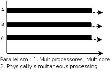
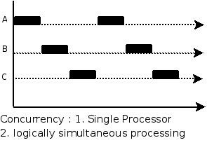
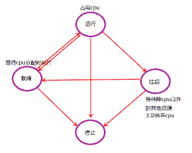

## 并发编程

所谓的并发编程就是在 一台服务上面`同时`处理多个任务

宏观的并发指的是,在同一段时间内,有多个程序同时运行

微观上并发指的是,在同一时刻,只能运行一条指令,但是多个程序指令被快速的轮换执行,使得在宏观上具有多个程序同时执行的效果,但是实际上并不是同时执行,只是把时间分割为若干个时间片,是得多个程序快速的交替执行

### 并行和并发

1. 并行

是指在同一时刻(CPU的时间量级),有多条指令在多个处理器上同时运行,这主要借助的是多核CPU

2. 并发

指在同一时刻,只能有一条指令执行,但是多核进程的执行被快速的轮换执行,是得在宏观上具有多个指令同时执行的效果,但是在微观上,并不是同时执行的,只是把时间分为若干个时间片,通过CPU时间片轮换使得多个进程快速交替的执行

### 程序和进程

1. 程序

程序是指编译的好的二进制文件,在磁盘上,不占用系统资源(这里的系统资源指的是CPU和内存)

2. 进程

进程是一种抽象的概念,与操作系统原理紧密的联系在一起,进程是活跃的程序,占用系统资源,在内存中执行,进程由程序运行产生

下面是程序的几种状态:

## 进程并发

在使用进程并发的时候,会出现的问题

- 系统开销比较大,占用的资源比较多,可以开启的进程数少(linux 系统中最大能开启的进程数为65536)

在操作系统找那个,我们可以创建很多进程,在Unix/Linux系统中,正常情况下,子进程是由父进程fork创建的,子进程在创建新的进程,而且父进程永远无法预测子进程什么时候结束,当一个进程完成它的工作终止以后,它的父进程需要调用系统资源来获取子进程的状态,这种情况下,就容易出现下面两种进程

1. 孤儿进程

父进程先于子进程结束,则子进程称为孤儿进程,那么此时的子进程的父进程将更改为init进程,称为init进程领养孤儿进程

2. 僵尸进程

终止进程,其父进程尚未回收,子进程残留资源(PCB)存放于内存中,变成僵尸进程

windows 下的进程和linux 下的进程不一样,它比较懒惰,从不执行任何东西,只是为线程提供执行环境,然后由线程负责执行再进程的地址空间中的代码,当创建一个进程的时候操作系统会自动的创建这个进程的第一个线程,称为主线程

## 线程并发

LWP: light weight proccess 轻量级的进程,但是本质上还是linux上的进程

- 进程: 拥有独立的地址空间,拥有PCB(进程控制块(process control block))
- 线程: 有独立的PCB,但是没有独立的地址空间(进程中的线程的地址空间时共享的)

#### 进程和线程的区别与关系

- 进程: 最小的资源分配单位,,可以看做是只有一个线程的进程

进程是程序的一次执行过程,是一个动态的概念,在程序的执行过程中`进程是分配和管理资源的基本单位`,每一个进程都有自己的地址空间,至少有五种基本状态: 初始态,就绪态,运行态,挂起态(阻塞态)和终止态

- 线程: 最小的执行单位,CPU分配时间片的对象

它可以与属于同一个进程的其他进程共享所有用的全部资源

##### 关系

一个线程只能属于一个进程,而一个进程可以有多个线程,但是至少会有一个线程

##### 区别

理解它们的区别,需要从使用的资源的角度出发(CPU,内存,文件和网络等)

- 根本区别:进程是操作系统资源分配的基本单位,而线程是任务调度和执行的基本单位
- 开销方面: 每个进程都有自己独立的代码和数据空间(程序的上下文),进程之间的切换开销比较大,线程可以看做是轻量级的进程同一个进程下的线程共享代码和数据空间,每个线程都有自己独立的运行栈和程序计数器(PC)线程间的切换开销较小
- 所处的环境: 在操作系统中,能够同时运行多个进程,而在同一个进程中也可以同时有多个线程(通过CPU调度,在每个时间片只能有一个线程去执行任务)
- 内存分配: 系统为每个进程分配不同的内存空间,而对于线程来说,除了CPU之外,系统不会为线程分配内存(线程使用的内存来自其所属的进程),线程组之间能够共享内存
- 包含关系: 线程是进程的一部分

windows 系统下,我们可以直接忽略进程的概念,只谈线程,因为线程是最小的执行单位,是被系统独立调度和分配的基本单位,而进程是给线程提供了执行环境

#### 线程同步

同步即同步调用,按照语句的先后次序运行

线程同步,指的是一个线程发出某一种功能调用的时候,在没有得到结果之前,该调用不返回,同时其他的线程为了保持一致性,不会调用该功能

​	例如: 内存中有100 字节,线程T1 欲写入全部的1,线程T2欲写入全部的0,但是当T1执行的时候,只写入了50个字节的时候就失去了CPU时间,接着T2获取到了CPU时间片,那么就会将T1写入的内容覆盖,当T1再次获取到CPU时间后,继续写入1,当执行结束的时候,内存中既不是T1要求的数据,也不是T2要求的数据

上述现象就叫做`与时间相关的错误(time related)`为了避免这种数据混乱,线程需要同步,同步的目的就是为了避免数据混乱,线程需要同步,同步的目的就是为了避免数据混乱,解决与时间相关的错误,实际上,不仅是线程需要同步,进程与信号等等都需要同步机制

> 因此,所有的多个控制流,共同操作同一个共享资源的时候,都需要同步机制

### 锁的应用

#### 互斥锁

linux 中提供一把互斥锁mutex(也称为互斥量)

每个线程对资源操作前,都会首先尝试加锁,加锁成功后才能操作,操作结束后解锁

资源是共享的,线程间也还是竞争的,但是通过锁,将其对资源的访问编程互斥操作,而后与时间相关的错误也就不会产生了,但是应注意,同一时刻,只能有一个线程持有该锁

当A线程对某个全局变量加锁访问，B在访问前尝试加锁，拿不到锁，B阻塞。C线程不去加锁，而直接访问该全局变量，依然能够访问，但会出现数据混

所以,互斥锁实质上是操作系统提供的建议锁,又称为协同锁,建议程序中有多线程访问共享资源的时候使用该机制,但是并没有强制限定

因此,即使有了mutex,如果线程不按照规则来访问数据,已然会操作数据混乱

#### 读写锁

与互斥量类似,但是读写锁允许更高的并行性,其特性为: 写独占,读共享

##### 读写锁的状态

特别强调,读写锁只有一把,但是其具备两种状态

- 读模式下加锁状态(读锁)
- 写模式下加锁状态(写锁)

##### 读写锁的特性

1. 读写锁是`写模式加锁`时,直到解锁前,所有对该锁申请加锁的线程都会被阻塞
2. 读写锁是`读模式加锁`时,如果线程以读模式对其加锁能够成功,以写模式对其加锁会阻塞
3. 读写锁是`写模式加锁`时,既有试图以写模式解锁的线程,也有试图以读模式加锁的线程,那么读写锁会阻塞随后的读模式锁线程,有限满足写模式,读锁,写锁并行阻塞,写锁的优先级高

> 读写锁也叫做`共享-独占锁`,当读写锁以读模式锁住的时候,它是以共享模式锁住的,当它以写模式锁住的时候,它是以独占模式锁住的,写独占,读共享,读写锁非常适合对数据结果读取的次数远大于写的情况

### 协程并发

协程(goroutine),也叫做轻量级线程,与传统的系统级线程和进程比较,协程最大的优势在于轻量级,可以轻松的创建上万个,而不会调至系统资源的枯竭

一个线程中可以有多个协程,但是某一个时刻只能有一个协程在运行,多协程分享该线程分配的计算机资源

多数语言在语法层次不支持协程,而是通过库的方式支持,但是调用库的方式支持的功能也不完善,比如仅仅提供协程的创建,销毁与切换等功能,如果在这样的轻量级的线程中调用一个同步IO操作,比如网络通信,本地文件读写等,都会阻塞其他并发执行的轻量级线程,从而无法真正的达到轻量级线程的目标

在协程中,调用一个任务就像调用一个函数一样,消耗的资源非常的少,但是能够达到线程并发和进程并发相同的效果

在个并发执行的任务中,进程,线程和协程都能够实现,从系统资源的消耗角度来看,进程占用的最多,线程其次,协程最小

协程的概念很早就提出来了,但是知道近几年才在一部分语言中得到广泛的应用

子程序,或者称为函数,在所有的语言中都是层级调用,比如A调用B,B在执行的过程中又调用了c,C执行完毕后返回,B执行完毕之后返回,最后是A执行完毕

所以子程序调用总是通过栈来实现的,一个线程就是执行一个子程序

子程序调用总是一个入口,一次返回,调用顺序是明确的,而协程的调用和子程序不同

协程看上去也是子程序,但是执行的过程中,在子程序的内部可以中断,然后转而执行别的子程序,在适当的时候再返回来接着执行

> 注意: 在一个子程序中中断,去执行其他子程序,不是函数调用,有点类似CPU的中断

最大的优势就是协程的执行效率极高,因为是在子程序中的切换而不是线程的切换,也不存在同时写变量冲突,在协程中控制共享资源不加锁,只需要判断状态就好了,所以执行效率比线程高很多

因为协程是一个线程执行,那么怎利用多核CPU呢? 最简单的方式就是多进程+协程,即充分的利用多核,又充分的发挥协程的高效,可以获得极高的性能