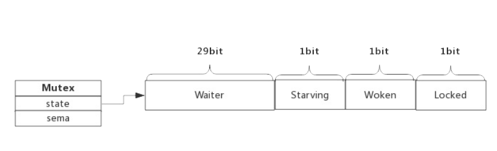
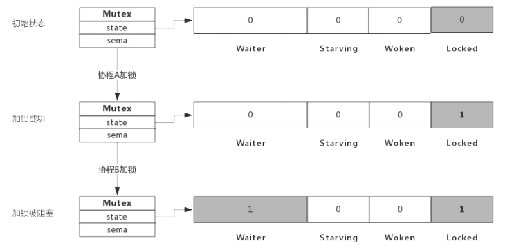

## 互斥锁

互斥锁是并发程序中对共享资源进行访问控制的主要手段,对此Go语言提供了非常简单易用的Mutex,Mutex为结构体类型,对外暴露两个方法Lock()和Unlock()分别用于加锁和解锁

Mutex使用起来非常方便,但其内部实现却是复杂很多,这包括Mutex的几种状态

### Mutex 数据结构

源码包`src/sync/mutex.go:Mutex`

```go
type Mutex struct {
	state int32
	sema  uint32
}
```

Mutex.state : 表示互斥锁的状态,比如是否被锁定等

Mutex.sema: 表示信号量,协程阻塞等待该信号量,解锁的协程,释放该信号量从而唤醒等待这个信号量的协程

我们看到Mutex.state是32位的整形变量,内部实现时把该变量分层四份,用于记录Mutex的四种状态

- 下图展示Mutex的内存布局



- Locked: 表示该Mutex是否已经被锁定,0表示没有锁定,1表示已经被锁定
- Woken: 表示是否有协程已经被唤醒,0表示没有唤醒,1表示已经协程唤醒,正在加锁的过程中
- Starving: 表示该Mutex是否处于饥饿状态,0表示没有饥饿,1表示饥饿状态,说明有协程阻塞了超过1ms
- Waiter : 表示阻塞等待锁的协程个数,协程解锁是根据此值来判断是否需要释放信号量

协程之间抢锁实际上抢的是给Locked赋值的权利,能给Locked域置1,就说明抢锁成功,抢不到的话就阻塞等待Mutex.sema信号量,一旦持有锁的协程解锁,等待的协程会依次被唤醒

woken 和 Starving 主要用于控制协程间的抢锁过程

### Mutex方法

Mutex 对外提供两个方法,实际上也只有这两个方法:

- Lock() : 加锁方法
- Unlock() : 解锁方法

### 加锁过程

假定当前只有一个协程在加锁,没哟其他协程干扰,那么过程如下图所示:


加锁过程会去判断Locked标志位是否为0,如果是0则把Locked位置变为1,代表加锁成功,从上图可见,加锁成功后,只有Locked位置1,其他状态位没有发生变化

### 加锁被阻塞

假定加锁时,锁已经被其他的协程占用了,此时加锁过程如下图所示



从上图可看到,当协程B对一个已被占用的锁再次加锁时,Waiter计数器增加了1,此时协程B将被阻塞,直到Locked值变为0后才会被唤醒