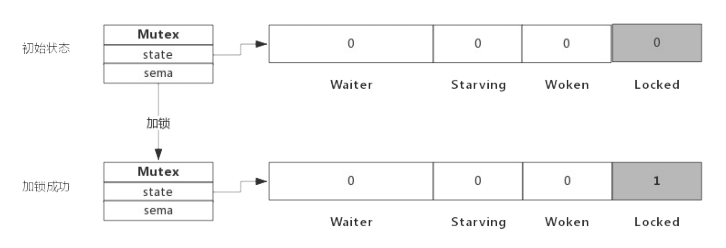

## 互斥锁

互斥锁是并发程序中对共享资源进行访问控制的主要手段,对此Go语言提供了非常简单易用的Mutex,Mutex为结构体类型,对外暴露两个方法Lock()和Unlock()分别用于加锁和解锁

Mutex使用起来非常方便,但其内部实现却是复杂很多,这包括Mutex的几种状态

### Mutex 数据结构

源码包`src/sync/mutex.go:Mutex`

```go
type Mutex struct {
	state int32
	sema  uint32
}
```

Mutex.state : 表示互斥锁的状态,比如是否被锁定等

Mutex.sema: 表示信号量,协程阻塞等待该信号量,解锁的协程,释放该信号量从而唤醒等待这个信号量的协程

我们看到Mutex.state是32位的整形变量,内部实现时把该变量分层四份,用于记录Mutex的四种状态

- 下图展示Mutex的内存布局


- Locked: 表示该Mutex是否已经被锁定,0表示没有锁定,1表示已经被锁定
- Woken: 表示是否有协程已经被唤醒,0表示没有唤醒,1表示已经协程唤醒,正在加锁的过程中
- Starving: 表示该Mutex是否处于饥饿状态,0表示没有饥饿,1表示饥饿状态,说明有协程阻塞了超过1ms
- Waiter : 表示阻塞等待锁的协程个数,协程解锁是根据此值来判断是否需要释放信号量

协程之间抢锁实际上抢的是给Locked赋值的权利,能给Locked域置1,就说明抢锁成功,抢不到的话就阻塞等待Mutex.sema信号量,一旦持有锁的协程解锁,等待的协程会依次被唤醒

woken 和 Starving 主要用于控制协程间的抢锁过程

### Mutex方法

Mutex 对外提供两个方法,实际上也只有这两个方法:

- Lock() : 加锁方法
- Unlock() : 解锁方法

### 加锁过程

假定当前只有一个协程在加锁,没哟其他协程干扰,那么过程如下图所示:



加锁过程会去判断Locked标志位是否为0,如果是0则把Locked位置变为1,代表加锁成功,从上图可见,加锁成功后,只有Locked位置1,其他状态位没有发生变化

### 加锁被阻塞

假定加锁时,锁已经被其他的协程占用了,此时加锁过程如下图所示


从上图可看到,当协程B对一个已被占用的锁再次加锁时,Waiter计数器增加了1,此时协程B将被阻塞,直到Locked值变为0后才会被唤醒

### 简单解锁

假定解锁时,没有其他协程阻塞,此时解锁过程中如下所示


由于没有其它协程等待加锁,所以此时的解锁只需要把 Locken 的位置变为 0 即可,不需要释放信号量

### 解锁并唤醒协程

假定解锁时,有 1 个或者多个协程阻塞,此时的解锁过程如下所示


协程 A 解锁的过程分为两步:

- 第一步是把 Locked 位置变为 0
- 第二步是查看到 Waiter >0,说明有协程等待加锁,所以释放一个信号量,唤醒一个阻塞的协程,被唤醒的协程 B 把 Locked 位置变为 1,于是协程 B 获得了锁

### 自旋过程

加锁时,如果当前 Locked 为 1,说明该锁当前其他协程持有,尝试加锁的协程并不是马上就转入阻塞,而是会持续的探测 Locked 的值是否为 0,这个过程称为自旋过程

自旋的过程很短,但是如果在自旋过程中发现锁已经被释放了,那么协程立即获得锁,此时即使有其他协程被唤醒也无法获取锁,只能是再次阻塞

自旋的好处就是,当加锁失败时,不比立即转入阻塞,有一定的机会可以获取到锁,这样可以避免协程的切换

#### 什么是自旋

自旋对应 CPU 的`PAUSE`指令,CPU 对该指令什么都不做,相当于 CPU 空转,对程序而言相当于 sleep 了一小段时间,时间非常短,当前实现是 30 个时钟周期

自旋过程中会持续探测 Locked 是否变为 0,连续两次探测间隔就是执行这些`PAUSE`指令,它不同于 sleep,不需要将协程转为睡眠状态

#### 自旋条件

加锁时程序会自动判断是否可以自旋,无限制的自旋将会给 CPU 带来巨大的压力,所以判断是否可以自旋就很重要了,自旋必须满足以下所有条件:

- 自旋次数要足够小,通常为 4,即自旋最多 4 次
- CPU 核心数要大于 1,否则自旋没有意义,因为此时不能有其他的协程释放锁
- 协程调度机制中的 Process 数量要大于 1,比如使用 GOMAXPROCS(),将处理器设置为 1 就不能启用自旋
- 协程调度机制中的可运行队列必须为空,否则会延迟协程调度

可见自旋的条件是很苛刻的,总而言之就是不忙的时候,才会启用自旋

#### 自旋的优势

自旋的优势就是更充分的利用 CPU,尽量避免协程切换,因为当前申请加锁的协程拥有 CPU,如果经过短时间的自旋可以获得协程,当前协程可以继续运行,不比进入阻塞状态

#### 自旋的问题

如果自旋的过程中获得了锁,那么之前被阻塞的协程就无法获得锁,如果加锁的协程特别多,每次都通过自旋获得锁,那么之前被阻塞的协程就很难获得锁,从而进入饥饿状态

为了避免协程长时间无法获取锁,自 1.8 版本依赖增加了一个状态,即 Mutex 的 Starving 状态,这个状态下不会自旋,一旦有协程释放锁,那么被唤醒的协程一定能加锁成功

### Mutex 模式

前面只关注了 waiter 和 Locked 位的变化,下面来查看 Starving 位的作用

每个 Mutex 都有两个模式,称为 Normal 和 Starving

#### normal 模式

默认情况下,Mutex 的模式为 normal

这个模式下,协程如果加锁不成功,不会立即转入阻塞队列,而是判断是否满足自旋的条件,如果满足则会启动自旋过程,尝试加锁

#### Starvation 模式

自旋的过程中能抢到锁,一定意味着同一时刻有协程释放了锁,我们知道释放锁的时候,如果发现有阻塞等待的协程,还会释放一个信号量来唤醒一个等待协程,被唤醒的协程得到 CPU 后开始运行,此时发现锁已经被抢占了,自己只好再次阻塞,不过阻塞前会判断自从上次阻塞到本次阻塞经过的时间,如果超过了 1ms 的话,会将 Mutex 标记为`饥饿`状态模式,然后再次阻塞

处于饥饿模式下,不会启动自旋过程,也就是说,一旦有协程释放了锁,那么一定会唤醒协程,被唤醒的协程将会成功的获取到锁,同时也会把等待技术减 1

#### Woken 状态

Woken 状态用于加锁和解锁过程的通信,也就是说,同一个时刻,两个协程正在加锁每一个在解锁,在加上的协程可能在自旋的过程中,此时把 Woken 标记为 1,用于通知解锁协程不比释放信号量了

### 为什么重复解锁要 panic

Unlock 的过程分为将 Locked 置为 0,然后判断 Waiter 值,如果 Waiter>0,则释放信号量,如果多次 Unlock().那么就会释放多个信号量,唤醒多个协程,多个协程被唤醒之后继续在 Lock() 的逻辑中抢锁,势必会增加 Lock()实现的复杂度,也会引起不必要的协程切换

### 编程 Tips

1. 加锁后应该立即使用 defer 释放锁,可以有效的避免出现死锁
2. 加锁和解锁最好出现在同一层次的代码块中,必须在同一个函数中
3. 重复解锁会引起 panic,应该避免这种操作的可能性

## RWMutex

RWMutex 就是所谓的读写锁,完整的表达应该是读写互斥锁,可以说是 Mutex 的一个改进版本,在某些场景下可以发挥更加灵活的控制能力,比如:读取数据频率远大于写数据频率的场景

例如: 程序中写操作少而读操作多,简单的来说就是,执行过程中 1 次的写入数据,对应着 N 的读取数据,如果使用 Mutex,这个过程将是串行的,因为即便 N 次读取操作之间不会相互影响,但是也都需要持有 Mutex 后才能操作,如果使用读写锁,多个读操作可以同时持有锁,能大大的提升并发能力 


实现读写锁需要解决如下几个问题:

- 写锁需要阻塞写锁: 一个协程获得了写锁之后,其他要使用写锁的协程全部阻塞
- 写锁需要阻塞读锁: 一个协程获得了写锁之后,其他要使用读锁的协程全部阻塞
- 读锁需要阻塞写锁: 一个协程获得了读锁之后,其他要使用写锁的协程全部阻塞
- 读锁不能阻塞读锁: 一个协程获得了读锁之后,其他的协程也可以使用读锁

### 读写锁的数据结构

源码包`src/sync/rwmutex.go:RWMutex`定义了读写锁数据结构

```go
type RWMutex struct {
	w           Mutex  // 用于控制多个读写锁,获得写锁首先要获取该锁,如果有一个写锁在进行,那么再到来的写锁将会阻塞与此
	writerSem   uint32 // 写阻塞等待的信号量,最后一个读者释放锁的时候会释放信号量
	readerSem   uint32 // 读阻塞的协程等待的信号量,持有写锁的协程释放锁后会释放信号量
	readerCount int32  // 记录读者的个数
	readerWait  int32  // 记录写阻塞时的读者的个数
}

```

从上面的数据结构中可见,读写锁内部仍有一个互斥锁,用于将两个写操作隔离开来,其他的几个都用于隔离读操作和写操作

### 读写锁的接口

RWMutex 提供 4 个简单的接口来提供服务

- Rlock() : 读锁定
- RUnlock() : 解除读锁定
- Lock(): 写锁定
- Unlock() : 解除写锁定

#### Lock() 实现逻辑

Lock方法将rw锁定为写入状态，禁止其他线程读取或者写入

写锁要做两件事:

- 获取互斥锁
- 阻塞等待所有读操作结束(如果有的话)

```go
func (rw *RWMutex) Lock() {
	if race.Enabled {
		_ = rw.w.state
		race.Disable()
	}
	// First, resolve competition with other writers.
	rw.w.Lock() //想要获取写锁,首先要获取互斥锁,下面再等待所有读者释放锁
	// Announce to readers there is a pending writer.
	r := atomic.AddInt32(&rw.readerCount, -rwmutexMaxReaders) + rwmutexMaxReaders //使用原子操作减去rwmutexMaxReaders将readerCount置为负值,目的是阻止读锁。再加上rwmutexMaxReaders又可以获取原来的读者数。非常精妙
	// Wait for active readers.
	if r != 0 && atomic.AddInt32(&rw.readerWait, r) != 0 { //如果读者数是0，那么直接获取写锁，不需要等待信号量。 因为写锁获取成功，所以此处简单的加上读者数量即可。（加上读者数量应该不会出现0的情况）
		runtime_SemacquireMutex(&rw.writerSem, false) // 续：此处将读者数写入readerWait实际上是用于排队，即当前为止的读者释放后轮到写操作，避免写锁被饿死
	}
	if race.Enabled {
		race.Enable()
		race.Acquire(unsafe.Pointer(&rw.readerSem))
		race.Acquire(unsafe.Pointer(&rw.writerSem))
	}
}
```


#### Unlock() 实现逻辑

Unlock方法解除rw的写入锁状态，如果m未加写入锁会导致运行时错误

解除写锁定要做两件事:

- 唤醒因读锁定而被阻塞的其他协程(如果有的话)
- 解除互斥锁

```go
func (rw *RWMutex) Unlock() {
	if race.Enabled {
		_ = rw.w.state
		race.Release(unsafe.Pointer(&rw.readerSem))
		race.Disable()
	}

	// Announce to readers there is no active writer.
	r := atomic.AddInt32(&rw.readerCount, rwmutexMaxReaders) //因为持有写锁期间,读者数量有可能增加,此处将读者数量加上rwmutexMaxReaders,将读者数量转为正值。
	if r >= rwmutexMaxReaders {
		race.Enable()
		throw("sync: Unlock of unlocked RWMutex")
	}
	// Unblock blocked readers, if any.
	for i := 0; i < int(r); i++ { //持有锁期间，读者可能继续到来并阻塞起来，所以这里有多少个读者，释放多少个信号量
		runtime_Semrelease(&rw.readerSem, false)
	}
	// Allow other writers to proceed.
	rw.w.Unlock()
	if race.Enabled {
		race.Enable()
	}
}
```

#### RLock() 实现逻辑

RLock方法将rw锁定为读取状态，禁止其他线程写入，但不禁止读取。

读锁定需要做两件事:

- 增加读操作计数: readerCount++
- 阻塞等待写操作结束(如果有的话)

```go
func (rw *RWMutex) RLock() {
	if race.Enabled {
		_ = rw.w.state
		race.Disable()
	}
	if atomic.AddInt32(&rw.readerCount, 1) < 0 {
    // 读者数量+1,如果readerCount为负数,说明有协程持有了写锁,需要等待协程解除写锁后释放信号量解锁
		// A writer is pending, wait for it.
		runtime_SemacquireMutex(&rw.readerSem, false, 0)
	}
	if race.Enabled {
		race.Enable()
		race.Acquire(unsafe.Pointer(&rw.readerSem))
	}
}
```


#### RUnlock() 实现逻辑

Runlock方法解除rw的读取锁状态，如果m未加读取锁会导致运行时错误

解除读锁定需要做两件事:

- 减少读操作计数,即readerCount--
- 唤醒等待写操作的协程(如果有的话)

```go
func (rw *RWMutex) RUnlock() {
	if race.Enabled {
		_ = rw.w.state
		race.ReleaseMerge(unsafe.Pointer(&rw.writerSem))
		race.Disable()
	}
	if r := atomic.AddInt32(&rw.readerCount, -1); r < 0 { //每个读者解锁时，首先将readerCount -1，如果readerCount为负值，说明有协程在等待写锁
		if r+1 == 0 || r+1 == -rwmutexMaxReaders {
			race.Enable()
			throw("sync: RUnlock of unlocked RWMutex")
		}
		// A writer is pending.
		if atomic.AddInt32(&rw.readerWait, -1) == 0 { //将readerWait -1, 并且最后一个读者负责释放一个信号量，来唤醒等待写锁的协程
			// The last reader unblocks the writer.
			runtime_Semrelease(&rw.writerSem, false)
		}
	}
	if race.Enabled {
		race.Enable()
	}
}
```


> 注意: 即便有协程阻塞等待写操作,并不是所有的解除读写锁操作都会唤醒该协程,而是最后一个解除读锁定的协程才会释放信号量将该协程唤醒,因为只有当前所有读操作的协程释放锁后才能唤醒协程

### 场景分析

#### 写操作是如何阻止写操作的

读写锁包含一个互斥锁,写锁定必须要先获取这个互斥锁,如果互斥锁已经被协程 A 获取(或者协程 A 在阻塞等待读结束),意味着协程 A 获取到了互斥锁,那么协程 B 只能阻塞等待该互斥锁

所以,写操作依赖互斥锁阻塞其他的写操作

#### 写操作如何阻塞读操作

这个是读写锁中最精华的技巧

我们知道读写锁的readerCount 是整型值,用于表示读者数量,不考虑写操作的情况下,每次读锁定都会将这个值+1,每次解除都会将这个值-1,所以readerCount的取值为[0,N),N为读者的个数,实际上最大可支持 2^30 个并发读者

写锁定进行时,会先将readerCount减去 2^30,从而readerCount编程了负数,此时便知道有写操作正在进行,只好阻塞等待,而真实的读操作的个数并不会丢失,只需要将readerCount 加上 2^30 即可得到

> 所以,写操作将readerCount变为负数来阻塞写操作

#### 读操作是如何阻塞写操作的

读锁定会先将readerCount+1,此时写操作来的时候,发现readerCount 的数量不是 0,会阻塞等待所有的读操作结束

#### 为什么写锁定不会被饿死

我们知道,写操作要等待读操作结束后才能获得锁,写操作等待期间可能还会有其他的新的读操作持续到来,如果写操作等待所有的读操作结束,很可能被饿死,然而,通过 ReaderWait 可以完美的解决这个问题

写操作到来的时候,会把readerCount 的值拷贝到 ReaderWait 中,用于标记排在写操作前面的读操作个数

前面的读操作计数之后,除了会递减readerCount的个数,还会递减 ReaderWait 的值,当 ReaderWait 的值变为 0 的时候,唤醒写操作

所以,写操作就相当于把一段连续的读操作划分为两个部分,前面的读操作结束会唤醒写操作,写操作结束后唤醒后面的读操作


