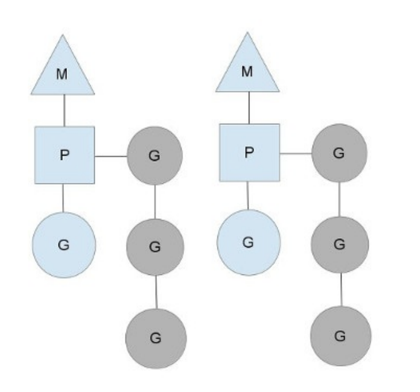

## 线程池的缺陷

在高并发应用中,频繁的创建线程会造成不必要的开销,所以才有了线程池,线程池中预先保存一定数量的线程,而新任务将不再以创建线程的方式去执行,而是将任务发布到任务队列中,线程池中的线程不断的从任务队列中取出任务并执行,可以有效的减少线程创建和销毁所带来的开销

下图展示的是一个典型的线程池:

未来方便下面的叙述,我们把任务队列中的每一个任务称为 G,而 G 往往代表这一个函数,线程池中的线程 worker 线程不断的从任务队列中取出任务执行,而 worker 线程的调度则交给操作系统进行调度

如果 worker 线程执行的 G 任务中发生系统调用,则操作系统将会将该线程置为阻塞的状态,也就意味着该线程在怠工,意味着消费任务的 worker 线程数变少了,也就是说线程池的消费能力变弱了

如果任务队列中的大部分任务都会进行系统调用,则会让这种状态恶化,大部分 worker 线程进入阻塞状态,从而任务队列中的任务产生堆积

> 解决这个问题的一个思路就是重新审视线程池总线程的数量,增加线程池中线程的数量可以从一定程度上提高消费能力,单随着线程数量的增多,由于过多线程争抢 CPU,消费能力会有上线,甚至出现消费能力下降

## Goroutine 调度器

线程数过多,意味着操作系统会不断的切换线程,频繁的上下文切换就造成了性能瓶颈,Go 提供一种机制,可以在线程中实现自己调度,上下文切换更轻量,从而达到了线程数减少,而并发效果不降低的效果,而线程中调度的就是 Goroutine

在早期的 Go 版本中,Goroutine 调度器就是将`ready-to-run`的 goroutine 分发到线程中

#### Goroutine 调度器的主要概念

- G(Goroutine) : 即 Go 协程,每个 go 关键词都会创建一个协程
- M(Machine): 工作线程,在 Go 中称为 machine
- P(Processor): 处理器(go 中定义的一个概念,并不是 CPU),包含运行 Go 代码的必要资源,也有调度 goroutine 的能力

M 必须有用 P 才可以执行 G 中的代码,P 中含有一个包含多个 G 的队列,P 可以调度 G 交给 M 执行,其关系如下:

图中 M 是交给操作挺调度的线程,M 持有一个 P,P 将 G 调度到 M 中执行,P 同时还维护着一个 包含 G 的队列(图中灰色的部分),可以按照一定的策略将不同的 G 调度到 M 中执行

P 的个数是在程序启动的时候指定的,默认情况下等同于 CPU 的核心数,由于 M 必须持有 P 才能运行 go 的代码,所以同时运行的 M 个数,也就是线程数一般等同于 CPU 核心数,以达到尽可能的使用 CPU 而又不至于产生过多的线程切换的开销的目的

程序中可以使用`runtime.GOMAXPROCS()`设置 P 的个数,在某些 IO 密集型的场景下可以在一定程度上提高性能

### Goroutine 的调度策略

1. 队列轮转

每个 P 都维护着一个包含 G 的队列,不考虑 G 进入系统调用或者 IO 操作的情况下,P 周期性的将 G 调度到 M 中执行,执行一小段时间,将上下文保存下来,然后将 G 放到队列尾部,然后从队列中重新取出一个 G 进行调度

除了每个 P 维护的 G 队列之外,还有一个全局的队列,每个 P 都会周期性的查看全局队列中是否有 G 待运行,并将其调度到 M 中执行,全局队列中的 G 的来源,主要是从系统调用中恢复的 G,之所以 P 会周期性的查看全局队列,是为了防止全局队列中的 G 被饿死

2. 系统调用

上面说到 P 的个数默认等于核心数,每个 M 必须持有一个 P 才能执行 G ,一般情况下 M 的数量会大于 P 的数量,这些多出来的 M 将会在 G 产生系统调用的时候返回作用,类似线程池,Go 也提供了一个 M 的池子,需要时从池子中取出,用完放回到池子中,不够用的时候就再创建一个

当 M 运行的 G 产生系统调用的时候,如下图所示

当 G0 即将进入系统调用时,M0 将释放P,进而某个空闲的 M1 将会获取 P,继续执行 P 队列中剩下的 G,有 M0 由于陷入系统调用而被阻塞,M1 接替 M0 的工作,只要 P 不空闲,就可以充分的利用 CPU

M1 的来源有可能是 M 的缓存池,也可能是新建的,当 G0 系统调用结束后,根据 M0 是否能够获取到 P,将会将 G0 做不同的处理

- 如果没有空闲的 P,则获取一个 P,继续执行 G0
- 如果有没空闲的 P,则将 G0 放入到全局队列中,等待被其他的 P 调度,然后 M0 将进入缓存池休眠

