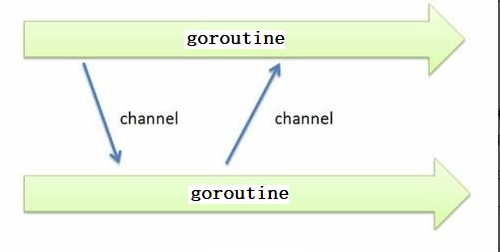

## go 并发

GO 在语言级别支持协程,每一个并发的执行单元叫做一个goroutine,go语言标准库提供的所有的系统调用(包括所有的同步IO操作),都会让出CPU给其他的goroutine,这让清零及线程的切换和管理不依赖于系统的进程和线程,也不需要依赖于CPU的核心数量


GO 语言为并发上层程序而内置的上层API,基于顺序通信进程模型CSP,这就意味着显示锁都是可以避免的,因为GO通过相对安全的通道发和接收数据来实现同步,就这大大的简化了并发编程的编写

> go 语言中的并发编程主要使用goroutine和channel来实现

## goroutine

goroutine 说到底就是协程.go 语言内部帮我们实现了goroutine之间的内存共享


#### 创建goroutine

只需要在函数调用语句前加上go关键词,就可以创建并发执行单位,开发人员无需了解任何执行细节,调度器自动将其安排到适合的系统线程上执行


在并发编程中,我们通常将一个过程切分成几块,然后让每个goroutine各自负责一块工作,当一个程序启动时,主函数在一个单独的goroutine中运行,我们叫做main goroutine,新的goroutine会用go语言来创建,而go 语言的并发设计,让我们轻松的可以达到目的

```go
package main

import (
    "fmt"
    "time"
)

func sang()  {
    for i :=0 ; i<5 ; i++{
        fmt.Println("正在唱歌---")
        time.Sleep(100 *time.Millisecond)
    }
}

func dance()  {
    for i :=0 ; i<5 ; i++{
        fmt.Println("正在跳舞---")
        time.Sleep(100 *time.Millisecond)
    }
}

func main()  { // 主 goroutine
    go sang() // 子 goroutine
    go dance()
    for { // 需要循环,不让主 goroutine停止,如果主goroutine停止了,那么子goroutine也会停止
        ;
    }
}
```

上面代码的结果输出为:


1. 如果不使用 go 关键词来创建 goroutine 的话,那么执行的顺序是顺序执行的,加了 go 关键词后,两个函数会去争抢CPU时间,而不是等待第一个执行完之后才去执行第二个
2. 之所以要让程序sleep的原因是,因为如果没有sleep的话,cpu的执行速度比较快,在一个CPU时间内第一个函数就执行完了,看不出效果,因此要让第一个函数执行一次后sleep,这样cpu就空闲出来了,能去执行第二个函数,这样就能实现并发执行了

> goroutine 的特性: 当主 goroutine 退出以后,其他的工作 goroutine 也会随之退出

### sync.WaitGroup

使用`sync.WaitGroup` 包可以让主 goroutine 在所有的工作 goroutine 执行完毕后才退出

```go
package main

import (
    "fmt"
    "sync"
)

var wg sync.WaitGroup

func hello(i int) {
    defer wg.Done() // goroutine结束就登记-1
    fmt.Println("Hello Goroutine!", i)
}
func main() {

    for i := 0; i < 10; i++ {
        wg.Add(1) // 启动一个goroutine就登记+1
        go hello(i)
    }
    wg.Wait() // 等待所有登记的goroutine都结束
}
```

### goroutine 与线程

goroutine 是用户态的线程,就是用户自己实现的线程

- goroutine 是可增长的栈

os 线程一般是有固定的栈内存(通常为 2MB),一个 goroutine 的栈是在其生命周期开始的时候,只有一个很小的栈(典型默认情况下为 2KB),goroutine 的栈是不固定的,可以按需增大减小,goroutine 的栈大小的限制可以达到 1GB,所以在 go 语言中,一次性创建 10 万个左右的 goroutine 也是可以的

### Goroutine的调度

`GMP`是 go 语言运行时 runtime 层面实现的,是 go 语言自己实现的一套调度系统,区别于操作系统调度 OS 线程

- G: 就是 goroutine,里面除了存放该 goroutine 的信息之外,还存放与其所在的 P 的绑定信息
- M: Machine,是 Go 运行时 runtime 对操作系统内核线程的虚拟,M 与内核线程一般是一一映射的关系,一个 goroutine 最终都要放在 M 上执行
- P:管理着一组 goroutine,其中保存着当前 goroutine 运行的上下文环境(函数指针,堆栈地址以及边界地址等),同时也会对自己管理的 goroutine 做调度,比如把占用 CPU 时间较长的 goroutine 暂停,运行后续的 goroutine 等,当自己的队列消费完了就到全局队列中获取任务

P 与 M 一般也是一一对应的,他们的关系是: P 管理着一组 goroutine,将一组 goroutine 挂载到 M 上执行的,当一个 goroutine 长期的阻塞在 M 上的时候,runtime 就会创建新的 M,阻塞 goroutine 所在的 P 会把其他的 goroutine 挂载到新的 M 上执行,当旧的 goroutine 阻塞完成或者认为其死亡的时候,会将其 M 回收


P 的个数是通过`runtime.GOMAXPAOCS`设定的,最大值为 256 个,go 1.5 版本之后,默认为物理线程数,在并发量最大的时候会增加一些 P 和 M,切换太频繁的话会影响性能


但是从线程调度的调度来说,go 语言相比其他的语言优势就是 OS 线程是由内核来完成调度的,goroutine 则是有 go 运行时 runtime 自己的调度器来调度的,这个调度器使用的是一个称为 `m:n`的调度技术(复用/调度 m 个 goroutine到 n 个 os 线程),其最大的特点就是 goroutine 的调度总是在用户态下完成的,不涉及到内核态和用户态之间的频繁切换,包括内存的分配与释放,都是用户态在维护着一块内存池,不直接调用系统的 malloc 函数(除非内存池需要改变),成本比 os 线程要低很多,另一方面充分的利用了多核硬件资源,近似把多个 goroutine 均匀的分布在多个物理线程之上,再加上本身 goroutine 的超轻量级,保证了 go 调度方面的性能


### runtime.GOMAXPROCS

go 运行时的调度器使用runtime.GOMAXPROCS 参数来确定同时使用多少个 OS 线程来同时执行代码,默认是所在机器的物理核心数

- 使用单个核心来执行程序测试

```go
package main

import (
    "fmt"
    "runtime"
    "sync"
)

var wg sync.WaitGroup

func a() {
    defer wg.Done()
    for i := 1; i < 10; i++ {
        fmt.Println("A:", i)
    }
}

func b() {
    defer wg.Done()
    for i := 1; i < 10; i++ {
        fmt.Println("B:", i)
    }
}

func main() {
    runtime.GOMAXPROCS(1)
    wg.Add(2)
    go a()
    go b()
    wg.Wait()
}
// 从下面的输出中可以看出,先执行一个任务在执行另一个任务
B: 1
B: 2
B: 3
B: 4
B: 5
B: 6
B: 7
B: 8
B: 9
A: 1
A: 2
A: 3
A: 4
A: 5
A: 6
A: 7
A: 8
A: 9
```

- 使用多个核心来执行测试

```go
runtime.GOMAXPROCS(2)
// 从下面的输出结果中可以看出,两个任务是同时在两个核心上执行的
B: 1
B: 2
B: 3
B: 4
A: 1
A: 2
A: 3
A: 4
A: 5
A: 6
A: 7
A: 8
A: 9
B: 5
B: 6
B: 7
B: 8
B: 9
```

### go 语言函数库的包


#### runtime 包

runtime 包提供和 go 运行时环境相关的操作,如控制go 程的函数,它也包括用于 reflect 包的低层次类型信息,参见reflect包的文档获取运行时类型系统的可编程接口


1. runtime.Gosched()

Gosched() 函数使当前的 go 程放弃处理器,以让其他的 goroutine 来运行,它不会挂起当前的 goroutine,调度器安排其它等待的任务来运行,并在下次再次获取到 CPU 轮片的时候,从上次让出 CPU 的位置恢复执行,因此当前的 goroutine 会在未来恢复执行

```go
package main

import (
    "fmt"
    "runtime"
)

func main() {
    //  创建go程
    go func() {
        for i:=0 ; i<2;i++{
            fmt.Println("子go程")
        }
    }()

    for i:=0; i <2 ; i++{
        runtime.Gosched() // 出让当前cpu的时间片
        fmt.Println("main go程")
    }
}
```

上面的代码中,如果不使用 runtime.Gosched()的话,那么输出将全部都是 main goroutine 的输出,main goroutine 程序结束后,子 goroutine 也就结束了,并不会有输出,那么加上 runtime.Gosched 以后,当执行到 main goroutine 以后,会主动的让出 cpu 时间片去执行子 goroutine,结束后执行main goroutine

2. runtime.Goexit()

Goexit() 函数的作用是终止调用它的 goroutine,其他的 goroutine 不会受到影响,Goexit() 函数会在终止该 goroutine 之前执行所有的 defer 的函数


在程序的 main goroutine 中调用本函数的话,会终止该 goroutine,而不会让 main 返回,因为 main 函数没有返回,程序会继续执行其他的 goroutine,如果其他的所有的 goroutine 都退出了,程序就崩溃了

```go
package main

import (
    "fmt"
    "runtime"
)

func test()  {
    fmt.Println("3")
    runtime.Goexit()
    defer fmt.Println("4")
}

func main() {
    //  创建go程
    go func() {
        defer fmt.Println("1")
        test()
        fmt.Println("2")
    }()
    for {
        ;
    }
}
```

上面程序的输出为 3 和 1,2 不会输出,因为在 goroutine 中的 test() 函数中结束了 goroutine,但是 4 也不会输出,因为执行到 runtime.Goexit() 函数的时候,4 代表的延迟调用还没有加载到内存中


3. runtime.NumCPU()

返回本地机器逻辑 CPU 的数量


4. runtime.GOMAXPROCS

GOMAXPROCS设置可以并行执行的cpu核心的最大值，并返回先前的设置。 若 n < 1，它就不会更改当前设置。本地机器的逻辑CPU数可通过 NumCPU 查询。本函数在调度程序优化后会去掉。

```go
package main

import (
    "fmt"
)

func main() {
//n := runtime.GOMAXPROCS(1)    // 第一次 测试
//打印结果：111111111111111111110000000000000000000011111...

n := runtime.GOMAXPROCS(2)         // 第二次 测试
//打印结果：010101010101010101011001100101011010010100110...
    fmt.Printf("n = %d\n", n)

    for {
        go fmt.Print(0)
        fmt.Print(1)
    }
}
```

在第一次执行runtime.GOMAXPROCS(1) 时，最多同时只能有一个goroutine被执行。所以会打印很多1。过了一段时间后，GO调度器会将其置为休眠，并唤醒另一个goroutine，这时候就开始打印很多0了，在打印的时候，goroutine是被调度到操作系统线程上的。
在第二次执行runtime.GOMAXPROCS(2) 时， 我们使用了两个CPU，所以两个goroutine可以一起被执行，以同样的频率交替打印0和1。


## channel

channel 是 go 语言中的一个核心类型,可以看做是管道(或者队列),并发核心单元通过 channel 就可以发送或接收数据进程通信,这在一定的程度上降低了编程的难度


channel 是一个数据类型,主要用来解决协程的同步问题,以及协程之间的数据共享 (数据传递)的问题


goroutine 运行在相同的地址空间,因此访问共享内存必须做好同步,goroutine 奉行通过通信来共享内存,而不是通过共享内存来通信


引用类型 channel 可用于多个 goroutine 通信,其内部实现了同步,并确保并发安全



#### channel 的定义

channel 了类型和 map 类型类似,channel 也是一个对应 make 创建的底层数据结构的引用

当复制一个 channel 或者用以函数的参数传递的时候,只是拷贝了一个 channel 的引用,因此调用者和被调用者将引用同一个 channel 对象,和其它的引用类型一样,channel的零值也是 nil


定义一个 channel 的时候,也需要定义发送搭配 channel 值的数据类型,channel 可以使用内置的 make()函数来创建

```go
make(chan 数据类型,容量)
```

Chan 是关键词, 数据类型代表着在 channel 中传递的数据的类型,当容量为 0 的时候,channel 称为无缓冲 channel,是阻塞读写的,当容量大于 0 的时候,channel 是有缓冲的,在容量被填满之前,是不会阻塞读写的

#### channel 数据的发送和接收

channel 通过操作符 `<-`来实现数据的发送个接收

```go
chan := make(chan int ,0)
// 向 channel 中发送数据
chan <- 10
// 从 channel 中读取数据
a := <- chan
// 从 channel 中读取数据的时候,检查 channel 通道是否已经关闭或者为空
a , OK := <- chan
```


 默认情况下,channel 接收数据和发送数据都是阻塞的,除非另一端应准备好了,这样就使得 goroutine 同步变得更加的更加的简单,而不需要显式的锁

```go
package main

import (
	"fmt"
	"time"
	"sync"
)

var w sync.WaitGroup

// 定义全局的channel
var channel = make(chan int,1)

// 定义函数充当打印机，打印传递的字符
func printer(s string)  {
	for _,ch :=range s{
		fmt.Printf("%c",ch)
		time.Sleep(300 * time.Millisecond)
	}
}

// 定义用户1，使用打印机
func persoon1()  {
	defer w.Done()
	printer("hello")
	channel <- 8 // 向channel中写数据

}

// 定义用户2，使用打印机
func persoon2()  {
	defer w.Done()
	<- channel // 从channel中读数据，并丢弃
	printer("world")
}

func main()  {

	w.Add(2)
	go persoon1()
	go persoon2()
	w.Wait()
}
```

上面的代码中,如果没有使用 channel 的话,那么当执行 goroutine 的时候,因为有 sleep,会导致 person1 和 person2 轮流执行,那么输出的效果就是hwoelrlldo,但是使用了 channel 之后,那么当 person1 sleep 的时候,程序执行 person2 ,从 channel 中读取数据,但是 channel 还未写入数据,那么就会一直阻塞在这里,等到重新执行 person1 的时候,直至执行完毕,会向 channel 中发送数据,那么 person2 才能结束阻塞,执行自己的程序

> channel 的读端和写端都必须同时进行,才不会阻塞,如果只有写端没有读端,那么为写阻塞,如果只有读端没有写端,为读阻塞

1. len() 函数

使用 len()函数,可以统计 channel 中剩余未读取的数据的个数

2. cap()函数

使用 cap()函数,可以统计 channel 的容量

3. close() 函数

使用 close() 函数,关闭 channel

向一个已经关闭 的 channel 中发送数据,会导致 panic 异常,但是从对于一个已经被 close 的 channel中读取数据是可以的,如果 channel 中没有了数据,那么会产生对应类型的零值数据

