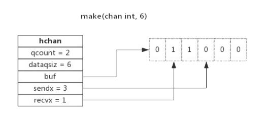
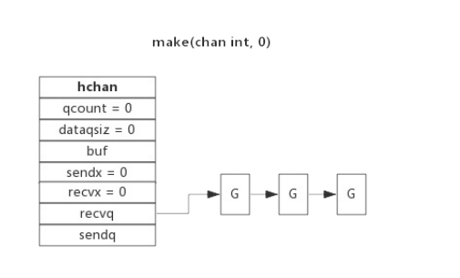
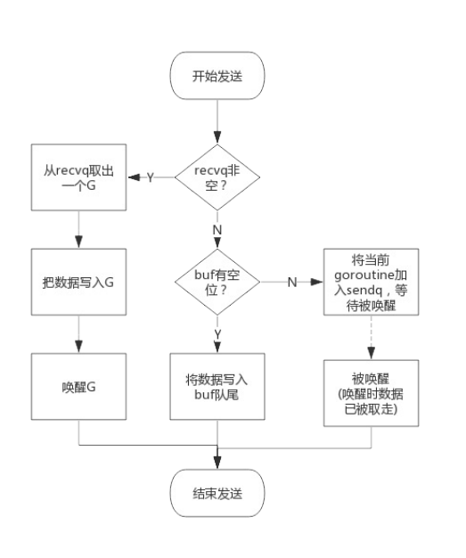
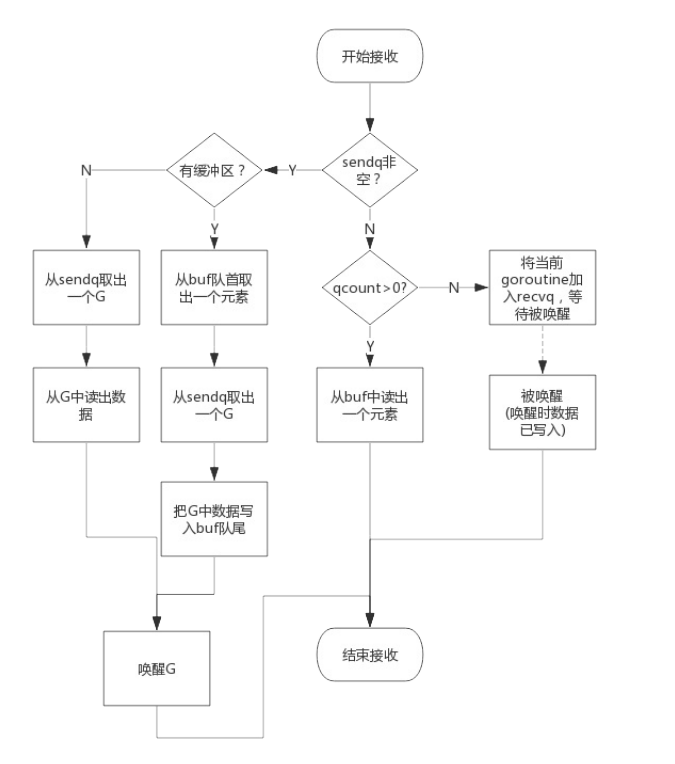

## channel 数据结构

channel 是golang 在语言层次提供的goroutine间的通信方式,比Unix管道更加的易用轻便,channel主要用于进程内各个goroutine间的通信,如果需要跨进程通信,建议使用分布式系统的方法来解决


go语言的源码`https://github.com/golang/go/blob/master/src/runtime/chan.go`中定义了channel的数据结构

```go
type hchan struct {
	qcount   uint           // 当前队列中剩余元素的个数
	dataqsiz uint           // 环形队列长度,即可以存放的元素的个数
	buf      unsafe.Pointer // 环形队列指针
	elemsize uint16			// 每个元素的大小
	closed   uint32			// 标识关闭状态
	elemtype *_type 		// 元素类型
	sendx    uint   		// 队列下标,指示元素写入时存放到队列中的位置
	recvx    uint   		// 队列下标,只是元素从队列的该位置读出
	recvq    waitq  		// 等待读消息的goroutine队列
	sendq    waitq  		// 等待写消息的goroutine队列

	// lock protects all fields in hchan, as well as several
	// fields in sudogs blocked on this channel.
	//
	// Do not change another G's status while holding this lock
	// (in particular, do not ready a G), as this can deadlock
	// with stack shrinking.
	lock mutex				// 互斥锁,chan不允许并发读写
}
```

从上面的数据结构中可以看出,channel由队列,信息类型,goroutine等队列组成


### 环形队列

chan 内部实现了一个环形队列作为其缓冲区,队列的长度就是创建 chan 时指定的

下图是一个可以缓存6个元素的channel示意图



- dataqsiz : 指示了队列的长度为6,即可以缓存6个元素
- buf: 指向队列的内存,队列中还剩余两个元素
- qcount : 表示队列中还有两个元素
- sendx : 指示后续写入的数据存储位置,取值[0,6)
- recvx: 指示从该位置读取数据,取值[0,6)


### 等待队列

从channel中读取数据,如果channel缓冲区为空或者没有缓冲区,当前goroutine会被阻塞,向channel写数据如果channel缓冲区已满或者没有缓冲区,当前goroutine会被阻塞

被阻塞的goroutine将会挂载channel的等待队列中

- 因为读阻塞的goroutine会被向channel写入数据的goroutine唤醒
- 因为写阻塞的goroutine会被从channel读取数据的goroutine唤醒

下面展示了一个没有缓冲区的channel,有几个goroutine阻塞等待读取数据



> 注意: 一般情况下,recvq和sendq至少有一个为空,只有一个例外,那就是同一个goroutine使用select语句向channel中一边写入数据,一边读取数据

### 信息类型

一个channel只能传递一种类型的值,类型信息存储在hchan数据结构中

- elemtype: 代表类型,用于数据传递过程中的赋值
- elemsize 代表类型大小,用于buf中定位元素位置

### 锁

一个channel同时只允许被一个channel读写


## 创建channel

创建channel的过程实际上就是初始化hchan结构体,其中类型信息和缓冲区长度由make语句传入,buf的大小则与元素大小和缓冲区长度共同决定

创建channel的伪代码如下所示:

```go
func makechan(t *chantype, size int) *hchan {
	var c *hchan 
	c = new(hchan)
	c.buf = malloc(元素类型大小*size)
	c.elemsize = 元素类型大小
	c.elemtype = 元素类型
 	c.dataqsiz = size 

	 return c 
 }
```

## 向channel中写入数据

向一个channel中写入数据简单的过程如下:

1. 如果等待接收队列recvq不为空,说明缓冲区没有数据或者没有缓冲区,此时直接从recvq中取出goroutine,并把数据写入,最后把该goroutine唤醒,结束发送过程
2. 如果缓冲区中有空余位置,将数据写入缓冲区,结束发送过程
3. 如果缓冲区中没有空余位置,将待发送的数据写入到goroutine,并将该goroutine加入的到sendq,进入睡眠,到等待读goroutine唤醒

简单的流程如下:



## 从channel中读取数据

从一个channel 中读取数据的简单过程如下

1. 如果等待发送队sendq不为空,且没有缓冲区,直接从sendq中取出G,把G中的数据读出,最后把G唤醒,结束读取过程
2. 如果等待发送队列sendq不为空,而且有缓冲区,此时说明缓冲区已满,从缓冲区的首部读取出数据,把G中的数据写入到缓冲区的尾部,把G唤醒,读取数据过程结束
3. 如果缓冲区中有数据,泽兴缓冲区中读取数据,结束读取过程
4. 将当前的G加入到recvq,进入睡眠,等待被被写入的G唤醒

从channel中读取数据的简单过程如下



## 关闭channel

关闭channel时,会把recvq中的G全部唤醒,本该写入数据的位置为nil,吧sendq中的G全部唤醒,但是这些G会panic异常

除此之外,panic出现的常见场景还有:

1. 关闭值为nil的channel
2. 关闭已经被关闭的channel
3. 向已经关闭的channel中写入数据

