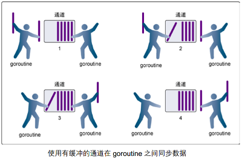
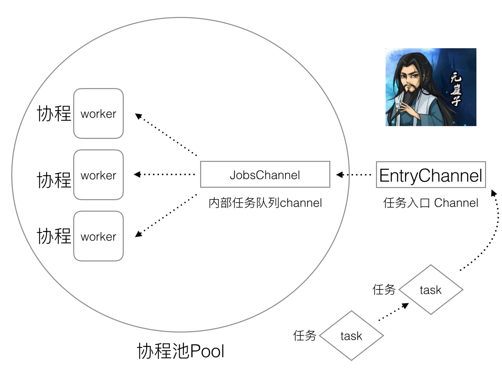

## 无缓冲channel

无缓冲channel,指的是接手数据前没有保存能力的channel

这种类型的channel要求发送数据的goroutine和接收数据的goroutine同时准备好才能完成数据的发送和接收操作,否则,通道会导致先执行发送或者读取数据的goroutine阻塞等待

这种通道进行发送和接收的交互行为本身就是同步的,其中任意一个操作永远无法独立于另一个操作单独存在

- 阻塞: 由于某种原因没有数据到达,当前协程处于等待的状态,直至满足条件,才能解除阻塞
- 同步: 在两个或者多个协程之间,能够保持数据的一致性的机制


1. 在第 1 步，两个 goroutine 都到达通道，但哪个都没有开始执行发送或者接收。
2. 在第 2 步，左侧的 goroutine 将它的手伸进了通道，这模拟了向通道发送数据的行为。这时，这个 goroutine 会在通道中被锁住，直到交换完成。
3. 在第 3 步，右侧的 goroutine 将它的手放入通道，这模拟了从通道里接收数据。这个 goroutine 一样也会在通道中被锁住，直到交换完成。
4. 在第 4 步和第 5 步，进行交换，并最终，在第 6 步，两个 goroutine 都将它们的手从通道里拿出来，这模拟了被锁住的 goroutine 得到释放。两个 goroutine 现在都可以去做别的事情了。

> channel 至少要被应用于两个go程及以上

### 无缓冲channel的创建

如果没有指定缓冲区的容量,那么该通道就是同步的,因此会阻塞到发送者准备好发送数据和接收者准备好接收数据

```go
package main

import "fmt"

func main() {
    ch := make(chan int,0) // 创建无缓冲channel
    fmt.Println("len:",len(ch),"cap:",cap(ch)) 
    // 因为创建的是无缓冲通道,那么 len() 和 cap() 统计的数量都为 0

    go func() {
        for i :=0 ; i<3 ; i++ {
            ch <- i
            fmt.Println("子go程正在运行：",i)
        }
    }()

    for i:=0 ; i<3 ; i++ {
        num := <- ch
        fmt.Println("主go程正在工作",num)
    }
}
```

## 有缓冲的channel

有缓冲的channel是一种再被接收前能存储一个或者多个数据值的通道

这种类型的channel并不强制的要求goroutine之间必须同时完成数据的发送和接收,通道会阻塞发送和接收的条件也不相同

只有通道中没有要接收的数据的时候,接收的动作才会被阻塞

只有通道总没有缓冲区可以容纳要发送的数据的时候,发送的动作才会被阻塞

这就导致了缓冲通道和无缓冲通道之间有一个很大的不同,无缓冲通道保证进行发送和接收的goroutine会在同一时间进行数据交换,有缓冲的通道则没有这种保证



1. 在第 1 步，右侧的 goroutine 正在从通道接收一个值。

   

2. 在第 2 步，右侧的这个 goroutine独立完成了接收值的动作，而左侧的 goroutine 正在发送一个新值到通道里。

3. 在第 3 步，左侧的goroutine 还在向通道发送新值，而右侧的 goroutine 正在从通道接收另外一个值。这个步骤里的两个操作既不是同步的，也不会互相阻塞。

4. 最后，在第 4 步，所有的发送和接收都完成，而通道里还有几个值，也有一些空间可以存更多的值

### 有缓冲通道的创建

如果给定了一个缓冲区的容量,那么通道就是异步的,只要缓冲区有尚未使用的空间用于发送数据或者还包含可以接收的数据,那么通道就会无阻塞的运行

```go
package main

import (
    "fmt"
    "time"
)

func main() {
    ch := make(chan int,3) // 创建无缓冲channel
    fmt.Println("len:",len(ch),"cap:",cap(ch))

    go func() {
        defer fmt.Println("子协程结束")
        for i :=0 ; i<5 ; i++ {

            fmt.Printf("子go程正在运行：%d,len:%d,cap:%d\n",i,len(ch),cap(ch))
            ch <- i
        }
    }()
    time.Sleep(2 * time.Second)
    for i:=0 ; i<5 ; i++ {
        num := <- ch
        fmt.Println("主go程正在工作",num)
    }
}
```

上面代码的输入如下

```go
len: 0 cap: 3
子go程正在运行：0,len:0,cap:3
子go程正在运行：1,len:1,cap:3
子go程正在运行：2,len:2,cap:3
子go程正在运行：3,len:3,cap:3
主go程正在工作 0
主go程正在工作 1
主go程正在工作 2
主go程正在工作 3
子go程正在运行：4,len:3,cap:3
子协程结束
主go程正在工作 4
```

> 理论上来说,当 channel 的容量为 3 的时候,那么当子 go 程向其中写入了 0 、1、2的时候应该就阻塞的进程,等待主 go 程读取数据后,channel中等待读取的数据小于3的时候,才能继续写入,那么为什么输出的时候,显示子go 程写入了 4 个数据呢?,或者是出现子 go 程还没写入主 go 程就读取到的情况呢?

实际上系统在工作的时候正如我们所想,就是子 go 程写入了三个数据后就阻塞了,等待主 go 程的读取,显示为写入 4 个数据的原因就是因为其中有 IO 延迟

当进程需要打印输出的时候,需要使用到硬件设备(显示器),因为IO 操作比较耗时,就是当主 go 程读取到了数据,下面要打印数据的时候,还没等打印呢,结果分配到的 CPU 时间到了,只能是交出当前的 CPU ,只能是当下次获得 CPU 以后才能继续处理,这就导致了我们的程序在输出上出现与预想中的差异

## 关闭channel

如果发送者知道没有跟多的数据需要发送到channel中的话,那么接收者也能及时的知道没有多余的数据可以接收,这样的话,将是有必要的,因为接收者可以停止不必要的接收等待,这就可以通过内置的close()函数来关闭channel实现

```go
package main

import (
    "fmt"
    "time"
)

func main() {
    ch := make(chan int,3) // 创建无缓冲channel
    fmt.Println("len:",len(ch),"cap:",cap(ch))

    go func() {
        defer fmt.Println("子协程结束")
        for i :=0 ; i<5 ; i++ {

            fmt.Printf("子go程正在运行：%d,len:%d,cap:%d\n",i,len(ch),cap(ch))
            ch <- i

        }
        close(ch)
    }()
    time.Sleep(2 * time.Second)
    for {
        if num, ok := <-ch; ok == true {
            fmt.Println("主go程正在工作", num)
        } else {
            break
        }
        fmt.Println("完成")
    }
}
```

使用channel 的时候需要注意一下几点

1. channel不想文件那样需要经常去关闭,如果当你确定确实是没有要发送的数据了,或者是想结束range循环之类的,才会去关闭channel
2. 关闭channel后,无法像channel中写入数据(引发panic异常后导致接收立即返回零值)
3. 关闭channel后,可以继续从channel中读取数据
4. 对于 nil channel ,无论是接收还是发送,都会被阻塞
5. ok的值为true表示成功的从channel中接收到了数据,为false表示channel已经被关闭,而且其中已经没有值可以接收了

## 单向 channel

默认情况下,通道 channel 是双向的,也就是说既可以向里面发送数据,也可以从里面读取数据

但是,我们希望将通道作为参数传递的时候,希望对方是单向使用的,要么只能发送数据,要么只能接收数据,这个时候我们可以指定通道的方向

#### 单向 channel 的定义

```go
var ch1 chan int		// 正常的双向 channel
var ch2 chan <- int	// ch2 是单向 channel,只能从中读取数据
var ch3 <- chan int // ch3也是单向 channel,只能向其中发送数据
```

#### 单向 channel 和双向 channel 的转换

双向 channel 可以隐式的转换为任意一种单向 channel,但是单向 channel 不能转换为双向 channel

```go
ch := make(chan int,3) // 定义默认的双向 channel
var sendch chan <- int = ch // 将双向 channel 转换为单向写 channel
var recvch <- chan int = ch // 将双向 channel 转换为单向读 channel
```

### 单向 channel 作为函数参数

channel 作为函数参数传递的时候,是引用传递

```go
package main

import "fmt"
// 单向写 channel
func counter(send chan <- int)  {
    defer close(send)
    for i :=0 ; i<5 ; i++ {
        send <- i
    }
}
// 单向读 channel
func printer(recv <- chan int)  {
    for num := range recv{
        fmt.Println(num)
    }
}

func main()  {
    ch := make(chan int)

    go counter(ch)
    printer(ch)
}
```


## 生产者消费者模型

单向 channel 的最典型应用就是生产者消费者模型


所谓的生产者消费者模型就是:某个模块(函数)复制生产数据,这些数据由另一个模块负责来处理(此处的模块是广义的,可以是类-函数-协程-线程-进程等),产生数据的模块,就形象的称为生产者,而处理数据的模块就称为消费者

单单抽象出生产者和消费者,还不够称为生产者消费者模型,该模式还需要由一个缓冲区处于生产者和消费者之间,作为一个中介,生产者把数据放入缓冲区,消费者从缓冲区读取数据


#### 缓冲区的作用

1. 解耦

假如生产者和消费者是两个类,如果让生产者直接调用消费者的某个方法,那么生产者就会对消费者产生依赖(也就是耦合),如果将来如果消费者的代码发生改变,可能会直接影响到生产者,如果两者都依赖于某个缓冲区,两者不直接依赖,耦合度也就降低了

2. 并发处理

生产者直接调用消费者的某个方法,还有另一个弊端,由于函数调用是同步的(或者叫阻塞的),在消费者的方法没有返回之前,生产者只能是一直处于等待的状态,万一消费者处理数据很慢,生产者只能是无端的浪费时间


使用了生产者消费者模式之后,生产者和消费者可以是两个完全独立的并发主体,生产者把制造出来的数据放到缓冲区中,就可以去生产下一个数据,基本上不依赖于消费者的处理速度

> 生产者消费者模型,最初就是用来处理并发问题的

3. 缓存

如果生产者制造数据的速度很慢,那么缓冲区的作用就提现出来了,当数据生产的快的时候,消费者来不及处理,未处理的数据就放在缓冲区中,等生产者生产数据的速度降下来了,消费者再去慢慢的处理

```go
package main

import "fmt"

// 生产者
func counter(send chan <- int)  {
    defer close(send)  // 生产者写完数据后,要将 channel 关闭,否则消费者一直会监测到生产者占用着写端,然后等待生产者写数据
    for i :=0 ; i<5 ; i++ {
        send <- i
    }
}

// 消费者
func printer(recv <- chan int)  {
    for num := range recv{
        fmt.Println(num)
    }
}

func main()  {
    ch := make(chan int,5)

    go counter(ch) // 子go程扮演生产者
    printer(ch) // 主go程扮演消费者
}
```

#### 订单模拟

在实际的开发中,生产者消费者模型应用的比较广泛,典型的就是电商网站的订单,当很多的用户点击下单的时候,订单产生的数据全部都放在缓冲区中,然后消费者将队列中的数据取出来发送给仓库管理等系统处理


通过生产者消费者模式,将订单系统与仓库系统隔离开,用户可以随时产生数据,如果订单系统直接调用仓库系统,那么用户点击下单之后,要等到仓库系统返回结果,这样的处理速递就会很慢

```go
package main

import "fmt"

type OrderInfo struct {
    id int // 创建订单结构体
}


// 生产者--生产订单
func counter(send chan <- OrderInfo)  {
    defer close(send)
    for i :=0 ; i<10 ; i++ {
        send <- OrderInfo{i+1} //
    }
}

// 消费者-- 消费订单
func printer(recv <- chan OrderInfo)  {
    for num := range recv{
        fmt.Println("订单ID为",num.id)
    }
}

func main()  {
    ch := make(chan OrderInfo,5)

    go counter(ch)
    printer(ch)
}
```

#### worker poll (goroutine 资源池)

在正常的工作中,我们在使用 goroutine 资源池的方式来指定 goroutine 的数量,防止因为 goroutine 过多而导致内存泄露或者暴涨

一般情况下,goroutine 在操作系统上只要硬件资源足够,它是可以无限的启动的,但是如果出现大规模的启动的情况就会造成大量占用系统资源,所以从理论上将工作池的目的就是为了先知 golang 的启动数量,保证不会出现硬件计算资源溢出的情况




资源池中一般有三个角色:

- EntryChannel: 对外接收任务的入口
- JobsChannel: 内部任务队列
- Worker_num: 内部 goroutine 资源的个数

程序一般从 EntryChannel 作为入口,将数据传递给 EntryChannel ,然后将EntryChannel中的数据读取出来存放 JobsChannel 中,创建 Worker_num 指定数量的 goroutine 循环消费 JobsChannel 队列中的数据

```go
package main

import (
	"fmt"
	"time"
)

/* 有关Task任务相关定义及操作 */
//定义任务Task类型,每一个任务Task都可以抽象成一个函数
type Task struct {
	f func() error //一个无参的函数类型
}

//通过NewTask来创建一个Task
func NewTask(f func() error) *Task {
	t := Task{
		f: f,
	}

	return &t
}

//执行Task任务的方法
func (t *Task) Execute() {
	t.f() //调用任务所绑定的函数
}

/* 有关协程池的定义及操作 */
//定义池类型
type Pool struct {
	//对外接收Task的入口
	EntryChannel chan *Task

	//协程池最大worker数量,限定Goroutine的个数
	worker_num int

	//协程池内部的任务就绪队列
	JobsChannel chan *Task
}

//创建一个协程池
func NewPool(cap int) *Pool {
	p := Pool{
		EntryChannel: make(chan *Task),
		worker_num:   cap,
		JobsChannel:  make(chan *Task),
	}

	return &p
}

//协程池创建一个worker并且开始工作
func (p *Pool) worker(work_ID int) {
	//worker不断的从JobsChannel内部任务队列中拿任务
	for task := range p.JobsChannel {
		//如果拿到任务,则执行task任务
		task.Execute()
		fmt.Println("worker ID ", work_ID, " 执行完毕任务")
	}
}

//让协程池Pool开始工作
func (p *Pool) Run() {
	//1,首先根据协程池的worker数量限定,开启固定数量的Worker,
	//  每一个Worker用一个Goroutine承载
	for i := 0; i < p.worker_num; i++ {
		go p.worker(i)
	}

	//2, 从EntryChannel协程池入口取外界传递过来的任务
	//   并且将任务送进JobsChannel中
	for task := range p.EntryChannel {
		p.JobsChannel <- task
	}

	//3, 执行完毕需要关闭JobsChannel
	close(p.JobsChannel)

	//4, 执行完毕需要关闭EntryChannel
	close(p.EntryChannel)
}

//主函数
func main() {
	//创建一个Task
	t := NewTask(func() error {
		fmt.Println(time.Now())
		return nil
	})

	//创建一个协程池,最大开启3个协程worker
	p := NewPool(3)

	//开一个协程 不断的向 Pool 输送打印一条时间的task任务
	go func() {
		for {
			p.EntryChannel <- t
		}
	}()

	//启动协程池p
	p.Run()

}
```

#### 练习 2:使用goroutine和channel实现一个计算int64随机数各位数和的程序。

- 开启一个goroutine循环生成int64类型的随机数，发送到jobChan
- 开启24个goroutine从jobChan中取出随机数计算各位数的和，将结果发送到resultChan
- 主goroutine从resultChan取出结果并打印到终端输出

```go
package main

import (
    "fmt"
    "math/rand"
    "strconv"
    "sync"
    "time"
)

var wg sync.WaitGroup
var once sync.Once
var lock sync.Mutex

func getRand(jobChan chan<- int64) {
    defer wg.Done()
    for i := 0; i < 24; i++ {
        // rand1 := rand.New(rand.NewSource(time.Now().UTC().UnixNano()))
        var randNum int64 = rand.Int63()
        fmt.Println(randNum)
        jobChan <- randNum
    }
    close(jobChan)
}

func putResult(jobChan <-chan int64, results chan<- int64) {
    defer wg.Done()
    for {
        i, ok := <-jobChan
        if !ok {
            break
        }
        int64Num := i
        lenNum := len(strconv.FormatInt(int64Num, 10))
        var sum int64 = 0
        for i := 1; i <= lenNum; i++ {
            last := int64Num % 10
            sum = sum + last
            int64Num = int64Num / 10
        }
        results <- sum
    }
    // once.Do(func() { close(results) })

}

func main() {
    start := time.Now()
    jobChan := make(chan int64, 100)
    results := make(chan int64, 100)

    wg.Add(1)
    go getRand(jobChan)

    for i := 1; i <= 24; i++ {
        wg.Add(1)
        go putResult(jobChan, results)
    }
    wg.Wait()
    close(results)
    for i := range results {
        fmt.Println(i)
    }
    end := time.Now()
    fmt.Println(end.Sub(start))
}
```

