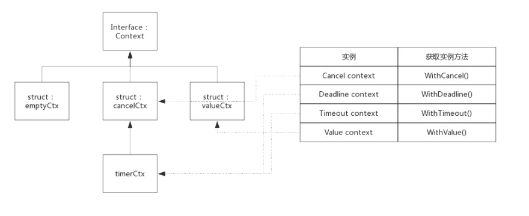

## 并发控制

Go 语言提供了三种解决方案:

- Channel : 使用 channel 控制子协程
- WaitGroup: 使用信号量机制控制子协程
- Context: 使用上下文控制子协程

三种方案各有优劣,比如 channel 优点是实现简单,清晰易懂,waitGroup 的优点是子协程个数动态可调整,context 优点是对子协程派生出来的协程的控制


## channel

channel 一般用于协程间的通信,channel 也可以用于并发控制,比如朱携程启动 N 个子协程,主协程等待所有的子协程退出以后再继续后续的流程,这种场景下channel 也可以轻易的实现

下面的代码就是使用 channel 控制子协程的例子:

```go
package main
import (
	"fmt"
  "time"
)

func Process(ch chan int) {
  time.Sleep(time.Second * 2)
  ch <- 1 // 向管道找那个写入一个元素表示当前协程结束
}

func main() {
  channel := make([]chan int ,10) //创建一个 10 个元素的切片,元素类型为 channel
  
  for i:=0;i<10;i++ {
    channel[i] = make(chan int) // 切片中放入一个 channel
    go Process(channel[i]) // 启动协程,传一个管道用于通信
  }
  for i ,ch := range channel { // 遍历切片,等待子协程结束
    <- ch
    fmt.Println("Routine",i,"quit")
  }
}
```

上面的程序中,通过创建 N 个 channel 来管理 N 个协程,每个协程都有一个 channel 用于与父协程通信,父协程创建完所有协程等待所有的协程结束

### 总结

使用 channel 来控制子协程的优点是实现简单,缺点是当需要大量创建协程的时候就需要由相同数量的 channel,而且对于子协程继续派生出来的协程不方便控制


## WaitGroup

WaitGroup 是 Golang 引用开发过程中常用的并发控制技术

WaitGroup,可以理解为 Wait-Goroutine-Group,即等待一组 goroutine 结束,比如某个 goroutine需要等待其他的 goroutine 全部完成,那么使用 WaitGroup 可以轻松的实现

下面的程序展示了一个 goroutine 等待另外两个 goroutine 结束:

```go
package main

import (
	"fmt"
  "sync"
  "time"
)

func main() {
  var wg sync.WaitGroup
  wg.Add(2) 
  go func() {
    time.Sleep(time.Second * 10)
    fmt.Println("goroutine 1 finished!")
    wg.Done()
  }()
  go func() {
    time.Sleep(time.Second * 2)
    fmt.Println("goroutine 2 finished!")
    wg.Done()
  }()
  wg.Wait()
  fmt.Println("all goroutine finished!!!")
}
```

简单的来说,就是 wg 内部维护了一个计数器:

1. 启动 goroutine 前将计数器通过 Add() 将计数器设置为待启动的 goroutine 的个数
2. 启动 goroutine 后,使用 Wait()方法阻塞自己执行,等待计数器个数变为 0
3. 每个 goroutine 结束后,使用 Done()方法将计数器减 1
4. 计数器变为 0 之后,阻塞的 goroutine 被唤醒

其实 WaitGroup 也可以实现一组 goroutine 等待另一组 goroutine

#### 信号量

信号量是 unix 系统提供的一种保护共享资源的机制,用于防止多个线程同时访问某个资源

可以简单的理解为信号量就是一个数值:

- 当信号量 > 0 时,表示资源可用,获取信号量是系统将信号量自动的减 1
- 当信号量 == 0 时,表示资源暂时不可用,获取信号量时,当前线程会进入休眠,当有了信号量的时候被唤醒

WaitGroup 实现中就是使用了信号量

### WaitGroup 的数据结构

源码包`src/sync/waitgroup.go:WaitGroup`中定义了数据结构

```go
type WaitGroup struct {
	noCopy noCopy
	state1 [3]uint32
}
```

State1 是个长度为 3 的数组,其中包含了state 和一个信号量,而 state 实际上是连个计数器

- counter: 当前还未执行结束的 goroutine 计数器
- waiter count: 等待 goroutine-group 结束的 goroutine 数量,也就是有多少个等待者
- semaphore: 信号量

考虑到字节是否对齐,三者出现的位置不同,为了简单起见,依照字节已经对齐的情况下,三者在内存中的位置如下:


WaitGroup 对外提供三个接口:

- `func (wg *WaitGroup) Add(delta int)`: 将 delta 值加到 counter 中
- `func (wg *WaitGroup) Done()`: counter 递减 1,按照 waiter 数值释放响应次数信号量,实际上是给 Add() 方法传递 -1 的值
- `func (wg *WaitGroup) Wait()`: waiter 递增 1,并阻塞等待信号量 semaphore

#### Add(delta int)

Add() 方法做了两件事:

1. 把 delta 值累计到 counter 中,因为 delta 可以为负值,也就是说 counter 有可能变为 0 或者负值
2. 当 counter 变为 0 的时候,根据 waiter 数值释放等量的信号量,把等到的 goroutine 全部唤醒,如果 counter 变为负数,则 panic

```go
func (wg *WaitGroup) Add(delta int) {
	statep, semap := wg.state() // 获取 state 和 semaphore 的地址指针
	if race.Enabled {
		_ = *statep // trigger nil deref early
		if delta < 0 {
			// Synchronize decrements with Wait.
			race.ReleaseMerge(unsafe.Pointer(wg))
		}
		race.Disable()
		defer race.Enable()
	}
  // 把delta 左移 32 位累加到 state,也就是累加到 counter
	state := atomic.AddUint64(statep, uint64(delta)<<32)
	v := int32(state >> 32) // 获取counter 的值
	w := uint32(state)			// 获取waiter 的值
	if race.Enabled && delta > 0 && v == 	int32(delta) {
		// The first increment must be synchronized with Wait.
		// Need to model this as a read, because there can be
		// several concurrent wg.counter transitions from 0.
		race.Read(unsafe.Pointer(semap))
	}
	if v < 0 { // 如果 counter 变为 0,这 panic
		panic("sync: negative WaitGroup counter")
	}
	if w != 0 && delta > 0 && v == int32(delta) {
		panic("sync: WaitGroup misuse: Add called concurrently with Wait")
	}
  // 经过累加后,此时 counder >= 0
  // 如果 counter 为正,说明不需要释放信号量,直接退出
  // 如果 waiter 为 0,说明没有等待者,也不需要释放信号量,直接退出
	if v > 0 || w == 0 {
		return
	}
	// This goroutine has set counter to 0 when waiters > 0.
	// Now there can't be concurrent mutations of state:
	// - Adds must not happen concurrently with Wait,
	// - Wait does not increment waiters if it sees counter == 0.
	// Still do a cheap sanity check to detect WaitGroup misuse.
	if *statep != state {
		panic("sync: WaitGroup misuse: Add called concurrently with Wait")
	}
	// Reset waiters count to 0.
  // 此时counter 一定为 0,而 waiter 一定大于 0(内部维护 waiter,不会出现小于 0 的情况)
  // 先把counter 置为 0,在释放 waiter 个数的信号量
	*statep = 0
	for ; w != 0; w-- {
		runtime_Semrelease(semap, false, 0)
	}
}
```

#### Wait()

Wait() 方法也做了两件事:

1. 累加 waiter
2. 阻塞等待信号量

```go
func (wg *WaitGroup) Wait() {
	statep, semap := wg.state() // 获取 state 和 semaphore 的地址指针
	if race.Enabled {
		_ = *statep // trigger nil deref early
		race.Disable()
	}
	for {
		state := atomic.LoadUint64(statep)	// 获取state 的值
		v := int32(state >> 32)	// 获取counter 的值
		w := uint32(state)			// 获取 waiter的值
    // 如果 counter 的值为 0,说明所有的 goroutine 都退出了,不需要等待,直接返回
		if v == 0 {
			// Counter is 0, no need to wait.
			if race.Enabled {
				race.Enable()
				race.Acquire(unsafe.Pointer(wg))
			}
			return
		}
		// Increment waiters count.
    // 使用 CAS(比较交换算法)累加 Waiter,累加可能会失败,失败后通过 for loop 下一次重试
		if atomic.CompareAndSwapUint64(statep, state, state+1) {
			if race.Enabled && w == 0 {
				// Wait must be synchronized with the first Add.
				// Need to model this is as a write to race with the read in Add.
				// As a consequence, can do the write only for the first waiter,
				// otherwise concurrent Waits will race with each other.
				race.Write(unsafe.Pointer(semap))
			}
			runtime_Semacquire(semap)// 累加成功后,等待信号量唤醒自己
			if *statep != 0 {
				panic("sync: WaitGroup is reused before previous Wait has returned")
			}
			if race.Enabled {
				race.Enable()
				race.Acquire(unsafe.Pointer(wg))
			}
			return
		}
	}
}
```

> 这里用到了CAS算法保证有多个goroutine同时执行Wait()时也能正确累加waiter。

#### Done()

```go
func (wg *WaitGroup) Done() {
	wg.Add(-1)
}
```


## context

golang Context 是golang 应用开发经常用到的并发控制技术,他与 WaitGroup 最大的不同点是 context 对于派生 gotoutine 有更强的控制力,它可以控制多级的 goroutine

context 翻译成中文就是`上下文`,即它可以控制一组呈现树状结构的goroutine,每个goroutine拥有相同的上下文

典型使用场景如下:


上图中由于goroutine派生出子goroutine,而子goroutine又派生新的goroutine,这种情况下使用WaitGroup就不太容易了,因为子goroutine个数不容易确定,而使用context就可以很容易实现

### 空Context

context 包中定义了一个空的context,名为emptyCtx,用于context的根节点,空的context只是简单的实现了Context,本身不包含任何值,仅用于其他的Context的父节点

emptyCtx类型定义的代码如下:

```go
type emptyCtx int

func (*emptyCtx) Deadline() (deadline time.Time, ok bool) {
	return
}

func (*emptyCtx) Done() <-chan struct{} {
	return nil
}

func (*emptyCtx) Err() error {
	return nil
}

func (*emptyCtx) Value(key interface{}) interface{} {
	return nil
}
```

context 包中定义了公共的emptyCtx全局变量,名为background,可以使用context.BackGround()获取它,实现代码如下所示:

```go
var background = new(emptyCtx)
func Background() Context {
	return background
}
```

congtext包提供了4个方法创建不同类型的context,使用这四个方法时如果没有父context,都需要传入background,即background作为其父节点:

- WithCancel()
- WithDeadline()
- WithTimeout
- WithValue()

context 包中实现Context接口的struct,除了emptyCtx之外,还有cancelCtx,timeCtx和valueCtx三种,正是基于这三种context实例,实现了上述四种类型的context

context包中各个context类型之间的关系



struct cancelCtx,valueCtx,valueCtx都继承于Context,下面分别介绍这三种struct

#### cancelCtx

源码包`src/context/context.go:concelCtx`中定义了该类型context

```go
type cancelCtx struct {
	Context

	mu       sync.Mutex            
	done     chan struct{}         
	children map[canceler]struct{} 
	err      error                
}
```

children 中记录了由此context派生的所有child,此context被cancel是会把其中所有的child都cancel掉

cancelCtx与deadline和value无关,所以只需要实现Done()和Err()接口即可

##### Done() 接口的实现

按照context定义,Done() 接口只需要返回一个channel即可,对于cancelCtx来说,只需要返回成员变量done即可

```go
func (c *cancelCtx) Done() <-chan struct{} {
	c.mu.Lock()
	if c.done == nil {
		c.done = make(chan struct{})
	}
	d := c.done
	c.mu.Unlock()
	return d
}
```

由于cancelCtx没有指定初始化函数,所以cancelCtx.donw可能还未分配,所以需要考虑初始化

cancelCtx.Done 会在Context被cancel时关闭,所以cancelCtx.Done的值一般经历三个阶段: nil->chan struct{} -> closed chan

##### Err() 接口实现

按照context定义,Err() 只需要返回一个error告知context被关闭的原因,对于cancelCtx来说,只需要返回成员变量err即可

```go
func (c *cancelCtx) Err() error {
	c.mu.Lock()
	err := c.err
	c.mu.Unlock()
	return err
}
```

cancelCtx.Err 默认值是nil,在context被cancel时指定一个error变量:`var Canceled = errors.New("context canceled")`

##### cancel() 接口实现

cancel() 内部方法是理解cancelCtx的最关键的方法,其作用是关闭自己和其后代其后代存储在cancelCrx.children的map中,其中key值即后代对象,value值并没有意义,这里使用map只是为了方便查询而已

```go
func (c *cancelCtx) cancel(removeFromParent bool, err error) {
	if err == nil {
		panic("context: internal error: missing cancel error")
	}
	c.mu.Lock()
	if c.err != nil {
		c.mu.Unlock()
		return // already canceled
	}
	c.err = err		// 设置一个error,说明关闭的原因
	if c.done == nil {
		c.done = closedchan
	} else {
		close(c.done)		// 将channel关闭,以此通知派生cancel方法
	}
	for child := range c.children {
		// NOTE: acquiring the child's lock while holding parent's lock.
		child.cancel(false, err)
	}
	c.children = nil
	c.mu.Unlock()

	if removeFromParent {// 正常情况下,需要间自己从parent删除
		removeChild(c.Context, c)
	}
}
```

实际上,WithCancel() 返回的第二个用于cancel context的方法正是cancel()

#### timeCtx

源码包`src/context/context.go:timeCtx`定义了该类型Context

```go
type timerCtx struct {
	cancelCtx
	timer *time.Timer // Under cancelCtx.mu.

	deadline time.Time
}
```

timeerCtx 在cancelCtx基础上增加了的啊店里呢用于标记自动cancel的最终时间,而timer就是一个自动触发cancel的定时器

由此,衍生出WitchDeadline() 和WithTimeout(),实现上这两种类型实现原理一样,只不过使用语境不一样:

- deadline : 指定最后期限,比如context将在2021.10.20 00:00:00之时自动结束
- timeout : 指定最长存活时间,比如context将在30s后结束

#### valueCtx() 接口实现

由valueCtx数据结构定义可见,valueCtx.key和valueCtx.val分别代表其中的key和value的值

```go
type valueCtx struct {
	Context
	key, val interface{}
}
```

即当前context查找不到key时,就会向父节点查找,如果查询不到则最终干回interface{},也就是说,可以通过子context查询到父的value值

