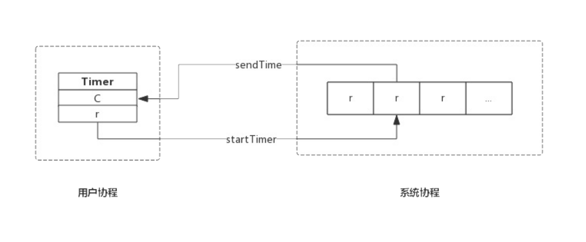
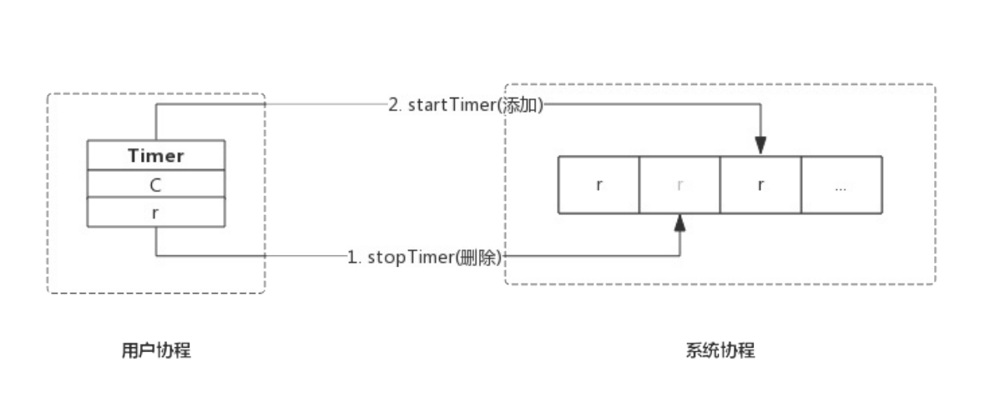
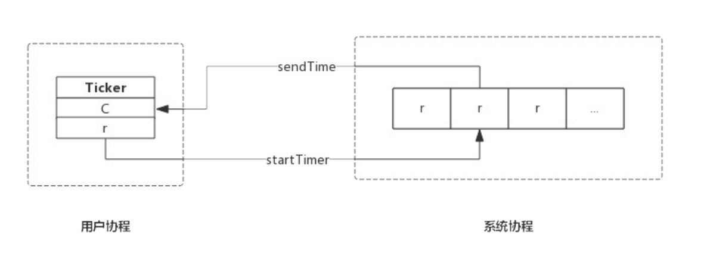

## Timer

源码包`src/time/sleep.go:Timer`定义了 Timer 的数据结构

```go
type Timer struct {
	C <-chan Time
	r runtimeTimer
}
```

Timer 只有两个成员:

- C : 管道,上层应用根据这个管道接收事件
- r: runtimrTimer 定时器,该定时器就是系统管理的定时器,对上层应用不可见

这里应该按照层次来理解 Timer 的结构,Timer.C 即面向 Timer 用户的,Timer.r 是面向底层的定时器实现


### runtimeTimer

创建一个 Timer 实质上是把一个定时任务交给专门的协程进行监控,这个任务的载体便是`runtimeTimer`,简单的来讲,每创建一个 Timer 意味着创建一个 runtimeTimer 变量,然年把它交给系统进行监控,我们通过设置 runtimeTimer 过期后的行为来达到定时的目的

源码包`src/time/sleep.go:runtimeTimer`定义了数据结构

```go
type runtimeTimer struct {
	pp       uintptr	// 系统底层存储 runtimeTimer 的数组地址
	when     int64		// 定时器触发事件的时间
	period   int64		// 当前定时器周期触发间隔
	f        func(interface{}, uintptr) // 定时器触发时执行的回调函数,接收两个参数
	arg      interface{}	// 触发器执行回调函数的参数之一
	seq      uintptr	//触发器执行回调函数的参数之一
	nextwhen int64
	status   uint32
}
```

### 实现原理

一个进程中的多个 Timer 都由底层的一个协程来管理,为了描述方便我们把这个协程称为系统协程


系统协程是把 runtimeTimer 存放在数组中,并按照`when`字段对所有的 runtimeTimer 进行排序,定时器触发时执行 runtimeTimer 中预定函数`f`,即完成了一次定时任务


### 创建 Timer 的过程

```go
func NewTimer(d Duration) *Timer {
	c := make(chan Time, 1) // 创建一个管道
	t := &Timer{  // 构造 Timer 数据结构
		C: c,
		r: runtimeTimer{
			when: when(d),	// 触发时间
			f:    sendTime,	// 触发后执行函数 sendTime
			arg:  c,				// 触发后执行函数 sendTime 时附带的参数
		},
	}
	startTimer(&t.r) // 此处启动定时器,只是把 runtimeTimer 方法系统协程的堆中,由系统协程维护
	return t
}
```

 NewTimer() 只是构造了一个 Timer,然后把 Timer.r 通过 startTimer() 交给系统协程维护

其中 when()方法是计算下一次定时器触发的绝对时间: 当前时间+NewTimer() 的参数 d

其中 SendTime() 方法便是定时器触发时的动作

```go
func sendTime(c interface{}, seq uintptr) {

	select {
	case c.(chan Time) <- Now():
	default:
	}
}

```

sendTime 接收一个管道作为参数,其主要任务是想管道中写入当前时间,创建Timer 时生成的管道含有一个缓冲区(make(chan Time,1)),所以 Timer 触发时向管道中写入时间永远不会阻塞,sendTime 写完即退出

之所以 sendTime() 使用 select 并拼搭一个空的 default 分支,是因为后面的 Ticker 也复用 sendTime(),Ticker 触发时也会向管道中写入时间,但是无法保证之前的数据已经被取走了,所以使用 select 并搭配一个空的 default 分支,确保 sendTime() 不会阻塞,Ticker 触发的时候,如果管道中还有值,则本次不再向管道中写入书剑,本次触发的事件直接丢弃

`startTimer(&t.r) ` 的具体实现是在 runtime包中,其主要作用是把 runtimeTimer 写入到系统执协程的数组中,并启动系统协程(如果系统协程还未开始运行的话)


综上所述,创建的过程如下:



### 重置 Timer

重置 Timer 时会先将 timer 从系统协程中删除,修改新的时间后添加到系统协程中

```go
func (t *Timer) Reset(d Duration) bool {
	if t.r.f == nil {
		panic("time: Reset called on uninitialized Timer")
	}
	w := when(d)
	return resetTimer(&t.r, w)
}
```

其返回值与 Stop() 保持一致,即如果 Timer 成功停止,返回 true,如果 Timer已经触发,则返回 false



## Ticker 的简单接口

部分场景下,我们启动一个定时器并且永远不会停止,比如定时轮询任务,此时可以使用一个简单的 Tick 函数来获取定时器的管道

```go
func Tick(d Duration) <-chan Time
```

这个函数内部实际还是创建一个Ticker,但是并不会返回出来,所以没有的手段来停止该 Ticker


### 创建 ticker

```go
func NewTicker(d Duration) *Ticker {
	if d <= 0 {
		panic(errors.New("non-positive interval for NewTicker"))
	}
	// Give the channel a 1-element time buffer.
	// If the client falls behind while reading, we drop ticks
	// on the floor until the client catches up.
	c := make(chan Time, 1)
	t := &Ticker{
		C: c,
		r: runtimeTimer{
			when:   when(d),
			period: int64(d), // ticker和 timer 的重要区别就是提供了period参数,据此决定 timer 是一次性的还是周期性的
			f:      sendTime,
			arg:    c,
		},
	}
	startTimer(&t.r)
	return t
}
```

NewTicker() 只是构造了一个 Ticker,然后把 Ticker.r 通过 startTimer() 交给系统协程维护

启动 period 为时间触发的周期

其中 sendTime() 方法便是定时器触发时的动作

```go
func sendTime(c interface{}, seq uintptr) {
	// Non-blocking send of time on c.
	// Used in NewTimer, it cannot block anyway (buffer).
	// Used in NewTicker, dropping sends on the floor is
	// the desired behavior when the reader gets behind,
	// because the sends are periodic.
	select {
	case c.(chan Time) <- Now():
	default:
	}
}
```

sendTime 接收管道作为参数,其主要任务就是向管道中写入当前的时间

创建 ticker 的时候生成的管道含有一个缓冲区,但是 Ticker 触发的事件时周期性的,如果管道中的数据没有被取走,sendTime( ) 也不会阻塞,而是直接退出,带来的后果就是丢失本次事件



