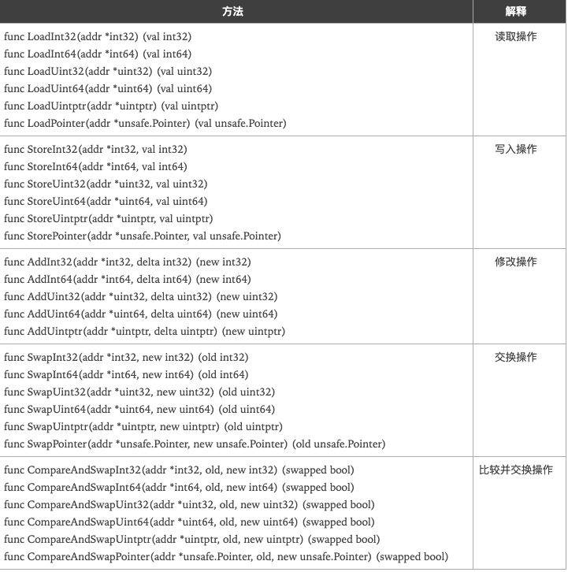

## atomic 包

代码中的加锁操作,因为涉及内核态的上下文切换,代价比较高,针对基本数据类型,我们可以使用原子操作来保证并发的安全,因为原子操作是 Go 语言提供的方法,在用户态就可以完成,因此性能比加锁操作要更好, go 语言中原子操作是由`sync/atomic`包提供的

### atomic 包中的方法



### 示例代码

当我们既不使用锁也不使用原子操作的时候

```go
package main

import (
	"fmt"
    "sync"
)

var wg sync.WaitGroup

var x int64

func add() {
    x++
    wg.Done()
}

func main() {
    wg.Add(10000)
    for i :=0;i<10000;i++ {
        go add()
    }
    wg.Wait()
    fmt.Println(x)
}
```

执行上面的代码,丛执行的结果上看,我们预期的执行及结果应该是`x=10000`,但是因为在执行的时候会存在多个goroutine同时读取x的情况,那么执行的结果会是`x<10000`

为了避免上面的情况,我们可以使用互斥锁来实现

```go
package main

import (
	"fmt"
    "sync"
)

var wg sync.WaitGroup

var l sync.Mutex

var x int64

func add() {
    l.Lock()
    x++
    l.Unlock()
    wg.Done()
}

func main() {
    wg.Add(10000)
    for i :=0;i<10000;i++ {
        go add()
    }
    wg.Wait()
    fmt.Println(x)
}
```

因为使用了互斥锁,那么就不会出现之前的问题,但是现在的问题就是程序的执行效率比较低

使用原子操作来实现上面的方式

```go
package main

import (
	"fmt"
    "sync"
)

var wg sync.WaitGroup

var x int64

func add() {
    atomic.AddInt64(&x,1)
    wg.Done()
}

func main() {
    wg.Add(10000)
    for i :=0;i<10000;i++ {
        go add()
    }
    wg.Wait()
    fmt.Println(x)
}
```

`atomic`包提供了底层的原子级内存操作,对于同步算法的实现很有用,这些函数必须谨慎的保证正确性,除了某些特殊的底层应用,使用通道或者sync包的函数/类型,实现同步更好