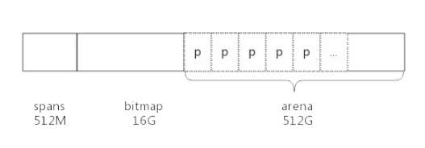

## 前言

在 C 语言中,需要通过 malloc() 方法动态的申请内存,其中内存分配器使用的是 glibc 提供的 ptmalloc2,除了 glibc,业界比较出名的内存分配器有 google 的 tcmalloc 和 facebook 的jemalloc,二者在避免内存碎片和性能上均比 glibc 有比较大的优势,在多线程环境中效果更佳


golang 中也实现了内存分配器,原理与 tcmalloc 类似,简单来说就是维护一块很大的全局内存,每个线程(goroutine中为P)维护一块小的私有内存,私有内存不足再从全局申请


和tcmalloc相同,go的内存分配也是基于两种粒度的内存单位,span和object,span是连续的page,按照page的数量进行归档,比如分为2个page的span和4个page的span等,object是span中按照预设大小划分的块,也是按照大小分类,同一个span中,只有一种类型(大小)的object


另外,内存分配与GC(垃圾回收)关系密切,所以了解GC之前必须要了解内存分配原理


## 基础概念

为了方便自主管理内存,做法便是先向系统申请一块内存,然后将内存切割成小块,通过一定的内存分配算法管理内存,以64为系统为例,Golang 程序启动时便会向系统申请的内存如下所示



预申请的内存分文三部分,spans,bitmap和arena三部分,其中arena就是所谓的堆区内存,应用中需要的内存都从这里分配出去,其中spans和bitmap是为了管理arena区而存在的

#### arena

arena的大小为`512GB`,为了方便管理把 arena区域划分为一个个的page,每个page为`8KB`,这些page组合起来称为 mspan,总共有 **512GB/8KB = 67108864 个page**


#### spans

spans 区域用于表示 arean 区域中的某一页(page)属于哪个 span

spans 区域存放 mspan (也就是一些arena分割的页组合起来的内存管理基本单元),每个指针对应一页,每个指针的大小是8byte(8B),所以 spans 区域的大小就是 **(512GB/8KB)*8B = 512MB**

spans 区域的一个指针对应 arena 区域中的一个 page,对应关系是从头开始的


#### bitmap

bitmap 区域标识 arena 区域哪些地址保存了对象,并且使用4bit(4b)标志位标识对象是否包含指针和GC等信息,bitmap中一个byte(B)大小的内存对应 arena 区域中4个指针大小(32B),所以bitmap区域的大小是 512GB/(4*8B)=16G


bitmap 区域中一个 byte 对应 arena 区域的 4 个指针大小的内存,每一个指针的大小的内存都会有两个 bit 分别表示是否应该继续扫描和是否包含指针


bitmap 中的 byte 和 arena 的对应关系从末尾开始,也就是随着内存分配会向两边扩展


#### 先了解内存管理大致的策略

- 申请一块较大的地址空间(虚拟内存),用于内存分配及管理(golang：spans+bitmap+arena->512M+16G+512G)
- 当空间不足的时候,向系统申请一块较大的内存,如100KB或者1MB
- 申请到的内存块按照特定的size,被分割成多种小块内存(golang：_NumSizeClasses = 67),并使用链表管理起来
- 创建对象的时候,按照对象的大小,从空闲链表中查找最适合的内存块
- 销毁对象的时候,将对应的内存块返回链表中得以复用
- 空闲内存达到阀值的时候,返回操作系统


### span

span 是用于管理 arena 页的关键数据结构,每个span 中包含1个或多个连续的page,为了满足小对象分配,span 中的一页会划分为更小的粒度,而对于大对象比如超过page页大小,则通过多页实现

### class

根据对象大小,划分了一系列class,每个class都代表一个固定大小的对象,以及每个span的大小

```go
// sizeclass
// class  bytes/obj  bytes/span  objects  waste bytes
//     1          8        8192     1024            0
//     2         16        8192      512            0
//     3         32        8192      256            0
//     4         48        8192      170           32
//     5         64        8192      128            0
//     6         80        8192      102           32
//     7         96        8192       85           32
//     8        112        8192       73           16
//     9        128        8192       64            0
//    10        144        8192       56          128
//    11        160        8192       51           32
//    12        176        8192       46           96
//    13        192        8192       42          128
//    14        208        8192       39           80
//    15        224        8192       36          128
//    16        240        8192       34           32
//    17        256        8192       32            0
//    18        288        8192       28          128
//    19        320        8192       25          192
//    20        352        8192       23           96
//    21        384        8192       21          128
//    22        416        8192       19          288
//    23        448        8192       18          128
//    24        480        8192       17           32
//    25        512        8192       16            0
//    26        576        8192       14          128
//    27        640        8192       12          512
//    28        704        8192       11          448
//    29        768        8192       10          512
//    30        896        8192        9          128
//    31       1024        8192        8            0
//    32       1152        8192        7          128
//    33       1280        8192        6          512
//    34       1408       16384       11          896
//    35       1536        8192        5          512
//    36       1792       16384        9          256
//    37       2048        8192        4            0
//    38       2304       16384        7          256
//    39       2688        8192        3          128
//    40       3072       24576        8            0
//    41       3200       16384        5          384
//    42       3456       24576        7          384
//    43       4096        8192        2            0
//    44       4864       24576        5          256
//    45       5376       16384        3          256
//    46       6144       24576        4            0
//    47       6528       32768        5          128
//    48       6784       40960        6          256
//    49       6912       49152        7          768
//    50       8192        8192        1            0
//    51       9472       57344        6          512
//    52       9728       49152        5          512
//    53      10240       40960        4            0
//    54      10880       32768        3          128
//    55      12288       24576        2            0
//    56      13568       40960        3          256
//    57      14336       57344        4            0
//    58      16384       16384        1            0
//    59      18432       73728        4            0
//    60      19072       57344        3          128
//    61      20480       40960        2            0
//    62      21760       65536        3          256
//    63      24576       24576        1            0
//    64      27264       81920        3          128
//    65      28672       57344        2            0
//    66      32768       32768        1            0
```

上表中每列的含义如下:

- class: class ID,每个span结构中都有一个class id,表示span可处理的对象类型
- bytes/obj : 该class代表对象的字节数
- bytes/span : 每个span 占用的堆内存的字节数,也即是page个数*page的大小
- objects: 每个span可分配的对象个数,等于(每个span占用的堆内存字节数)/(class代表的对象的字节数)
- waste bytes: 每个span产生的内存碎片,等于(每个span占用的堆内存字节数)%(class代表的对象的字节数)

### span 数据结构

span 是内存管理的基本单元,每个 span 用于管理特定的 class 对象,跟对象大小,span 将一个或多个页拆分成多个块进行管理

`src/runtime/mheap.go:mspan`定义了其数据结构

```go
type mspan struct {
	next *mspan     // 链表后向指针,用于将 span 链接起来
	prev *mspan     // 链表前后指针,用于将 span 链接起来
	...
	startAddr uintptr // 起始地址,也就是所管理页的地址
	npages    uintptr // 管理的页数
	...
	nelems uintptr // 块个数,也就是有多少个块可供分配
	...
	allocBits  *gcBits // 分配位图,每一位代表一个块是否已分配
	...
	allocCount  uint16	// 已分配的块个数
	spanclass   spanClass  // class 表中的 class id
	...
	elemsize    uintptr       // class 表中的对象大小,也就是块大小
  ...
}
```

以 class 10 为例,span 和管理的内存如下图所示


spanclass 的值 为 10,参照 class 包可以得出 npage=1,nelems=56,elemsize=144,其中 startAddr 是在 span 初始化的时候就指定了某个页的地址,allocBits 指向一个位图,每个代表一个块是否被分配,本来中已经有两个块被分配,那么 allocCount = 2

> next 和 prev 用于将多个 span 链接起来,这有利于管理多个 span

### cache

有了管理内存的基本单位 span,还要有个数据结构来管理 span,这个数据结构就叫做 mcentral ,个线程需要内存时从 mcentral 管理的 span 中申请,为了避免多线程申请内存时不断的加锁,golang 为每个线程分配了 span 的缓存,这个缓存就是 cache

`src/runtime/mcache.go:mcache `定义了cache的数据结构：

```go
type mcache struct {
	next_sample uintptr 
	local_scan  uintptr 
	tiny             uintptr
	tinyoffset       uintptr
	local_tinyallocs uintptr 
	alloc [numSpanClasses]*mspan // 按 class 分组的 mspan 列表
	stackcache [_NumStackOrders]stackfreelist
	local_largefree  uintptr                 
	local_nlargefree uintptr                  
	local_nsmallfree [_NumSizeClasses]uintptr 
	flushGen uint32
}
```

alloc 为 mspan 的指针数组,数组的大小为 class 总数的两倍,数组中的每个元素代表了一种 class 类型的 span 列表,每种 class 类型都有两组 span 列表,第一组列表中所表示的对象包含了指针,第二组列表中所表示的对象不包含指针,这么做是为了提高 GC 扫描的性能,对于不包含指针的 span 列表,没有必要去扫描

根据对象是否包含指针,将对象分为 noscan 和 scan 两种,其中 noscan 代表没有指针,scan 代表包含指针,需要 GC 扫描

mcache 和 span 的对应关系如下:

mcache 在初始化的时候是没有任何 span 的,在使用过程中会动态的从 central 中获取并缓存下来,根据使用情况,每种 class 的 span 个数也不相同,上图所示,class 0 的 span 要比 class 1 的 span 多,说明本线程分配的小对象比较多一些

### central

cache 作为线程的私有资源为单个线程提供服务,而 central 则是全局的资源,为多个线程服务,当某个线程的内存不足的时候,会向 central 申请,当某个线程释放内存的时候又回收进central

`src/runtime/mcentral.go:mcentral`中定义了 central 的数据结构

```go
type mcentral struct {
	lock      mutex				// 互斥锁
	spanclass spanClass		// span class id
	nonempty mSpanList // none-empty 指还有空闲块的 span 列表
	empty    mSpanList // 指没有空闲块的 span 列表 
	partial [2]spanSet // list of spans with a free object
	full    [2]spanSet // list of spans with no free 
	nmalloc uint64			// 已经累计分配的对象个数
}
```

- lock : 线程间的互斥锁,防止多线程读写冲突
- spanclass : 每个 mcentral 管理着一组有相同 class 的 span 列表
- nonempty: 指内存中可用的 span 列表
- empty:指没有内存可用的 span 列表
- nmalloc: 值累计分配的对象个数

线程从 central 获取 span 的步骤如下:

1. 加锁
2. 从 nonempty 列表中获取一个可用的 span,并将其从链表中删除
3. 将取出的 span 放入 empty 链表
4. 将 span 返回给线程
5. 解锁
6. 线程将该 span 缓存进 cache

线程将 span 归还的步骤:

1. 加锁
2. 将 span 从 empty 链表中移除
3. 将 span 加入到 nonempty 链表中
4. 解锁

上述线程从 central 中获取 span 和归还 span 只是简单的流程


### heap

从 mcentral 数据结构可见,每个 mcentral 对象只管理特定的 class 规格的 span,事实上,每种 class 都会对应一个 mcentral,这个 mcentral 的集合存放在 mheap 数据结构中

`src/runtime/mheap.go:mheap`

```go
type mheap struct {
  lock 		mutex		// 互斥锁
  spans 	[]*mspan
  bitmap 	uintptr		// 指向 bitmap 首地址,bitmap 是从高地址向低地址增长的
  arena_start	uintptr	// 指向 arena 区域的首地址
  arena_used	uintptr	// 指向 arena 区域已经使用的地址位置
  central [numSpanClasses]struct {
		mcentral mcentral
		pad      [cpu.CacheLinePadSize - unsafe.Sizeof(mcentral{})%cpu.CacheLinePadSize]byte
	}
}
```

- lock : 互斥锁
- spans : 执行 spans 区域,用于映射 span 和 page 的关系
- bitmap: bitmap的起始地址
- arena_start : arena 区域首地址
- arena_used: 当前 arena 区域已经使用的最大地址
- central : 每种 class 对应的两个 mcentral

从数据结构可见,mheap 管理着全部的内存,事实上 golang 就是通过一个 mheap 类型的全局变量进行内存管理的


mheap 内存管理示意图如下:


系统预分配的内存为 spans,bitmap 和 arena 三个区域,通过 mheap 管理起来

## 内存分配过程

针对待分配的对象的大小不通,有不同的分配逻辑,go将内存申请按大小分为三种类型：tiny，small，large

- (0,16B) : 且不包含指针的对象,Tiny 分配
- (0,16B): 包含指针对象,正常分配
- [16B,32KB] : 正常分配, samll 分配
- (32KB,-) : large 分配

#### 以申请 size 为 N 的内存为例

1. 获取当前线程的私有缓存 mcache
2. 根据 size 计算出适合大小的 class id
3. 从 mcache 的 alloc[class]链表中查询可用的 span
4. 如果 mcache 没有可用的 span,则从 mcentral 申请新的 span 加入到mcache
5. 如果 mcentral 中也没有可用的 span,则从 mheap 中申请一个新的 span 加入到 mcentral
6. 从该 span 中获取到空闲对象的地址并返回

## 总结

1. golang 程序启动的时候,申请一块大的内存,划分为 spans,bitmap 和 arena 三部分
2. arena 区域按照 page 划分为一个个小块
3. span 管理一个或者多个 page
4. mcentral 管理多个 span 供线程使用
5. mcache 作为线程私有资源,资源来源于 mcentral