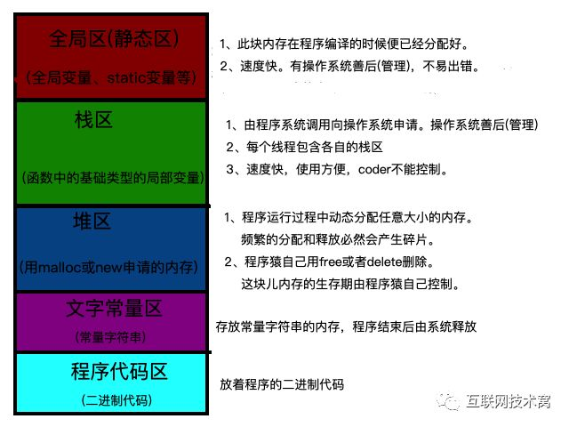
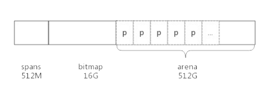

## 一般程序的内存分配




## 前言

在 C 语言中,需要通过 malloc() 方法动态的申请内存,其中内存分配器使用的是 glibc 提供的 ptmalloc2,除了 glibc,业界比较出名的内存分配器有 google 的 tcmalloc 和 facebook 的jemalloc,二者在避免内存碎片和性能上均比 glibc 有比较大的优势,在多线程环境中效果更佳


golang 中也实现了内存分配器,原理与 tcmalloc 类似,简单来说就是维护一块很大的全局内存,每个线程(goroutine中为P)维护一块小的私有内存,私有内存不足再从全局申请


和tcmalloc相同,go的内存分配也是基于两种粒度的内存单位,span和object,span是连续的page,按照page的数量进行归档,比如分为2个page的span和4个page的span等,object是span中按照预设大小划分的块,也是按照大小分类,同一个span中,只有一种类型(大小)的object


另外,内存分配与GC(垃圾回收)关系密切,所以了解GC之前必须要了解内存分配原理


## 基础概念

为了方便自主管理内存,做法便是先向系统申请一块内存,然后将内存切割成小块,通过一定的内存分配算法管理内存,以64为系统为例,Golang 程序启动时便会向系统申请的内存如下所示



预申请的内存分文三部分,spans,bitmap和arena三部分,其中arena就是所谓的堆区内存,应用中需要的内存都从这里分配出去,其中spans和bitmap是为了管理arena区而存在的

arena的大小为`512GB`,为了方便管理把 arena区域划分为一个个的page,每个page为`8KB`,这些page组合起来称为 mspan,总共有 **512GB/8KB = 67108864 个page**

spans 区域存放 mspan (也就是一些arena分割的页组合起来的内存管理基本单元),每个指针对应一页,每个指针的大小是8byte(8B),所以 spans 区域的大小就是 **(512GB/8KB)*8B = 512MB**

bitmap 区域标识 arena 区域哪些地址保存了对象,并且使用4bit(4b)标志位标识对象是否包含指针和GC等信息,bitmap中一个byte(B)大小的内存对应 arena 区域中4个指针大小(32B),所以bitmap区域的大小是 512GB/(4*8B)=16G


#### 先了解内存管理大致的策略

- 申请一块较大的地址空间(虚拟内存),用于内存分配及管理(golang：spans+bitmap+arena->512M+16G+512G)
- 当空间不足的时候,向系统申请一块较大的内存,如100KB或者1MB
- 申请到的内存块按照特定的size,被分割成多种小块内存(golang：_NumSizeClasses = 67),并使用链表管理起来
- 创建对象的时候,按照对象的大小,从空闲链表中查找最适合的内存块
- 销毁对象的时候,将对应的内存块返回链表中得以复用
- 空闲内存达到阀值的时候,返回操作系统


### span

span 是用于管理 arena 页的关键数据结构,每个span 中包含1个或多个连续的page,为了满足小对象分配,span 中的一页会划分为更小的粒度,而对于大对象比如超过page页大小,则通过多页实现

### class

根据对象大小,划分了一系列class,每个class都代表一个固定大小的对象,以及每个span的大小

```go
// sizeclass
// class  bytes/obj  bytes/span  objects  waste bytes
//     1          8        8192     1024            0
//     2         16        8192      512            0
//     3         32        8192      256            0
//     4         48        8192      170           32
//     5         64        8192      128            0
//     6         80        8192      102           32
//     7         96        8192       85           32
//     8        112        8192       73           16
//     9        128        8192       64            0
//    10        144        8192       56          128
//    11        160        8192       51           32
//    12        176        8192       46           96
//    13        192        8192       42          128
//    14        208        8192       39           80
//    15        224        8192       36          128
//    16        240        8192       34           32
//    17        256        8192       32            0
//    18        288        8192       28          128
//    19        320        8192       25          192
//    20        352        8192       23           96
//    21        384        8192       21          128
//    22        416        8192       19          288
//    23        448        8192       18          128
//    24        480        8192       17           32
//    25        512        8192       16            0
//    26        576        8192       14          128
//    27        640        8192       12          512
//    28        704        8192       11          448
//    29        768        8192       10          512
//    30        896        8192        9          128
//    31       1024        8192        8            0
//    32       1152        8192        7          128
//    33       1280        8192        6          512
//    34       1408       16384       11          896
//    35       1536        8192        5          512
//    36       1792       16384        9          256
//    37       2048        8192        4            0
//    38       2304       16384        7          256
//    39       2688        8192        3          128
//    40       3072       24576        8            0
//    41       3200       16384        5          384
//    42       3456       24576        7          384
//    43       4096        8192        2            0
//    44       4864       24576        5          256
//    45       5376       16384        3          256
//    46       6144       24576        4            0
//    47       6528       32768        5          128
//    48       6784       40960        6          256
//    49       6912       49152        7          768
//    50       8192        8192        1            0
//    51       9472       57344        6          512
//    52       9728       49152        5          512
//    53      10240       40960        4            0
//    54      10880       32768        3          128
//    55      12288       24576        2            0
//    56      13568       40960        3          256
//    57      14336       57344        4            0
//    58      16384       16384        1            0
//    59      18432       73728        4            0
//    60      19072       57344        3          128
//    61      20480       40960        2            0
//    62      21760       65536        3          256
//    63      24576       24576        1            0
//    64      27264       81920        3          128
//    65      28672       57344        2            0
//    66      32768       32768        1            0
```

上表中每列的含义如下:

- class: class ID,每个span结构中都有一个class id,表示span可处理的对象类型
- bytes/obj : 该class代表对象的字节数
- bytes/span : 每个span 占用的堆内存的字节数,也即是page个数*page的大小
- objects: 每个span可分配的对象个数,等于(每个span占用的堆内存字节数)/(class代表的对象的字节数)
- waste bytes: 每个span产生的内存碎片,等于(每个span占用的堆内存字节数)%(class代表的对象的字节数)