## 垃圾回收算法

所谓的垃圾就是不再被需要的内存块,这些垃圾如果不清理,就没有办法再次被分配使用,在不支持垃圾回收的编程语言中,这些垃圾就会导致内存泄露

常见的垃圾回收算法有一下几种:

- 引用计数: 对每个对象维护一个引用计数,当引用该对象的对象被销毁的时候,引用计数-1,当引用计数为 0 的时候,回收对象
  - 优点: 对象可以被很好的回收,不会出现内存耗尽或者达到某个阀值才回收的情况
  - 缺点: 不能很好的处理循环引用,而且实时维护引用计数也是有一定的代价的
  - 代表语言: python,PHP,swift
- 标记-清除 : 从根变量开始变量所有的引用对象,引用的对象标记为"被引用",没有被标记的进行回收
  - 优点 : 解决了引用计数的缺点
  - 缺点 : 需要 STW(stop to world),即需要暂停程序的运行
  - 代表语言: golang(采用三色标记法)
- 分代回收 : 主要依赖于弱分代假说`大部分的对象都会在年轻的时候死亡`,我们将新创建的对象称为新生代对象,将经历的 N 次的 GC 仍然存活的对象称为老年代对象,基于弱分代假说,大部分的对象都会在经历的最初几次的 GC 中死亡,也就是说新生代对象成为垃圾的概率高于老年代对象,所以可以将数据划分为新生代和老年代,降低老年代执行垃圾回收的频率,无需每次都处理全部的数据,将明显的提升垃圾回收的效率,而且新生代和老年代的数据还可以执行不同的垃圾回收策略,进一步减少垃圾回收的开销
  - 优点 : 回收性能好
  - 缺点 : 算法复杂
  - 代表语言: JAVA

> 分代回收和标记清理回收都是追踪式回收

上面的操作中,回收完毕的内存都容易造成内存的碎片化的问题,解决这一问题有一下几种方式:

- 标记-整理压缩算法: 与标记清扫算法相同,但是会在标记完毕后,移动非垃圾数据,使他们紧凑的存放在内存中
  - 优点: 避免了内存的碎片化
  - 缺点: 多次扫描与移动开销很大

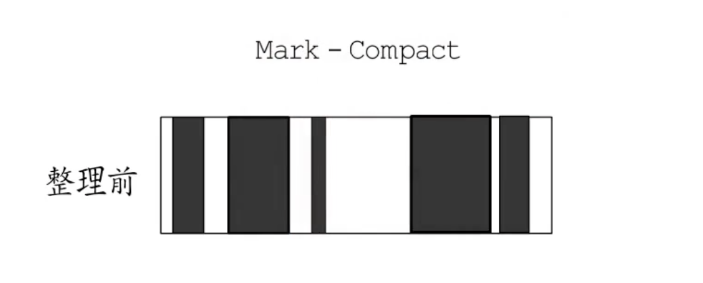

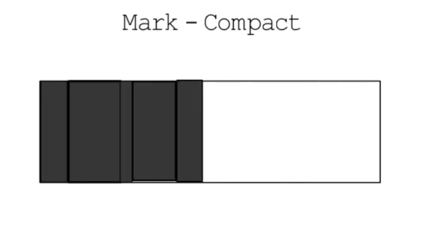

- 复制式回收算法: 将内存分为 From 空间和 To 空间,垃圾回收执行的时候,使用 from 空间,把能追踪的数据复制到 to 空间,等全部的数据都追踪完毕后,将 from 空间与 to 空间的角色互换
  - 优点: 解决了内存碎片化的问题
  - 缺点 : 只有一半的堆内存可用 

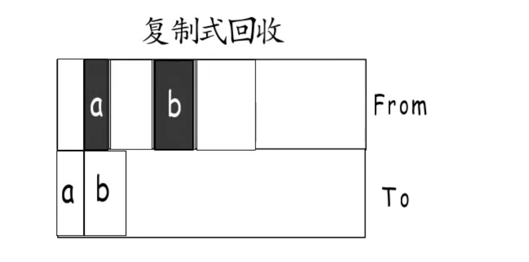

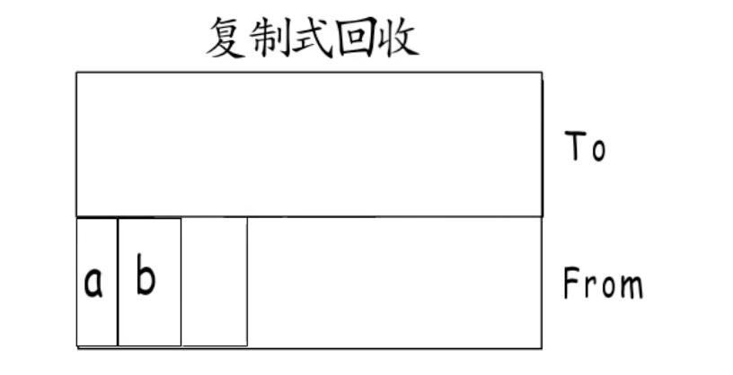

为了提高堆内存的使用率,只会在一部分的堆内存中使用复制式回收,例如分代回收就常常与复制式回收搭配使用


> 上面介绍的两种都是移动式垃圾回收器

## Golang 的垃圾回收

简单的来说,垃圾回收的核心就是标记处哪些内存还在使用(即被引用到),哪些内存不再使用了,把不再使用的内存回收掉,以供后续内存分配使用


下图展示了一段内存,内存中既有已经被分配的内存,也有未被分配的内存,垃圾回收的目标就是把那些已经分配但是不再使用的内存找出来并回收:

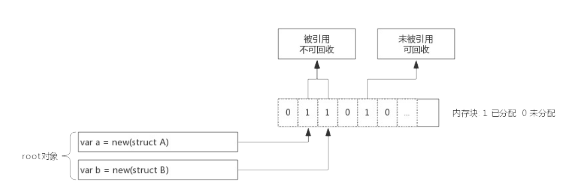

上图中,内存块 1, 2,4 号位上的内存块已经被分配,变量 a,b 为指针,指向内存中的 1,2 号位,内存块的 4 号位未被引用,就需要被回收掉


垃圾会输开始时从 root 对象开始扫描,把 root 对象引用的内存标记为`被引用`,考虑到内存块中存放的有可能是指针,所以还需要递归的进行标记,全部标记完毕后,只保留被标记的内存,未被标记的全部都标记为未分配,完成回收


### 内存标记(Mark)

前面说过了 span 数据结构,span 中维护了一个个的内存块,并由一个位图 allocBits 表示每个内存块的分布情况,在 span 数据结构中还有另一个位图`gcmarkBits`用于标记内存块被引用的情况

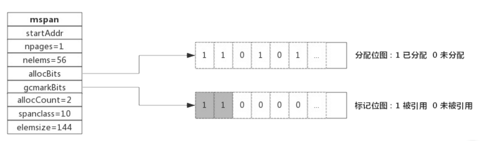

如上图所示,allocBits 记录了每块内存的分配情况,而 gcmarkBits 记录了每块内存的标记情况,标记阶段对每块内存进行标记,有对象引用的内存被标记为1(灰色),没有引用的保持默认为 0


allocBits 和 gcmarkBits 的数据结构完全一致,标记结束就是内存回收,回收时将 allocBits 指向 gcmarkBits , 这代表标记过的才是存活的,gcmarkBits 则会在下次标记的时候重新分破内存

#### 三色标记法

前面介绍了对象标记状态的存储方式,还需要一个标记队列来存放待标记的对象,可以简单的想象成把对象从标记队里中取出,将对象的引用状态标记在 span 的 gcmarkBits 中,把对象引用的其他对象再放入队列中


三色只是为了叙述上面方便抽象出来的一种说法,实际上并没有颜色之分,这里的三色,对应了垃圾回收过程中对象的三种状态

- 灰色 : 对象还在标记队列中等待
- 黑色 : 对象已经被标记,gcmarkBits 对应位为 1(该对象不会在本次的 GC 中被清理)
- 白色 :  对象未被标记,gcmarkBits 对应位为 0(该对象将会在本次 GC 中被清理)

例如: 当前内存中有 A~F 一共 6 个对象,根对象 a,b 本身为栈上分配的局部变量,根对象a,b 分别引用了对象 A,B,而 B 对象又引用了对象 D,则 GC 开始前对各个对象的状态如下图所示:

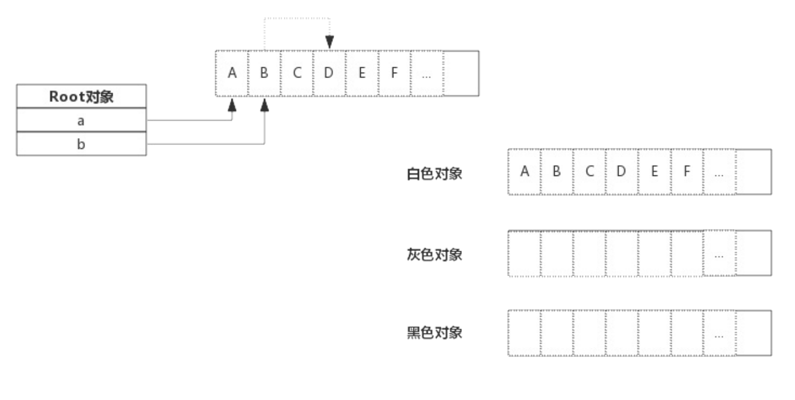

初始状态下都是白色的对象

接着开始扫描跟对象 a b

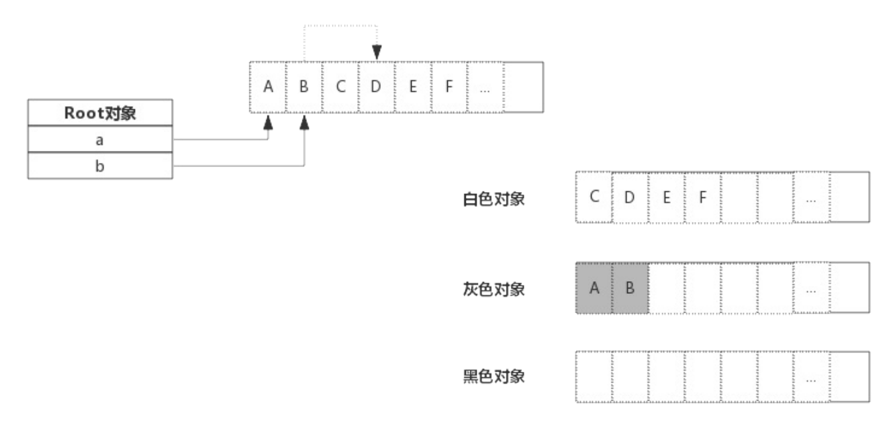

由于跟对象引用了对象 A B,那么对象 A B 变为灰色对象,接下来就开始分析灰色的对象,分析 A 的时候,A 没有引用其他的对象,那么标记为黑色,B 引入了 D,那么将 B 标记为黑色的同时将 D 标记为灰色

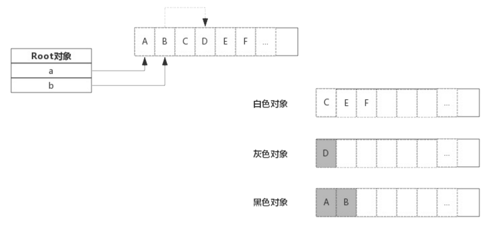

接下来对 D 进行分析,由于 D 没有引用其他的对象,D 被标记为黑色,标记过程结束

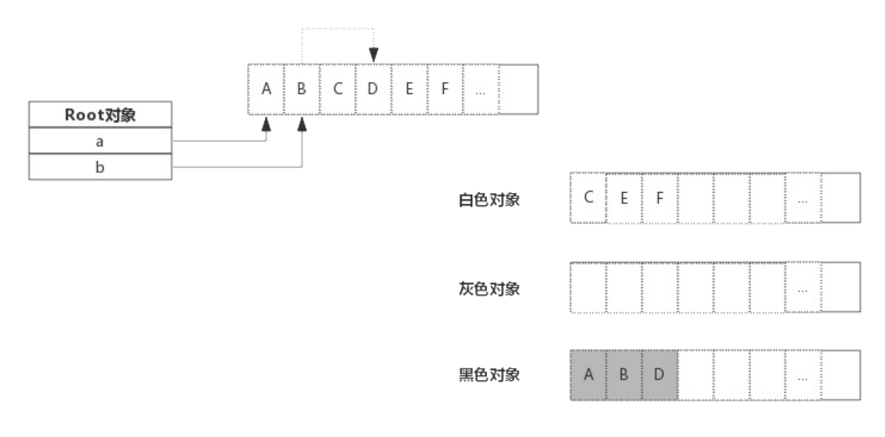

最终的结果就是黑色的对象会被保存下来,白色的对象被回收


### STW(Stop To World)

对于垃圾回收来说,回收的过程就是需要控制住内存的变化,否则回收过程中指针传递就会引起内存引用关系变化,如果错误的回收了还在使用的内存,将是灾难的

golang 中的 STW 就是停止所有的 goroutine,专心做垃圾回收,等待垃圾回收结束后才回复 goroutine

STW 时间的长短直接影响了应用程序的执行,时间过长会导致等待的时间是用户不可接受的,这也是广受诟病的原因之一

为了缩短 STW 的时间,golang 不断的优化处理算法

#### 增量式垃圾回收

我们总是希望缩短 STW 的时间,可以将垃圾回收工作分文多次完成,也就是用户程序和垃圾回收交替完成,这就是增量式垃圾回收

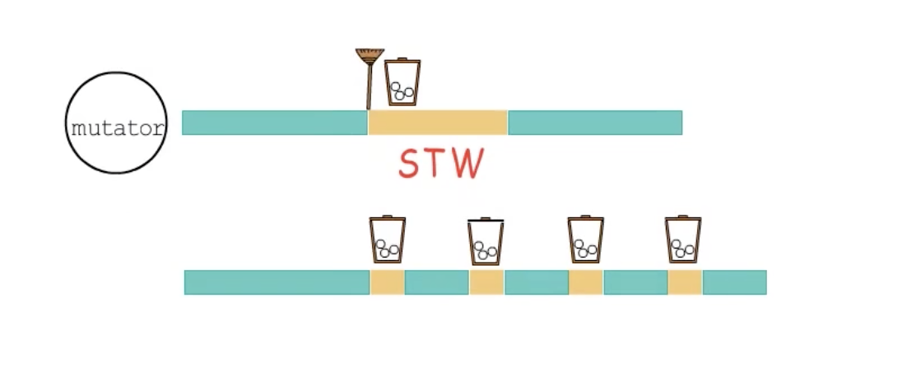

增量式垃圾回收,可以缩短每次暂停的时间,但是也带来的额外的问题,就是一旦垃圾回收刚把一个变量标记为了一个黑色对象,但是用户程序接下来就修改了它,要是放任不管,可能就不会当做垃圾处理掉

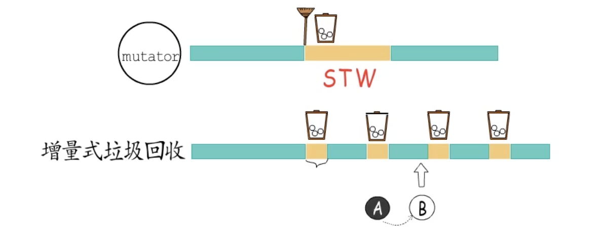


继续回到三色标记的问题: 黑色对象是处理完毕的对象,灰色是待处理的对象,如果发生黑色对象到白色对象的引用,而且又没有灰色对象到白色对象的应用的话,那么这个白色会向很有可能会被当做垃圾处理掉,但是实际上应该是存活的数据

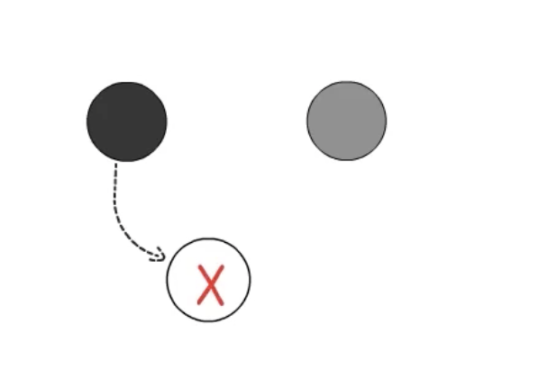

- 强三色不变式: 就是强制不能出现黑色对象到白色对象的引用
- 弱三色不变式: 可以出现黑色对象到白色对象的引用,但是要保证通过灰色对象也可以到达该白色对象

实现强/弱三色不变式的做法通常是建立读/写屏障

#### 写屏障

写屏障会在操作中插入指令,目的是把对数据对象的修改通知到垃圾回收器,所以写屏障通常都要有一个记录集

- 插入写屏障: 强三色不变式无论如何也不能出现黑色对象到白色对象的引用,我们可以将白色的对象变为灰色,或者将黑色的对象变为灰色,这些都称为`插入`写屏障
- 删除写屏障: 弱三色不变式 关注的是灰色对象到白色对象的破坏行为,例如要删除灰色对象到白色的对象的引用时,要把白色的对象标记为灰色

STW 的目的就是为了防止 GC 扫描内存时内存变化为停掉 goroutine,而写屏障就是让 goroutine 与 GC 同时运行的手段,虽然不能完全消除 STW,但是能缩短 STW 的时间

写屏障类似一种开关,在 GC 的特定时机开启,开启后指针传递时会把指针标记,即本轮不回收,下次 GC 的时候再确定

#### 读屏障

非移动式垃圾回收器,天然的不需要读屏障,但是在移动式垃圾回收器中,如果 GC 和用户程序交替执行,读数据也将不是安全的,例如回收器已经将对象 A 移动到了 to 空间中,但是交替执行的用户程序读取的还是 From 空间中的陈旧数据,当回收器对 From 空间整体回收的时候,就会出现问题,这种情况就需要建立读屏障,确保用户程序不会读取到已经建立了新的副本的陈旧对象


### 多核

- 并行垃圾回收

上面的分析都是基于在单核的处理下,但是实际场景中,避免不了的就是多核的问题


交由多核 GC 程序同时执行,那么就要出现多个 GC 进程间的同步的问题,尤其是在复制式垃圾回收中,就要避免同一个数据对象被多个 GC 程序重复移动的问题,而 GC 程序之间的同步又会造成一定的开销

- 并发垃圾回收

在并发垃圾回收中,肯定会出现的就死用户程序和 GC 程序同时执行的问题,那么就会出现用户程序和 GC 程序同时使用写屏障记录器,所以还要考虑用户程序之间与 GC 程序之间的竞争问题STW 的时间,那么 GC 很难及时的通知到所有的线程,可能就会导致某个线程开启写屏障延迟而引发错误


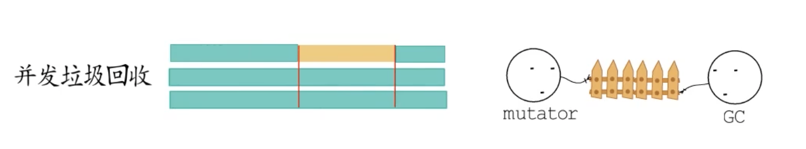

- 主体并发式

在某一时间执行 STW,其余时间执行并行垃圾回收


- 主体并发增量式回收

在主体并发式垃圾回收之前支持增量式回收


### 辅助 GC

为了防止内存分配过快,在执行 GC 过程中,如果 goroutine 需要分配内存,那么这个 goroutine 会参与一部分的 GC 工作,即帮助 GC 做一部分的工作,这个机制叫做 Mustator Assist


## 垃圾回收机制的触发

1. 内存分配量达到阀值触发 GC 

每次内存分配都会检查当前内存分配量是否达到了阀值,如果达到了立即启动 GC

> 阀值= 上次 GC 内存分配量 * 内存增长率

内存增长率是由环境变量`GOGC`控制,默认为 100,即每次内存扩大一倍的时候启动 GC

2. 定期触发 GC

默认情况下,最长 2 分钟触发一次 GC,这个间隔在`src/runtime/proc.go:forcegcperiod`变量中被声明

```go
var forcegcperiod int64 = 2 * 60 * 1e9
```

3. 手动触发

在代码中可以使用`runtime.GC()`来手动触发 GC,这主要用于 GC 性能测试和统计