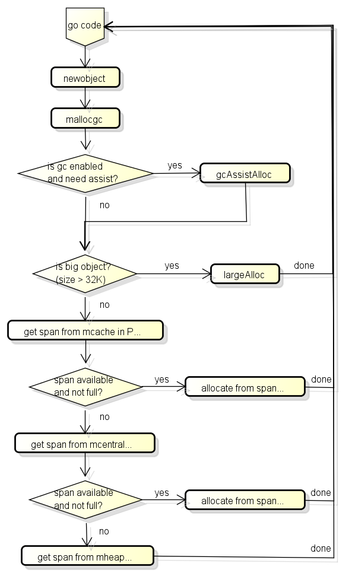
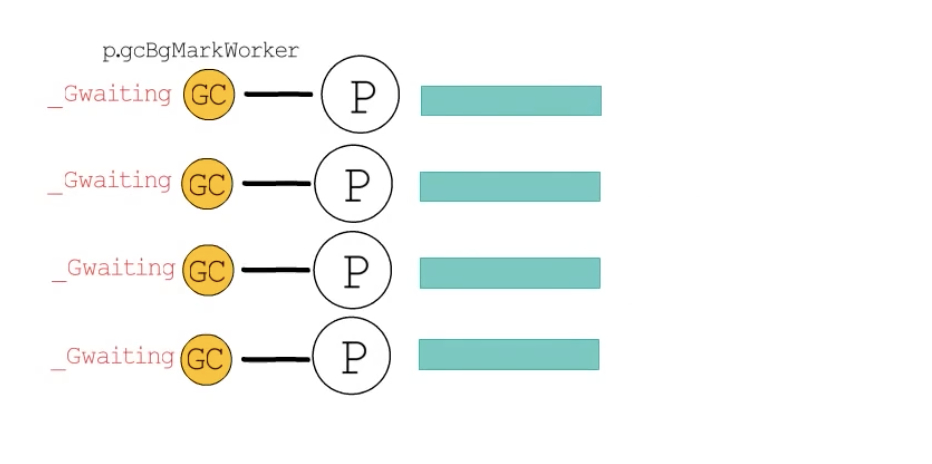
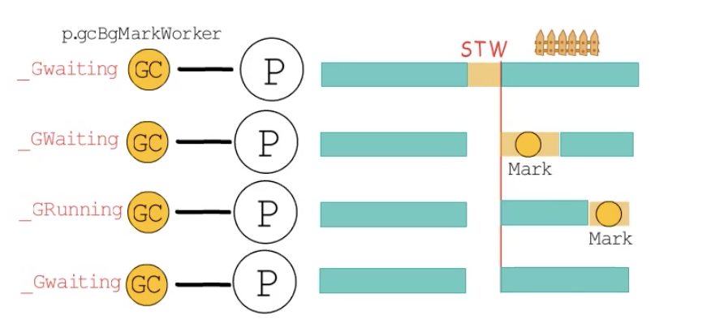
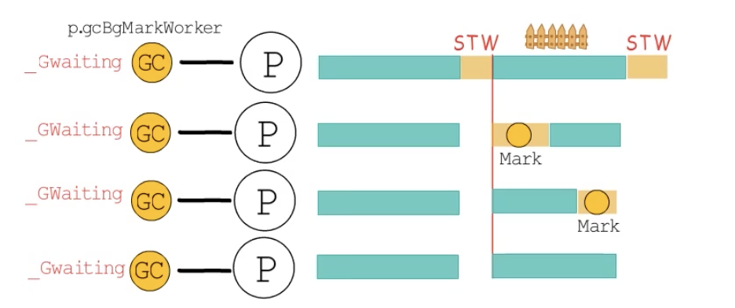
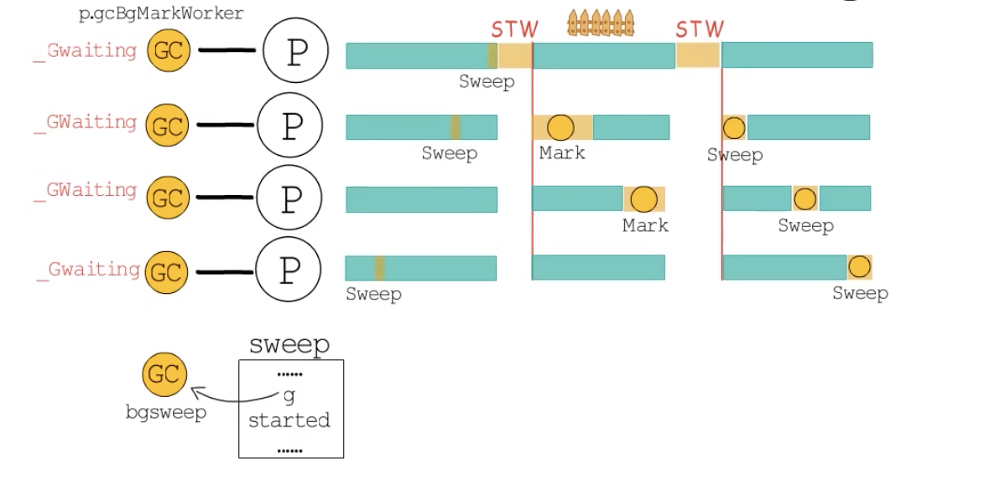
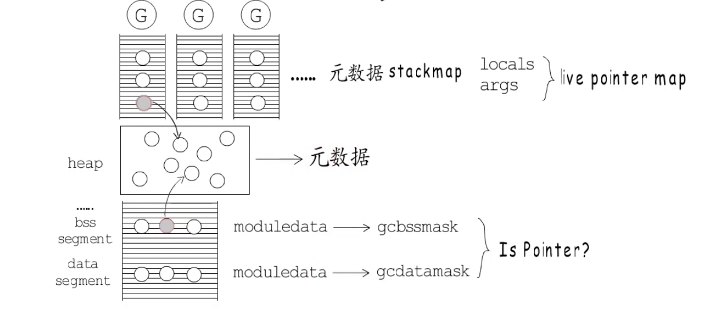
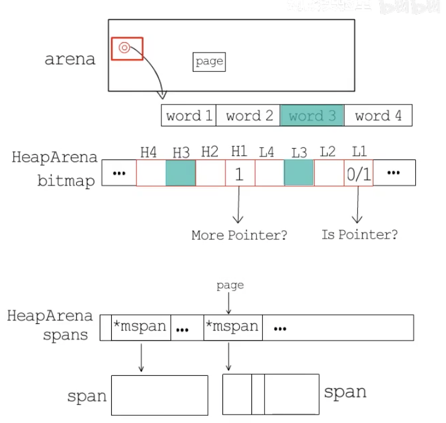

## go 语言的 GC

#### GC bitmap

GC 在标记的时候,需要知道哪些地方包含了指针,之前提到的 bitmap 区域涵盖了 arena 区域中的指针信息,除此之外,GC 还需要制动栈空间上有哪些地方包含了指针

因为栈空间不属于 arena 渔区,栈空间的指针信息记录在`函数信息`里面

另外,GC 在分配对象的时候,也需要根据对象的类型设置 bitmap区域,来源的指针信息将会在`类型信息`里面

总结起来 go 中有以下的 GC bitmap

- bitmap 区域: 涵盖了 arena 区域,使用 2bit 表示一个指针大小
- 函数信息: 涵盖了函数的栈空间,使用 1bit 表示一个指针大小的内存(位于 stackmap.bytedata)
- 类型信息: 在分配对象时候会复制到 bitmap 区域,使用 1bit 表示一个指针大小的内存(位于_type.gcdata)

### 分配对象的流程

go从堆内存对象时会调用newobject函数,这个函数的流程大致如下:

首先会检查GC是否在工作中,如果GC在工作中并且当前G分配了一定大小的内存,则需要协助GC做一定的工作,这个机制叫做GC Assist,用于防止分配内存太快导致GC回收跟不上的情况发生

之后判断是小对象还是大对象,如果是大对象则直接调用LargeAlloc从堆内存中分配,如果是小对象分为3个阶段获取可用的span,然后从span中分配对象:

- 首先从P的缓存(mcache)获取
- 然后从全局缓存(mcentral)获取,全局缓存中有可用的span列表
- 最后从mheap获取,mheap中也有span的自由列表,如果都获取失败则从arena区域分配

### 数据类型的定义

分配对象设计的数据类型包括:
P: Processor,协程中用于用运行go代码的虚拟资源

M: Machine,代表目前系统线程

G: Goroutine

mspan: 用于分配对象的区块

mcentral: 全局的mspan缓存,一共有134个

mheap:用于管理heap的对象,全局只有一个

### 源码分析

整个分配对象的流程,详细请查看

## 回收对象的处理流程

go的GC是并行GC,也就是GC的大部分处理和普汀的go代码是同时运行的,折让go的GC流程比较复杂,首先GC有四个阶段:

- sweep Termination: 对未清扫的span进行清扫,只有上一轮的GC的清扫工作结束才能完成新一轮的GC
- Mark:扫描所有的根对象,和根对象可以达到的所有对象,标记它们不被回收
- Mark Termination: 完成比较工作,从新扫描部分根对象(要求STW)
- sweep:按照标记结果清扫span

在GC过程中会有两种后台任务(G),一种是标记用的后台任务,一种是清扫用的后台任务

- 标记用的后台任务会在需要的时候启动,可以同时工作的后台任务数量大约是P的数量的25%,也就是Go所讲的让25%的CPU用在GC上的根据,在 GC 的初始化阶段,会根据当前的 GOMAXPROCS 的数值乘以 CPU 目标使用率,来计算需要启动的 markworker 的数量
- 清扫用的后台任务会在程序启动的时候,启动一个,进入清扫阶段时候唤醒

目前整个GC流程会进行两次STW,第一次是Mark阶段开始的时候,第二次是Mark Termination及阶段

- 第一次的STW会准备根对象的扫描,启动写屏障和辅助GC
- 第二次的STW会从新扫描部分根对象,禁用写屏障和辅助GC

需要注意的是,不是所有根对象的扫描都需要用到STW,例如扫描栈上的对象只需要停止拥有栈的G即可

> go 从1.9版本之后,写屏障实现了混合写屏障,大幅度减少了第二次STW的时间

## go 语言的 GC 流程

go 语言的 gc 在创建阶段,会为每个 P 创建一个 MarkWorker 协程,并把对应的 G 指针存储到 P 中,这些 MarkWorker 协程创建后就进入休眠的状态等待到标记阶段得到调度执行

1. 接下来进行第一次的 STW,GC 进入_GCMark 阶段

- 全局变量 gcphrase= _GCMark 记录 GC 阶段标识
- 全局变量 writeBarrier.enabled = true 记录是否开启写屏障
- 全局变量 gcBlackEnabled = 1用于标记是否允许进行 GC 标记工作(1 标识允许)

在 STW 的情况下开启写屏障,等所有的准备工作做好以后,start zhe world ,所有的 P 都会知道写屏障已经开启,然后这些后台的 MarkWorker 得到调度执行,开始进行标记工作

当没有标记工作的时候,进行第二次的 STW,GC 进入_GCMarkTermiation 阶段

- 全局变量 gcphrase= _GCMarkTermiation 

记录标记工作确实已经完成,然后停止标记工作

- 全局变量 gcBlackEnabled 的值被置为 0

3. 接下来进入_GCOff 阶段,关闭写屏障,然后 start the world

- 全局变量 gcphrase= _GCOff

- 全局变量 writeBarrier.enabled = false

在进入_GCOff 阶段之前,新分配的对象会被直接标记为黑色,进入__GCOff阶段之后,再新分配的对象就是白色的了

4. 接下来进如清扫阶段

执行清扫任务的协程,由runtime.main 在 gcenable 中创建,对应的 G 的指针存储在全局变量`sweep`中,到了清扫阶段,这个后台的 sweep 会被加入到 run queue 中,它得到调度执行的时候,会进行清扫任务,以为清扫操作也是增量进行的,所以本轮的清扫任务开始之前还要完成上一轮 GC 未完成的清扫工作

> 这样的流程看下来,似乎只需要两次必要的 STW ,标记与清扫工作与用于线程并发增量执行

#### mark阶段

按照标记清扫算法,标记工作要从扫描 bss段,数据段,以及协程栈上的这些 root 节点开始,追踪到堆上的节点,那么怎么确定这些数据是 GC 感兴趣的指针呢?

Go 语言在编译阶段会生成 BBS 段,数据段等对应的元数据,存储在可执行文件中,通过各个模块对应的 moduledata 可以获得gcdatamark 和 gcbssmark 等信息,这些信息将被用来判断对应的 root 节点是否为指针

协程栈也有对应的元数据信息,存储在对应的stackmark 中,扫描协程栈时,通过对应的元数据可以知道栈上的局部变量,参数和返回值等对象中哪些是存活的指针

确定了 root 节点是否为指针,还需要判断这些指针是否指向了堆内存,如果指向了堆内存就需要把这些 root 节点加入到 GC 队列中继续扫描

##### 堆内存的管理结构

堆内存使用 mheap 来存储数据结构,mheap 管理着虚拟地址空间的一大段连续的内存,通常指的从堆内存分配指的就是从这里分配,这些内存以 8KB 为一个 page,过个 page 组成一个 span,多个 span组成一个 arena

span 对应的数据结构是 mspan,每个 span 都只储存一种大小的元素,span 存储的元素的规格就是之前提到的 对应的 66 种 class ,记录在 mspan.spanclass 中,大于 32G 的大对象直接在 mheap 中分配,对应的 span class id 为 0

除了按照大小分类,还会按照是否含有指针分类,所以元素大小类型相同的 span 还会分为两种:(前面提到的 span 的分类为 67 * 2 =134 种)

- scan: 含有指针的 span

- noscan : 不含有指针的 span

分配内存的时候,根据类型数据的 ptrdata 字段来决定数据对象应该分配在哪种 span 中:

- prtdata = 0 : 表示没有指针,分配到 noscan 类型的 span 中
- ptrdata != 0 : 表示含有指针,分配到 scan 类型的 span 中

noscan 类型的 span 不会被 GC 扫描,即使存储的是堆上某个对象的地址,这个对象也不会被 GC 追踪到

scan 类型的 span 会被 GC 追踪到

##### central

如果协程都直接向 mheap 申请内存,那么同步开销就会很大,所以 go 语言实现了全局与本地缓存

mheap.central 提供全局 span 缓存,按照全局 span 类型区分,一共 134 个 mcentral,每个 msentral 管理一种类型的 mspan,并且会将有空闲空间和没有空闲空间的 mspan 分别管理

###### cache

每个 P 都有一个 mcache 用与本地 span 缓存,同样按照 span 的类型区分,一共 134 个 mspan 链表

##### 堆内存中 GC 标记会用到的元数据信息

mheap 中每个 arena 对应一个 HeapArena,用来记录 arena 的元数据信息,其中有一个 bitmap, 比bitmap 中的一个字节可以标记 arena 中连续 4 个指针大小的内存,每个 work 对应到两个 bit 中

- 低位 bit 标记是否为指针 : 0 为非指针,1 为指针
- 高位 bit 标记是否需要继续扫描,1 表示扫描完当前 work,并不能完成当前数据对象的扫描

bitmap 的信息在分配内存的时候设置,会用到对应元数据类型中的 gcdata 信息

HeapArena 中还有一个 spans 字段,是一个`*mspan`类型的数组,用来记录当前 arean 中每一个页对应到哪一个 span

基于 HeapArena 记录的元数据信息,我们只要知道一个对象的地址,就可以根据 bitmap 信息,扫描它内部是否含有指针,也可以根据对象地址,计算出它在哪一页,然后通过 span 信息查到它在哪一个 span 中

而每一个 span 都对应两个位图标记,记录在 mspan 中

- allocBits: 每一位用于标记对象存储单元是否已经分配
- gcmarkBits: 每一位用于标记一个对象是否存活

有了上面的位图和标记就能知道哪些对象应该被标记为灰色,也就是把其对应的 gcmarkBits 标记为1,并将其加入到工作队列中

