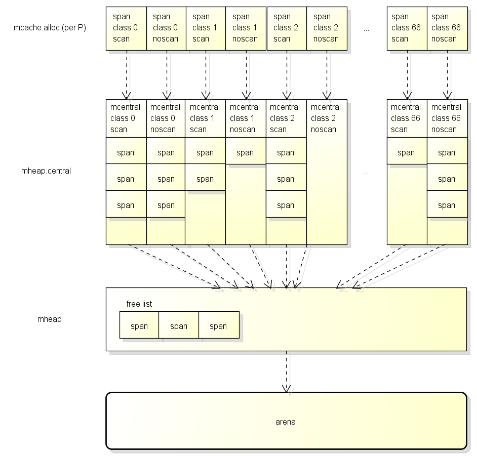

## go 语言的 GC

#### GC bitmap

GC 在标记的时候,需要知道哪些地方包含了指针,之前提到的 bitmap 区域涵盖了 arena 区域中的指针信息,除此之外,GC 还需要制动栈空间上有哪些地方包含了指针

因为栈空间不属于 arena 渔区,栈空间的指针信息记录在`函数信息`里面

另外,GC 在分配对象的时候,也需要根据对象的类型设置 bitmap区域,来源的指针信息将会在`类型信息`里面

总结起来 go 中有以下的 GC bitmap

- bitmap 区域: 涵盖了 arena 区域,使用 2bit 表示一个指针大小
- 函数信息: 涵盖了函数的栈空间,使用 1bit 表示一个指针大小的内存(位于 stackmap.bytedata)
- 类型信息: 在分配对象时候会复制到 bitmap 区域,使用 1bit 表示一个指针大小的内存(位于_type.gcdata)

### 分配对象的流程

go从堆内存对象时会调用newobject函数,这个函数的流程大致如下:

首先会检查GC是否在工作中,如果GC在工作中并且当前G分配了一定大小的内存,则需要协助GC做一定的工作,这个机制叫做GC Assist,用于防止分配内存太快导致GC回收跟不上的情况发生

之后判断是小对象还是大对象,如果是大对象则直接调用LargeAlloc从堆内存中分配,如果是小对象分为3个阶段获取可用的span,然后从span中分配对象:

- 首先从P的缓存(mcache)获取
- 然后从全局缓存(mcentral)获取,全局缓存中有可用的span列表
- 最后从mheap获取,mheap中也有span的自由列表,如果都获取失败则从arena区域分配

### 数据类型的定义

分配对象设计的数据类型包括:
P: Processor,协程中用于用运行go代码的虚拟资源

M: Machine,代表目前系统线程

G: Goroutine

mspan: 用于分配对象的区块

mcentral: 全局的mspan缓存,一共有134个

mheap:用于管理heap的对象,全局只有一个

### 源码分析

整个分配对象的流程,详细请查看

## 回收对象的处理流程

go的GC是并行GC,也就是GC的大部分处理和普汀的go代码是同时运行的,折让go的GC流程比较复杂,首先GC有四个阶段:

- sweep Termination: 对未清扫的span进行清扫,只有上一轮的GC的清扫工作结束才能完成新一轮的GC
- Mark:扫描所有的根对象,和根对象可以达到的所有对象,标记它们不被回收
- Mark Termination: 完成比较工作,从新扫描部分根对象(要求STW)
- sweep:按照标记结果清扫span

在GC过程中会有两种后台任务(G),一种是标记用的后台任务,一种是清扫用的后台任务

- 标记用的后台任务会在需要的时候启动,可以同时工作的后台任务数量大约是P的数量的25%,也就是Go所讲的让25%的CPU用在GC上的根据
- 清扫用的后台任务会在程序启动的时候,启动一个,进入清扫阶段时候唤醒

目前整个GC流程会进行两次STW,第一次是Mark阶段开始的时候,第二次是Mark Termination及阶段

- 第一次的STW会准备根对象的扫描,启动写屏障和辅助GC
- 第二次的STW会从新扫描部分根对象,禁用写屏障和辅助GC

需要注意的是,不是所有根对象的扫描都需要用到STW,例如扫描栈上的对象只需要停止拥有栈的G即可

> go 从1.9版本之后,写屏障实现了混合写屏障,大幅度减少了第二次STW的时间