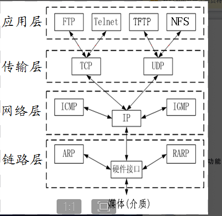
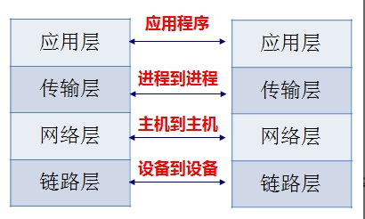
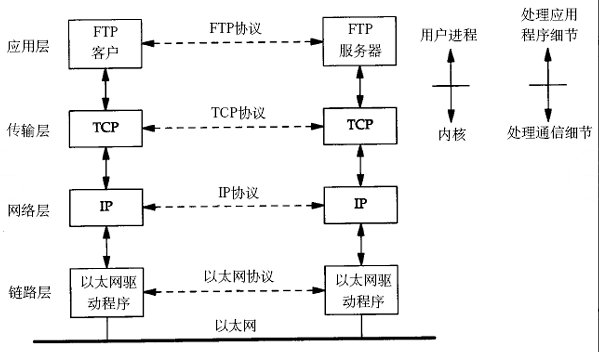
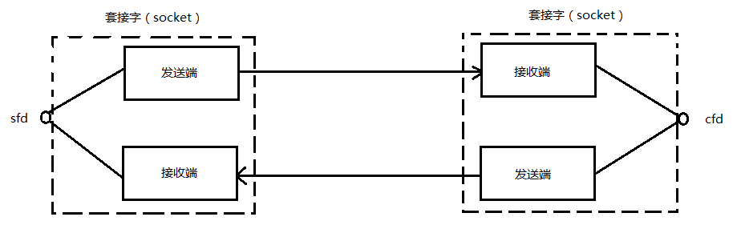
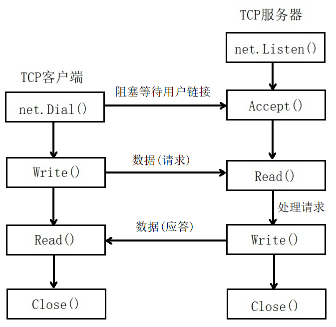
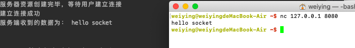
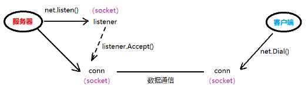
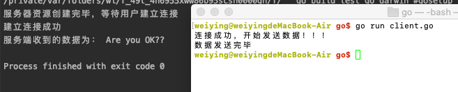

# 网络协议
从应用的角度出发,协议可以理解为"规则",是数据传输和数据解释的规则,加入,A,B 双方于传输文件,规定:

- 第一次,传输文件名,接收方收到文件名,应答 OK 给传输方

- 第二次,发送文件的尺寸,接收方收到该数据后在应答一个 OK

- 第三次,传输文件内容,同样接收方收到数据后应答 OK 表示文件内容接收成功

由此，无论A、B之间传递何种文件，都是通过三次数据传输来完成。A、B之间形成了一个最简单的数据传输规则。双方都按此规则发送、接收数据。A、B之间达成的这个相互遵守的规则即为协议。

这种仅在A、B之间被遵守的协议称之为原始协议。

当此协议被更多的人采用，不断的增加、改进、维护、完善。最终形成一个稳定的、完整的文件传输协议，被广泛应用于各种文件传输过程中。该协议就成为一个标准协议。最早的ftp协议就是由此衍生而来。

> 通信的双刚必须严格的遵守规则

## 典型常用的协议
OSI 七层模型(自上向下):应用层、表示层、会话层、传输层、网络曾、数据链路层、物理层
TCP/IP四层协议:应用层(应用层、表示层、会话层)、传输层、网络层、链路层(数据链路层和物理层)

> 越向下的层,越靠近硬件,越向上的层越接近用户

1. 传输层协议: TCP/UDP 协议
	TCP传输控制协议（Transmission Control Protocol）是一种面向连接的、可靠的、基于字节流的传输层通信协议。

	UDP用户数据报协议（User Datagram Protocol）是OSI参考模型中一种无连接的传输层协议，提供面向事务的简单不可靠信息传送服务。

2. 应用层协议:HTTP、FTP协议
	HTTP超文本传输协议（Hyper Text Transfer Protocol）是互联网上应用最为广泛的一种网络协议。

	FTP文件传输协议（File Transfer Protocol）

3. 网络层协议:IP 协议、ICMP协议和IGMP协议
	IP协议是因特网互联协议（Internet Protocol）

	ICMP协议是Internet控制报文协议（Internet Control Message Protocol）它是TCP/IP协议族的一个子协议，用于在IP主机、路由器之间传递控制消息。

	IGMP协议是 Internet 组管理协议（Internet Group Management Protocol），是因特网协议家族中的一个组播协议。该协议运行在主机和组播路由器之间。

4. 网络接口层:ARP协议和RARP协议
	ARP协议是正向地址解析协议（Address Resolution Protocol），通过已知的IP，寻找对应主机的MAC地址。

	RARP是反向地址转换协议，通过MAC地址确定IP地址


### OSI 七层模型的详细信息

1. 物理层:主要定义物理设备标准，如网线的接口类型、光纤的接口类型、各种传输介质的传输速率等。它的主要作用是传输比特流（就是由1、0转化为电流强弱来进行传输，到达目的地后再转化为1、0，也就是我们常说的数模转换与模数转换）。这一层的数据叫做比特。

2. 数据链路层:定义了如何让格式化数据以帧为单位进行传输，以及如何让控制对物理介质的访问。这一层通常还提供错误检测和纠正，以确保数据的可靠传输。如：串口通信中使用到的115200、8、N、1

3. 网络层:在位于不同地理位置的网络中的两个主机系统之间提供连接和路径选择。Internet的发展使得从世界各站点访问信息的用户数大大增加，而网络层正是管理这种连接的层。

4. 传输层:4)定义了一些传输数据的协议和端口号（WWW端口80等），如：TCP（传输控制协议，传输效率低，可靠性强，用于传输可靠性要求高，数据量大的数据），UDP（用户数据报协议，与TCP特性恰恰相反，用于传输可靠性要求不高，数据量小的数据，如QQ聊天数据就是通过这种方式传输的）。 主要是将从下层接收的数据进行分段和传输，到达目的地址后再进行重组。常常把这一层数据叫做段。

5. 会话层:通过传输层(端口号：传输端口与接收端口)建立数据传输的通路。主要在你的系统之间发起会话或者接受会话请求（设备之间需要互相认识可以是IP也可以是MAC或者是主机名）。

6. 表示层:可确保一个系统的应用层所发送的信息能被另一个系统的应用层读取,例如,PC程序与另一台计算机通信,其中一台计算机使用扩展二一十进制交换码(EBCDIC),而另一台则使用美国信息交换标准码（ASCII）来表示相同的字符。如有必要，表示层会通过使用一种通格式来实现多种数据格式之间的转换

7. 应用层:最靠近用户的一层,这一层为用户的应用程序(例如电子邮件、文件传输和终端仿真)提供网络服务

### 层与协议
每一层都是为了完成一种功能,为了实现这些功能,就需要大家都遵守共同的规则,大家都遵守的这规则就叫做协议

网络的每一层,都定义了很多协议,这些协议的总称,叫做 TCP/IP 协议,其中不仅仅包括 TCP 和 IP 协议,还包括其他的协议



#### 协议功能


### TCP/IP 四层模型的详细说明

1. 链路层
以太网规定,连入网络的所有设备,都必须具有网卡设备,数据包必须是从一块网卡到另一块网卡,通过网卡能够在不同的计算机之间连接,从而完成数据通信等功能,网卡的地址--MAC 地址,是数据包的物理发送地址和物理接收地址


2. 网络层
网络层的作用是引进一套新的地址,使得我们能够区分不同的计算机是否属于同一个子网,这套地址就叫做网络地址,也就是我们常说的 IP 地址

网络地址帮助我们确定计算机所在的子网,MAC 地址将数据包送到该子网中的目标网络,网络层协议包含的主要信息是源 IP 和目的 IP

于是，“网络层”出现以后，每台计算机有了两种地址，一种是 MAC 地址，另一种是网络地址。两种地址之间没有任何联系，MAC 地址是绑定在网卡上的，网络地址则是管理员分配的，它们只是随机组合在一起。

网络地址帮助我们确定计算机所在的子网络，MAC 地址则将数据包送到该子网络中的目标网卡。因此，从逻辑上可以推断，必定是先处理网络地址，然后再处理 MAC 地址。

3. 传输层
当我们一边聊QQ，一边聊微信，当一个数据包从互联网上发来的时候，我们怎么知道，它是来自QQ的内容，还是来自微信的内容？

也就是说，我们还需要一个参数，表示这个数据包到底供哪个程序（进程）使用。这个参数就叫做“端口”（port），它其实是每一个使用网卡的程序的编号。每个数据包都发到主机的特定端口，所以不同的程序就能取到自己所需要的数据。

端口的特点:

- 对于同一个端口,在不同系统中对应着不同的进程

- 对于同一个系统,一个端口只能被一个进程占用

4. 应用层
应用程序收到“传输层”的数据，接下来就要进行解读。由于互联网是开放架构，数据来源五花八门，必须事先规定好格式，否则根本无法解读。“应用层”的作用，就是规定应用程序的数据格式

## 网络通信过程
以 TCP/IP 协议为例的通讯过程如下:


> 没有经过封装的数据，不能再互联网中传输

# socket 编程
socket 一般称之为套接字,用于描述 ip 地址和端口,可以实现不同程序之间的数据通信

socket 起源于 Unix,而Unix基本哲学之一就是“一切皆文件”，都可以用“打开open –> 读写write/read –> 关闭close”模式来操作。Socket就是该模式的一个实现，网络的Socket数据传输是一种特殊的I/O，Socket也是一种文件描述符。Socket也具有一个类似于打开文件的函数调用：Socket()，该函数返回一个整型的Socket描述符，随后的连接建立、数据传输等操作都是通过该Socket实现的.

套接字的内核实现较为复杂,不易在学习初期深入学习,大体结构如下:


在TCP/IP协议中，“IP地址+TCP或UDP端口号”唯一标识网络通讯中的一个进程。“IP地址+端口号”就对应一个socket。欲建立连接的两个进程各自有一个socket来标识，那么这两个socket组成的socket pair就唯一标识一个连接。因此可以用Socket来描述网络连接的一对一关系。

常用的Socket类型有两种：流式Socket（SOCK_STREAM）和数据报式Socket（SOCK_DGRAM）。流式是一种面向连接的Socket，针对于面向连接的TCP服务应用；数据报式Socket是一种无连接的Socket，对应于无连接的UDP服务应用。

## 网络应用程序设计模式

1. C/S 模式
传统的网络应用设计模式，客户机(client)/服务器(server)模式。需要在通讯两端各自部署客户机和服务器来完成数据通信。

2. B/S 模式
浏览器(Browser)/服务器(Server)模式。只需在一端部署服务器，而另外一端使用每台PC都默认配置的浏览器即可完成数据的传输。

### 两种模式的优缺点

对于C/S模式来说，其优点明显。客户端位于目标主机上可以保证性能，将数据缓存至客户端本地，从而提高数据传输效率。且，一般来说客户端和服务器程序由一个开发团队创作，所以他们之间所采用的协议相对灵活。可以在标准协议的基础上根据需求裁剪及定制。例如，腾讯所采用的通信协议，即为ftp协议的修改剪裁版。

因此，传统的网络应用程序及较大型的网络应用程序都首选C/S模式进行开发。如，知名的网络游戏魔兽世界。3D画面，数据量庞大，使用C/S模式可以提前在本地进行大量数据的缓存处理，从而提高观感。

C/S模式的缺点也较突出。由于客户端和服务器都需要有一个开发团队来完成开发。工作量将成倍提升，开发周期较长。另外，从用户角度出发，需要将客户端安插至用户主机上，对用户主机的安全性构成威胁。这也是很多用户不愿使用C/S模式应用程序的重要原因。

B/S模式相比C/S模式而言，由于它没有独立的客户端，使用标准浏览器作为客户端，其工作开发量较小。只需开发服务器端即可。另外由于其采用浏览器显示数据，因此移植性非常好，不受平台限制。如早期的偷菜游戏，在各个平台上都可以完美运行。

B/S模式的缺点也较明显。由于使用第三方浏览器，因此网络应用支持受限。另外，没有客户端放到对方主机上，缓存数据不尽如人意，从而传输数据量受到限制。应用的观感大打折扣。第三，必须与浏览器一样，采用标准http协议进行通信，协议选择不灵活。

## TCP 的 C/S 架构


1. 首选服务器端要启动一个 net.Listen(),设置服务器监听的资源(ip、端口等)

2. 服务器端阻塞监听客户端的连接,没有连接的话会一直阻塞

3. 客户端调用 net.Dial() 函数,建立与服务器的连接,连接建立后服务器端调用 Accept() 函数

4. 客户端调用 Write()函数,向服务器端发送数据请求,然后服务器端调用 Read() 函数读取用户发送的数据

5. 服务器端读取了请求后,调用 Write() 函数,返回给用户处理的请求的结果

6. 客户端收到处理结果后,调用 Read() 函数读取数据

7. 一次请求完成,双方关闭连接

> 建立一次 TCP 连接,服务器需要两个 socket,分别是使用 net.Listen() 函数创建的用于监听的 socket,另一个是使用 Accept() 函数创建的用于监听用户请求的 socket,客户端只有一个用户建立建立的 socket,完毕都需要关闭,实现的过程中用于监听用户请求的 socket 复于服务器端最先创建的用于监听的 socket

## TCP 的 C/S架构 server 端的详细说明
1. server 端的 Listen 函数:
```go
unc Listen(network, address string) (Listener, error) {
	var lc ListenConfig
	return lc.Listen(context.Background(), network, address)
}
```
两个参数
	-network:选用的协议,TCP 或者 UDP
	address: 需要监听的 ip 地址和端口号

返回值:为 Listener 接口 和错误信息

2. server 端的 Listener 接口
```go
type Listener interface {
	Accept() (Conn, error)  // 返回 connect ,用户通信的 socket,用户监听客户端请求并通信
	Close() error  // 关闭 socket
	Addr() Addr // 
}
```

3. server 端的 Conn 接口
```go
type Conn interface {
	Read(b []byte) (n int, err error)  // 读 , 返回
	Write(b []byte) (n int, err error) // 写
	Close() error // 关闭
	LocalAddr() Addr // 获取自己的 ip 地址
	RemoteAddr() Addr // 获取对端的 ip 地址
	SetDeadline(t time.Time) error
	SetReadDeadline(t time.Time) error
	SetWriteDeadline(t time.Time) error
}
```

4. 创建服务端的代码
```go
package main

import (
	"fmt"
	"net"
)

func main()  {
	// 创建用于监听的socket
	listener , err := net.Listen("tcp","127.0.0.1:8080")
	if err != nil {
		fmt.Println("net.Listen err", err)
		return
	}
	// 关闭socket
	defer listener.Close()
	fmt.Println("服务器资源创建完毕，等待用户建立连接")
	// 创建用户用户通信的socket，真正的用于监听的套接字
	conn , err := listener.Accept()
	if err != nil {
		fmt.Println("listener.Accept", err)
		return
	}
	defer conn.Close()
	fmt.Println("建立连接成功")
	// 接收客户端的数据
	buf :=make([]byte,4096)
	n , err := conn.Read(buf)
	if err != nil{
		fmt.Println("read err",err)
		return
	}
	fmt.Println("服务端收到的数据为：",string(buf[:n]))

}
```
运行代码测试: 客户端使用 nc 测试


如图，在整个通信过程中，服务器端有两个socket参与进来，但用于通信的只有 conn 这个socket。它是由 listener创建的。隶属于服务器端。


## TCP 的 C/S架构 client  端的详细说明
1. client 端的 Dial 函数
```go
func Dial(network, address string) (Conn, error) {
	var d Dialer
	return d.Dial(network, address)
}
```
两个参数分别为选用的协议和服务器端的 ip+port 
返回值为 conn 接口,与 server 端的使用方法一致

2. client 端连接 server 端的代码
```go
package main

import (
	"fmt"
	"net"
)

func main()  {
	// 主动发起连接请求
	conn ,err := net.Dial("tcp","127.0.0.1:8080")
	if err != nil {
		fmt.Println("net.Dial error", err)
		return
	}
	// 结束的时候关闭连接
	defer conn.Close()

	fmt.Println("连接成功，开始发送数据！！！")

	// 发送数据
	_ , err = conn.Write([]byte("Are you OK?"))
	if err != nil {
		fmt.Println("conn.Write error:",err)
		return
	}
}
```
执行结果
