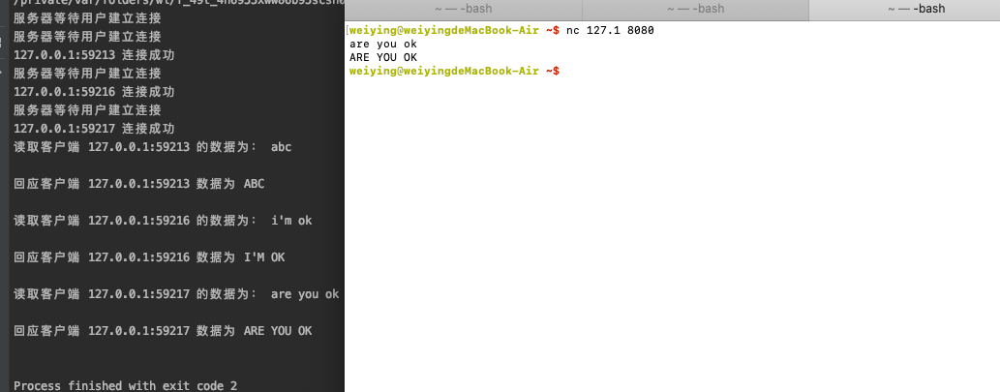
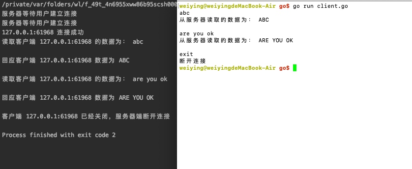

# 并发 C/S 通信模型

## 并发 server
之前完成的基于 socket 的 C/S 通信模型是服务器端只能接受一次用户发送的请求,怎样能接受多个客户端发送过来的数据,才能实现高效的并发服务器呢?

Accept() 函数的作用是等待用户的连接,如果没有用户连接那么就会一直处于阻塞的状态,如果有客户端的连接,那么该方法会返回一个 socket 负责与客户端通信,所以,每有一个客户端,该方法就返回一个 socket 与之通信,因此,可以使用循环来讲 Accept() 函数包裹起来实现

需要注意的是,实现并发处理多个客户端连接的服务器,就是针对每个客户端的连接,单独的产生一个 scoket,并创建一个单独的 go 程(goroutine) 与之完成通信

```go
package main

import (
	"fmt"
	"net"
	"strings"
)

// 完成与客户端通信的函数
func HandlerConnect(conn net.Conn)  {
	// 结束的时候关闭conn
	defer conn.Close()
	// 获取客户端的ip地址
	clientAdd := conn.RemoteAddr()
	fmt.Println(clientAdd,"连接成功")
	// 循环读取客户端发送的数据
	buf := make([]byte,4096)
	for { // 此处的 for 循环,用于实现能够接收一个用户的多个请求
		n , err := conn.Read(buf)
		if err != nil {
			fmt.Println("conn.Read error :", err)
			return
		}
		str := string(buf[:n])
		fmt.Println("读取客户端",clientAdd,"的数据为：", str)
		//处理数据，将处理后的数据发送给客户端
		//此处将客户端发送的数据变为大写
		conn.Write([]byte(strings.ToUpper(string(buf[:n]))))
		fmt.Println("回应客户端",clientAdd,"数据为",strings.ToUpper(str))

	}
}

func main()  {
	// 创建用于监听的socket
	listener , err := net.Listen("tcp","127.0.0.1:8080")
	if err != nil {
		fmt.Println("net.Listen err", err)
		return
	}
	// 关闭socket
	defer listener.Close()

	for { // 此处的 for 循环能够实现与多个客户端建立连接
		fmt.Println("服务器等待用户建立连接")
		// 创建用户用户通信的socket，真正的用于监听的套接字
		conn, err := listener.Accept()
		if err != nil {
			fmt.Println("listener.Accept", err)
			return
		}
		// 具体完成与客户端通信的函数,新建一个 go 程
		go HandlerConnect(conn)
	}
}
```
测试代码的执行


## 并发 server 端实现关闭
根据 read() 函数的韩回执判断客户端是否关闭了连接,如果返回值为 0 说明客户端已经关闭,或者客户端发送了 exit 或者 quit,关闭连接

read() 方法获取客户端发送过来的数据,填充到字符切片中,返回的是实际填充的数据的长度,如果长度为 0 , 说明客户端关闭连接

> 需要注意的时,即使客户端什么数据都发送,也会自动的添加换行符,返回的长度也不会是 0
```go
func HandlerConnect(conn net.Conn)  {
	// 结束的时候关闭conn
	defer conn.Close()
	// 获取客户端的ip地址
	clientAdd := conn.RemoteAddr()
	fmt.Println(clientAdd,"连接成功")
	// 循环读取客户端发送的数据
	buf := make([]byte,4096)
	for { //
		n , err := conn.Read(buf)
		if n == 0 {
			fmt.Println("客户端",clientAdd,"已经关闭，服务器端断开连接")
			return
		}
		if err != nil {
			fmt.Println("conn.Read error :", err)
			return
		}
		str := string(buf[:n])
		if str == "exit\n" || str == "quit\n" || str == "exit\r\n" || str == "quit\r\n"{
			fmt.Println("客户端",clientAdd,"已经关闭，服务器端断开连接")
			return // 或者使用 runtime.Goexit()
		}
		fmt.Println("读取客户端",clientAdd,"的数据为：", str)
		//处理数据，将处理后的数据发送给客户端
		//此处将客户端发送的数据变为大写
		conn.Write([]byte(strings.ToUpper(string(buf[:n]))))
		fmt.Println("回应客户端",clientAdd,"数据为",strings.ToUpper(str))

	}
}
```
> 在判断用户输入的为 quit 或者 exit 的时候,那么后面必须加上'\n',因为客户端在使用发送数据的时候,会自动的末尾加上"\n"或者"\r\n",根据操作系统的不同,发送不同的换行符

## 并发 client
客户端不仅需要持续的向服务器端发送数据,也要不断的从服务器端接收数据,因此,可以将发送和接收数据放到不同的 go 程中

主 go 程从服务器端接收数据并打印,子 go 程从键盘读取用户输入并发送给服务器端,从键盘读取用户输入我们使用的是os.Stdin.Read(str),而不使用 fmt.Scanf 的原因是fmt.Scanf 不支持用户在输入的数据中添加空格等,os.Stdin.Read(str) 的参数 str 为字符切片,会将用户的输入保存在字符切片中,返回输入的长度和错误信息

```go
package main

import (
	"fmt"
	"net"
	"os"
)

func main()  {
	// 主动发起连接请求
	conn ,err := net.Dial("tcp","127.0.0.1:8080")
	if err != nil {
		fmt.Println("net.Dial error", err)
		return
	}
	// 结束的时候关闭连接
	defer conn.Close()
	// 启动子go程，从键盘接收用户数据，发送给服务器
	go func() {
		// 创建缓冲区，保存用户输入的数据
		str := make([]byte,1024)
		for {
			n , err := os.Stdin.Read(str)
			if err != nil {
				fmt.Println("读取用户输入错误：",err)
				continue // 读取失败后继续读取下一次输入
			}
			// 给服务器发送数据
			_ , err2 := conn.Write(str[:n])
			if err2 != nil {
				fmt.Println("向服务器发送数据失败：",err2)
			}
		}
	}()

	// 接收服务返回的数据并打印
	for {
		// 创建缓冲区用于保存从服务器读取的数据
		buf := make([]byte,4096)
		n , err := conn.Read(buf)
		if n == 0 { // 判断如果读取的数据长度为 0 ,说明服务器端已经关闭了连接,那么客户端也需要关闭连接
			fmt.Println("断开连接")
			return
		}
		if err != nil {
			fmt.Println("从服务器读取数据失败：",err)
			return
		}
		fmt.Println("从服务器读取的数据为：",string(buf[:n]))
	}
}

```
执行结果
