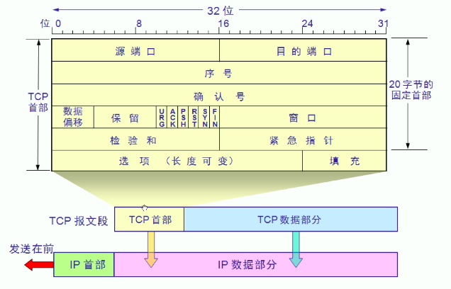
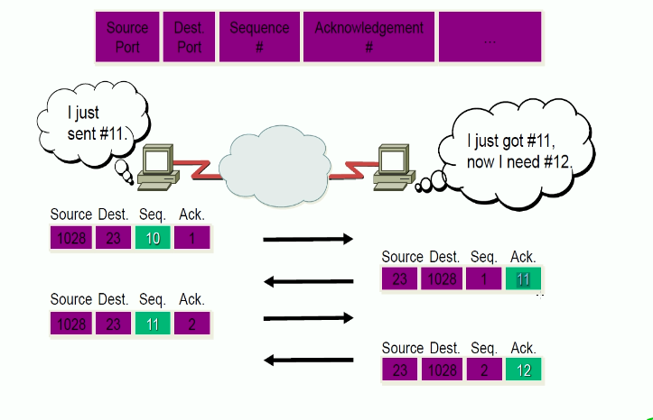
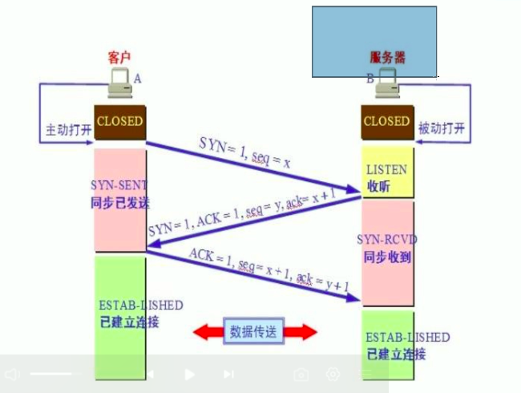
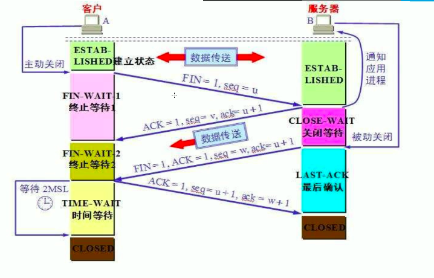
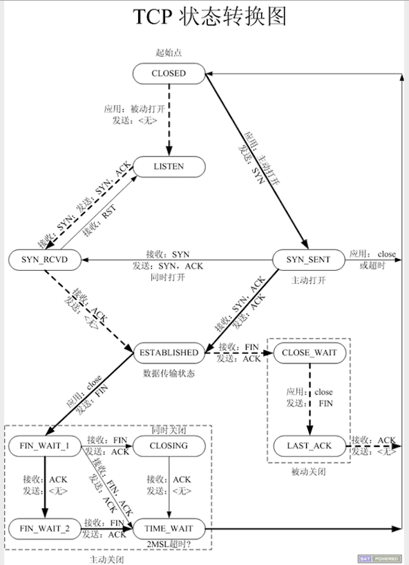

# TCP 的特性
1. 工作在传输层

2. 面向连接的协议
两个主机在网络中使用 TCP 传输数据之前,需要先建立连接

3. 全双工协议
支持双向同时传输数据

4. 半关闭
两个主机通过 TCP 传输数据,允许其中的一方关闭,另一方不关闭,关闭的一方不能接收数据,但是能发送数据

5. 错误检查、将数据打包成段,排序、确认机制、数据恢复,重传、流量控制,滑动窗口、拥塞控制,慢启动和拥塞避免算法等

### TCP 的报文头部

每一行 有 32 位(4 个字节),启动前 16 位是源端口,后面的 16 位是目标端口

1. 源端口和目标端口
无论是源端口还是目标端口,都只占了 16 位,也是就是说明端口的范围是 0 - 2^16-1(65535),通过端口号也就确认了指定主机上程序的唯一表示
无论是 TCP 还是 UDP,一共是 0-65535 个端口,分配如下:
	0-1023 : 系统端口或特权端口(仅系统管理员可以使用),分配给固定的系统应用使用
	1024-49151:用户端口或注册端口,要求不严格
	49152-65535:动态端口或者私有端口,客户端随机使用

2. 序号:占用 31 位(4 个字节)
也就是可以表达 2^32 个数字,发送数据的时候,都会以数据包的形式发送,一些大的文件会拆分成多个包,每一个包分配一个序号,用来标识包的顺序

3. 确认号
接收数据包的一方,用确认号来回复发送方,确认数据包是否收到,确认号一般是收到的包的序号加 1,比如收到了需要为 1000 包,接收方要回复发送方确认号为 1001,表示序号为 1000 的包已经收到,让发送发下一次应该发送序号为 1001 的数据包

发送方A发送的时候,使用 seq(序号)标明发送包的序号,使用 ack(确认号) 表示下次接收方B回包的时候,要回序号为 1 的包,B 接收到 A 的包后,要回复 A 的包为 A 在报文中指定 ack的包,同时要确认收到了 A 发送的 seq 的包,回复的时候,seq+1 告诉 A 下一次传输要发送给 B的包

> 这里的确认号可以指定大小,也就是说可以指定我接收多少个包之后再确认一次,也就是 TCP 的滑动窗口,双方协商每次发送多少个数据包

4. 数据偏移:4 位
表示TCP 报文的长度,因为 TCP 报文的长度只是前 20 个字节数固定长度的,后面还有可选的内容,所以在通讯的时候,要告诉对方 TCP 的报文有多长

5. 保留:6 位

7. 标记位:6 位

- URG:紧急指针位,表示数据中是否带有紧急指针的数据,1 表示后面的紧急指针是有效的

- ACK:在三次握手中详解

- PSH:为 1 表示数据从网络发送过来之后,不经过缓冲区(buffer)直接发送给应用程序

- RST:重置位,为 1 表示传输的过程中出现了网络故障,需要重新建立会话

- SYN:在三次握手中详解

- FIN:在三次握手中详解

8. 窗口
用来设置每发送多少个数据包确认一次

## 三次握手
所谓的三次握手(Three-Way Handshake),即建立 TCP 连接,就是指建立 TCP 连接时,需要客户端和服务端总共发送 3 个包才能确认连接

### 三次握手的过程
客户端主动发起请求,服务器被动接收请求

1. 客户端主动发起连接,将 SYN 的标记为主动的变为 1,其他的都为 0,数据包的序号为 seq = x,将数据包发送出去后,客户端会将自己的状态从 CLOSED 状态变为 SYN-SENT 状态,表示已经将同步(请求)的信息发送出去了

2. 服务器端收到请求后,回复客户端的报文,SYN = 1, ACK = 1(这里的 ACK 是标记位中的 ACK),同时标识自己发送数据包的序号 seq = y,确认号 ack = x+1(这里的 ack 是确认号),服务器端同时将自己的 LISTEN 状态切换为 SYN-RCVD 转态,标识同步(请求)已经收到

3. 客户端收到服务器端回复的报文后,继续回应服务器端,ACK = 1 ,同时标识自己发送包的需要为 seq = x+1, 确认号为 ack = y+1,同时把自己的状态变为 ESTAB-LISHED(已建立连接状态),同时服务器端收到报文后将自己的状态也变为ESTAB-LISHED(已建立连接状态)

通过三次握手后,通讯的双方就能确认通讯是正常的,然后就可以进行正常的数据传输了

> 在代码中,服务器端 Accept() 函数调用完成,标志和三次握手完成,客户端net.Dial() 函数调用完成,标志着三次握手完成

### 四次挥手
所谓的四次挥手,就是终止 TCP 连接,就是指断开一个 TCp 连接时,需要客户端和服务器端总共发送 4 个包确认连接断开,在 socket 编程中,这一过程由客户端或服务器端执行 close 来触发

四次挥手的发起这可能是客户端也可能是服务器端,下面以客户端发起为例说明四次挥手

#### 四次挥手的过程
> 由于 TCP 的连接是全双工的,因此,每个方向都必须单独进行关闭,这原则是当一方完成它的数据发送任务后就能发送一个 FIN 来终止这个方向的连接,收到一个 FIN 只意味着这一方向是没有数据流动,一个 TCP 连接在收到一个 FIN 后任然能发送数据,首先进行关闭一方将执行主动关闭,而另一方执行被动关闭

1. 客户端主动发起断开连接的请求,将标记位 FIN 主动的变为 1,同时发送数据包的序列号 seq=u , 将数据包发送出去后,马上就将自己的状态从 ESTAB-LISHED(已连接) 状态变为 FIN-WAIT1(终止等待 1)的状态

2. 服务器端收到客户端的报文后,会回复客户端 ACK = 1,用于向客户端确认以收到断开连接的报文,同时回复报文的序号 seq=v,和确认号 ack = u+1,报文发送之后服务器端将自己的状态从 ESTAB-LISHED 状态变为 CLOSE-WAIT(关闭等待)状态,同时客户端收到报文后会将自己的状态从 FIN-WAIT1(终止等待 1) 变为FIN-WAIT2(终止等待 2)

> 上面两步完成后,处于半关闭状态,客户端已经关闭了,不会在给服务器发送数据了,但是服务器端可能还有剩余的数据要发送给客户端,这时可以继续发送

3. 服务器端将数据完全发送给客户端后,发送断开连接的报文 FIN=1 和确认断开连接的报文 ACK = 1,同时发送 包的序号 seq = w 和确认号 ack = u+1,发送报文后,服务区端会将自己的状态从 CLOSE-WAIT 状态变为 LAST-ACK(最后确认)状态,客户端收到报文后将自己的状态从FIN-WAIT2(终止等待 2) 切换为 TIME-WAIT 状态

4. 客户端收到服务器端的断开连接的报文后,回复服务器端 ACK = 1,确认收到了断开连接的报文,同时发送数据包的序号 seq = u+1,ack=w+1,同时将自己的状态从 TIME-WAIT 状态经过 2 倍的等待时长后变为 CLOSED 状态,服务器端收到客户端的确认报文后,将自己的状态从 LAST-ACK(最后确认) 变为 CLOSED 转态,至此,TCP 连接断开

> 上面的过程中,前两部完成后,处于半关闭状态,服务器继续向客户端发送剩余的数据后,再发送 FIN = 1 的报文,但是可能因为互联网环境的复杂导致数据报文比 FIN= 1 的报文晚到,所以客户端在将自己的状态变为 CLOSED 状态之前,会等待两倍的生存时长,保证将数据都接收完毕了,再关闭连接

### TCP 的有限状态机
TCP 在传输的时候,会设计到在多个状态之间切换

1. CLOSED : 没有任何连接状态

2. LISTEN: 监听状态,等待来自远方 TCP 端口的连接请求

3. SYN-SENT:在发送连接请求后,等待对方确认

4. SYN-RECEIVED:在收到和发送一个连接请求后,等待对方确认

5. ESTABLISHED: 连接以建立,双方进入数据传输的状态

6. FIN-WAIT1: 主动关闭连接,主机已发送关闭连接的请求,等待对方确认

7. FIN-WAIT2: 主动关闭,主机已经接收到对方关闭传输连接确认,等待对方发送关闭传输连接请求

8. TIME-WAIT: 完成双向传输连接关闭 ,等待所有的分组消失

9. CLOSE-WAIT:被动关闭,收到对方发来的关闭连接请求,并以确认

10. LAST-ACK: 被动关闭,等待最后一个关闭连接确认,并等待所有的分组消失

11. CLOSING:双方同时尝试关闭连接,等待对方确认

#### TCP 通讯过程中的状态切换

上图中虚线为服务器端状态的切换,实线为客户端的状态切换