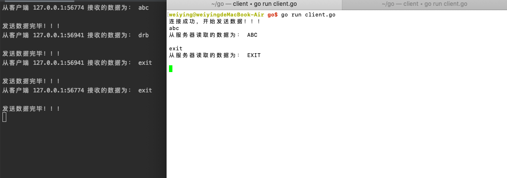

# UDP 协议的特性
UDP协议是无连接的协议,不可靠的报文传递

下面是 UDP 协议的包头


## UDP 通信
由于 UDP 是无连接的,所以服务器端不需要创建额外的监听套接字,只需要指定好 ip+port ,然后监听该地址,等待客户端与之建立连接,即可通信

创建监听地址
```go
func ResolveUDPAddr(network, address string) (*UDPAddr, error) {
}
```
创建用于通信的 socket
```go
func ListenUDP(network string, laddr *UDPAddr) (*UDPConn, error) {
}
```
接收 udp 数据
```go
func (c *UDPConn) ReadFromUDP(b []byte) (int, *UDPAddr, error)
```
发送数据到 udp
```go
func (c *UDPConn) WriteToUDP(b []byte, addr *UDPAddr) (int, error)
```

### 创建 UDP 通信的过程
1. 创建用于通信的 socket

2. 阻塞读 socket

3. 处理读到的数据

4. 写数据给客户端

服务器端的完整代码
```go
package main

import (
	"fmt"
	"net"
	"time"
)

func main() {
	//	 创建监听的地址，并且指定视同udp协议
	server_addr , err := net.ResolveUDPAddr("udp","127.0.0.1:8080")
	if err != nil {
		fmt.Println("net.ResolveUDPAddr error:",err)
		return
	}
	// 创建监听连接
	conn , err := net.ListenUDP("udp",server_addr)
	if err != nil {
		fmt.Println("net.ListenUDP error:",err)
		return
	}
	// 延时调用，关闭监听连接
	defer conn.Close()

	// 读取客户端的数据
	// 创建存储用户数据的字节数组
	buf := make([]byte,4096)

	// 返回三个值，分别是读取的字节数、客户端的地址和错误信息
	n , client_addr ,err := conn.ReadFromUDP(buf)
	if err != nil {
		fmt.Println("conn.ReadFromUDP error:",err)
		return
	}
	fmt.Println("接收的客户端数据为：",string(buf[:n]))
	//发送数据给客户端
	// 将当前的时间保存为字符串
	datatime := time.Now().String()
	_ , err = conn.WriteToUDP([]byte(datatime),client_addr)
	if err != nil {
		fmt.Println("conn.WriteToUDP error:",err)
		return
	}
	fmt.Println("发送数据完毕！！！")
}
```
使用 nc 命令测试


客户端代码与 TCP 客户端基本是一样的,只是将协议变为 udp
```go
package main

import (
	"fmt"
	"net"
)

func main()  {
	// 主动发起连接请求
	conn ,err := net.Dial("udp","127.0.0.1:8080")
	if err != nil {
		fmt.Println("net.Dial error", err)
		return
	}
	// 结束的时候关闭连接
	defer conn.Close()

	fmt.Println("连接成功，开始发送数据！！！")

	// 发送数据
	_ , err = conn.Write([]byte("Are you OK?"))
	if err != nil {
		fmt.Println("conn.Write error:",err)
		return
	}
	// 接收服务发送过来的数据
	buf := make([]byte,4096)
	n ,err := conn.Read(buf)
	if err != nil {
		fmt.Println("conn.Read error:",err)
		return
	}
	fmt.Println("从服务器读取的数据为：",string(buf[:n]))
}
```


## UDP 并发
其实对于 UDP 来说,服务器不需要并发,只需要循环处理客户端数据即可,客户端也等同于 TCP 通信的并发客户端

1. 服务器端并发
```go
package main

import (
	"fmt"
	"net"
	"strings"
)

func main() {
	//	 创建监听的地址，并且指定视同udp协议
	server_addr , err := net.ResolveUDPAddr("udp","127.0.0.1:8080")
	if err != nil {
		fmt.Println("net.ResolveUDPAddr error:",err)
		return
	}
	// 创建监听连接
	conn , err := net.ListenUDP("udp",server_addr)
	if err != nil {
		fmt.Println("net.ListenUDP error:",err)
		return
	}
	// 延时调用，关闭监听连接
	defer conn.Close()
	fmt.Println("服务器端创建完成",server_addr,"等待用户访问")

	for { // 使用循环来处理用户请求
		// 读取客户端的数据
		// 创建存储用户数据的字节数组
		buf := make([]byte, 4096)

		// 返回三个值，分别是读取的字节数、客户端的地址和错误信息
		n, client_addr, err := conn.ReadFromUDP(buf)
		if err != nil {
			fmt.Println("conn.ReadFromUDP error:", err)
			return
		}
		fmt.Println("从客户端", client_addr, "接收的数据为：", string(buf[:n]))
		//发送数据给客户端
		// 转换大写
		buf2 := []byte(strings.ToUpper(string(buf[:n])))
		_, err = conn.WriteToUDP(buf2, client_addr)
		if err != nil {
			fmt.Println("conn.WriteToUDP error:", err)
			return
		}
		fmt.Println("发送数据完毕！！！")
	}
}
```

2. 客户端并发
```go
package main

import (
	"fmt"
	"net"
	"os"
	"runtime"
)

func main()  {
	// 主动发起连接请求
	conn ,err := net.Dial("udp","127.0.0.1:8080")
	if err != nil {
		fmt.Println("net.Dial error", err)
		return
	}
	// 结束的时候关闭连接
	defer conn.Close()

	fmt.Println("连接成功，开始发送数据！！！")
	// 发送数据
	go func() {
		// 从键盘读取数据
		str := make([]byte,4096)
		for {
			n , err := os.Stdin.Read(str)
			if err != nil {
				fmt.Println("os.Stdin.Read error:",err)
				runtime.Goexit()
			}
			//向服务器发送数据
			conn.Write(str[:n])
		}
	}()
	// 接收服务发送过来的数据
	buf := make([]byte,4096)
	for {
		n, err := conn.Read(buf)
		if err != nil {
			fmt.Println("conn.Read error:", err)
			return
		}
		fmt.Println("从服务器读取的数据为：", string(buf[:n]))
	}
}
```


# TCP 和 UDP 的比较


- TCP 的使用场景:对数据有传输安全性、稳定性要求较高的场景,如网络文件传输

- UDP 的使用场景:对数据实时传输要求高的场合,如视频直播、在线的电话会议、游戏等