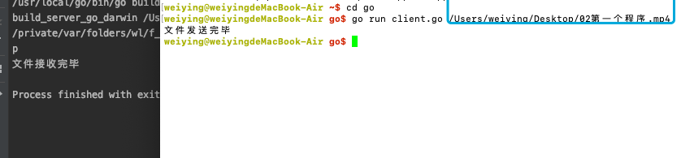

# 文件传输

借助 TCP 完成文件传输,基本思路如下

1. 发送方(客户端)向服务器端发送文件名,服务器端保存该文件名

2. 接收方(服务端)向客户端返回一个确认消息 OK , 确认文件名保存成功

3. 发送方(客户端)接收到消息后,开始想服务器端发送文件数据

4. 接收方(服务器端)读取文件内容,写入到之前保存好的文件中

首先要获取文件名,借助os包中的stat()函数来获取文件属性信息。在函数返回的文件属性中包含文件名和文件大小。Stat参数name传入的是文件访问的绝对路径。FileInfo中的Name()函数可以将文件名单独提取出来

```go
unc Stat(name string) (FileInfo, error) {
	testlog.Stat(name)
	return statNolog(name)
}

type FileInfo interface {
	Name() string       // base name of the file
	Size() int64        // length in bytes for regular files; system-dependent for others
	Mode() FileMode     // file mode bits
	ModTime() time.Time // modification time
	IsDir() bool        // abbreviation for Mode().IsDir()
	Sys() interface{}   // underlying data source (can return nil)
}
```

### 获取命令行参数 os.Args 的使用
```go
var Args []string
```
获取当前的命令行参数,返回字符串切片
```go
package main

import (
	"fmt"
	"os"
)

func main()  {
	list := os.Args
	fmt.Println("areg :",list)
}
```
在命令行中执行程序,查看输出


从输出中可以看到,返回的字符串切片中,第 0 个参数问执行的程序本身,后面的参数为执行程序时指定的参数

## 创建发送端

1. 获取文件名--不包含路径

2. 与接收端建立连接

3. 发送文件名给接收端

4. 等待接收端的返回值,如果返回 ok 发送数据

```go
package main

import (
	"fmt"
	"io"
	"net"
	"os"
)

func sendFile(conn net.Conn, filePath string)  {
	// 只读方式打开文件
	f , err := os.Open(filePath)
	if err != nil {
		fmt.Println("open file error:",err)
		return
	}
	defer f.Close()
	// 读取数据发送给接收发
	buf := make([]byte,4096)
	for {
		n ,err := f.Read(buf)
		if err != nil {
			if err == io.EOF{
				fmt.Println("文件发送完毕")
				return
			}else {
				fmt.Println("read file error:",err)
				return
			}
		}
		// 通过socket发送数据
		_ , err = conn.Write(buf[:n])
		if err != nil {
			fmt.Println("write data error:",err)
			return
		}
	}
}

func main()  {
	//获取命令行参数
	list := os.Args
	// 判断命令行参数是否满足条件
	if len(list) != 2 {
		fmt.Println("正确的使用方法：go run client.go 文件绝对路径")
	}
	// 获取文件的绝对路径
	filePath := list[1]
	// 获取文件信息
	fileInfo, err := os.Stat(filePath)
	if err != nil {
		fmt.Println("os.Stat error:",err)
		return
	}
	// 获取文件名
	filename := fileInfo.Name()

	// 与接收端建立连接

	conn ,err := net.Dial("tcp","127.0.0.1:8080")
	if err != nil {
		fmt.Println("net.dial error:",err)
		return
	}
	defer conn.Close()
	// 发送文件名给接收端
	_, err = conn.Write([]byte(filename))
	if err != nil {
		fmt.Println("conn.write filename error:",err)
		return
	}

	// 读取接收端返回的ok
	buf := make([]byte,1024)
	n , err := conn.Read(buf)
	if err != nil {
		fmt.Println("conn.read ok  error:",err)
		return
	}
	// 判断如果为OK，继续发送数据
	if string(buf[:n]) == "ok" {
		sendFile(conn , filePath)
	}
}
```

## 创建接收端

1. 创建监听 socket

2. 阻塞等待发送端的连接

3. 接收发送端发送的文件名,并返回 ok

4. 接收发送端发送的数据并写入到文件中

```go
package main

import (
	"fmt"
	"net"
	"os"
)

func recvFile(conn net.Conn,filename string)  {
	// 创建文件
	f , err := os.Create(filename)
	if err != nil {
		fmt.Println("create file error:",err)
		return
	}
	defer f.Close()
	// 读取网络数据，写入到文件中
	buf := make([]byte,4096)
	for {
		n , err := conn.Read(buf)
		if n == 0 {
			fmt.Println("文件接收完毕")
			return
		}
		if err != nil {
			fmt.Println("recv data error:",err)
			return
		}
		// 写入到文件中
		f.Write(buf[:n])
	}
}

func main() {
	// 创建用于监听的socket
	listen , err := net.Listen("tcp", "127.0.0.1:8080")
	if err != nil {
		fmt.Println("net.listen error:",err)
		return
	}
	defer listen.Close()

	// 阻塞等待发送端的连接
	conn , err := listen.Accept()
	if err != nil {
		fmt.Println("listen.accept error:",err)
		return
	}
	defer conn.Close()

	// 获取文件名
	buf := make([]byte,1024)
	n , err := conn.Read(buf)
	if err != nil {
		fmt.Println("read filename error:",err)
		return
	}
	filename := string(buf[:n])

	// 给发送端发送OK
	_ , err = conn.Write([]byte("ok"))
	if err != nil {
		fmt.Println("send ok error:",err)
		return
	}

	// 获取文件数据
	recvFile(conn,filename)

}
```
执行代码测试
