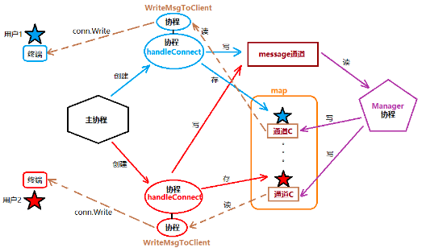
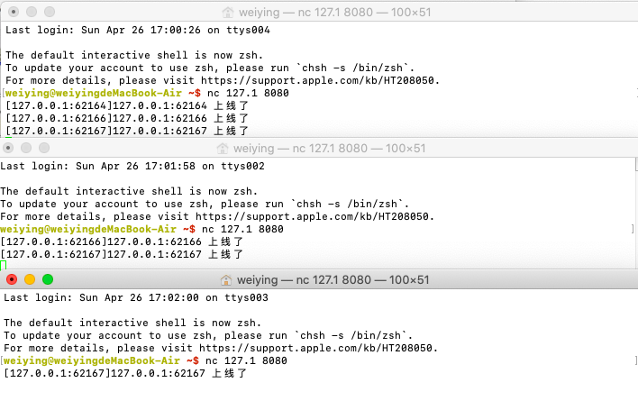
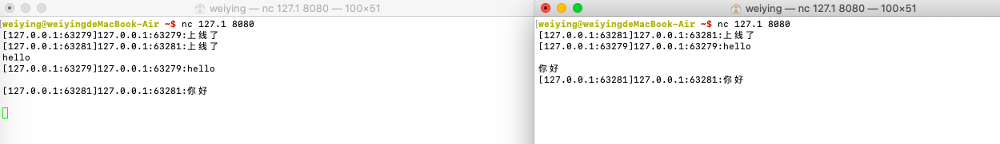
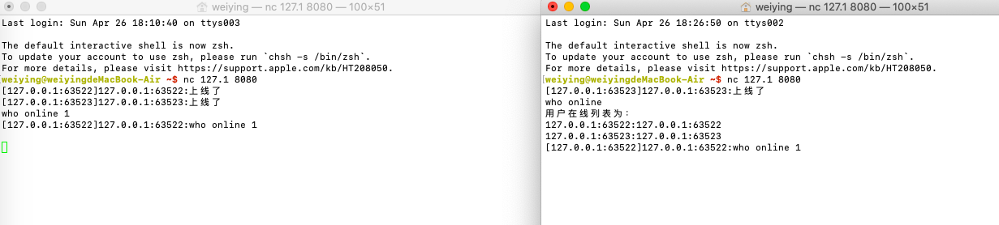

# 并发聊天室
并发编程和网络编程是现今行业中常用的技术,Go 语言强大的语言设定使得并发和网络编程都变得简单而高效

下面利用之前学到的知识,使用并发和网络实现一个简单的网络在线聊天室，在这个小案例中,充分的用到了协程并发处理不同的任务

## 并发聊天室的模块简述

1. 主 go 程(服务器)
负责监听和接收用户连接请求,建立通信关系,同时启动相应的 go 程处理任务，也就是说主 go 程与服务器和客户端之间有 socket 连接，通信的时候主 go 程给每个用户创建 HandleConnect 负责通信

2. 处理用户连接的 go 程: HandleConnect
负责新上线的用户的存储、用户消息读取、发送、用户改名、下线处理及超时处理

为了提高并发效率，同时给一个用户维护多个协程来并行处理上述任务

当新用户上线的时候，要通知所有的在线用户，如果 HandleConnect 去通知的话，效率比较低，那么就创建 message 通道负责此事

3. 用户消息广播：Manager
负责在线用户遍历、用户消息广播发送、需要与 HandleConnect 协程及用户子协程协作完成

监听用户广播的通道 message， 当有新用户上线的时候，HandleConnect 会向 message 通道中写入数据，manager 负责读取通道中的数据，并发送给在线用户

同时也会维护一份在线用户的 map

4. 协程间应用数据及通信
map：存储所有登录聊天室的用户信息，key：用户的 IP+port ， value：Clent 结构体

client 结构体：包含成员：用户名 Name、网络地址 Addr(ip+port)、发送信息的通道 C（channel）

通道 message ： 协调并发协程间消息的传递

5. 广播用户上线
首先，服务器启动，等待用户建立通信连接，当有用户连接上来，将其存储到 map 中，这样就维护了一个“在线用户”的列表，当有新的用户连接上来的时候，应向该列表中所有用户进行广播通知，提示 XXX 用户上线

当然，简单实现手法可以循环读取用户列表中的用户，一次向其发送消息通知新用户上线，但是这种方式无疑是一种串行的通信手段、实现简单、但执行效率低

在 go 语言中，我们利用协程轻便、高效、并发性好的特性，给每个登录用户维护多个协程来进行数据通信，借助 channel 不需要使用同步锁，就可以实现高效的并发通信

具体的实现步骤如下：


1. 当用户 1 连接到服务器端后，连接建立后主 go 程便会为其创建HandleConnect go 程

2. 随之 HandleConnect go 程便会向 message 管道中写入新用户上线的通知消息

3. 消息写入到 message 管道后，原来阻塞监听 message 管道的 manager go 程便会从中读取数据

4. manager 工程将读取到的数据，发送到所有的在线用户的通道 C 中

5. WriteMsgToClent go 程监听到用户的管道 C 中有数据后便会读取出来，并发送给用户，至此所有的用户遍收到了新用户的登录消息

6. WriteMsgToClent 协程
读取用户结构体 C 中的数据，如果没有数据就阻塞等待，有数据写出给登录用户

## 代码实现新用户登录广播通知

1. 在主 go 程创建监听套接字

2. 创建用户结构体、在线 map 和全局的 message

3. 创建用户管理 go 程 manager，并实现 manager，初始化用户在线 map，循环读取全局的管道 message

4. 循环监听用户连接请求

5. 当用户连接后创建新 go 程  HandleConnect 处理数据

6. 获取用户的 ip+port ，并在新创建的 go 程中 HandleConnect 初始化用户结构体信息

7. 将新连接的用户信息添加到在线用户map 中，key 值为 ip+port，value 为用户结构体

8. 创建专门给客户端发送消息的go程，并调用

9. 从用户结构体中的 C 管道中读取数据，通过 socket 发送给客户端

10. HandleConnect 中将用户上线信息发送到 message 管道中


```go
package main

import (
	"fmt"
	"net"
)

// 用户信息结构体
type Client struct {
	Name string  	// 用户名
	addr string		// 用户ip+port
	C chan string	// 用户管道
}

// 创建全局map，用来保存在线的用户
var onlineMap map[string]Client

// 创建全局message
var message = make(chan string)

// 管理者go程
func Manager()  {
	//初始化在线用户列表
	onlineMap = make(map[string]Client)
	for {// 循环监听message通道的是否有数据
		// 如果message中没有数据，会一直处于阻塞的状态
		msg := <- message
		// 循环发送消息给在线用户
		for _, cli := range onlineMap {
			cli.C <- msg
		}
	}
}

// 创建用于创建用户信息的go程
func HandleConnect(conn net.Conn)  {
	defer conn.Close()
	//
	// 获取用户网络地址
	netAddr := conn.RemoteAddr().String()
	// 创建新连接用户的结构体信息,Name 默认为ip+port
	cli := Client{netAddr,netAddr,make(chan string)}

	//将新连接的用户添加到在线用户map中
	onlineMap[netAddr] = cli

	// 调用专门给客户端发送消息的go程
	go WriteMsgToClient(conn,cli)

	// 发送用户上线消息到message管道中
	message <- "[" + netAddr + "]" +cli.Name + " " +"上线了"

	// 暂时使用for循环不让 HandleConnect 子 go 程退出，后面使用select
	for {
		;
	}
}

// 创建专门用户给客户端发送消息的go程
func WriteMsgToClient(conn net.Conn,cli Client)  {
	// 循环监听客户端结构体中的 C 管道，如果有消息就发送给客户端
	// 如果 用户结构体中的 C 管道中没有数据，会处于阻塞的状态
	for msg := range cli.C{
		conn.Write([]byte(msg + "\n"))
		// 此处在mag后面需要加换行符，如果不加的话，发送的时候回认为没有输入完毕，回一直阻塞
	}
}

func main() {
	//  创建监听套接字
	listener , err := net.Listen("tcp", "127.0.0.1:8080")
	if err != nil {
		fmt.Println("net.Listen error:",err)
		return
	}
	defer listener.Close()

	// 创建manager 管理者go程
	go Manager()

	// 循环监听用户连接
	for {
		conn , err := listener.Accept()
		if err != nil {
			fmt.Println("net.Listen error:",err)
			return
		}

		// 创建用于创建用户信息的go程
		go HandleConnect(conn)
	}
}
```
测试


## 用户聊天消息广播
当某个客户端向服务器端发送消息后，服务器端应将该消息广播给其他用户，达到聊天室的效果

设计，在 HandleConnect go 程中开启一个新的 go 程，专门负责接收从客户端发送过来的消息，然后将收到的消息发送给 message 管道

在上面的用户上线广播中，实现了将用户上线的消息发送给管道 message ，message 中一旦有了数据后，便会有 manager 遍历在线成员 map，然后将数据全部发送给在线用户，最终由 WriteMsgToClient go 程将数据发送给客户端

综上，实际上，要完成聊天消息的广播，只需要将读到的数据发送给 message 管道即可达到目的

### 代码实现用户聊天消息广播
上面代码中，向 message 管道中发送消息，使用的是字符串拼接，因为下面还要使用，所以将其写成函数
```go
// 原来的写法
message <- "[" + netAddr + "]" +cli.Name + " " +"上线了"
// 函数写法
func RecvMsg(client Client,str string) string {
	chat:= "[" + client.addr + "]" +client.Name + ":" + str
	return chat
}
```
广播用户聊天消息的代码
```go
// 广播用户聊天消息的go程
func ChatMessages(conn net.Conn,cli Client)  {
	// 创建字符切片，保存用户消息
	buf := make([]byte,4096)
	// 循环读取用户消息
	for {
		n , err := conn.Read(buf)
		if n == 0 {
			fmt.Println("用户",cli.Name,"退出了")
			return
		}
		if err != nil {
			fmt.Println("conn.read chat messages error,",err)
			return
		}
		msg := string(buf[:n])
		// 将聊天消息写入到message 管道中
		message <- RecvMsg(cli,msg)
	}
}
```
测试


## 展示在线用户
当用户输入了 “who online” 后，返回当前在线的用户列表，而且这个列表不需要广播，谁查询就发送给谁
```go
msg := string(buf[:n-1]) // 使用nc命令,会在结尾自动添加"\n",所以读取的时候要去掉换行符
// 判断用户发送的消息
if msg == "who online" { // 如果是查询当前的在线用户
	conn.Write([]byte("用户在线列表为：\n"))
	// 遍历用户在线map
	for _, user :=range onlineMap{
		userInfo := user.addr + ":" + user.Name +"\n"
		//发送给用户
		conn.Write([]byte(userInfo))
	}
}else {
	// 将聊天消息写入到message 管道中
	message <- RecvMsg(cli, msg)
}
```
测试


## 修改用户名
如果用户输入的是“rename| username”， 则修改用户名为 username
```go
msg := string(buf[:n-1]) // 使用nc命令,会在结尾自动添加"\n",所以读取的时候要去掉换行符
// 判断用户发送的消息
if msg == "who online" { // 如果是查询当前的在线用户
	conn.Write([]byte("用户在线列表为：\n"))
	// 遍历用户在线map
	for _, user :=range onlineMap{
		userInfo := user.addr + ":" + user.Name +"\n"
		//发送给用户
		conn.Write([]byte(userInfo))
	}

} else if len(msg)>=8 && msg[:6] == "rename"{
	// 判断如果输入的长度大于等于8，并且前6和字符为rename，才符合改名的条件
	//提取新的用户名，以"｜"符号切割，实现提取用户名
	Newname := strings.Split(msg,"|")[1]
	// 替换用户名
	cli.Name = Newname
	// 更新在线用户列表
	onlineMap[cli.addr] =cli
	//返回结果
	conn.Write([]byte("改名成功\n"))
}else {
	// 将聊天消息写入到message 管道中
	message <- RecvMsg(cli, msg)
}
```

## 用户退出
当检测到有用户退出了之后,应该将其从在线的用户列表中移除用户,然后发送广播消息
```go
func HandleConnect(conn net.Conn) {
	...
	// 发送用户上线消息到message管道中
	message <- RecvMsg(cli, "上线了")
	// 创建用户监听用户是否退出的channel
	IsQuit := make(chan bool)
	// 实现广播用户聊天消息
	go ChatMessages(conn, cli, IsQuit)

	// 暂时使用for循环不让 HandleConnect 子 go 程退出，后面使用select
	for {
		select {
		case <-IsQuit: // 如果channel上有数据了，那么客户端退出了
			// 移除在线用户map
			delete(onlineMap, netAddr)
			// 广播
			message <- RecvMsg(cli, "下线了")
			return
		}
	}
}

func ChatMessages(conn net.Conn, cli Client, IsQuit chan bool) {
	// 创建字符切片，保存用户消息
	buf := make([]byte, 4096)
	// 循环读取用户消息
	for {
		n, err := conn.Read(buf)
		if n == 0 {
			IsQuit <- true
			fmt.Println("监测到用户", cli.Name, "退出了")
			return
		}
		...
}
```

## 超时处理
如果客户端没有主动退出,并且长时间没有发送消息,会一直占用服务器资源,所以,针对这种用户添加超时强踢的机制

这个可以借助并发编程中的 select 机制来实现,select 监听 time.After(60 * time.Second) 管道上的数据流动,如果在及时期间内,没有数据,通道中会被写入当前系统时间,此外我们还需要一个 HasData 来监测用户是否有数据发送,让 select 也来监听这个 channel,这样当用户有数据输入的时候,select 监听这个 hasData 通道会满足 case 条件得以执行,不做任何处理,目的是时监听在 select 中的计时器被重新计时
```go
for {
		select {
		case <-IsQuit: // 如果channel上有数据了，那么客户端退出了
			// 移除在线用户map
			delete(onlineMap, netAddr)
			// 广播
			message <- RecvMsg(cli, "下线了")
			return
		case <- hasData:
			// 如果有数据流动说明用户活跃，重新刷新计时器
		case <- time.After(600 * time.Second):
			delete(onlineMap,netAddr)
			message <- RecvMsg(cli,"超时退出" )
			return
		}
	}


func ChatMessages(conn net.Conn, cli Client, IsQuit chan bool) {
	// 创建字符切片，保存用户消息
	buf := make([]byte, 4096)
	// 循环读取用户消息
	for {
		n, err := conn.Read(buf)
		if n == 0 {
			IsQuit <- true
			fmt.Println("监测到用户", cli.Name, "退出了")
			return
		}
		if err != nil {
			fmt.Println("conn.read chat messages error,", err)
			return
		}
		msg := string(buf[:n-1]) // 使用nc命令,会在结尾自动添加"\n",所以读取的时候要去掉换行符
		// 判断用户发送的消息
		if msg == "who online" { // 如果是查询当前的在线用户
			conn.Write([]byte("用户在线列表为：\n"))
			// 遍历用户在线map
			for _, user := range onlineMap {
				userInfo := user.addr + ":" + user.Name + "\n"
				//发送给用户
				conn.Write([]byte(userInfo))
			}

		} else if len(msg) >= 8 && msg[:6] == "rename" {
			// 判断如果输入的长度大于等于8，并且前6和字符为rename，才符合改名的条件
			//提取新的用户名，以"｜"符号切割，实现提取用户名
			Newname := strings.Split(msg, "|")[1]
			// 替换用户名
			cli.Name = Newname
			// 更新在线用户列表
			onlineMap[cli.addr] = cli
			//返回结果
			conn.Write([]byte("改名成功\n"))
		} else if msg == "exit" || msg == "quit" {
			IsQuit <- true
			return
		}else {
			// 将聊天消息写入到message 管道中
			message <- RecvMsg(cli, msg)
		}
		//只要代码执行到这里，说明用户肯定有输入
		hasData <- true
	}
}
```

# 聊天室完整代码
```go
package main

import (
	"fmt"
	"net"
	"strings"
	"time"
)

// 用户信息结构体
type Client struct {
	Name string      // 用户名
	addr string      // 用户ip+port
	C    chan string // 用户管道
}

// 创建全局map，用来保存在线的用户
var onlineMap map[string]Client

// 创建全局message
var message = make(chan string)

// 创建全局的channel 监听用户是否有数据发送
var hasData = make(chan bool)

// 管理者go程
func Manager() {
	//初始化在线用户列表
	onlineMap = make(map[string]Client)
	for { // 循环监听message通道的是否有数据
		// 如果message中没有数据，会一直处于阻塞的状态
		msg := <-message
		// 循环发送消息给在线用户
		for _, cli := range onlineMap {
			cli.C <- msg
		}
	}
}

// 发送的消息内容的函数
func RecvMsg(client Client, str string) string {
	chat := "[" + client.addr + "]" + client.Name + ":" + str
	return chat
}

// 创建用于创建用户信息的go程
func HandleConnect(conn net.Conn) {
	defer conn.Close()
	//
	// 获取用户网络地址
	netAddr := conn.RemoteAddr().String()
	// 创建新连接用户的结构体信息,Name 默认为ip+port
	cli := Client{netAddr, netAddr, make(chan string)}

	//将新连接的用户添加到在线用户map中
	onlineMap[netAddr] = cli

	// 调用专门给客户端发送消息的go程
	go WriteMsgToClient(conn, cli)

	// 发送用户上线消息到message管道中
	message <- RecvMsg(cli, "上线了")
	// 创建用户监听用户是否退出的channel
	IsQuit := make(chan bool)
	// 实现广播用户聊天消息
	go ChatMessages(conn, cli, IsQuit)

	// 暂时使用for循环不让 HandleConnect 子 go 程退出，后面使用select
	for {
		select {
		case <-IsQuit: // 如果channel上有数据了，那么客户端退出了
			// 移除在线用户map
			delete(onlineMap, netAddr)
			// 广播
			message <- RecvMsg(cli, "下线了")
			return
		case <- hasData:
			// 如果有数据流动说明用户活跃，重新刷新计时器
		case <- time.After(600 * time.Second):
			delete(onlineMap,netAddr)
			message <- RecvMsg(cli,"超时退出" )
			return
		}
	}
}

// 创建专门用户给客户端发送消息的go程
func WriteMsgToClient(conn net.Conn, cli Client) {
	// 循环监听客户端结构体中的 C 管道，如果有消息就发送给客户端
	// 如果 用户结构体中的 C 管道中没有数据，会处于阻塞的状态
	for msg := range cli.C {
		conn.Write([]byte(msg + "\n"))
		// 此处在mag后面需要加换行符，如果不加的话，发送的时候回认为没有输入完毕，回一直阻塞
	}
}

// 广播用户聊天消息的go程
func ChatMessages(conn net.Conn, cli Client, IsQuit chan bool) {
	// 创建字符切片，保存用户消息
	buf := make([]byte, 4096)
	// 循环读取用户消息
	for {
		n, err := conn.Read(buf)
		if n == 0 {
			IsQuit <- true
			fmt.Println("监测到用户", cli.Name, "退出了")
			return
		}
		if err != nil {
			fmt.Println("conn.read chat messages error,", err)
			return
		}
		msg := string(buf[:n-1]) // 使用nc命令,会在结尾自动添加"\n",所以读取的时候要去掉换行符
		// 判断用户发送的消息
		if msg == "who online" { // 如果是查询当前的在线用户
			conn.Write([]byte("用户在线列表为：\n"))
			// 遍历用户在线map
			for _, user := range onlineMap {
				userInfo := user.addr + ":" + user.Name + "\n"
				//发送给用户
				conn.Write([]byte(userInfo))
			}

		} else if len(msg) >= 8 && msg[:6] == "rename" {
			// 判断如果输入的长度大于等于8，并且前6和字符为rename，才符合改名的条件
			//提取新的用户名，以"｜"符号切割，实现提取用户名
			Newname := strings.Split(msg, "|")[1]
			// 替换用户名
			cli.Name = Newname
			// 更新在线用户列表
			onlineMap[cli.addr] = cli
			//返回结果
			conn.Write([]byte("改名成功\n"))
		} else if msg == "exit" || msg == "quit" {
			IsQuit <- true
			return
		}else {
			// 将聊天消息写入到message 管道中
			message <- RecvMsg(cli, msg)
		}
		//只要代码执行到这里，说明用户肯定有输入
		hasData <- true
	}
}

func main() {
	//  创建监听套接字
	listener, err := net.Listen("tcp", "127.0.0.1:8080")
	if err != nil {
		fmt.Println("net.Listen error:", err)
		return
	}
	defer listener.Close()

	// 创建manager 管理者go程
	go Manager()

	// 循环监听用户连接
	for {
		conn, err := listener.Accept()
		if err != nil {
			fmt.Println("net.Listen error:", err)
			return
		}
		// 创建用于创建用户信息的go程
		go HandleConnect(conn)
	}
}

```