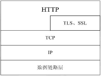
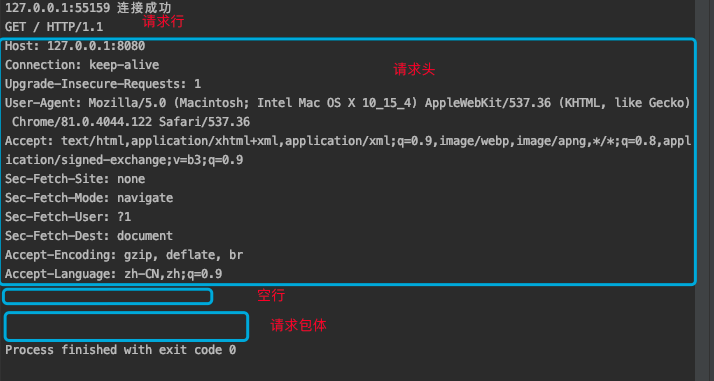
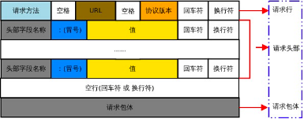
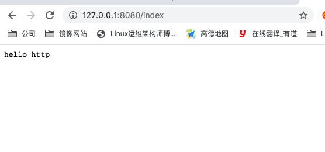
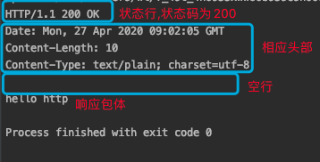
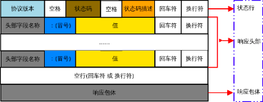

# Web 的工作方式
对于普通的上网过程 ，系统其实是这样做的：浏览器本身是一个客户端，当你输入URL的时候，首先浏览器会去请求DNS服务器，通过DNS获取相应的域名对应的IP，然后通过IP地址找到IP对应的服务器后，要求建立TCP连接，等浏览器发送完HTTP Request（请求）包后，服务器接收到请求包之后才开始处理请求包，服务器调用自身服务，返回HTTP Response（响应）包；客户端收到来自服务器的响应后开始渲染这个Response包里的主体（body），等收到全部的内容随后断开与该服务器之间的TCP连接。

> DNS域名服务器（Domain Name Server）是进行域名(domain name)和与之相对应的IP地址转换的服务器。DNS中保存了一张域名解析表，解析消息的域名。

一个Web服务器也被称为HTTP服务器，它通过HTTP (HyperText Transfer Protocol 超文本传输协议)协议与客户端通信。这个客户端通常指的是Web浏览器(其实手机端客户端内部也是浏览器实现的)。

## Web 服务器的工作原理简单的总结

1. 客户端通过 TCP/IP 协议建立与服务器的 TCP 连接

2. 客户端向服务器发送 HTTP 协议请求包,请求服务器里的资源文档

3. 服务器向客户机发送 HTTP 应答包,如果请求的资源包含有动态语言的内容，那么服务器会调用动态语言的解释引擎负责处理“动态内容”，并将处理得到的数据返回给客户端

4. 客户机与服务器断开,与客户端解释 HTML 文档,在客户端上渲染图形结果

# HTTP 协议
超文本传输协议(HyperText Transfer Protocol),是互联网上应用最广泛的网络协议,它详细的规定了浏览器和万维网服务器间的互相通信规则,通过因特网传送万维网文档的数据传送协议

HTTP协议通常承载于TCP协议之上，有时也承载于TLS或SSL协议层之上，这个时候，就成了我们常说的HTTPS



## URL
URL(统一资源定位符)全称为Unique Resource Location，用来表示网络资源，可以理解为网络文件路径。

基本URL的结构包含模式（协议）、服务器名称（IP地址）、路径和文件名。常见的协议/模式如http、https、ftp等。服务器的名称或IP地址后面有时还跟一个冒号和一个端口号。再后面是到达这个文件的路径和文件本身的名称。

URL的长度有限制，不同的服务器的限制值不太相同，但是不能无限长。

#### URL 的组成
```bash
<scheme>://<user>:<password>@<host>:<port>/<path>;<params>?<query>#<frag>
	scheme:方案，访问服务器以获取资源时要使用哪种协议
	user:用户，某些方案访问资源时需要的用户名
	password:密码，用户对应的密码，中间用：分隔
	Host:主机，资源宿主服务器的主机名或IP地址
	port:端口,资源宿主服务器正在监听的端口号，很多方案有默认端口号
	path:路径,服务器资源的本地名，由一个/将其与前面的URL组件分隔
	params:参数，指定输入的参数，参数为名/值对，多个参数，用;分隔
	query:查询，传递参数给程序，如数据库，用？分隔,多个查询用&分隔
	frag:片段,一小片或一部分资源的名字，此组件在客户端使用，用#分隔
```

## HTTP 报文解析

#### HTTP 协议的请求报文
为了直观的看到浏览器发送的请求报文,我们首先创建一个简单的 web 服务器,接收浏览器的数据,打印查看
```bash
package main

import (
	"fmt"
	"net"
	"os"
)
// 错误封装函数
func errFunc(info string,err error)  {
	if err != nil {
		fmt.Println(info,"error:",err)
		os.Exit(1) // 无论在什么位置调用，都表示将当前的进程结束
	}
}

func main()  {
	// 创建监听
	listen ,err := net.Listen("tcp","127.0.0.1:8080")
	errFunc("net.listen",err)
	defer listen.Close()

	// 等待用户连接
	conn , err := listen.Accept()
	errFunc("listen.accept",err)
	defer conn.Close()
	fmt.Println(conn.RemoteAddr().String(),"连接成功")
	buf := make([]byte,4096)
	n , err := conn.Read(buf)
	if n == 0 {
		return
	}
	errFunc("conn.read",err)
	result := string(buf[:n])

	fmt.Println(result)
}
```
使用浏览器访问后查看服务端代码的打印结果
```go
GET / HTTP/1.1
Host: 127.0.0.1:8080
Connection: keep-alive
Upgrade-Insecure-Requests: 1
User-Agent: Mozilla/5.0 (Macintosh; Intel Mac OS X 10_15_4) AppleWebKit/537.36 (KHTML, like Gecko) Chrome/81.0.4044.122 Safari/537.36
Accept: text/html,application/xhtml+xml,application/xml;q=0.9,image/webp,image/apng,*/*;q=0.8,application/signed-exchange;v=b3;q=0.9
Sec-Fetch-Site: none
Sec-Fetch-Mode: navigate
Sec-Fetch-User: ?1
Sec-Fetch-Dest: document
Accept-Encoding: gzip, deflate, br
Accept-Language: zh-CN,zh;q=0.9
//空行,不能省略 为\r\n
//空行
// 请求包体
```


#### 请求报文格式说明
HTTP 请求报文由请求行、请求头部、空行、请求包体4个部分组成，如下图所示


1. 请求行
请求行由方法字段、URL 字段 和HTTP 协议版本字段 3个部分组成，他们之间使用空格隔开。常用的 HTTP 请求方法有 GET、POST、HEAD、PUT、DELETE、OPTIONS、TRACE

- GET:

当客户端要从服务器中读取某个资源时，使用GET 方法。GET 方法要求服务器将URL 定位的资源放在响应报文的数据部分，回送给客户端，即向服务器请求某个资源。

使用GET方法时，请求参数和对应的值附加在 URL 后面，利用一个问号(“?”)代表URL 的结尾与请求参数的开始，传递参数长度受限制，因此GET方法不适合用于上传数据。

通过GET方法来获取网页时，参数会显示在浏览器地址栏上，因此保密性很差

- POST:

当客户端给服务器提供信息较多时可以使用POST 方法，POST 方法向服务器提交数据，比如完成表单数据的提交，将数据提交给服务器处理。

GET 一般用于获取/查询资源信息，POST 会附带用户数据，一般用于更新资源信息。POST 方法将请求参数封装在HTTP 请求数据中，而且长度没有限制，因为POST携带的数据，在HTTP的请求正文中，以名称/值的形式出现，可以传输大量数据。

- HEAD : 只从服务器获取文档的响应首部

- PUT : 将请求的主体部分直接存储在服务器上

- DELETE : 请求删除服务器上的指定数据

- OPTIONS : 请求服务器返回对指定资源支持使用的请求方法

- TRACE : 追踪请求到达服务器中间经过的代理服务器

2. 请求头

- Host: 请求的主机和端口,允许多个域名同处一个 ip 地址,即虚拟主机

- Connection: 连接方式,close或keep-alive

- User-Agent: 请求的浏览器类型

- Accept:通知服务器客户端能够接受的媒体类型，星号“ * ”用于按范围将类型分组，用“ */* ”指示可接受全部类型，用“ type/* ”指示可接受 type 类型的所有子类型

- Accept-Language:客户端可接受的自然语言

- Accept-Encoding:客户端可接受的编码压缩格式

- Accept-Charset:客户端可接受的应答的字符集

- Cookie:存储于客户端扩展字段，向同一域名的服务端发送属于该域的cookie

3. 空行
最后一个请求头之后是一个空行，发送回车符和换行符，通知服务器以下不再有请求头

4. 请求包体
请求包体不在GET方法中使用，而在POST方法中使用。POST方法适用于需要客户填写表单的场合。与请求包体相关的最常使用的是包体类型Content-Type和包体长度Content-Length。

### HTTP 的响应报文
要想获取响应报文,首先要发送请求报文给 web 服务器,服务器收到并解析浏览器发送的请求报文后,借助 http 协议,回复对应的响应报文

下面我们借助 net/http 包,创建一个最简单的服务器,给浏览器发送响应报文,首先注册处理函数 http.HandleFunc(),设置回调函数 handler,而后绑定服务器的监听地址 http.ListenAndserver()

这个服务器启动后,当有浏览器发送请求,回调函数会被调用,会向浏览器回复 "hello http" 作为网页内容.当然,会按照 HTTP 协议的格式进行回复
```go
func HandleFunc(pattern string, handler func(ResponseWriter, *Request)) {
	DefaultServeMux.HandleFunc(pattern, handler)
}
// 第一个参数为访问的路径
// 第二个参数为要注册的回调函数,函数参数固定

func ListenAndServe(addr string, handler Handler) error {
	server := &Server{Addr: addr, Handler: handler}
	return server.ListenAndServe()
}
// 第一个参数为绑定的服务器的地址和端口
//第二个参数为指定的回调函数,表示客户端访问的时候,调用该函数回应访问,如果为空,会调用自带的回调函数
```
##### 简单的 web 服务器创建
```go
package main

import "net/http"

func handler(w http.ResponseWriter,r *http.Request)  {
	// w 表示写回给客户端的数据 ， r表示从客户端读取的数据
	w.Write([]byte("hello http"))
}

func main()  {
	//注册回调函数，会在服务器被访问的时候，自动调用
	http.HandleFunc("/index",handler)
	// 第一个参数为访问的路径
	// 第二个参数为要注册的回调函数,传递的是函数名,也就是函数地址

	// 绑定服务器监听地址
	http.ListenAndServe("127.0.0.1:8080",nil)
}
```
启动后使用浏览器访问测试


###### 回调函数
本质就是函数指针,通过地址在某一特定位置调用函数

在程序中,定义一个函数,但是并不显示调用,当某一条件满足的时候,由操作系统自动调用

在上面的代码中,当有浏览器去访问资源 /index 的时候,函数会被自动调用

##### 下面创建客户端,模拟浏览器发送请求报文,然后将服务器的响应报文打印查看
```go
package main

import (
	"fmt"
	"net"
)

func main()  {
	// 客户端主动连接服务器
	conn, err := net.Dial("tcp","127.0.0.1:8080")
	if err != nil {
		fmt.Println(err)
		return
	}
	defer conn.Close()

	//模拟浏览器，组织最简单的请求报文
	httpRequest := "GET /index HTTP/1.1\r\nHost:127.0.0.1:8080\r\n\r\n"
	//给服务器发送请求报文
	conn.Write([]byte(httpRequest))

	buf := make([]byte,4096)
	n , err := conn.Read(buf)
	if n==0 {
		return
	}
	if err != nil {
		fmt.Println(err)
		return
	}
	fmt.Println(string(buf[:n]))
}
```
运行程序查看响应报文
```go
HTTP/1.1 200 OK
Date: Mon, 27 Apr 2020 09:02:05 GMT
Content-Length: 10
Content-Type: text/plain; charset=utf-8
// 空行
hello http
```


#### HTTP响应包说明
HTTP 响应报文由状态行、响应头部、空行、响应包体4个部分组成，如下图所示


1. 状态行
状态行由 HTTP 协议版本字段,响应状态码字段和状态码描述字段组成,中间使用空格隔开

- 状态码:由三位数字组成,第一位数字表示响应的类型
	1xx:100,101,表示服务器端已经接收到了客户端的请求,客户端可以继续发送请求
	2xx:200-206,表示服务器端已经成功的接收到了请求,并进行的处理
	3xx:300-305,表示服务器端要求客户端重定向(源访问请求重定向到新的位置)
	4xx:400-415,表示错误类信息，客户端错误
	5xx：500-505，错误类信息，服务器端错误

常见的错误状态码
```bash
200：成功，请求的所有数据通过响应报文的entity-body部分发送：ok
301：永久重定向，请求的URL指向的资源已经被删除，但在响应报文中通过首部location指明了资源现在所在的新位置:Moved Permanently
302：与301相似，不过在响应报文通过location首部指明资源现在所在的临时新位置:Found
304：客户端发出条件式请求，但服务器上的资源未曾发生改变，通过此响应状态码通知客户端: Not Modfiled
401：需要输入账号和密码认证后后才能访问:Unauthorized
403：请求被禁止:Forbidden
404：服务器无法找到客户端请求的资源:Not Found
500：服务器内部错误：Internal Server Error
502：代理服务器从后端服务器收到了一条伪响应：Bad Getway
```

2. 响应头部

- Location:响应报头域用于重定向接收者到一个新的位置,告知客户端正真的实体位于何处

- Server:server 响应报头域中包含了服务器用来处理请求的软件信息及其版本,服务器自己程序的名称和版本

- Vary:指示不可缓存的请求头列表,服务器查看其它的首部列表

- Connection:连接方式

- Age:响应持续时长

- Acc—Ranges：服务器可接受的请求范围类型

- Set-Cookie：向客户端设置cookie

- www-Authorization：来自服务器对客户端的质询认证表单

3. 空行
最后一个响应头部之后是一个空行，发送回车符和换行符，通知服务器以下不再有响应头部

4. 响应包体
服务器返回给客户端的文本信息