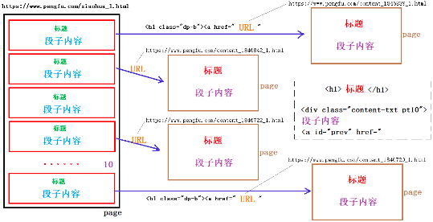
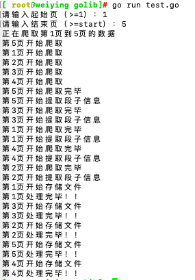
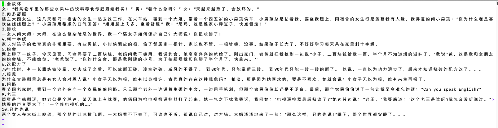

# 捧腹网页面结构分析
首先打开捧腹网的网站首页,然后点击菜单中的段子,测试翻页的特性
https://www.pengfu.com/xiaohua_1.html   下一页 +1
https://www.pengfu.com/xiaohua_2.html
https://www.pengfu.com/xiaohua_3.html

每页有 10 个段子,每一个标题都对应一个独立的 URL 连接,该链接的特征是:
```html
<h1 class="dp-b"><a href="URL" target="_blank">段子标题</a> 
</h1>
```
点开该链接后,可以打开一个独立的页面,包含该段子对应的标题和内容,标题和内容的特征是
```html
<h1>段子标题															</h1>  //此页中有两个<h1>标签,第一个<h1>标签才是我们要用的

<div class="content-txt pt10">
																段子内容								<a id="prev" href="https://www.pengfue.com/content_1857807_1.html"></a>
```

整体的结构如下:


根据上面的分析,得出匹配正则表达式为

1. 页面中段子的 url
```go
`<h1 class="dp-b"><a href="(?s:(.*?))" target="_blank" rel="noopener noreferrer">`
```

2. 段子页面中的标题
```go
`<h1>(?s:(.*?))</h1>`
```

3. 段子内容
```go
`<div class="content-txt pt10">(?s:(.*?))<a`
```


### 爬取段子的代码实现

根据上述分析，爬取“捧腹网”段子内容，大致可以分为三步实现。
1. 先获取网页规律，根据用户指定起始、终止页打开要爬取的网页。并获取每一个网页中单个段子所对应页面的URL。
2. 依次将每一个段子对应的网页打开，读取标题和正文内容。
3. 将一个网页内容（10个段子）保存成一个 .txt文件。

```go
package main

import (
	"fmt"
	"io"
	"net/http"
	"os"
	"regexp"
	"strconv"
	"strings"
)

func worker(start , end int)  {
	fmt.Printf("正在爬取第%d页到%d页的数据\n",start,end)
	// 创建管道，使主go程在完全爬取完数据有才结束
	page := make(chan int)
	//循环爬取页面
	for i := start ; i <= end ;i++ {
		// 每个页面的url
		url := "https://www.pengfue.com/xiaohua_"+strconv.Itoa(i)+".html"
		go SpiderPage(url , i,page)
	}
	for i := start ; i <= end ;i++ {
		fmt.Printf("第%d页处理完毕！！\n", <-page)
	}
}

func SpiderPage(url string , index int,page chan int)  {
	fmt.Printf("第%d页开始爬取\n",index)
	// 调用指定的函数获取页面信息
	result , err :=HttpGet(url)
	if err != nil {
		fmt.Println("http.get page error:",err)
		return
	}
	fmt.Printf("第%d页开始爬取完毕\n",index)
	// 解析编译提取页面的正则表达式
	res1 := regexp.MustCompile(`<h1 class="dp-b"><a href="(?s:(.*?))" target="_blank" rel="noopener noreferrer">`)
	// 提取URL
	DZ_url := res1.FindAllStringSubmatch(result,-1)

	//调用函数到指定的段子的页面中读取数据
	fmt.Printf("第%d页开始提取段子信息\n",index)
	DZ_list := SpiderDZ(DZ_url)
	// 存储到文件中
	fmt.Printf("第%d页开始存储文件\n" ,index)
	SaveToFile(DZ_list,index)

	page <- index
}

func SpiderDZ(DZ_url [][]string) (DZ_list []string){
	//一页有10个段子，依次到10和段子中爬取
	DZ_list = make([]string,0)
	for i :=0 ; i <len(DZ_url); i++ {
		var  result_dz string
		res , err := http.Get(DZ_url[i][1])
		if err != nil {
			fmt.Println("http.get 段子 error",err)
			continue // 失败后爬取下一个段子
		}
		defer res.Body.Close()
		buf := make([]byte,4096)
		for {
			n , err2 := res.Body.Read(buf)
			if n == 0 {
				//读取完毕
				break
			}
			if err2 != nil && err2 != io.EOF {
				err = err2
				return
			}
			result_dz += string(buf[:n])
		}
		//爬取完一个页面后解析
		// 解析编译提取段子标题的正则表达式
		res2 := regexp.MustCompile(`<h1>(?s:(.*?))</h1>`)
		// 提取URL
		title := res2.FindAllStringSubmatch(result_dz,1) // 有两处，只提取第一个

		// 解析编译提取段子内容的正则表达式
		res3 := regexp.MustCompile(`<div class="content-txt pt10">(?s:(.*?))<a`)
		// 提取URL
		message := res3.FindAllStringSubmatch(result_dz,-1)
		// 将title和message追加到切片中
		con := strconv.Itoa(i+1) + "." + strings.Replace(title[0][1],"\t","",-1) + "\t" + strings.Replace(message[0][1],"\t","",-1) + "\n"
		DZ_list = append(DZ_list,con)
	}
	return
}

func SaveToFile(DZ_list []string,index int)  {
	// 创建文件
	f, err := os.Create("/Users/weiying/Desktop/crawler/" + "第" + strconv.Itoa(index) + "页" + ".txt")
	if err != nil {
		fmt.Println("os.create error:",err)
		return
	}
	defer f.Close()
	for _,data := range DZ_list {
		f.WriteString(data)
	}
}

func HttpGet(url string) (result string , err error)  {
	res , err1 := http.Get(url)
	if err1 != nil {
		err = err1
		return
	}
	//fmt.Println(res.Status)
	defer res.Body.Close()
	buf := make([]byte,4096)
	for {
		n , err2 := res.Body.Read(buf)
		if n == 0 {
			//读取完毕
			break
		}
		if err2 != nil && err2 != io.EOF {
			err = err2
			return
		}
		result += string(buf[:n])
	}
	return
}

func main()  {
	var start , end int
	fmt.Printf("请输入起始页（>=1）：")
	fmt.Scan(&start)
	fmt.Printf("请输入结束页（>=start）：")
	fmt.Scan(&end)
	//封装函数，完成爬虫任务
	worker(start,end)
}
```
执行代码,查看结果


