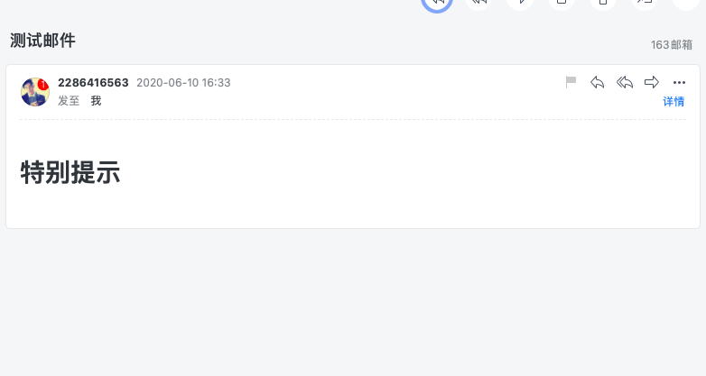

## 发送邮件的流程
实际上是使用了中间的 smtp 服务器,beego 的网站将邮件发送到 smtp 服务器,然后由 smtp 服务器将邮件发送给用户

### 具体实现,以 QQ 邮箱为例

1. 指定发送邮件的配置信息
```go
config := `{"username":"发件邮箱的地址","password":"授权码","host":"smtp.qq.com","port":587}`
```

这里指定了发件人的名称,以及对应的授权码,对应的 SMTP 服务器以及对应的端口号

2. 创建一个 EMAIL的对象
```go
eamil := utils.NewEMail(config)

func NewEMail(config string) *Email {
	e := new(Email)
	e.Headers = textproto.MIMEHeader{}
	err := json.Unmarshal([]byte(config), e)
	if err != nil {
		return nil
	}
	return e
}
```

3. 通过 EMAIL 对象中的属性,指定发件人邮箱,收件人邮箱,邮件标题以及内容
```go
// 指定收件人邮箱地址，一般为用户注册的时候填写的地址
	teamil.To = []string{"15324165633@163.com"}
	//指定发件人邮箱
	teamil.From = "2286416563@qq.com"
	// 指定邮件主题
	teamil.Subject = "测试邮件"
	// 指定邮件内容，应该是给用户发送一个激活用户的链接
	teamil.Text = "测试邮件"
	// 以HTML的形式解析
	teamil.HTML = "<h1>特别提示</h1>"
	// 发送邮件
	teamil.Send()
```

查看接收到的邮件
 