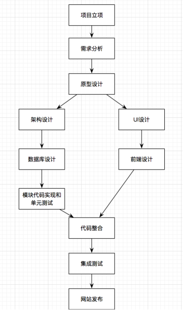

## 认识电商

1. B2B:企业对企业
2. C2C:个人对个人
3. B2C:企业对个人
4. C2B:个人对企业
5. O2O:线上到线下
6. F2C:工厂到个人
7. B2B2C"企业-企业-个人(供应商-互联网销售企业-个人)

## web 项目的开发流程

 

1. 立项: 准备对应的人员和物品的配置
2. 需求分析:根据需要分析具体需要的模块和功能
3. 原型设计: 一般是产品经理通过 Axure 先大体的设计一个网站
4. 接下就是后台代码的设计


## 天天生鲜项目的需求分析

1. 用户注册模块
- 登录
- 注册
- 个人中心

2. 商品模块
- 首页
- 商品详情页
- 商品列表页
- 其他

3. 购物车模块
- 将商品添加到购物车
- 用户登录后,显示购物车的条目
- 对购物车中的商品的操作

4. 订单模块
- 提交订单页面
- 用户中心显示订单信息
- 提交订单后生成订单
- 订单的支付

5. 后台模块
对商品进行管理


## 天天生鲜项目,数据库设计

#### 用户表

- 用户 id
- 用户名
- 密码
- 邮箱
- 是否激活标识
- 权限标识: 用来标识是否具有管理后台的权限

#### 地址表

-  地址 id
- 地址
- 联系方式
- 联系人
- 标识:用来标记默认地址
- 邮编
- 用户 id(外键,和用户的关系为一个用户可以有多个地址)

#### 商品sku表

- 商品 id
- 商品名称
- 商品简介
- 价格
- 计量单位
- 商品图片
- 商品详情
- 销量
- 库存量
- 商品类型id(外键,和商品类型表为一个类型对应多个商品)
- 商品spu id (外键,一个 spu 可以有多个 sku)

#### 商品类型表

- 类型 id
- 名称
- 图片
- logo 图片

#### 商品 spu 表

- id
- 商品名称
- 详情

#### 商品轮播图

- id
- 图片
- 对应的商品 id 或者是活动的 url
- 滚动的顺序(下标)

#### 促销商品表

- id
- 图片
- 活动的 URL
- index

#### 首页的商品展示表

- id
- 类型id(外键)
- 商品 id(外键)
- 商品首页展示类型(使用文字或者图片展示)
- index(展示的次序)

#### 订单表

- id
- 时间
- 订单号
- 支付状态
- 收货地址id(外键)
- 支付方式
- 商品
- 商品总价
- 运费
- 总价格

#### 订单商品表

- id
- 商品 id
- 订单 id
- 商品数量


> 购物车使用 redis 存储,历史的浏览记录也通过 redis 存储


## 天天生鲜项目创建

1. 创建 Beego 项目
```bash
go get -u -v github.com/astaxie/beego
go get -u -v github.com/beego/bee
```

2. 创建新的工程
```bash
bee new fresh
```


### 完成数据库的创建

```bash
package models

import (
	"github.com/astaxie/beego/orm"
	_ "github.com/go-sql-driver/mysql"
	"time"
)

type User struct { //用户表
	Id        int
	Name      string       `orm:"size(20);unique"` //用户名
	PassWord  string       `orm:"size(20)"`        //登陆密码
	Email     string       `orm:"size(50)"`        //邮箱
	Active    bool         `orm:"default(false)"`  //是否激活
	Power     int          `orm:"default(0)"`      //权限设置  0 表示未激活  1表示激活
	Address   []*Address   `orm:"reverse(many)"`
	OrderInfo []*OrderInfo `orm:"reverse(many)"`
}

type Address struct { //地址表
	Id        int
	Receiver  string       `orm:"size(20)"`      //收件人
	Addr      string       `orm:"size(50)"`      //收件地址
	Zipcode   string       `orm:"size(20)"`      //邮编
	Phone     string       `orm:"size(20)"`      //联系方式
	Isdefault bool         `orm:"defalt(false)"` //是否默认 0 为非默认  1为默认
	User      *User        `orm:"rel(fk)"`       //用户ID
	OrderInfo []*OrderInfo `orm:"reverse(many)"`
}

type Goods struct { //商品SPU表
	Id       int
	Name     string      `orm:"size(20)"`  //商品名称
	Detail   string      `orm:"size(200)"` //详细描述
	GoodsSKU []*GoodsSKU `orm:"reverse(many)"`
}

type GoodsType struct { //商品类型表
	Id                   int
	Name                 string                  //种类名称
	Logo                 string                  //logo
	Image                string                  //图片
	GoodsSKU             []*GoodsSKU             `orm:"reverse(many)"`
	IndexTypeGoodsBanner []*IndexTypeGoodsBanner `orm:"reverse(many)"`
}

type GoodsSKU struct { //商品SKU表
	Id                   int
	Goods                *Goods                  `orm:"rel(fk)"` //商品SPU
	GoodsType            *GoodsType              `orm:"rel(fk)"` //商品所属种类
	Name                 string                  //商品名称
	Desc                 string                  //商品简介
	Price                int                     //商品价格
	Unite                string                  //商品单位
	Image                string                  //商品图片
	Stock                int                     `orm:"default(1)"`   //商品库存
	Sales                int                     `orm:"default(0)"`   //商品销量
	Status               int                     `orm:"default(1)"`   //商品状态
	Time                 time.Time               `orm:"auto_now_add"` //添加时间
	GoodsImage           []*GoodsImage           `orm:"reverse(many)"`
	IndexGoodsBanner     []*IndexGoodsBanner     `orm:"reverse(many)"`
	IndexTypeGoodsBanner []*IndexTypeGoodsBanner `orm:"reverse(many)"`
	OrderGoods           []*OrderGoods           `orm:"reverse(many)"`
}

type GoodsImage struct { //商品图片表
	Id       int
	Image    string    //商品图片
	GoodsSKU *GoodsSKU `orm:"rel(fk)"` //商品SKU
}
type IndexGoodsBanner struct { //首页轮播商品展示表
	Id       int
	GoodsSKU *GoodsSKU `orm:"rel(fk)"` //商品sku
	Image    string    //商品图片
	Index    int       `orm:"default(0)"` //展示顺序
}

type IndexTypeGoodsBanner struct { //首页分类商品展示表
	Id          int
	GoodsType   *GoodsType `orm:"rel(fk)"`    //商品类型
	GoodsSKU    *GoodsSKU  `orm:"rel(fk)"`    //商品sku
	DisplayType int        `orm:"default(1)"` //展示类型 0代表文字，1代表图片
	Index       int        `orm:"default(0)"` //展示顺序
}

type IndexPromotionBanner struct { //首页促销商品展示表
	Id    int
	Name  string `orm:"size(20)"` //活动名称
	Url   string `orm:"size(50)"` //活动链接
	Image string //活动图片
	Index int    `orm:"default(0)"` //展示顺序
}

type OrderInfo struct { //订单表
	Id           int
	OrderId      string    `orm:"unique"`
	User         *User     `orm:"rel(fk)"` //用户
	Address      *Address  `orm:"rel(fk)"` //地址
	PayMethod    int       //付款方式
	TotalCount   int       `orm:"default(1)"` //商品数量
	TotalPrice   int       //商品总价
	TransitPrice int       //运费
	Orderstatus  int       `orm:"default(1)"`   //订单状态
	TradeNo      string    `orm:"default('')"`  //支付编号
	Time         time.Time `orm:"auto_now_add"` //评论时间

	OrderGoods []*OrderGoods `orm:"reverse(many)"`
}

type OrderGoods struct { //订单商品表
	Id        int
	OrderInfo *OrderInfo `orm:"rel(fk)"`    //订单
	GoodsSKU  *GoodsSKU  `orm:"rel(fk)"`    //商品
	Count     int        `orm:"default(1)"` //商品数量
	Price     int        //商品价格
	Comment   string     `orm:"default('')"` //评论
}

func init() {
	// set default database
	orm.RegisterDataBase("default", "mysql", "root:admin123@tcp(172.19.36.69:3306)/dailyfresh?charset=utf8")

	// register model
	orm.RegisterModel(new(User), new(Address), new(OrderGoods), new(OrderInfo), new(IndexPromotionBanner), new(IndexTypeGoodsBanner), new(IndexGoodsBanner), new(GoodsImage), new(GoodsSKU), new(GoodsType), new(Goods))

	// create table
	orm.RunSyncdb("default", false, true)
}
```

4. 在 main 函数中导入数据库的初始化
```go
package main

import (
	_ "fresh/routers"
	_ "fresh/models"
	"github.com/astaxie/beego"
)

func main() {
	beego.Run()
}


```

5. 导入静态资源,并将动态资源存放到视图中