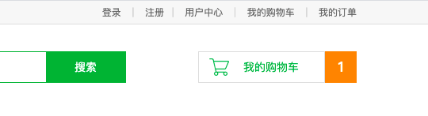

## 用户注册

用户通过网站购买商品之前,必须登录,如果该用户没有账号的话,是需要注册的

#### 用户注册界面的显示

1. 创建用户注册界面的路由
```go
beego.Router("/register",&controllers.UserController{},"get:UserRegiterShow")
```

2. 根据路由创建对应的控制器
```go
func (this *UserController) UserRegiterShow() {
	this.TplName = "register.html"
}
```

#### 用户注册功能的实现

1. 视图中 form 标签实现 post 请求和 action 提交的地址
```go
<form method="post" action="/register">
```
2. 注册请求路由的实现
```go
	beego.Router("/register",&controllers.UserController{},"get:UserRegiterShow;postUserRegisterHandle")

```

3. 处理用户注册控制器
```go
package controllers

import (
	"fresh/models"
	"github.com/astaxie/beego"
	"github.com/astaxie/beego/orm"
	"github.com/astaxie/beego/utils"
	"regexp"
	"strconv"
)

type UserController struct {
	beego.Controller
}

// 用户注册界面显示
func (this *UserController) UserRegiterShow() {
	this.TplName = "register.html"
}

// 处理用户的注册请求
func (this *UserController) UserRegisterHandle() {
	// 获取用户发送的数据
	username := this.GetString("user_name")
	passwd := this.GetString("pwd")
	cpasswd := this.GetString("cpwd")
	email := this.GetString("email")
	// 对获取的数据进行校验
	if username == "" || passwd == "" || cpasswd == "" || email == "" {
		this.Data["errmsg"] = "输入的信息不完整，请重新输入"
		this.TplName = "register.html"
		return
	}
	// 判断用户两次输入的密码是否一致
	if passwd != cpasswd {
		this.Data["errmsg"] = "两次密码输入不一致，请重新输入"
		this.TplName = "register.html"
		return
	}
	// 判断用户的邮箱，使用正则
	rex_email := `\w+([-+.]\w+)*@\w+([-.]\w+)*\.\w+([-.]\w+)*`
	// 解析正则表达式
	reg , _ := regexp.Compile(rex_email)
	res := reg.FindString(email)
	if res == "" {
		this.Data["errmsg"] = "邮箱格式不正确"
		this.TplName = "register.html"
		return
	}

	// 处理数据，插入数据库
	db := orm.NewOrm()

	user := models.User{}

	user.Name = username
	user.PassWord = passwd
	user.Email = email
	// 校验用户名是否重名
	err := db.Read(&user,"Name")
	if err != orm.ErrNoRows {
		this.Data["errmsg"] = "用户以存在，请重新注册！"
		this.TplName = "register.html"
		return
	}
	// 如果用户不存在的话，插入数据库
	_ ,err = db.Insert(&user)
	if err != nil {
		this.Data["errmsg"] = "数据插入失败，请重新注册"
		this.TplName = "register.html"
		return
	}
	// 发送用于用户激活的邮件
	// 指定发送邮件的配置信息
	config := `{"username":"2286416563@qq.com","password":"llnoftodmbqndjhj","host":"smtp.qq.com","port":587}`
	// 根据配置信息，创建指定的email 对象
	temail := utils.NewEMail(config)
	// 通过EMAIL对象中的属性。指定，发件人邮箱，收件人邮箱，邮件标题，以及邮件的内容。
	temail.From = "2286416563@qq.com"
	temail.To = []string{email}
	temail.Subject = "天天生鲜用户激活"
	temail.HTML = "复制该连接到浏览器中激活: 127.0.0.1/active?id="+strconv.Itoa(user.Id)
	// 发送邮件
	err = temail.Send()
	if err != nil{
		this.Data["errmsg"] = "发送激活邮件失败，请重新注册！"
		this.TplName = "register.html"
		return
	}
	this.Ctx.WriteString("注册成功，请前往邮箱激活!")

}
```

4. 在用户的注册界面,展示一下错误信息
```go
...
                <label>邮箱:</label>
                <input type="text" name="email" id="email">
                <span class="error_tip">提示信息</span>
            </li>
            <li class="agreement">
                <input type="checkbox" name="allow" id="allow" checked="checked">
                <label>同意”天天生鲜用户使用协议“</label>
                <span class="error_tip2">提示信息</span>
            </li>
            <li class="reg_sub">
                <input type="submit" value="注 册" name="">
            </li>
        </ul>				
        </form>
    </div>
    {{ .errmsg }}<!--------展示出对应的错误信息---------->
</div>
```

## 用户激活
上面的操作中,我们已经完成了用户的注册,并向用户发送了对应的邮件,邮件中指定了激活的 url

1. 根据 url 中发送到地址,创建路由
```go
beego.Router("/active",&controllers.UserController{},"get:UserActive")
```

2. 创建控制器
```go
func (this *UserController) UserActive() {
	// 获取用户id
	id ,err := this.GetInt("id")
	if err !=nil{
		this.Data["errmsg"] = "激活路径不正确，请重新确定之后登陆！"
		this.TplName = "login.html"
		return
	}
	// 根据获取的id 查询数据库
	db := orm.NewOrm()

	user := models.User{}

	user.Id = id

	err = db.Read(&user,"Id")
	if err != nil{
		this.Data["errmsg"] = "激活路径不正确，请重新确定之后登陆！"
		this.TplName = "login.html"
	}
	// 将active字段改为激活，并更新
	user.Active = true
	_ , err = db.Update(&user)
	if err != nil{
		this.Data["errmsg"] = "激活失败，请重新确定之后登陆！"
		this.TplName = "login.html"
	}
	this.Redirect("/login",302)
}
```


## 用户登录

1. 创建显示用户登录界面的路由
```go
beego.Router("/login",&controllers.UserController{},"get:UserLogin")
```

2. 创建登录页面控制器
```go
func (this *UserController) UserLogin() {
	this.TplName = "login.html"
}
```

3. 用户登录视图修改 form
```go
<form action="/login" method="post">
```

4. 处理用户登录的路由
```go
	beego.Router("/login",&controllers.UserController{},"get:UserLogin;post:UserLoginHandle")

```

5. 实现用户登录,并实现记住用户名
这里实现的时候,要注意,使用 cookie 记住用户名的时候,是不支持中文的,如果是实现中文需要使用 base64 进行序列化

```go
func (this *UserController) UserLoginHandle() {
	// 获取数据
	username := this.GetString("username")
	passwd := this.GetString("pwd")
	// 判断数据
	if username == "" || passwd == "" {
		this.Data["errmsg"] = "用户名和密码不能为空，请重新输入"
		this.TplName = "login.html"
		return
	}

	// 到数据库中查询用户名是否存在
	db := orm.NewOrm()
	user := models.User{}

	user.Name = username
	// 首先判断用户名是否存在
	err := db.Read(&user,"Name")
	if err != nil {
		this.Data["errmsg"] = "用户名或密码错误，请重新输入"
		this.TplName = "login.html"
		return
	}
	// 再判断密码是否正确
	if user.PassWord != passwd {
		this.Data["errmsg"] = "用户名或密码错误，请重新输入"
		this.TplName = "login.html"
		return
	}
	// 判断用户是否激活
	if user.Active == false {
		this.Data["errmsg"] = "用户尚未激活，请先到邮箱中激活"
		this.TplName = "login.html"
		return
	}

	// 用户登录成功，创建cookie
	// 首先判断是否点击了记住用户名
	remember := this.GetString("remember")
	if remember == "on" {
		// 使用base64加密 实现可以使用cookie存储中文
		temp := base64.StdEncoding.EncodeToString([]byte(username))
		this.Ctx.SetCookie("username",temp,3600 * 24 * 30)
	}else {
		this.Ctx.SetCookie("username",username,-1)
	}
	// 返回视图
	this.Redirect("/index",302)
}
```

6. 显示登录界面的时候,判断是否有 cookie 的存在
```go
func (this *UserController) UserLogin() {
	// 实现查询是否存在cookie
	username := this.Ctx.GetCookie("username")
	// 解码
	temp , _:= base64.StdEncoding.DecodeString(username)

	if string(temp) == ""{
		this.Data["username"] = ""
		this.Data["checked"] = ""
	}else {
		this.Data["username"] = string(temp)
		this.Data["checked"] = "checked"
	}

	this.TplName = "login.html"
}
```

7. 视图中接收用户传递的数据
```go
 <div class="form_input">
      <form action="/login" method="post">
          <input type="text" name="username" class="name_input" placeholder="请输入用户名" value={{.username}}>
          <div class="user_error">输入错误</div>
          <input type="password" name="pwd" class="pass_input" placeholder="请输入密码">
          <div class="pwd_error">输入错误</div>
          <div class="more_input clearfix">
              <input type="checkbox" name="remember" {{.checked}}>
              <label>记住用户名</label>
              <a href="#">忘记密码</a>
          </div>
          <input type="submit" name="" value="登录" class="input_submit">
      </form>
  </div>
```

## session 设置
将用户名存储到 session 中,用来判断用户是否登录,或者后面可以使用 session

1. 首先在配置文件中开启 session
```go
appname = fresh
httpport = 80
runmode = dev
sessionon = true
```

2. 设置登录成功后设置 session
```go
//登录成功后添加session
this.SetSession("username",username)
```

3. 设置路由过滤器
```go
// 设置路由过滤器
var BeferExecFunc = func(ctx *context.Context) {
    // 获取 session
    username := ctx.Input.Session("username")
    // 如果不存在,返回登录界面
    if username == nil {
        ctx.Redirect(302,"/login")
    }
}
```

4. 路由中指定执行过滤器
```go
// 请求为 127.0.0.1/user/* 的资源的时候,在执行路由之前先判断是否有 session	
// 将要进行判断的 url 前面加上 user

beego.InsertFilter("/user/*",beego.BeforeRouter,BeferExecFunc)
```

## 页面显示以及用户退出
 

上面的图片中,用户登录后应该显示的是用户名和退出登录,如果没有登录显示的才是登录和注册

1. 首先在视图中完成这个功能
```go
{{if compare .username nil}}
    <div class="login_btn fl">
        <a href="/login">登录</a>
        <span>|</span>
        <a href="/register">注册</a>
    </div>
{{else}}
    <div class="login_btn fl">
        欢迎您：<em>{{.username}}</em>
        <span>|</span>
        <a href="/user/logout">退出</a>
    </div>
{{end}}
```

2. 在首页中通过 session 判断是否登录了
```go
// 首页显示
func (this *IndexController) IndexShow() {
	// 判断用户是否登录
	username := this.GetSession("username")

	if username == "" {
		this.Data["username"] = ""
	}else {
		this.Data["username"] = username
	}
	
	this.TplName = "index.html"
}
```

3. 用户退出请求的路由
```go
beego.Router("/user/logout",&controllers.UserController{},"get:UserLogout")
```

4. 实现退出登录的控制器
```go
// 用户退出登录
func (this *UserController) UserLogout() {
	// 删除session
	this.DelSession("username")
	// 返回视图
	this.TplName = "login.html"
}
```