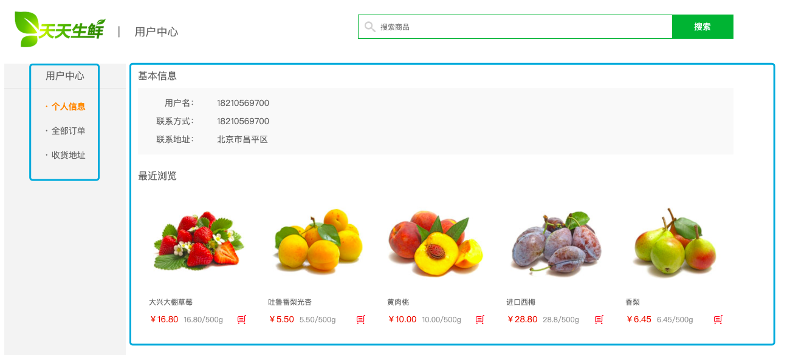

## 用户中心

当用户登录后,点击右上角的用户中心,便可以跳转到用户中心的管理页面

#### 个人信息页展示

1. 路由的设定
```go
beego.Router("/user/userinfo",&controllers.UserInfoController{},"get:UserInfoShow")
```

2. 控制器的设置
```go
// 展示用户中心信息页面
func (this *UserInfoController)  UserInfoShow() {
	this.TplName = "user_center_info.html"
}
```

访问用户中心页面查看
 

上面的图片中,我们可以看出,三个页面中,只有中间显示部分是不一样的,那么我们就可以使用视图布局来完成

### UserInfoLayout 创建试图布局

1. UserInfoLayout 的创建
```bash
<!DOCTYPE html PUBLIC "-//W3C//DTD XHTML 1.0 Transitional//EN" "http://www.w3.org/TR/xhtml1/DTD/xhtml1-transitional.dtd">
<html xmlns="http://www.w3.org/1999/xhtml" xml:lang="en">
<head>
    <meta http-equiv="Content-Type" content="text/html;charset=UTF-8">
    <title>天天生鲜-用户中心</title>
    <link rel="stylesheet" type="text/css" href="/static/css/reset.css">
    <link rel="stylesheet" type="text/css" href="/static/css/main.css">
</head>
<body>
<div class="header_con">
    <div class="header">
        <div class="welcome fl">欢迎来到天天生鲜!</div>
        <div class="fr">
            <div class="login_info fl">
                欢迎您：<em>张 山</em>
            </div>
            <div class="login_btn fl">
                <a href="login.html">登录</a>
                <span>|</span>
                <a href="register.html">注册</a>
            </div>
            <div class="user_link fl">
                <span>|</span>
                <a href="user_center_info.html">用户中心</a>
                <span>|</span>
                <a href="cart.html">我的购物车</a>
                <span>|</span>
                <a href="user_center_order.html">我的订单</a>
            </div>
        </div>
    </div>
</div>

<div class="search_bar clearfix">
    <a href="index.html" class="logo fl"></a>
    <div class="sub_page_name fl">|    用户中心</div>
    <div class="search_con fr">
        <input type="text" class="input_text fl" name="" placeholder="搜索商品">
        <input type="button" class="input_btn fr" name="" value="搜索">
    </div>
</div>

{{.LayoutContent}}

<div class="footer">
    <div class="foot_link">
        <a href="#">关于我们</a>
        <span>|</span>
        <a href="#">联系我们</a>
        <span>|</span>
        <a href="#">招聘人才</a>
        <span>|</span>
        <a href="#">友情链接</a>
    </div>
    <p>CopyRight © 2016 北京天天生鲜信息技术有限公司 All Rights Reserved</p>
    <p>电话：010-****888    京ICP备*******8号</p>
</div>

</body>
</html>
```

2. 三个页面值保留中间主页面的内容
```go
<div class="main_con clearfix">
    <div class="left_menu_con clearfix">
        <h3>用户中心</h3>
        <ul>
            <li><a href="/user/userinfo" class="active">· 个人信息</a></li>
            <li><a href="/user/userorder">· 全部订单</a></li>
            <li><a href="/user/usersite">· 收货地址</a></li>
        </ul>
    </div>
    <div class="right_content clearfix">
        <div class="info_con clearfix">
            <h3 class="common_title2">基本信息</h3>
            <ul class="user_info_list">
                <li><span>用户名：</span>18210569700</li>
                <li><span>联系方式：</span>18210569700</li>
                <li><span>联系地址：</span>北京市昌平区</li>
            </ul>
        </div>

        <h3 class="common_title2">最近浏览</h3>
        <div class="has_view_list">
            <ul class="goods_type_list clearfix">
                <li>
                    <a href="detail.html"></a>
                    <h4><a href="detail.html">大兴大棚草莓</a></h4>
                    <div class="operate">
                        <span class="prize">￥16.80</span>
                        <span class="unit">16.80/500g</span>
                        <a href="#" class="add_goods" title="加入购物车"></a>
                    </div>
                </li>

                <li>
                    <a href="#"></a>
                    <h4><a href="#">吐鲁番梨光杏</a></h4>
                    <div class="operate">
                        <span class="prize">￥5.50</span>
                        <span class="unit">5.50/500g</span>
                        <a href="#" class="add_goods" title="加入购物车"></a>
                    </div>
                </li>

                <li>
                    <a href="#"></a>
                    <h4><a href="#">黄肉桃</a></h4>
                    <div class="operate">
                        <span class="prize">￥10.00</span>
                        <span class="unit">10.00/500g</span>
                        <a href="#" class="add_goods" title="加入购物车"></a>
                    </div>
                </li>

                <li>
                    <a href="#"></a>
                    <h4><a href="#">进口西梅</a></h4>
                    <div class="operate">
                        <span class="prize">￥28.80</span>
                        <span class="unit">28.8/500g</span>
                        <a href="#" class="add_goods" title="加入购物车"></a>
                    </div>
                </li>

                <li>
                    <a href="#"></a>
                    <h4><a href="#">香梨</a></h4>
                    <div class="operate">
                        <span class="prize">￥6.45</span>
                        <span class="unit">6.45/500g</span>
                        <a href="#" class="add_goods" title="加入购物车"></a>
                    </div>
                </li>
            </ul>
        </div>
    </div>
</div>
```

3. 上面的操作中,发现几乎每个页面都需要通过 session 判断用户是否登录,那么将其封装成函数
```go
func UserLoginCheck(this *beego.Controller)  {
	username := this.GetSession("username")

	if username == "" {
		this.Data["username"] = ""
	}else {
		this.Data["username"] = username
	}
}

// 其他函数调用的时候
UserLoginCheck(&this.Controller)
```

4. 用户信息展示的时候,获取用户名,联系方式和地址
```go
func (this *UserInfoController)  UserInfoShow() {
	// 用户登录判断
	UserLoginCheck(&this.Controller)
	// 获取用户名
	username := this.GetSession("username")
	this.Data["username"] = username

	// 查询用户的地址，需要查询地址表
	var addr models.Address
	db := orm.NewOrm()
	db.QueryTable("Address").RelatedSel("User").Filter("User__Name",username).Filter("Isdefault",true).One(&addr)

	if addr.Id == 0 {
		this.Data["addr"] = ""
	}else {
		this.Data["addr"] = addr
	}

	this.Layout = "UserInfoLayout.html"
	this.TplName = "user_center_info.html"
}
```

5. 视图接收传递的数据
```go
<div class="info_con clearfix">
    <h3 class="common_title2">基本信息</h3>
    <ul class="user_info_list">
        <li><span>用户名：</span>{{.username}}</li>
        {{ if compare .addr "" }}
            <li>没有设置默认地址</li>
        {{else}}
            <li><span>联系方式：</span>{{.addr.Addr}}</li>
            <li><span>联系地址：</span>{{.addr.Phone}}</li>
        {{end}}
    </ul>
</div>
```

### 全部订单页面展示

1. 路由的设置
```go
beego.Router("/user/userorder",&controllers.UserInfoController{},"get:UserOrderShow")
```

2. 控制器 的设置
```go
// 用户订单展示
func (this *UserInfoController) UserOrderShow() {
	// 用户登录判断
	UserLoginCheck(&this.Controller)
	
	this.Layout = "UserInfoLayout.html"
	this.TplName = "user_center_order.html"
}
```

3. 视图设置
```go
<div class="main_con clearfix">
    <div class="left_menu_con clearfix">
        <h3>用户中心</h3>
        <ul>
            <li><a href="/user/userinfo">· 个人信息</a></li>
            <li><a href="/user/userorder" class="active">· 全部订单</a></li>
            <li><a href="/user/usersite">· 收货地址</a></li>
        </ul>
    </div>
....

        <div class="pagenation">
            <a href="#">上一页</a>
            <a href="#" class="active">1</a>
            <a href="#">2</a>
            <a href="#">3</a>
            <a href="#">4</a>
            <a href="#">5</a>
            <a href="#">下一页></a>
        </div>
    </div>
</div>

```

### 收货地址页面
这个页面分为两个部分,分别是显示当前地址和添加地址

1. 路由设置
```go
beego.Router("/user/usersite",&controllers.UserInfoController{},"get:UserSiteShow")
```

2. 控制器设置
```go
func (this *UserInfoController) UserSiteShow() {
	// 用户登录判断
	UserLoginCheck(&this.Controller)

	this.Layout = "UserInfoLayout.html"
	this.TplName = "user_center_site.html"
}
```

3.  添加地址路由设置
```go
	beego.Router("/user/usersite",&controllers.UserInfoController{},"get:UserSiteShow;post:UserSiteHandle")

```

4. 添加地址控制器设置,用来添加地址
```go
func (this *UserInfoController) UserSiteHandle() {
	// 获取数据
	receiver := this.GetString("receiver")
	addr := this.GetString("addr")
	zipCode := this.GetString("zipCode")
	phone := this.GetString("phone")
	// 校验数据
	if receiver == "" || addr == "" || zipCode == "" || phone == "" {
		this.Data["errmsg"] = "添加的信息不正确，请重试"
		this.Redirect("/user/usersite",302)
		return
	}
	beego.Info("数据库处理")
	// 处理数据
	db := orm.NewOrm()
	useraddr := models.Address{}
	// 查询用户是否有默认的收货地址
	useraddr.Isdefault = true
	err := db.Read(&useraddr,"Isdefault")
	if err == nil { // 如果二人为空说明查询到了，也就是有了默认的收货地址
		// 将默认的收货地址改为false
		useraddr.Isdefault = false
		db.Update(&useraddr)
	}

	// 如果 err 不为空，说明没有默认的地址
	// 关联user表
	username := this.GetSession("username")
	// 获取user对象
	var user models.User
	user.Name = username.(string)
	err =db.Read(&user,"Name")
	beego.Info("查询",err)

	// 如果直接插入的话，因为上面的useraddr已经存在了id会导致插入失败
	// 所以要新建一个对象
	var addNew models.Address
	addNew.Receiver = receiver
	addNew.Addr = addr
	addNew.Zipcode = zipCode
	addNew.Phone = phone
	addNew.Isdefault = true
	// 赋值
	addNew.User = &user

	// 插入数据库
	_, err = db.Insert(&addNew)
	if err != nil {
		this.Data["errmsg"] = "插入地址信息错误"
		this.Redirect("/user/usersite",302)
		return
	}

	// 返回视图
	this.Redirect("/user/usersite",302)
}
```

5. 显示地址
```go
// 用户地址页展示
func (this *UserInfoController) UserSiteShow() {
	// 用户登录判断
	UserLoginCheck(&this.Controller)

	// 获取当前登录的用户名
	username := this.GetSession("username")
	this.Data["user"] = username
	// 关联查询
	db := orm.NewOrm()
	var addr models.Address

	db.QueryTable("Address").RelatedSel("User").Filter("User__Name",username).Filter("Isdefault",true).One(&addr)

	// 传递给视图
	this.Data["addr"] = addr


	this.Layout = "UserInfoLayout.html"
	this.TplName = "user_center_site.html"
}
```