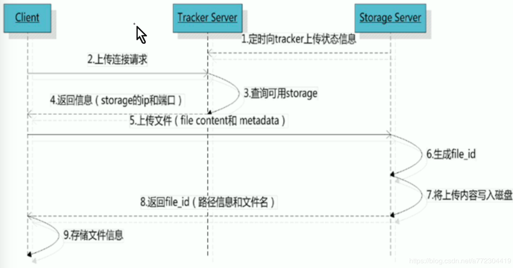
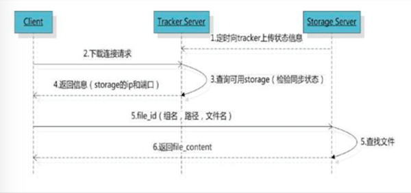

## 什么是 FastDFS
FastDFS 是阿里的余庆利用 C 语言编写的一款开源的分布式存储系统,FastDFS 是为互联网量身定做的,充分的考虑的冗余备份,负载均衡,线性扩容等机制,并注重高可用,高性能等指标,使用FastDFS 很容易搭建一套高性能的文件服务器集群,提供文件上传和下载等服务

在使用FastDFS 存储文件的时候,对文件的内容进行校验,保证同样内容的文件,只在服务器上存储一份,其他的均为链接

#### 优点
FastDFS 架构包括 Tracker server 和 Storage server,客户端请求 Tracker server 进行上传, 下载,替你刚刚 Tracker server 调度,由最终Storage server 完成文件上传和下载

Tracker server 作用是负载均衡和调度,通过 Tracker server 在文件上传的时候,可以根据一些方法找到 Storage server 提供服务文件上传服务,可以将 Tracker server 称为追踪器或者调度器

Storage server 作用是文件存储,客户端上传文件最终存储在 Storage 服务器上, storage server 没有时效件自己的文件系统,而是利用操作系统的文件系统来管理文件,可以将 storage 称为存储系统

 

#### 服务器端的两个角色

-  tracker:管理集群,tracker 也可以实现集群,每个 tracker 几点地位平等,手机 storage 集群的状态
-  storage : 用来实际的保存文件,分为多个组,每个组之间保存的文件是不同的,每个组内可以有多个成员,组成员内部保存的内容是一致的,组成员的地位是一致的,没有主从概念

### 文件上传流程
 

客户端上传文件后,存储服务器将文件的 id 返回给客户端,此文件的 id 用于以后访问该文件的索引信息,文件索引信息包括:组名,虚拟磁盘路径,数据两级目录和文件名

例如: group1/M00/02/44/xxxxxxxxxxxxx.sh

- 组名:文件上传后存在的 storage 组的名称,在文件上传成功后由 storage 服务器返回,需要客户端自行保存
- 虚拟磁盘路径: storage 服务器配置的虚拟路径,与磁盘选项 store_path* 对应,如果配置了 store_path0 则是 M00,如果配置了 store_path1 则是 M01,以此类推
- 数据两级目录: storage 服务器在每个虚拟磁盘路径下创建的两级目录,用于存储文件
- 文件名: 与上传时的名称不同,由存储服务器根据特定信息生成,文件名包含:源存储服务器 ip 地址,文件创建的时间戳,文件大小,随机数和文件扩展名组成,可以在有大量文件的时候,防止文件重复

### 文件下载流程
 


## FastDFS 的部署

官方网站：[https://github.com/happyfish100/](https://github.com/happyfish100/)

配置文档：[https://github.com/happyfish100/fastdfs/wiki/](https://github.com/happyfish100/fastdfs/wiki/)

参考资料：[https://www.oschina.net/question/tag/fastdfs](https://www.oschina.net/question/tag/fastdfs)

### 使用的软件的说明

- libfatscommon : FastDFS 分离出来的一些公用的函数包
- FastDFS : FastDFS 本体
- fastdfs-nginx-module: fastdfs 和 nginx 的关联模块
- nginx: 


### 单机部署 FastDFS

#### 安装依赖包
```bash
yum install git gcc gcc-c++ make automake autoconf libtool pcre pcre-devel zlib zlib-devel openssl-devel wget vim -y
```

1. 下载 libfastcommon 
```bash
# 下载源码包
git clone https://github.com/happyfish100/libfastcommon.git --depth 1
# 进入到目录下编译安装
./make.sh && ./make.sh install
```

2. 安装 FastDFS
```bash
# 下载 FastDFS 源码包
git clone https://github.com/happyfish100/fastdfs.git --depth 1

# 进入到目录下编译安装
./make.sh && ./make.sh install
```

3. 配置文件准备
```bash
cp /etc/fdfs/tracker.conf.sample /etc/fdfs/tracker.conf
cp /etc/fdfs/storage.conf.sample /etc/fdfs/storage.conf
 #客户端文件，测试用
cp /etc/fdfs/client.conf.sample /etc/fdfs/client.conf
#供nginx访问使用
cp fastdfs/conf/http.conf /etc/fdfs/
#供nginx访问使用
cp fastdfs/conf/mime.types /etc/fdfs/
```

4. 安装 fastdfs-nginx-module 
```bash
# 安装模块
git clone https://github.com/happyfish100/fastdfs-nginx-module.git --depth 1
# 拷贝模块到指定的位置
cp fastdfs-nginx-module/src/mod_fastdfs.conf /etc/fdfs/
```

5. 安装nginx
```bash
# 编译安装 nginx 依赖包
yum install -y vim lrzsz tree screen psmisc lsof tcpdump wget ntpdate gcc gcc-c++ glibc glibc-devel pcre pcre-devel openssl openssl-devel systemd-devel net-tools iotop bc zip unzip zlib-devel bash-completion nfs-utils automake libxml2 libxml2-devel libxslt libxslt-devel perl perl-ExtUtils-Embed
# 下载 nginx
wget http://nginx.org/download/nginx-1.15.4.tar.gz
# 解压安装
./configure --prefix=/apps/nginx 
    --user=nginx 
    --group=nginx 
    --with-http_ssl_module 
    --with-http_v2_module 
    --with-http_realip_module 
    --with-http_stub_status_module 
    --with-http_gzip_static_module 
    --with-pcre 
    --with-stream 
    --with-stream_ssl_module 
    --with-stream_realip_module 
    --add-module=/root/fastdfs-nginx-module/src/

# 安装
make && make install 
```

6. 配置tracker
```bash
vim /etc/fdfs/tracker.conf

port = 22122 #默认
# 指定存储数据和日志的根目录
base_path = /home/fastdfs 

#创建 tracker 的数据目录
mkdir /home/fastdfs
```

7. 配置 storage
```bash
vim /etc/fdfs/storage.conf

#需要修改的内容如下
port=23000  # storage服务端口（默认23000,一般不修改）
base_path=/home/fastdfs  # 数据和日志文件存储根目录
store_path0=/home/fastdfs  # 第一个存储目录
tracker_server=172.19.36.69:22122  # tracker服务器IP和端口
http.server_port=80  # http访问文件的端口(默认8888,看情况修改,和nginx中保持一致)
```

8. 启动tracker和storage
```bash
fdfs_trackerd  /etc/fdfs/tracker.conf
fdfs_storaged  /etc/fdfs/storage.conf

# 查看端口已经开启
[root@localhost ~]# ss -tnl 
State      Recv-Q Send-Q     Local Address:Port                    Peer Address:Port              
LISTEN     0      128                    *:23000                              *:*                  
LISTEN     0      128                    *:22122                              *:*
```

9. 客户端测试
```bash
vim /etc/fdfs/client.conf

base_path = /home/fastdfs
#tracker服务器IP和端口
tracker_server = 172.19.36.69:22122

# 执行命令测试
fdfs_upload_file /etc/fdfs/client.conf /apps/nginx/conf/nginx.conf
# 成功的返回类似下面的 id 说明安装成功
group1/M00/00/00/rBMkRV7qURKAeFgeAAAKYNHE8po89.conf
```

10.  配置fastfs-nginx-modele
```bash
vim /etc/fdfs/mod_fastdfs.conf
#需要修改的内容如下
tracker_server=172.19.36.69:22122  #tracker服务器IP和端口
url_have_group_name=true
store_path0=/home/fastdfs
```

11.  配置 nginx
```bash
vim /apps/nginx/conf/nginx.conf

worker_processes  1;

events {
    worker_connections  1024;
}

http {
    include       mime.types;
    default_type  application/octet-stream;

    sendfile        on;

    keepalive_timeout  65;

    server {
        listen       80; #该端口为storage.conf中的http.server_port相同
        server_name  localhost;

        location ~/group[0-9]/ { # 匹配,当访问/group0-9 的时候,去调用指定的模块
            ngx_fastdfs_module;
        }
        
        error_page   500 502 503 504  /50x.html;
        location = /50x.html {
            root   html;
        }
    }
}
```

12. 启动nginx
```bash
/apps/nginx/sbin/nginx

# 验证开启了 80 端口

[root@localhost ~]# ss -tnl 
State      Recv-Q Send-Q     Local Address:Port                                
LISTEN     0      128        *:80       *:*
```

13. 测试
下载之前存储的文件进行测试,能下载成功,说明部署成功
```bash
wget http://172.19.36.69/group1/M00/00/00/rBMkRV7qURKAeFgeAAAKYNHE8po89.conf
```

## 分布式部署

### tracker配置

```shell
#服务器ip为 192.168.52.2,192.168.52.3,192.168.52.4
#我建议用ftp下载下来这些文件 本地修改
vim /etc/fdfs/tracker.conf
#需要修改的内容如下
port=22122  # tracker服务器端口（默认22122,一般不修改）
base_path=/home/dfs  # 存储日志和数据的根目录
```

### storage配置

```shell
vim /etc/fdfs/storage.conf
#需要修改的内容如下
port=23000  # storage服务端口（默认23000,一般不修改）
base_path=/home/dfs  # 数据和日志文件存储根目录
store_path0=/home/dfs  # 第一个存储目录
tracker_server=192.168.52.2:22122  # 服务器1
tracker_server=192.168.52.3:22122  # 服务器2
tracker_server=192.168.52.4:22122  # 服务器3
http.server_port=8888  # http访问文件的端口(默认8888,看情况修改,和nginx中保持一致)
```

### client测试

```shell
vim /etc/fdfs/client.conf
#需要修改的内容如下
base_path=/home/moe/dfs
tracker_server=192.168.52.2:22122  # 服务器1
tracker_server=192.168.52.3:22122  # 服务器2
tracker_server=192.168.52.4:22122  # 服务器3
#保存后测试,返回ID表示成功 如：group1/M00/00/00/xx.tar.gz
fdfs_upload_file /etc/fdfs/client.conf /usr/local/src/nginx-1.15.4.tar.gz
```

### 配置nginx访问

```shell
vim /etc/fdfs/mod_fastdfs.conf
#需要修改的内容如下
tracker_server=192.168.52.2:22122  # 服务器1
tracker_server=192.168.52.3:22122  # 服务器2
tracker_server=192.168.52.4:22122  # 服务器3
url_have_group_name=true
store_path0=/home/dfs
#配置nginx.config
vim /usr/local/nginx/conf/nginx.conf
#添加如下配置
server {
    listen       8888;    ## 该端口为storage.conf中的http.server_port相同
    server_name  localhost;
    location ~/group[0-9]/ {
        ngx_fastdfs_module;
    }
    error_page   500 502 503 504  /50x.html;
    location = /50x.html {
    root   html;
    }
}
```

## 启动

### 防火墙

```shell
#不关闭防火墙的话无法使用
systemctl stop firewalld.service #关闭
systemctl restart firewalld.service #重启
```

### tracker

```shell
/etc/init.d/fdfs_trackerd start #启动tracker服务
/etc/init.d/fdfs_trackerd restart #重启动tracker服务
/etc/init.d/fdfs_trackerd stop #停止tracker服务
chkconfig fdfs_trackerd on #自启动tracker服务
```

### storage

```shell
/etc/init.d/fdfs_storaged start #启动storage服务
/etc/init.d/fdfs_storaged restart #重动storage服务
/etc/init.d/fdfs_storaged stop #停止动storage服务
chkconfig fdfs_storaged on #自启动storage服务
```

### nginx

```shell
/usr/local/nginx/sbin/nginx #启动nginx
/usr/local/nginx/sbin/nginx -s reload #重启nginx
/usr/local/nginx/sbin/nginx -s stop #停止nginx
```

### 检测集群

```shell
/usr/bin/fdfs_monitor /etc/fdfs/storage.conf
# 会显示会有几台服务器 有3台就会 显示 Storage 1-Storage 3的详细信息
```

## 说明

### 配置文件

```shell
tracker_server #有几台服务器写几个
group_name #地址的名称的命名
bind_addr #服务器ip绑定
store_path_count #store_path(数字)有几个写几个
store_path(数字) #设置几个储存地址写几个 从0开始
```

## 使用 go 语言操作 FastDFS

1. 下载对应的包
```bash
# go 语言没有专门的操作 fastdfs 的包,需要到 github 上找一下
go get github.com/weilaihui/fdfs_client

# 如果因为长城防火墙的问题,不能下载执行下面操作
在 src目录下面创建一个golang.org/x目录
cd golang.org/x
git clone https://github.com/golang/crypto.git
git clone https://github.com/golang/sys.git

// 或者可以到码云中下载
```

2. 导入对应的包
```go
import "github.com/weilaihui/fdfs_client"
```

3. 指定客户端配置文件,生成客户端对象
```go
client , err:= fdfs_client.NewFdfsClient("/Users/weiying/go/client.conf")
	if err != nil {
		fmt.Println("客户端对象创建失败：",err)
		return
	}


// client.conf 文件
connect_timeout = 20
network_timeout = 60
base_path = /home/fastdfs
tracker_server=172.19.36.69:22122
maxConns=100
use_connection_pool = false
connection_pool_max_idle_time = 3600
log_level = info
load_fdfs_parameters_from_tracker = false
use_storage_id = false
storage_ids_filename = storage_ids.conf
http.tracker_server_port = 80

```

4. 上传文件
上传文件,一般有两种方式,一是通过文件名上传,二是通过字节流

- 通过文件名上传文件
```go
// 参数是文件名,返回 FastDFS 结构体,包含组名和文件 ID两部分
fdfsresponse,err := client.UploadByFilename("flieName")

```
- 通过字节流上传文件
```go
// 参数是字节数组和文件后缀,不包括.
//返回 FastDFS 结构体,包含组名和文件 ID两部分
fdfsresponse,err := client.UploadByBuffer(fileBuffer,ext)
```

5. 返回值
```go
//返回 FastDFS 结构体,包含组名和文件 ID两部分
&{group1 group1/M00/00/00/rBMkRV7sfF2ATXR_AAAm3p25.jpg}

res.GroupName 获取组名
res.RemoteFileId 获取 id

```