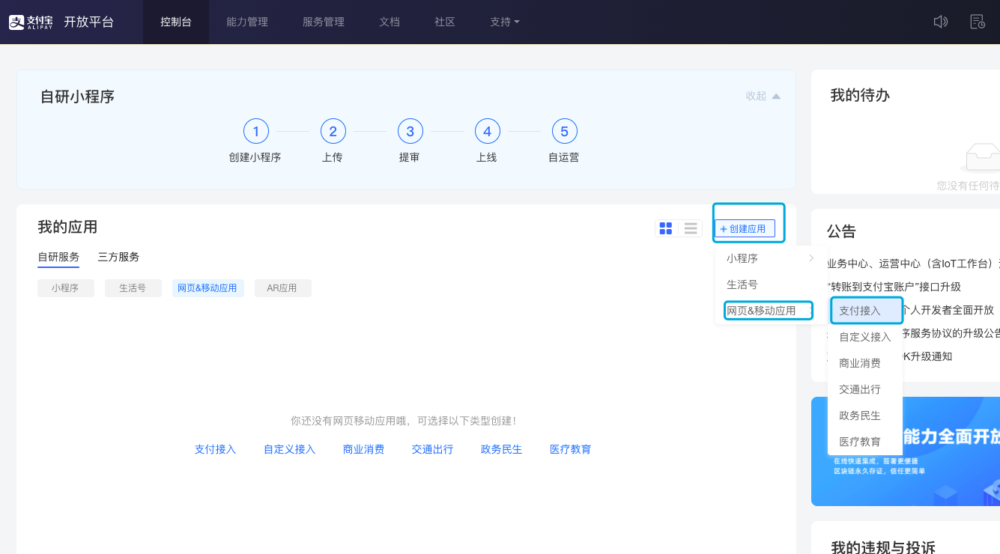
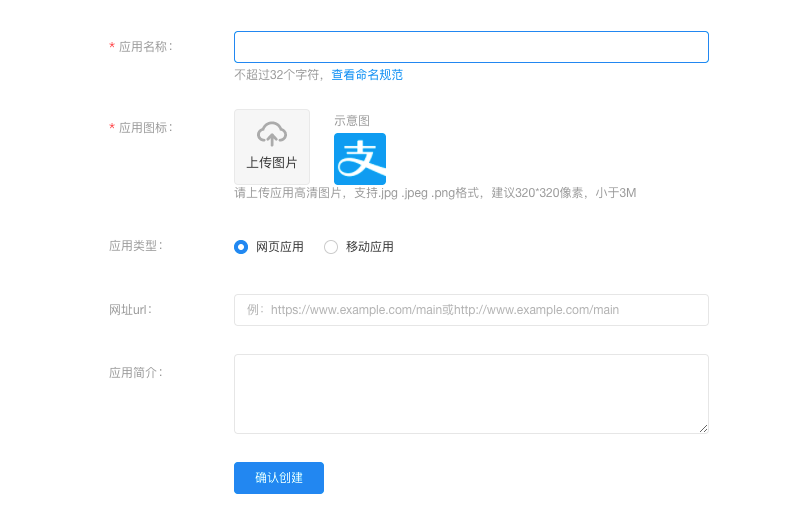
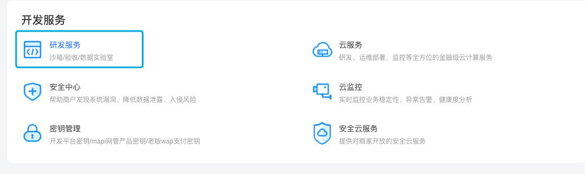
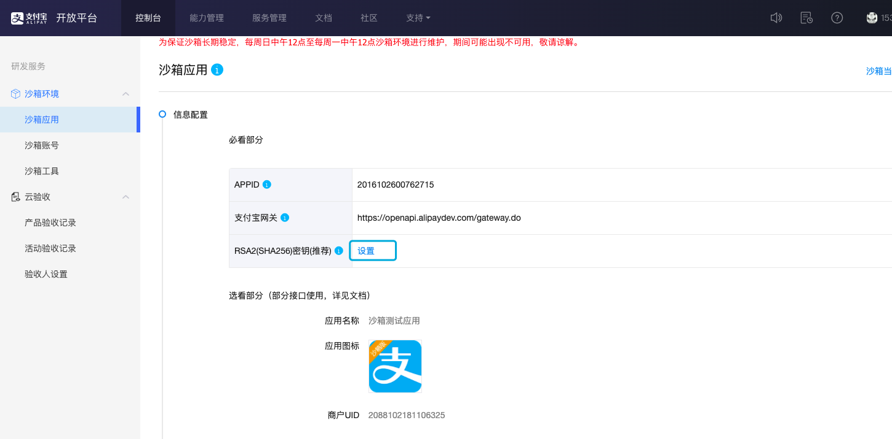
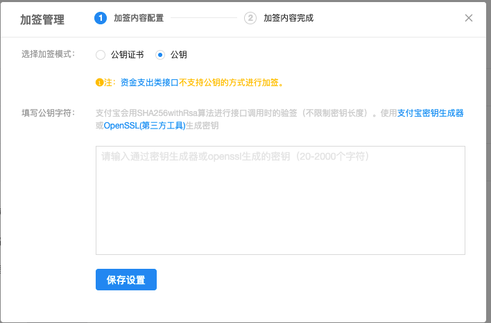
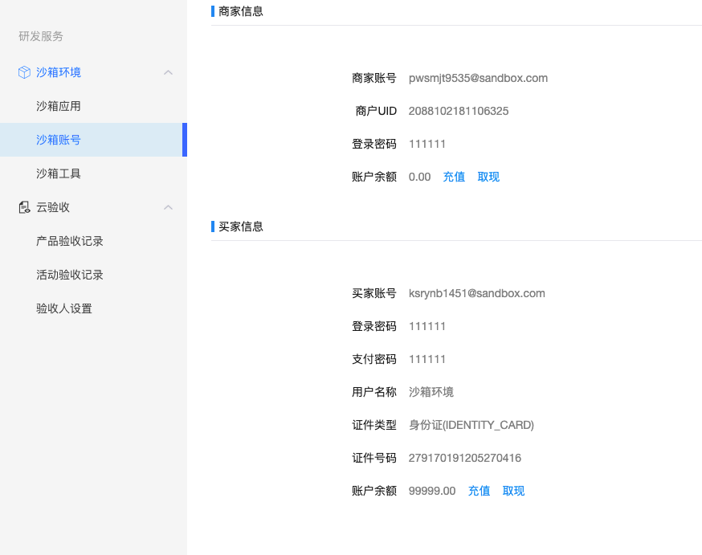

## 支付宝开放登录平台

网址:[https://open.alipay.com/platform/home.htm](https://open.alipay.com/platform/home.htm)

1. 首先创建支付应用
 

2. 填写应用信息
 

> 但是这里需要使用企业的身份才能创建成功,所以我们使用,开发服务中的沙箱功能

 

### 沙箱环境(开发模拟环境)

使用说明:[https://opendocs.alipay.com/open/200/105311](https://opendocs.alipay.com/open/200/105311)

1. 创建密钥
 

```bash
# 创建私钥
openssl genrsa -out weiying\_private\_key.pem 2048

Generating RSA private key, 2048 bit long modulus

................................+++

.....................................+++

e is 65537 (0x10001)

# 根据私钥提取公钥
openssl rsa -in weiying_private_key.pem -pubout -out weiying_public_key.pem

# 查看生成的私钥和公钥文件
ll weiying_p*
-rw-r--r--  1 weiying  staff  1679  7  1 17:01 weiying_private_key.pem
-rw-r--r--  1 weiying  staff   451  7  1 17:02 weiying_public_key.pem

```

2. 将生成的公钥导入
 


3. 设置完成之后会生成商家和买家的信息
 

## 开发者文档

支付宝开发者文档:[https://open.alipay.com/developmentDocument.htm](https://open.alipay.com/developmentDocument.htm)

网站电脑支付:[https://opendocs.alipay.com/open/270](https://opendocs.alipay.com/open/270)

### 支付过程

1. 用户发起支付的请求到服务器
2. 服务器调用支付宝的 alipay.trade.page.pay 接口,发起支付请求
3. 支付宝返回登录页面,让用户登录到支付宝
4. 用户选择支付方式(余额,余额宝,银行卡等),输入密码支付
5. 支付宝对用户的支付做校验(余额等)
6. 支付成功后,支付宝返回我们在程序中指定的 url

> 因为支付宝不提供 Go 语言的 SDK,但是支持 OpenSDK,那么我们使用开源的 接口来调用支付宝的支付 [https://github.com/smartwalle/alipay](https://github.com/smartwalle/alipay)


## 支付功能

1. 下载使用的包
```bash
go get github.com/smartwalle/alipay

# 报错
package golang.org/x/crypto/pbkdf2: unrecognized import path "golang.org/x/crypto/pbkdf2" (https fetch: Get https://golang.org/x/crypto/pbkdf2?go-get=1: dial tcp 216.239.37.1:443: i/o timeout)

# 如果上面报错,执行下面的操作
mkdir -p $GOPATH/src/golang.org/x
cd $GOPATH/src/golang.org/x
git clone https://github.com/golang/sync.git
git clone https://github.com/golang/crypto.git
git clone https://github.com/golang/sys.git
```

> 因为阿里云云的沙箱使用有问题,不知道是我自己的问题,还是沙箱的问题,由于实力的问题,暂时放一下,弄明白了再补回来